# Advanced Programming in the Unix Environment [76%]

##  Chapter 1. UNIX System Overview [12/12] 

###  1.1 Introduction {#introduction}

操作系统为程序的运行提供服务。

###  1.2 UNIX Architecture 

-   内核：控制硬件资源和提供程序运行环境的软件
-   系统调用：内核的接口层
-   库：包含系统调用上层的常用函数
-   shell：为其它程序的运行提供接口的特殊秩序

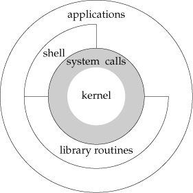

###  1.3 Logging in 

1.  Login Name

    `/etc/passwd` 文件保存了用户信息

2.  Shells

    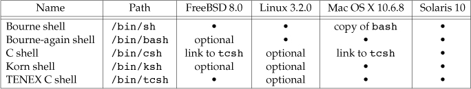

###  1.4 Files and Directories 

1.  File System

    UNIX 文件是一个目录和文件的层级结构，从根目录 \"/\" 开始

    目录是一个包含了目录条目的文件, 逻辑上每个条目包含了文件名,
    文件属性等信息结构.

    1.  Filename

        目录中的名字称为文件名.

    2.  Pathname

        -   Example

            ::: captioned-content
            ::: caption
            Listing 1: Figure 1.3 List all the files in a directory
            :::

            ``` c
            #include <dirent.h>

            #include "apue.h"

            extern char *__progname;

            int main(int argc, char *argv[]) {
                DIR           *dp;
                struct dirent *dirp;

                if (argc != 2) {
                    err_quit("usage: %s directory_name", __progname);
                }
                if ((dp = opendir(argv[1])) == NULL) {
                    err_sys("can't open %ls", argv[1]);
                }

                while ((dirp = readdir(dp)) != NULL) {
                    if (strcoll(dirp->d_name, ".") != 0 &&
                        strcoll(dirp->d_name, "..") != 0) {
                        printf("%s\n", dirp->d_name);
                    }
                }

                closedir(dp);
                return 0;
            }
            ```
            :::

    3.  Working Directory

        当前所在目录

    4.  Home Directory

        设置的登录后所处的目录

###  1.5 Input and Output - File Descriptors 

1.  文件描述符

    非负整数，被内核用以区分被进程访问的文件

    1.  Standard Input, Standard Output, and Standard Error

        1.  Unbuffered I/O

            由 `open`, `read`, `write`, `lseek`, `close` 函数提供

            -   Example

                ::: captioned-content
                ::: caption
                Listing 2: Figure 1.4 Copy standard input to standard
                output
                :::

                ``` c
                #include "apue.h"

                #define BUFFSIZE 4096

                int main(void) {
                    int  n = 0;
                    char buf[BUFFSIZE];

                    while ((n = read(STDIN_FILENO, buf, BUFFSIZE)) > 0) {
                        if (write(STDOUT_FILENO, buf, n) != 0) {
                            err_sys("write error");
                        }
                    }

                    if (n < 0) {
                        err_sys("read error");
                    }

                    return 0;
                }
                ```
                :::

        2.  Standard I/O

            为无缓冲的 I/O 函数提供带缓冲的 I/O 接口。

            -   Example

                ::: captioned-content
                ::: caption
                Listing 3: Figure 1.5 Copy standard input to standard
                output, using standard I/O
                :::

                ``` c
                #include "apue.h"

                int main(void) {
                    int c;
                    while ((c = getc(stdin)) != EOF) {
                        if (putc(c, stdout) == EOF) {
                            err_sys("output error");
                        }
                    }

                    if (ferror(stdin)) {
                        err_sys("input error");
                    }

                    return 0;
                }
                ```
                :::

###  1.6 Programs and Processes 

1.  Program

    存在于磁盘上一个目录里的 **可执行** 文件 读入内存后由内核使用 7 个
    `exec` 函数之一执行

    1.  Proceses and Process ID

        一个运行中程序的实例称为进程。

        每一个进程都有一个独有的数字标识，称为 PID，一般为非负整数。

        -   Example

            Figure 1.6 Print the process ID

            ``` c
            #include "apue.h"

            int main(int argc, char *argv[]) {
                printf("hello world from process ID %ld\n", (long)getpid());
                return 0;
            }
            ```

    2.  Process Control

        `fork`, `exec`, `waitpid`

        -   Example

            Figure 1.7 Read commands from standard input and execute them

            ``` c
            #include <sys/wait.h>

            #include "apue.h"

            int main(void) {
                char  buf[MAXLINE]; /* from apue.h */
                pid_t pid;
                int   status;

                printf("%% "); /* print prompt (printf require %% to print %) */

                while (fgets(buf, MAXLINE, stdin) != NULL) {
                    if (buf[strlen(buf) - 1] == '\n') {
                        buf[strlen(buf) - 1] = 0; /* replace newline with null */
                    }

                    if ((pid = fork()) < 0) {
                        err_sys("fork error");
                    } else if (pid == 0) {
                        execlp(buf, buf, 0);
                        err_ret("coulnd't excute: %s", buf);
                    }

                    /* parent */
                    if ((pid = waitpid(pid, &status, 0)) < 0) {
                        err_sys("waitpid error");
                    }

                    printf("%% ");
                }

                return 0;
            }
            ```

    3.  Threads and Thread IDs

        多线程用于多核系统的并发。

        线程 ID 与进程 ID 相似。

###  1.7 Error Handling {#error-handling}

当 UNIX 系统函数出现错误时，返回一个负值，errno
通常被设置为错误原因代码。

\<errno.h\> 定义了 errno，并为每一个设想的错误定义了一个常数。

多线程共享进程地址空间，会互相干扰，所以需要自己的 errno 备份。Linux
多线程访问 errno:

``` c
/* Linux 多线程访问 errno: */
extern int *__errno_location(void);
#define errno (*__errno_location())
```

关于 `errno`{.verbatim} 需要注意以下两点：

1.  如果没有发生错误， `errno`{.verbatim} 也不会清除
2.  `errno`{.verbatim} 的值不会被设为 0，\<errno.h\> 里也没有定义常数 0

打印错误信息的函数

``` c
#include <string.h>

/**
 * @brief      Print error messages
 * @return     pointer to message string
 */
char *strerror(int errnum);

/**
 * @brief      print error messages
 *
 * @details    outputs the string pointed to by msg,
 *             followed by a colon and a space,
 *             followed by the error message corresponding to the value of errno,
 *             followed by a '\n'
 */
void perror(const char *msg);
```

-   Example

    ::: captioned-content
    ::: caption
    Listing 6: Figure 1.8 Demonstrate strerror and perror
    :::

    ``` c
    #include <errno.h>

    #include "apue.h"

    int main(int argc, char *argv[]) {
        fprintf(stderr, "EACCESS: %s\n", strerror(EACCES));
        errno = ENOENT;
        perror(argv[0]);
        return 0;
    }
    ```
    :::

1.  Error Recovery

    \<errno.h\> 内定义的错误可以分为：致命和非致命

    -   致命：退出并打印错误信息到文件或屏幕
    -   非致命：大多非致命错误都是暂时的，比如资源短缺，系统活动较少时可能不发生，通常延迟重试即可。

###  1.8 User identification {#user-identification}

1.  User ID

    保存在密码文件里的数字值，系统用以区分用户

    *root* 或 *superuser* 的 UID 是 0

2.  Group ID

    类似 UID，用以区分用户属组，组文件为 /etc/group

    -   Example

        ::: captioned-content
        ::: caption
        Listing 7: Figure 1.9 Print user ID and group ID
        :::

        ``` c
        /**
         *   @file     uidgid.c
         *   @date     2019-12-01
         *   @author   whiothes <whiothes81@gmail.com>
         *   @version  1.0
         *   @brief    print uid and gid
         */

        #include "apue.h"

        int main(void) {
            printf("uid = %d, gid = %d\n", getuid(), getgid());
            exit(EXIT_SUCCESS);
        }
        ```
        :::

3.  Supplementary Group IDs

    除了密码本文件中为用户名指定的 GID，多数 UNIX
    系统版本允许一个用户归属其它组。

###  1.9 Signals {#signals}

Process choices:

1.  Ignore
2.  default action
3.  provide call function (catch signal)

-   Example

    ::: captioned-content
    ::: caption
    Listing 8: Figure 1.10 Read commands from standard input and execute
    them
    :::

    ``` c
    #include <sys/types.h>
    #include <sys/wait.h>

    #include "apue.h"

    static void sig_int(int); /* our signal-catching function */

    int main(void) {
        char  buf[MAXLINE]; /* from apue.h */
        pid_t pid;
        int   status;

        if (signal(SIGINT, sig_int) == SIG_ERR) err_sys("signal error");

        printf("%% "); /* print prompt (printf requires %% to print %) */
        while (fgets(buf, MAXLINE, stdin) != NULL) {
            if (buf[strlen(buf) - 1] == '\n')
                buf[strlen(buf) - 1] = 0; /* replace newline with null */

            if ((pid = fork()) < 0) {
                err_sys("fork error");
            } else if (pid == 0) {
                execlp(buf, buf, 0);
                err_ret("couldn't execute: %s", buf);
                exit(127);
            }
        }

        exit(0);
    }

    void sig_int(int signo) { printf("interrupt\n%% "); }
    ```
    :::

###  1.10 Time Values {#time-values}

1.  Calendar time. The value counts the number of seconds since the
    Epoch: 00:00:00 January 1, 1970, UTC.
2.  Process time. CPU time, measures the central processor resources
    used by a process. in clock ticks. `clock_t`{.verbatim}.
    -   Clock time
    -   User CPU time
    -   System CPU time

###  1.11 System calls and Library Functions {#system-calls-and-library-functions}

-   Concepts:
    -   System calls:
        -   Unix 系统实现，定义明确且数量有限的接口
        -   learned with `man 2` (Section 2 of *Unix Programmer\'s
            Mannual*)
        -   运行在内核
    -   Library Functions:
        -   These functions aren't entry points into the kernel,
            although they may invoke one or more of the kernel's system
            calls
        -   Can be learned with `man 3` for **general-purpose** (Section
            3 of *Unix Programmer\'s Mannual*)
-   Distinction:
    -   the system calls usually cannot be replaced
    -   the interface the UNIX system provides to determine the current
        time and date


###  1.12 Summary {#summary}

-   Exercises
    -   1.1
    -   1.2 53268 50922 was occupied
    -   1.3 strerror: int, value transfer, can not be changed, global
        errno can not be forecast perror: pointer, can be changed the
        value point to, const set constant
    -   1.4 2038, $ \frac{2^{31}}{(60*60*24*365)+1970} $ change time~t~
        to u~64t~ recompile the program
-   1.5

$ \frac{2^{31}}{(60*60*24*100)}=248.551348 $ days

##  Chapter 2. UNIX Standardization and Implementations \[10/10\] {#chapter-2.-unix-standardization-and-implementations-1010}

###  2.1 Introduction {#introduction-1}

###  2.2 UNIX Standardization {#unix-standardization}

1.   ISO C

2.   IEEE POSIX

3.   The Single UNIX Specification

    -   Encryption: denoted by `_XOPEN_CRYPE`
    -   Real-time: denoted by `_XOPEN_REALTIME`
    -   Advanced real-time
    -   Real-time threads: denoted by `_XOPEN_REALTIME_THREADS`
    -   Advanced real-time threads

4.   FIPS

###  2.3 UNIX System Implementations {#unix-system-implementations}

1.   2.3.1 UNIX system V Release 4

2.   2.3.2 4.4BSD

3.   2.3.3 FreeBSD

4.   2.3.4 Linux

5.   2.3.5 Mac OS X

6.   2.3.6 Solaris

7.   2.3.7 Others

    -   AIX, IBMUNIX
    -   HP-UX, HP
    -   IRIX, Silicon Graphics
    -   Unix Ware, SVR4 distribution

###  2.4 Relationship of Standards and Implementations {#relationship-of-standards-and-implementations}

###  2.5 Limits {#limits}

1.  Comipile-time limits
2.  Runtime limits

编译时限制可以在头文件中定义，运行时限制需要进程调用一个函数以获取值。


1.   2.5.1 ISO C Limits

2.   2.5.2 POSIX Limits

    1.  Numerical limits: `LONG_BIT`, `SSIZE_MAX`, and `WORD_BIT`
    2.  Minimum value：Figure 2.8 中的 25 个常数
    3.  Maximum value: `_POSIX_CLOCKRES_MIN`
    4.  Runtime increasable values: `CHARCLASS_NAME_MAX`,
        `COLL_WEIGHTS_MAX`, `LINE_MAX`, `NGROUPS_MAX`, and `RE_DUP_MAX`
    5.  Runtime invariant values: the 17 constants in Figure 2.9 (plus
        an additional four constants introduced in Section 12.2 and
        three constants introduced in Section 14.5)
    6.  Other invariant values: `NL_ARGMAX`, `NL_MSGMAX`, `NL_SETMAX`,
        and `NL_TEXTMAX`;
    7.  Pathname variables values: `FILESIZEBITS`, `LINK_MAX`,
        `MAX_CANON`, `MAX_INPUT`, `NAME_MAX`, `PATH_MAX`, `PIPE_BUF`,
        and `SYMLINK_MAX`

    
    

    其中部分常量最小值太小而不实用，不带 **[POSIX]{.underline}**
    前缀的常量名给定了一个实现的实用值。

3.   2.5.3 XSI Limits

    1.  Minimum values: the five constants in Figure 2.10
    2.  Runtime invariant values, possibly indeterminate: **IOV~MAX~**
        and **PAGE~SIZE~**

    

4.   2.5.4 `sysconf`, `pathconf`, and `fpathconf`
    Functions

    ``` c
    /**
     * @brief      obtain runtime limits
     *
     * @details
     *
     * @param
     *
     * @return     corresponding value if OK, -1 on error
     */
    #include <unistd.h>

    long sysconf(int name);

    long pathconf(const char *pathname, int name);

    long fpathconf(int fd, int name);
    ```

    返回值细节

    1.  如果 *name* 参数并非适当常量之一，函数返回 -1 并将
        `errno`{.verbatim} 设为 `EINVAL`{.verbatim}
    2.  有些可以返回变量的值（\>= 0）或返回值不确定，通过返回 -1
        且不改变 `errno`{.verbatim} 的值来表示
    3.  `_SC_CLK_TCK`{.verbatim}
        返回每秒时钟滴答数，供时间函数的返回值使用（Section 8.17）

    有些限制适用于 `pathconf` 的/pathname/ 参数以及 `fpathconf` 的 *fd*
    参数：

    1.  `_PC_MAX_CANON`{.verbatim} 和 `_PC_MAX_INPUT`{.verbatim}
        的引用文件必须是终端文件
    2.  `_PC_LINK_MAX`{.verbatim} 和
        `_PC_TIMESTAMP_RESOLUTION`{.verbatim}
        的引用文件可以是文件或目录。如果是目录，则返回值适用于目录本身，而非目录中的文件名。
    3.  `_PC_FILESIZEBITS`{.verbatim} 和 `_PC_NAME_MAX`{.verbatim}
        的引用文件必须是目录。返回值适用于目录中的文件。
    4.  `_PC_PATH_MAX`{.verbatim} 的引用文件必须是目录。
    5.  `_PC_PIPE_BUF`{.verbatim} 的引用文件必须是一个 pipe, FIFO
        或目录。前两个是 pipe 或 FIFO
        的限制值，如果是目录时，返回值是目录中的任意 FIFO 的限制
    6.  `_PC_SYMLINK_MAX`{.verbatim}
        的引用文件必须是一个目录。返回值是该目录中可以包含的链接的最大字符串长度。

    

    

    ::: captioned-content
    ::: caption
    Listing 9: Figure 2.13 Build C program to print all supported
    configuration limits
    :::

    ``` awk
    #!/usr/bin/awk -f

    BEGIN   {
        printf("#include \"apue.h\"\n")
        printf("#include <errno.h>\n")
        printf("#include <limits.h>\n")
        printf("\n")
        printf("static void pr_sysconf(char *, int);\n")
        printf("static void pr_pathconf(char *, char *, int);\n")
        printf("\n")
        printf("int\n")
        printf("main(int argc, char *argv[])\n")
        printf("{\n")
        printf("\tif (argc != 2)\n")
        printf("\t\terr_quit(\"usage: a.out <dirname>\");\n\n")
        FS="\t+"
        while (getline <"sysconf-lim.sym" > 0) {
            if (substr($1, 1, 1) == "#") {
                continue;
            }
            printf("#ifdef %s\n", $1)
            printf("\tprintf(\"%s defined to be %%ld\\n\", (long)%s+0);\n", $1, $1)
            printf("#else\n")
            printf("\tprintf(\"no symbol for %s\\n\");\n", $1)
            printf("#endif\n")
            printf("#ifdef %s\n", $2)
            printf("\tpr_sysconf(\"%s =\", %s);\n", $1, $2)
            printf("#else\n")
            printf("\tprintf(\"no symbol for %s\\n\");\n", $2)
            printf("#endif\n")
        }
        close("sysconf-lim.sym")
        while (getline <"pathconf-lim.sym" > 0) {
            if (substr($1, 1, 1) == "#") {
                continue;
            }
            printf("#ifdef %s\n", $1)
            printf("\tprintf(\"%s defined to be %%ld\\n\", (long)%s+0);\n", $1, $1)
            printf("#else\n")
            printf("\tprintf(\"no symbol for %s\\n\");\n", $1)
            printf("#endif\n")
            printf("#ifdef %s\n", $2)
            printf("\tpr_pathconf(\"%s =\", argv[1], %s);\n", $1, $2)
            printf("#else\n")
            printf("\tprintf(\"no symbol for %s\\n\");\n", $2)
            printf("#endif\n")
        }
        close("pathconf-lim.sym")
        exit
    }
    END {
        printf("\texit(0);\n")
        printf("}\n\n")
        printf("static void\n")
        printf("pr_sysconf(char *mesg, int name)\n")
        printf("{\n")
        printf("\tlong  val;\n\n")
        printf("\tfputs(mesg, stdout);\n")
        printf("\terrno = 0;\n")
        printf("\tif ((val = sysconf(name)) < 0) {\n")
        printf("\t\tif (errno != 0) {\n")
        printf("\t\t\tif (errno == EINVAL)\n")
        printf("\t\t\t\tfputs(\" (not supported)\\n\", stdout);\n")
        printf("\t\t\telse\n")
        printf("\t\t\t\terr_sys(\"sysconf error\");\n")
        printf("\t\t} else {\n")
        printf("\t\t\tfputs(\" (no limit)\\n\", stdout);\n")
        printf("\t\t}\n")
        printf("\t} else {\n")
        printf("\t\tprintf(\" %%ld\\n\", val);\n")
        printf("\t}\n")
        printf("}\n\n")
        printf("static void\n")
        printf("pr_pathconf(char *mesg, char *path, int name)\n")
        printf("{\n")
        printf("\tlong val;\n")
        printf("\n")
        printf("\tfputs(mesg, stdout);\n")
        printf("\terrno = 0;\n")
        printf("\tif ((val = pathconf(path, name)) < 0) {\n")
        printf("\t\tif (errno != 0) {\n")
        printf("\t\t\tif (errno == EINVAL)\n")
        printf("\t\t\t\tfputs(\" (not supported)\\n\", stdout);\n")
        printf("\t\t\telse\n")
        printf("\t\t\t\terr_sys(\"pathconf error, path = %%s\", path);\n")
        printf("\t\t} else {\n")
        printf("\t\t\tfputs(\" (no limit)\\n\", stdout);\n")
        printf("\t\t}\n")
        printf("\t} else {\n")
        printf("\t\tprintf(\" %%ld\\n\", val);\n")
        printf("\t}\n")
        printf("}\n")
    }
    ```
    :::

    ::: captioned-content
    ::: caption
    Listing 10: Figure 2.14 Print all possible sysconf and pathconf
    values
    :::

    ``` c
    #include <errno.h>
    #include <limits.h>

    #include "apue.h"

    static void pr_sysconf(char *, int);
    static void pr_pathconf(char *, char *, int);

    int main(int argc, char *argv[]) {
        if (argc != 2) err_quit("usage: a.out <dirname>");

    #ifdef ARG_MAX
        printf("ARG_MAX defined to be %ld\n", (long)ARG_MAX + 0);
    #else
        printf("no symbol for ARG_MAX\n");
    #endif
    #ifdef _SC_ARG_MAX
        pr_sysconf("ARG_MAX =", _SC_ARG_MAX);
    #else
        printf("no symbol for _SC_ARG_MAX\n");
    #endif
    #ifdef ATEXIT_MAX
        printf("ATEXIT_MAX defined to be %ld\n", (long)ATEXIT_MAX + 0);
    #else
        printf("no symbol for ATEXIT_MAX\n");
    #endif
    #ifdef _SC_ATEXIT_MAX
        pr_sysconf("ATEXIT_MAX =", _SC_ATEXIT_MAX);
    #else
        printf("no symbol for _SC_ATEXIT_MAX\n");
    #endif
    #ifdef CHARCLASS_NAME_MAX
        printf("CHARCLASS_NAME_MAX defined to be %ld\n",
               (long)CHARCLASS_NAME_MAX + 0);
    #else
        printf("no symbol for CHARCLASS_NAME_MAX\n");
    #endif
    #ifdef _SC_CHARCLASS_NAME_MAX
        pr_sysconf("CHARCLASS_NAME_MAX =", _SC_CHARCLASS_NAME_MAX);
    #else
        printf("no symbol for _SC_CHARCLASS_NAME_MAX\n");
    #endif
    #ifdef CHILD_MAX
        printf("CHILD_MAX defined to be %ld\n", (long)CHILD_MAX + 0);
    #else
        printf("no symbol for CHILD_MAX\n");
    #endif
    #ifdef _SC_CHILD_MAX
        pr_sysconf("CHILD_MAX =", _SC_CHILD_MAX);
    #else
        printf("no symbol for _SC_CHILD_MAX\n");
    #endif
    #ifdef CLOCKTICKSPERSECOND /*clock ticks/second*/
        printf("CLOCKTICKSPERSECOND /*clock ticks/second*/ defined to be %ld\n",
               (long)CLOCKTICKSPERSECOND /*clock ticks/second*/ + 0);
    #else
        printf("no symbol for CLOCKTICKSPERSECOND /*clock ticks/second*/\n");
    #endif
    #ifdef _SC_CLK_TCK
        pr_sysconf("CLOCKTICKSPERSECOND /*clock ticks/second*/ =", _SC_CLK_TCK);
    #else
        printf("no symbol for _SC_CLK_TCK\n");
    #endif
    #ifdef COLL_WEIGHTS_MAX
        printf("COLL_WEIGHTS_MAX defined to be %ld\n", (long)COLL_WEIGHTS_MAX + 0);
    #else
        printf("no symbol for COLL_WEIGHTS_MAX\n");
    #endif
    #ifdef _SC_COLL_WEIGHTS_MAX
        pr_sysconf("COLL_WEIGHTS_MAX =", _SC_COLL_WEIGHTS_MAX);
    #else
        printf("no symbol for _SC_COLL_WEIGHTS_MAX\n");
    #endif
    #ifdef DELAYTIMER_MAX
        printf("DELAYTIMER_MAX defined to be %ld\n", (long)DELAYTIMER_MAX + 0);
    #else
        printf("no symbol for DELAYTIMER_MAX\n");
    #endif
    #ifdef _SC_DELAYTIMER_MAX
        pr_sysconf("DELAYTIMER_MAX =", _SC_DELAYTIMER_MAX);
    #else
        printf("no symbol for _SC_DELAYTIMER_MAX\n");
    #endif
    #ifdef HOST_NAME_MAX
        printf("HOST_NAME_MAX defined to be %ld\n", (long)HOST_NAME_MAX + 0);
    #else
        printf("no symbol for HOST_NAME_MAX\n");
    #endif
    #ifdef _SC_HOST_NAME_MAX
        pr_sysconf("HOST_NAME_MAX =", _SC_HOST_NAME_MAX);
    #else
        printf("no symbol for _SC_HOST_NAME_MAX\n");
    #endif
    #ifdef IOV_MAX
        printf("IOV_MAX defined to be %ld\n", (long)IOV_MAX + 0);
    #else
        printf("no symbol for IOV_MAX\n");
    #endif
    #ifdef _SC_IOV_MAX
        pr_sysconf("IOV_MAX =", _SC_IOV_MAX);
    #else
        printf("no symbol for _SC_IOV_MAX\n");
    #endif
    #ifdef LINE_MAX
        printf("LINE_MAX defined to be %ld\n", (long)LINE_MAX + 0);
    #else
        printf("no symbol for LINE_MAX\n");
    #endif
    #ifdef _SC_LINE_MAX
        pr_sysconf("LINE_MAX =", _SC_LINE_MAX);
    #else
        printf("no symbol for _SC_LINE_MAX\n");
    #endif
    #ifdef LOGIN_NAME_MAX
        printf("LOGIN_NAME_MAX defined to be %ld\n", (long)LOGIN_NAME_MAX + 0);
    #else
        printf("no symbol for LOGIN_NAME_MAX\n");
    #endif
    #ifdef _SC_LOGIN_NAME_MAX
        pr_sysconf("LOGIN_NAME_MAX =", _SC_LOGIN_NAME_MAX);
    #else
        printf("no symbol for _SC_LOGIN_NAME_MAX\n");
    #endif
    #ifdef NGROUPS_MAX
        printf("NGROUPS_MAX defined to be %ld\n", (long)NGROUPS_MAX + 0);
    #else
        printf("no symbol for NGROUPS_MAX\n");
    #endif
    #ifdef _SC_NGROUPS_MAX
        pr_sysconf("NGROUPS_MAX =", _SC_NGROUPS_MAX);
    #else
        printf("no symbol for _SC_NGROUPS_MAX\n");
    #endif
    #ifdef OPEN_MAX
        printf("OPEN_MAX defined to be %ld\n", (long)OPEN_MAX + 0);
    #else
        printf("no symbol for OPEN_MAX\n");
    #endif
    #ifdef _SC_OPEN_MAX
        pr_sysconf("OPEN_MAX =", _SC_OPEN_MAX);
    #else
        printf("no symbol for _SC_OPEN_MAX\n");
    #endif
    #ifdef PAGESIZE
        printf("PAGESIZE defined to be %ld\n", (long)PAGESIZE + 0);
    #else
        printf("no symbol for PAGESIZE\n");
    #endif
    #ifdef _SC_PAGESIZE
        pr_sysconf("PAGESIZE =", _SC_PAGESIZE);
    #else
        printf("no symbol for _SC_PAGESIZE\n");
    #endif
    #ifdef PAGE_SIZE
        printf("PAGE_SIZE defined to be %ld\n", (long)PAGE_SIZE + 0);
    #else
        printf("no symbol for PAGE_SIZE\n");
    #endif
    #ifdef _SC_PAGE_SIZE
        pr_sysconf("PAGE_SIZE =", _SC_PAGE_SIZE);
    #else
        printf("no symbol for _SC_PAGE_SIZE\n");
    #endif
    #ifdef RE_DUP_MAX
        printf("RE_DUP_MAX defined to be %ld\n", (long)RE_DUP_MAX + 0);
    #else
        printf("no symbol for RE_DUP_MAX\n");
    #endif
    #ifdef _SC_RE_DUP_MAX
        pr_sysconf("RE_DUP_MAX =", _SC_RE_DUP_MAX);
    #else
        printf("no symbol for _SC_RE_DUP_MAX\n");
    #endif
    #ifdef RTSIG_MAX
        printf("RTSIG_MAX defined to be %ld\n", (long)RTSIG_MAX + 0);
    #else
        printf("no symbol for RTSIG_MAX\n");
    #endif
    #ifdef _SC_RTSIG_MAX
        pr_sysconf("RTSIG_MAX =", _SC_RTSIG_MAX);
    #else
        printf("no symbol for _SC_RTSIG_MAX\n");
    #endif
    #ifdef SEM_NSEMS_MAX
        printf("SEM_NSEMS_MAX defined to be %ld\n", (long)SEM_NSEMS_MAX + 0);
    #else
        printf("no symbol for SEM_NSEMS_MAX\n");
    #endif
    #ifdef _SC_SEM_NSEMS_MAX
        pr_sysconf("SEM_NSEMS_MAX =", _SC_SEM_NSEMS_MAX);
    #else
        printf("no symbol for _SC_SEM_NSEMS_MAX\n");
    #endif
    #ifdef SEM_VALUE_MAX
        printf("SEM_VALUE_MAX defined to be %ld\n", (long)SEM_VALUE_MAX + 0);
    #else
        printf("no symbol for SEM_VALUE_MAX\n");
    #endif
    #ifdef _SC_SEM_VALUE_MAX
        pr_sysconf("SEM_VALUE_MAX =", _SC_SEM_VALUE_MAX);
    #else
        printf("no symbol for _SC_SEM_VALUE_MAX\n");
    #endif
    #ifdef SIGQUEUE_MAX
        printf("SIGQUEUE_MAX defined to be %ld\n", (long)SIGQUEUE_MAX + 0);
    #else
        printf("no symbol for SIGQUEUE_MAX\n");
    #endif
    #ifdef _SC_SIGQUEUE_MAX
        pr_sysconf("SIGQUEUE_MAX =", _SC_SIGQUEUE_MAX);
    #else
        printf("no symbol for _SC_SIGQUEUE_MAX\n");
    #endif
    #ifdef STREAM_MAX
        printf("STREAM_MAX defined to be %ld\n", (long)STREAM_MAX + 0);
    #else
        printf("no symbol for STREAM_MAX\n");
    #endif
    #ifdef _SC_STREAM_MAX
        pr_sysconf("STREAM_MAX =", _SC_STREAM_MAX);
    #else
        printf("no symbol for _SC_STREAM_MAX\n");
    #endif
    #ifdef SYMLOOP_MAX
        printf("SYMLOOP_MAX defined to be %ld\n", (long)SYMLOOP_MAX + 0);
    #else
        printf("no symbol for SYMLOOP_MAX\n");
    #endif
    #ifdef _SC_SYMLOOP_MAX
        pr_sysconf("SYMLOOP_MAX =", _SC_SYMLOOP_MAX);
    #else
        printf("no symbol for _SC_SYMLOOP_MAX\n");
    #endif
    #ifdef TIMER_MAX
        printf("TIMER_MAX defined to be %ld\n", (long)TIMER_MAX + 0);
    #else
        printf("no symbol for TIMER_MAX\n");
    #endif
    #ifdef _SC_TIMER_MAX
        pr_sysconf("TIMER_MAX =", _SC_TIMER_MAX);
    #else
        printf("no symbol for _SC_TIMER_MAX\n");
    #endif
    #ifdef TTY_NAME_MAX
        printf("TTY_NAME_MAX defined to be %ld\n", (long)TTY_NAME_MAX + 0);
    #else
        printf("no symbol for TTY_NAME_MAX\n");
    #endif
    #ifdef _SC_TTY_NAME_MAX
        pr_sysconf("TTY_NAME_MAX =", _SC_TTY_NAME_MAX);
    #else
        printf("no symbol for _SC_TTY_NAME_MAX\n");
    #endif
    #ifdef TZNAME_MAX
        printf("TZNAME_MAX defined to be %ld\n", (long)TZNAME_MAX + 0);
    #else
        printf("no symbol for TZNAME_MAX\n");
    #endif
    #ifdef _SC_TZNAME_MAX
        pr_sysconf("TZNAME_MAX =", _SC_TZNAME_MAX);
    #else
        printf("no symbol for _SC_TZNAME_MAX\n");
    #endif
    #ifdef FILESIZEBITS
        printf("FILESIZEBITS defined to be %ld\n", (long)FILESIZEBITS + 0);
    #else
        printf("no symbol for FILESIZEBITS\n");
    #endif
    #ifdef _PC_FILESIZEBITS
        pr_pathconf("FILESIZEBITS =", argv[1], _PC_FILESIZEBITS);
    #else
        printf("no symbol for _PC_FILESIZEBITS\n");
    #endif
    #ifdef LINK_MAX
        printf("LINK_MAX defined to be %ld\n", (long)LINK_MAX + 0);
    #else
        printf("no symbol for LINK_MAX\n");
    #endif
    #ifdef _PC_LINK_MAX
        pr_pathconf("LINK_MAX =", argv[1], _PC_LINK_MAX);
    #else
        printf("no symbol for _PC_LINK_MAX\n");
    #endif
    #ifdef MAX_CANON
        printf("MAX_CANON defined to be %ld\n", (long)MAX_CANON + 0);
    #else
        printf("no symbol for MAX_CANON\n");
    #endif
    #ifdef _PC_MAX_CANON
        pr_pathconf("MAX_CANON =", argv[1], _PC_MAX_CANON);
    #else
        printf("no symbol for _PC_MAX_CANON\n");
    #endif
    #ifdef MAX_INPUT
        printf("MAX_INPUT defined to be %ld\n", (long)MAX_INPUT + 0);
    #else
        printf("no symbol for MAX_INPUT\n");
    #endif
    #ifdef _PC_MAX_INPUT
        pr_pathconf("MAX_INPUT =", argv[1], _PC_MAX_INPUT);
    #else
        printf("no symbol for _PC_MAX_INPUT\n");
    #endif
    #ifdef NAME_MAX
        printf("NAME_MAX defined to be %ld\n", (long)NAME_MAX + 0);
    #else
        printf("no symbol for NAME_MAX\n");
    #endif
    #ifdef _PC_NAME_MAX
        pr_pathconf("NAME_MAX =", argv[1], _PC_NAME_MAX);
    #else
        printf("no symbol for _PC_NAME_MAX\n");
    #endif
    #ifdef PATH_MAX
        printf("PATH_MAX defined to be %ld\n", (long)PATH_MAX + 0);
    #else
        printf("no symbol for PATH_MAX\n");
    #endif
    #ifdef _PC_PATH_MAX
        pr_pathconf("PATH_MAX =", argv[1], _PC_PATH_MAX);
    #else
        printf("no symbol for _PC_PATH_MAX\n");
    #endif
    #ifdef PIPE_BUF
        printf("PIPE_BUF defined to be %ld\n", (long)PIPE_BUF + 0);
    #else
        printf("no symbol for PIPE_BUF\n");
    #endif
    #ifdef _PC_PIPE_BUF
        pr_pathconf("PIPE_BUF =", argv[1], _PC_PIPE_BUF);
    #else
        printf("no symbol for _PC_PIPE_BUF\n");
    #endif
    #ifdef SYMLINK_MAX
        printf("SYMLINK_MAX defined to be %ld\n", (long)SYMLINK_MAX + 0);
    #else
        printf("no symbol for SYMLINK_MAX\n");
    #endif
    #ifdef _PC_SYMLINK_MAX
        pr_pathconf("SYMLINK_MAX =", argv[1], _PC_SYMLINK_MAX);
    #else
        printf("no symbol for _PC_SYMLINK_MAX\n");
    #endif
    #ifdef _POSIX_TIMESTAMP_RESOLUTION
        printf("_POSIX_TIMESTAMP_RESOLUTION defined to be %ld\n",
               (long)_POSIX_TIMESTAMP_RESOLUTION + 0);
    #else
        printf("no symbol for _POSIX_TIMESTAMP_RESOLUTION\n");
    #endif
    #ifdef _PC_TIMESTAMP_RESOLUTION
        pr_pathconf("_POSIX_TIMESTAMP_RESOLUTION =", argv[1],
                    _PC_TIMESTAMP_RESOLUTION);
    #else
        printf("no symbol for _PC_TIMESTAMP_RESOLUTION\n");
    #endif
        exit(0);
    }

    static void pr_sysconf(char *mesg, int name) {
        long val;

        fputs(mesg, stdout);
        errno = 0;
        if ((val = sysconf(name)) < 0) {
            if (errno != 0) {
                if (errno == EINVAL)
                    fputs(" (not supported)\n", stdout);
                else
                    err_sys("sysconf error");
            } else {
                fputs(" (no limit)\n", stdout);
            }
        } else {
            printf(" %ld\n", val);
        }
    }

    static void pr_pathconf(char *mesg, char *path, int name) {
        long val;

        fputs(mesg, stdout);
        errno = 0;
        if ((val = pathconf(path, name)) < 0) {
            if (errno != 0) {
                if (errno == EINVAL)
                    fputs(" (not supported)\n", stdout);
                else
                    err_sys("pathconf error, path = %s", path);
            } else {
                fputs(" (no limit)\n", stdout);
            }
        } else {
            printf(" %ld\n", val);
        }
    }
    ```
    :::

    

5.   2.5.5 Indeterminate Runtime Limits

    1.  Pathnames

        `MAXPATHLEN`{.verbatim}

        1.  

        ::: captioned-content
        ::: caption
        Listing 11: pathalloc
        :::

        ``` c
        #include <errno.h>
        #include <limits.h>

        #include "apue.h"

        #ifdef PATH_MAX
        static long pathmax = PATH_MAX;
        #else
        static long pathmax = 0;
        #endif

        static long posix_version = 0;
        static long xsi_version   = 0;

        /* If PATH_MAX is indeterminate, no guarantee this is adequate */
        #define PATH_MAX_GUESS 1024

        char *path_alloc(size_t *sizep) /* also return allocated size, if nonnull */
        {
            char * ptr;
            size_t size;

            if (posix_version == 0) posix_version = sysconf(_SC_VERSION);

            if (xsi_version == 0) xsi_version = sysconf(_SC_XOPEN_VERSION);

            if (pathmax == 0) { /* first time through */
                errno = 0;
                if ((pathmax = pathconf("/", _PC_PATH_MAX)) < 0) {
                    if (errno == 0)
                        pathmax = PATH_MAX_GUESS; /* it's indeterminate */
                    else
                        err_sys("pathconf error for _PC_PATH_MAX");
                } else {
                    pathmax++; /* add one since it's relative to root */
                }
            }

            /*
             * Before POSIX.1-2001, we aren't guaranteed that PATH_MAX includes
             * the terminating null byte.  Same goes for XPG3.
             */
            if ((posix_version < 200112L) && (xsi_version < 4))
                size = pathmax + 1;
            else
                size = pathmax;

            if ((ptr = malloc(size)) == NULL) err_sys("malloc error for pathname");

            if (sizep != NULL) *sizep = size;
            return (ptr);
        }
        ```
        :::

        1.  

        ::: captioned-content
        ::: caption
        Listing 12: openmax
        :::

        ``` c
        #include <errno.h>
        #include <limits.h>

        #include "apue.h"

        #ifdef OPEN_MAX
        static long openmax = OPEN_MAX;
        #else
        static long openmax = 0;
        #endif

        /*
         * If OPEN_MAX is indeterminate, this might be inadequate.
         */
        #define OPEN_MAX_GUESS 256

        long open_max(void) {
            if (openmax == 0) { /* first time through */
                errno = 0;
                if ((openmax = sysconf(_SC_OPEN_MAX)) < 0) {
                    if (errno == 0)
                        openmax = OPEN_MAX_GUESS; /* it's indeterminate */
                    else
                        err_sys("sysconf error for _SC_OPEN_MAX");
                }
            }
            return (openmax);
        }
        ```
        :::

###  2.6 Options {#options}

1.  Compile-time options are defined in `<unistd.h>`
2.  Runtime options are not associated with a file or a directory are
    idnetified with the `sysconf` function
3.  Runtime options that are associated with a file or a directory are
    discovered by calling either the `pathconf` or the `fpathconf`
    function

###  2.7 Features Test Macros {#features-test-macros}

`cc -D_POSIX_C_SOURCE=200809L code.c`

###  2.8 Primitive System Data Types {#primitive-system-data-types}

The header `<sys/types.h>` defines some implementation-dependent data
types, called the *primitive system data types*.

###  2.9 Differences Between Standards {#differences-between-standards}

###  2.10 Summary {#summary-1}

-   Exercises

    -   2.1 #ifndef ... #define ... #endif

    -   2.2
        `u_long, ushort, uint, u_quad_t, quad_t, qaddr_t, daddr_t, fixpt_t`

    -   2.3

        ::: captioned-content
        ::: caption
        Listing 13: OPEN~MAX~ exercise
        :::

        ``` c
        #include <limits.h>
        #include <sys/resource.h>

        #include "apue.h"

        #define OPEN_MAX_GUESS 256

        long open_max(void) {
            long          openmax;
            struct rlimit rl;

            if ((openmax = sysconf(_SC_OPEN_MAX)) < 0 || openmax == LONG_MAX) {
                if (getrlimit(RLIMIT_NOFILE, &rl) < 0) {
                    err_sys("can′t get file limit");
                }
                if (rl.rlim_max == RLIM_INFINITY)
                    openmax = OPEN_MAX_GUESS;
                else
                    openmax = rl.rlim_max;
            }

            return (openmax);
        }

        int main() { printf("%ld\n", open_max()); }
        ```
        :::

##  Chapter 3. File I/O \[17/17\] {#chapter-3.-file-io-1717}

###  3.1 Introduction {#introduction-2}

###  3.2 File Descriptors {#file-descriptors}

To the kernel, all open file are referred to by file descriptors.

-   0: stdin

-   1: stdout

-   2: stderr

###  3.3 `open` and `openat` Functions {#open-and-openat-functions}

`man 2 open`

###  3.4 `creat` Function {#creat-function}

`man 2 creat`

###  3.5 `close` Function {#close-function}

`man 2 close`

###  3.6 `lseek` Function {#lseek-function}

`man 2 lseek`

-   Example

    ::: captioned-content
    ::: caption
    Listing 14: Figure 3.1 Test whether standard input is capable of
    seeking
    :::

    ``` c
    #include "apue.h"

    int main(int argc, char *argv[]) {
        if (lseek(STDIN_FILENO, 0, SEEK_CUR) == -1) {
            printf("%s\n", strerror(errno));
        } else {
            printf("seek OK\n");
        }

        return 0;
    }
    ```
    :::

::: captioned-content
::: caption
Listing 15: Figure 3.2 Create a file with a hole in it
:::

``` c
#include <fcntl.h>

#include "apue.h"

char buf1[] = "abcdefghij";
char buf2[] = "ABCDEFGHIJ";

int main(int argc, char *argv[]) {
    int fd;
    if ((fd = creat("file.hole", FILE_MODE)) < 0) {
        err_sys("creat error");
    }

    if (write(fd, buf1, 10) != 10) {
        err_sys("buf1 write error");
    }

    if (lseek(fd, 16384, SEEK_SET) == -1) {
        err_sys("lssek error: %s", strerror(errno));
    }

    if (write(fd, buf2, 10) != 10) {
        err_sys("buf2 write error");
    }

    return 0;
}
```
:::

###  3.7 `read` Function {#read-function}

`man 2 read`

###  3.8 `write` Function {#write-function}

`man 2 write`

###  3.9 I/O Efficiency {#io-efficiency}

::: captioned-content
::: caption
Listing 16: Figure 3.5 Copy standard input to standard output
:::

``` c
#include <fcntl.h>
#include <sys/stat.h>

#include "apue.h"

int main(int argc, char *argv[]) {
    int  n;
    char buf[BUFSIZ];

    int in  = open(argv[1], O_RDONLY);
    int out = open(argv[2], O_CREAT | O_RDWR, 0644);

    while ((n = read(in, buf, BUFSIZ)) > 0) {
        if (write(out, buf, n) != n) {
            err_sys("write error");
        }
    }

    close(in);
    close(out);
    if (n < 0) {
        err_sys("read error");
    }
    return 0;
}
```
:::

###  3.10 File Sharing {#file-sharing}

1.  Every process has an entry in the process table.
2.  The kernel maintains a file table for all open files.
3.  Each open file(or device) has a v-node structure that contains
    information about the type of file\
    and pointers to functions that operate on the file;

###  3.11 Atomic Operations {#atomic-operations}

-   Appending to a File

-   `pread` and `pwrite` Functions

    Calling pread is equivalent to calling lseek followed by a call to
    read, with the following exceptions.

    -   There is no way to interrupt the two operations that occur when
        we call pread.

    -   The current file offset is not updated.

-   Creating a File

    *atomic operation* refers to an operation that might be composed of
    multiple steps

###  3.12 `dup` and `dup2` Functions {#dup-and-dup2-functions}

`man 2 dup`

-   `dup(fd)` \~ =fcntl(fd, F~DUPFD~, 0)\~

-   `dup2(fd, fd2)= = =close(fd2); fcntl(fd, F_DUPFD, fd2);`

Differences:

-   dup2 is an atomic operation, whereas the alternate form involves two
    function calls.

-   errno differences

###  3.13 `sync`, `fsync` and `fdatasync` Functions {#sync-fsync-and-fdatasync-functions}

`man 2 sync`

###  3.14 `fcntl` Function {#fcntl-function}

``` c
#include <fcntl.h>
int fcntl(int fd, int cmd, ... /* int arg */);
// Returns: dependos on cmd if OK (see following), -1 on error
```

The `fcntl` function is used for five different purposes.

1.  Duplicate an existing descriptor (*cmd* = `F_DUPFD`{.verbatim} or
    `F_DUPFD_CLOEXEC`{.verbatim})

2.  Get/set file descriptor flags (*cmd* = `F_GETFD`{.verbatim} or
    `F_SETFD`{.verbatim})

3.  Get/set file status flags (*cmd* = `F_GETFL`{.verbatim} or
    `F_SETFL`{.verbatim})

4.  Get/set asynchronous I/O ownership (*cmd* = `F_GETOWN`{.verbatim} or
    `F_SETOWN`{.verbatim})

5.  Get/set record locks (*cmd* = `F_GETLK`{.verbatim},
    `F_SETLK`{.verbatim}, or `F_SETLKW`{.verbatim})

6.  Example

    ::: captioned-content
    ::: caption
    Listing 17: Figure 3.11 Print file flags for specified descriptor
    :::

    ``` c
    #include <fcntl.h>

    #include "apue.h"

    int main(int argc, char *argv[]) {
        int val;
        if (argc != 2) {
            err_quit("usage: ./a.out <descriptor#");
        }

        if ((val = fcntl(atoi(argv[1]), F_GETFL, 0)) < 0) {
            err_sys("fcntl error for  %d: %s", atoi(argv[1]), strerror(errno));
        }

        switch (val & O_ACCMODE) {
            case O_RDONLY:
                printf("read only");
                break;
            case O_WRONLY:
                printf("write only");
                break;
            case O_RDWR:
                printf("read write");
                break;
            default:
                err_dump("unknown access mode");
        }

        if (val & O_APPEND) printf(", append");
        if (val & O_NONBLOCK) printf(", nonblocking");
        if (val & O_SYNC) printf(", synchronous writes");

    #if !defined(_POSIX_C_SOURCE) && defined(O_FSYNC) && (O_FSYNC != O_SYNC)
        if (val & O_FSYNC) printf(", synchronous writes");
    #endif
        putchar('\n');

        exit(0);
    }
    ```
    :::

::: captioned-content
::: caption
Listing 18: Figure 3.12 Turn on one or more of the file status flags for
a descriptor
:::

``` c
#include <fcntl.h>

#include "apue.h"

void set_fl(int fd, int flags) /* flags are file status flags to turn on */

{
    int val;

    if ((val = fcntl(fd, F_GETFL, 0)) < 0) {
        err_sys("fcntl F_GETFL: %s", strerror(errno));
    }

    val |= flags; /* turn on flags */

    if (fcntl(fd, F_SETFL, val) < 0) {
        err_sys("fcntl F_SETFL: %s", strerror(errno));
    }
}
```
:::

###  3.15 `ioctl` Function {#ioctl-function}

`man 2 ioctl`{.verbatim}

###  3.16 `/dev/fd` {#devfd}

###  3.17 Summary {#summary-2}

-   Exercises

    -   3.1 All disk I/O need to via buffer block.

        `read/write` always be buffered via kernel automatically,
        unbuffered only means user process;

    -   3.2

        ``` c
        #include <fcntl.h>

        #include "apue.h"

        int my_dup2(int fd, int fd2) {
            if (fd2 > open_max()) {
                return -1;
            }

            /*
             * use lseek to verify whether fd is valid
             */
            if (lseek(fd, 0, SEEK_CUR) < 0 && errno == EBADF) {
                printf("file descriptor: %d is not valid, %m\n", fd);
                return -1;
            }

            /* return if fd2 is fd */
            if (fd == fd2) {
                return fd2;
            }

            close(fd2);

            long i = 0;
            for (i = 0; i < open_max(); i++) {
                i = dup(fd);
                if (i == fd2) {
                    break;
                }
            }
            /* for (; i > fd; i--) { */
            /*   close(i); */
            /* } */

            return (fd2);
        }

        int main(int argc, char *argv[]) {
            if (argc < 2) {
                err_sys("usage: ./a.out <string>");
            }
            printf("%ld\n", open_max());
            my_dup2(STDERR_FILENO, 5);
            for (long i = 1; i < argc; ++i) {
                write(5, argv[i], strlen(argv[i]));
                write(5, "\n", 1);
            }

            close(5);
            return 0;
        }
        ```

    -   3.3 F~SETFD~: affect fd1 **file descriptor**

        F~SETFL~: affect fd1 and fd2 **file table**

    -   3.4 without `if (fd > 2)`{.verbatim}, there are 4 descriptors
        pointer to file, otherwise , there will be 3

    -   3.5 `./a.out > outfile 2>&1`{.verbatim}: stdout =\> outfile,
        stderr =\> stdout =\> outfile

        `./a.out 2>&1 > outfile`{.verbatim}: stderr =\> stdout, stdout
        =\> outfile\

    -   3.6, can be read random, but cannot replace existing data;

        ``` c
        #include <fcntl.h>

        #include "apue.h"

        int main(int argc, char *argv[argc]) {
            int  fd           = 0;
            int  ret          = 0;
            char buf[MAXLINE] = {0};

            fd = open("./a.txt", O_CREAT | O_RDWR | O_APPEND);
            if (fd < 0) {
                err_sys("open: %s", strerror(errno));
            }

            ret = write(fd, "hello world", 11);
            if (ret < 0) {
                err_sys("write: %s", strerror(errno));
            }

            ret = lseek(fd, 0, SEEK_SET);
            while ((ret = read(fd, buf, MAXLINE))) {
                ;
            }
            if (ret == -1) {
                err_sys("read: %s", strerror(errno));
            }
            printf("read: %s\n", buf);

            ret = lseek(fd, -18, SEEK_CUR);
            ret = write(fd, "hello world", 11);
            if (ret < 0) {
                err_sys("write: %s", strerror(errno));
            }

            ret = lseek(fd, 0, SEEK_SET);
            while ((ret = read(fd, buf, MAXLINE)) > 0) {
                ;
            }
            if (ret == -1) {
                err_sys("read: %s", strerror(errno));
            }
            printf("read: %s\n", buf);

            ret = lseek(fd, 10, SEEK_SET);
            while ((ret = read(fd, buf, MAXLINE)) > 0) {
                ;
            }
            if (ret == -1) {
                err_sys("read: %s", strerror(errno));
            }
            printf("read: %s\n", buf);

            return 0;
        }
        ```

##  Chapter 4. System Data Files and Information \[26/26\] {#chapter-4.-system-data-files-and-information-2626}

###  4.1 Introduction {#introduction-3}

###  4.2 `stat`, `fstat`, `fstatat`, and `lstat` Functions {#stat-fstat-fstatat-and-lstat-functions}

`man 2 stat`{.verbatim}

###  4.3 File Types {#file-types}

1.  Regular file. There is no distinction to the UNIX kernel whether
    this data is text or binary.

2.  Directory file.

3.  Block special file.

4.  Character special file. providing unbuffered I/O access.

5.  FIFO.

6.  Socket

7.  Symbolic link.

8.  Example

    ::: captioned-content
    ::: caption
    Listing 19: Figure 4.3 Print type of file for each command-line
    argument
    :::

    ``` c
    #include <sys/stat.h>

    #include "apue.h"

    int main(int argc, char *argv[argc]) {
        int         i;
        struct stat buf;
        char *      ptr;

        for (i = 1; i < argc; ++i) {
            printf("%s: ", argv[i]);
            if (lstat(argv[i], &buf) < 0) {
                err_ret("%s", argv[i], strerror(errno));
            }

            if (S_ISREG(buf.st_mode)) {
                ptr = "regular";
            } else if (S_ISLNK(buf.st_mode)) {
                ptr = "symbolic link";
            } else if (S_ISSOCK(buf.st_mode)) {
                ptr = "socket";
            } else if (S_ISBLK(buf.st_mode)) {
                ptr = "block special";
            } else if (S_ISDIR(buf.st_mode)) {
                ptr = "directory";
            } else if (S_ISCHR(buf.st_mode)) {
                ptr = "character special";
            } else if (S_ISFIFO(buf.st_mode)) {
                ptr = "named pipe(fifo)";
            } else {
                ptr = "** unknown mode **";
            }
            printf("%s\n", ptr);
        }

        return 0;
    }
    ```
    :::

###  4.4 Set-User-ID and Set-Group-ID {#set-user-id-and-set-group-id}

  IDs                       using for
  ------------------------- ----------------------------------------
  real user ID              who we really are
  real group ID             
  effective user ID         
  effective group ID        used for file access permission checks
  supplementary group IDs   
  save set-user-ID          saved by exec functions
  save set-group-ID         

###  4.5 File Access Permissions {#file-access-permissions}

  st~mode~ mask   Meaning
  --------------- ---------------
  S~IRUSR~        user-read
  S~IWUSR~        user-write
  S~IXUSR~        user-execute
  S~IRGRP~        group-read
  S~IWGRP~        group-write
  S~IXGRP~        group-execute
  S~IROTH~        other-read
  S~IWOTH~        other-write
  S~IXOTH~        other-execute

###  4.6 Ownership of New Files and Directories {#ownership-of-new-files-and-directories}

###  4.7 `access` and `faccessat` Functions {#access-and-faccessat-functions}

`man 2 access`{.verbatim}

-   Example

    ::: captioned-content
    ::: caption
    Listing 20: Figure 4.8 Example of access function
    :::

    ``` c
    #include <fcntl.h>

    #include "apue.h"

    int main(int argc, char *argv[]) {
        if (argc != 2) {
            err_quit("usage: a.out <pathname>");
        }
        if (access(argv[1], R_OK) < 0) {
            err_ret("access error for %s", argv[1]);
        } else {
            printf("read access OK\n");
        }

        int fd;
        if ((fd = open(argv[1], O_RDONLY)) < 0) {
            err_ret("open error for %s", argv[1]);
        } else {
            printf("open for reading OK\n");
            close(fd);
        }

        return 0;
    }
    ```
    :::

###  4.8 `umask` Function {#umask-function}

`man 2 umask`{.verbatim}

-   Example

    ::: captioned-content
    ::: caption
    Listing 21: Figure 4.9 Example of umask function
    :::

    ``` c
    #include <fcntl.h>

    #include "apue.h"

    #define RWRWRW (S_IRUSR | S_IWUSR | S_IRGRP | S_IWGRP | S_IROTH | S_IWOTH)

    int main(int argc, char *argv[argc]) {
        umask(0);
        if (creat("foo", RWRWRW) < 0) {
            err_sys("creat \"foo\": %s", strerror(errno));
        }

        umask(S_IRGRP | S_IWGRP | S_IROTH | S_IWOTH);
        if (creat("bar", RWRWRW) < 0) {
            err_sys("creat \"bar\": %s", strerror(errno));
        }
        return 0;
    }
    ```
    :::

###  4.9 `chmod`, `fchmod`, and `fchmodat` Functions {#chmod-fchmod-and-fchmodat-functions}

`man 2 chmod`{.verbatim}

-   Example

    ::: captioned-content
    ::: caption
    Listing 22: Figure 4.12 Example of chmod function
    :::

    ``` c
    #include "apue.h"

    int main(int argc, char *argv[]) {
        struct stat statbuf;

        /* turn on set-group-ID and turn off group-execute */
        if (stat("foo", &statbuf) < 0) {
            err_sys("stat error for foo");
        }
        if (chmod("foo", (statbuf.st_mode & ~S_IXGRP) | S_ISGID) < 0) {
            err_sys("chmod error for foo");
        }

        /* set absolute mode to "rw-r--r--" */
        if (chmod("bar", S_IRUSR | S_IWUSR | S_IRGRP | S_IROTH) < 0) {
            err_sys("chmod error for bar");
        }

        return 0;
    }
    ```
    :::

###  4.10 Sticky Bit {#sticky-bit}

If it was set for an executable program file, then the first time the
program was executed,\
a copy of the program's text was saved in the swap area when the process
terminated

###  4.11 `chown`, `fchown`, `fchownat`, and `lchown` Functions {#chown-fchown-fchownat-and-lchown-functions}

`man 2 chown`{.verbatim}

###  4.12 File Size {#file-size}

`struct stat.st_size`{.verbatim}

###  4.13 File Truncation {#file-truncation}

`man 2 truncate`{.verbatim}

###  4.14 File Systems {#file-systems}

-   Only when the link count goes to 0 can the file be deleted.

    `struct stat.st_nlink`{.verbatim}

-   The other type of link is called a symbolic link. With a symbolic
    link, the actual contents of the file---the data blocks---store the
    name of the file that the symbolic link points to.

-   The i-node contains all the information about the file.

    Most of the information in the stat structure is obtained from the
    i-node, exclude **filename** and **i-node** number.

-   a directory entry can't refer to an i-node in a different file
    system.

-   When renaming a file without changing file systems, the actual
    contents of the file need not be moved---all that needs to be done
    is to add a new directory entry that points to the existing i-node
    and then unlink the old directory entry.

###  4.15 `link`, `linkat`, `unlink`, `unlinkat`, and `remove` Functions {#link-linkat-unlink-unlinkat-and-remove-functions}

`man 2 link`{.verbatim}

-   Example

    ::: captioned-content
    ::: caption
    Listing 23: Figure 4.16 Open a file and then unlink it
    :::

    ``` c
    #include <errno.h>
    #include <fcntl.h>

    #include "apue.h"

    int main(int argc, char *argv[]) {
        if (open("tempfile", O_RDWR) < 0) {
            err_sys("open: %s", strerror(errno));
        }
        if (unlink("tempfile") < 0) {
            err_sys("unlink: %s", strerror(errno));
        }
        printf("file unlinked\n");
        sleep(15);
        printf("done\n");
        return 0;
    }
    ```
    :::

###  4.16 `rename` and `renameat` Functions {#rename-and-renameat-functions}

`man 2 rename`{.verbatim}

1.  If oldname specifies a file that is not a directory, then we are
    renaming a file or a symbolic link.
2.  If oldname specifies a directory, then we are renaming a directory.
3.  If either oldname or newname refers to a symbolic link, then the
    link itself is processed, not the file to which it resolves.
4.  We can't rename dot or dot-dot.
5.  As a special case, if oldname and newname refer to the same file,
    the function returns successfully without changing anything.

###  4.17 Symbolic Links {#symbolic-links}

-   Hard links normally require that the link and the file reside in the
    **same file system**.

-   Only the superuser can create a hard link to a directory (when
    supported by the underlying file system).

###  4.18 Creating and Reading Symbolic Links {#creating-and-reading-symbolic-links}

`man 2 symlink`{.verbatim} `man 2 readlink`{.verbatim}

###  4.19 File Times {#file-times}

  Field      Description                      Example        ls(1) option)
  ---------- -------------------------------- -------------- ---------------
  st~atim~   last-access of file data         read           -u
  st~mtim~   last-modification of file data   write          default
  st~ctim~   last-change of i-node status     chmod, chown   -c

  : Table 1: Figure 4.19 The three time values associated with each file

###  4.20 `futimens`, `utimensat`, and `utimes` Functions {#futimens-utimensat-and-utimes-functions}

POSIX.1 `man 2 futimens`{.verbatim} XSI `man 2 utimes`{.verbatim}

-   Example

    ::: captioned-content
    ::: caption
    Listing 24: Figure 4.21 Example of futimens function
    :::

    ``` c
    #include <fcntl.h>
    #include <sys/stat.h>

    #include "apue.h"

    int main(int argc, char *argv[argc]) {
        int             i, fd;
        struct stat     statbuf;
        struct timespec times[2];

        for (i = 0; i < argc; ++i) {
            if (stat(argv[i], &statbuf) < 0) { /* fetch current times */
                err_ret("%s: %s", argv[i], strerror(errno));
                continue;
            }

            if ((fd = open(argv[i], O_RDWR | O_TRUNC)) < 0) { /* truncate */
                err_ret("%s: %s", argv[i], strerror(errno));
                continue;
            }

            times[0] = statbuf.st_atimespec;
            times[1] = statbuf.st_mtimespec;

            if (futimens(fd, times) < 0) { /* reset times */
                err_ret("%s: %s", argv[i], strerror(errno));
            }

            close(fd);
        }

        return 0;
    }
    ```
    :::

###  4.21 `mkdir`, `mkdirat`, and `rmdir` Functions {#mkdir-mkdirat-and-rmdir-functions}

Creat4: `man 42 mkdir`{.verbatim} Remov4e: `man 42 rmdir`{.verbatim}.2
.2 .2 .2

###  4.22 Reading Directories {#reading-directories}

`man 43 o pendir`{.verbatim}

-   Exa4mpl e

    [Figure 4.22 Recursively descend a directory hierarchy, counting file types](/4Use rs/zhoush/Private/Notes/books/c/APUE/Chapter04/ftw.c).2
    .2 .2

###  4.23 `chidr`, `fchdir` and `getcwd` Functions {#chidr-fchdir-and-getcwd-functions}

`man 42 c hdir`{.verbatim}

-   Exa4mpl e

    ```{=org}
    #+c4apt ion: Figure 4.23 Example of chdir function
    ```
    ```{=org}
    #+i4ncl ude: "Chapter04/chdir.c" src c
    ```

`man 43 g etcwd`{.verbatim}

-   Exa4mpl e

    ```{=org}
    #+c4apt ion: Figure 4.24 Example of getcwd function
    ```
    ```{=org}
    #+i4ncl ude: "Chapter04/getcwd.c" src c.2 .2 .2 .2 .2 .2 .2 .2
    ```

###  4.24 Device Special Files {#device-special-files}

-   Exa4mpl e

    ```{=org}
    #+c4apt ion: Figure 4.25 Print st_dev and st_rdev values
    ```
    ```{=org}
    #+i4ncl ude: "Chapter04/devrdev.c" src c.2 .2 .2
    ```

###  4.25 Summary of File Access Permission Bits {#summary-of-file-access-permission-bits}

S~IRW4XU~ = S~IRUSR~ \| S~IWUSR~ \| S~IXUSR~ S~IRW4XG~ = S~IRGRP~ \|
S~IWGRP~ \| S~IXGRP~ S~IRW4XO~ = S~IROTH~ \| S~IWOTH~ \| S~IXOTH~.2 .2
.2

###  4.26 Summary {#summary-3}

-   Exercises

    -   4.1

        ``` c
        #include "apue.h"

        int main(int argc, char *argv[]) {
            int         i;
            struct stat buf;
            char *      ptr;

            for (i = 1; i < argc; i++) {
                printf("%s: ", argv[i]);
                if (stat(argv[i], &buf) < 0) {
                    err_ret("lstat error");
                    continue;
                }
                if (S_ISREG(buf.st_mode))
                    ptr = "regular";
                else if (S_ISDIR(buf.st_mode))
                    ptr = "directory";
                else if (S_ISCHR(buf.st_mode))
                    ptr = "character special";
                else if (S_ISBLK(buf.st_mode))
                    ptr = "block special";
                else if (S_ISFIFO(buf.st_mode))
                    ptr = "fifo";
                else if (S_ISLNK(buf.st_mode))
                    ptr = "symbolic link";
                else if (S_ISSOCK(buf.st_mode))
                    ptr = "socket";
                else
                    ptr = "** unknown mode **";
                printf("%s\n", ptr);
            }
            exit(0);
        }
        ```

        before modification: symbolic link after modification: regular

    -   4.2 default permissions: `----------`{.verbatim}

    -   4.3 `cat` get : Permission denied

    -   4.4 nothing changed.

    -   4.5 directory always shoud be entries for . and ..

        the size of symbolic link should be the size of the file
        contained in.

    -   4.6

        ``` c
        #include <fcntl.h>

        #include "apue.h"

        int main(int argc, char *argv[]) {
            int         in, out;
            char        buf[BUFSIZ];
            struct stat stbuf = {0};

            size_t l_size;
            if (stat("src.txt", &stbuf) < 0) {
                err_sys("stat: %s", strerror(errno));
            }
            l_size = stbuf.st_size;

            if ((in = open("src.txt", O_RDONLY)) < 0 ||
                (out = open("dst.txt", O_CREAT | O_RDWR, FILE_MODE)) < 0) {
                err_sys("open: %s", strerror(errno));
            }

            size_t l_sum = 0;
            size_t l_cur = 0;

            while ((l_cur = read(in, buf, BUFSIZ)) > 0) {
                l_sum += l_cur;
                if (write(out, buf, l_cur) != l_cur) {
                    err_sys("write: %s", strerror(errno));
                }
            }

            close(in);
            close(out);

            return 0;
        }
        ```

    -   4.7 default access permissions are different

    -   4.8 `du` check the file/directory/path space instead of disk ,
        and may need path permissions.

    -   4.9 it\'s not the last link to the file.

    -   4.10 recursive depth number

    -   4.11

        ``` c
        #include <dirent.h>
        #include <errno.h>
        #include <limits.h>

        #include "apue.h"

        /* function type that is called for each filename */
        typedef int Myfunc(const char *fpath, const struct stat *sb, int typeflag);

        static Myfunc myfunc;
        static int    myftw(const char *dirpath, Myfunc *func);
        static int    dopath(const char *dirname, Myfunc *func);

        static long nreg, ndir, nblk, nchr, nfifo, nslink, nsock, ntot;

        int main(int argc, char *argv[]) {
            int ret;

            if (argc != 2) {
                err_quit("usage: %s <starting-pathname>", argv[0]);
            }
            ret = myftw(argv[1], myfunc);

            ntot = nreg + ndir + nblk + nchr + nfifo + nslink + nsock;
            if (ntot == 0) {
                ntot = 1;
            }

            printf("regular files  = %7ld, %5.2f %%\n", nreg, nreg * 100.0 / ntot);
            printf("directories    = %7ld, %5.2f %%\n", ndir, ndir * 100.0 / ntot);
            printf("block special  = %7ld, %5.2f %%\n", nblk, nblk * 100.0 / ntot);
            printf("char special   = %7ld, %5.2f %%\n", nchr, nchr * 100.0 / ntot);
            printf("FIFOs          = %7ld, %5.2f %%\n", nfifo, nfifo * 100.0 / ntot);
            printf("symbolic links = %7ld, %5.2f %%\n", nslink, nslink * 100.0 / ntot);
            printf("sockets        = %7ld, %5.2f %%\n", nsock, nsock * 100.0 / ntot);

            return 0;
        }

        /*
         * Descend through the hierarchy, starting at "pathname".
         * The caller's func() is called for every file.
         */
        #define FTW_F   1 /* file other than directory */
        #define FTW_D   2 /* directory */
        #define FTW_DNR 3 /* dirctory that cant'be read */
        #define FTW_NS  4 /* file that we can't stat */

        static size_t pathlen;

        static int myftw(const char *pathname, Myfunc *func) {
            char *fullpath = path_alloc(&pathlen); /* malloc PATH_MAX+1 bytes */

            if (pathlen <= strlen(pathname)) {
                pathlen = strlen(pathname) * 2;
                if ((fullpath = realloc(fullpath, pathlen)) == NULL) {
                    err_sys("realloc %s", strerror(errno));
                }
            }
            return (dopath(pathname, func));
        }

        /*
         * Descend through the hierarchy, starting at "fullpath".
         * If "fullpath" is anything other than a directory, we lstat() it,
         * call func(), and return. For a directory, we call ourself
         * recursively for each name in the directory.
         */
        /* we return whatever func() returns  */
        static int dopath(const char *pathname, Myfunc *func) {
            struct stat    statbuf;
            struct dirent *dirp;
            DIR *          dp;
            int            ret, n;

            size_t l   = 0;
            char * cwd = path_alloc(&l);

            chdir(pathname);
            getcwd(cwd, l);
        #ifdef DEBUG
            printf("%s\n", cwd);
        #endif

            if ((dp = opendir(".")) == NULL) {
                /* can't read directory */
                return (func(pathname, &statbuf, FTW_DNR));
            }
            while ((dirp = readdir(dp)) != NULL) {
                if ((strcmp(dirp->d_name, ".") == 0) ||
                    (strcmp(dirp->d_name, "..") == 0)) {
                    continue; /* ignore dot and dot-dot */
                }
                if (lstat(dirp->d_name, &statbuf) < 0) { /* stat error */
                    func(dirp->d_name, &statbuf, FTW_NS);
                }
                if (S_ISDIR(statbuf.st_mode) == 0) { /* not a directory */
                    func(dirp->d_name, &statbuf, FTW_F);
                } else {
                    func(dirp->d_name, &statbuf, FTW_D);
                    /* chdir(dirp->d_name); */
                    if ((ret = dopath(dirp->d_name, func)) != 0) {
                        break;
                    }
                    /* chdir(".."); */
                    getcwd(cwd, l);
                }
            }

            if (closedir(dp) < 0) {
                err_ret("%s: %s", cwd, strerror(errno));
            }

            return (ret);
        }

        static int myfunc(const char *pathname, const struct stat *statptr, int type) {
            switch (type) {
                case FTW_F:
                    switch (statptr->st_mode & S_IFMT) {
                        case S_IFREG:
                            nreg++;
                            break;
                        case S_IFBLK:
                            nblk++;
                            break;
                        case S_IFCHR:
                            nchr++;
                            break;
                        case S_IFIFO:
                            nfifo++;
                            break;
                        case S_IFLNK:
                            nslink++;
                            break;
                        case S_IFSOCK:
                            nsock++;
                            break;
                        case S_IFDIR:
                            err_dump("for S_IFDIR for %s", pathname);
                        default:
                            break;
                    }
                    break;
                case FTW_D:
                    ndir++;
                    break;
                case FTW_DNR:
                    err_dump("%s: %s", pathname, strerror(errno));
                    break;
                case FTW_NS:
                    err_dump("stat error for %s", pathname);
                    break;
                default:
                    err_dump("unknown type %d for pathname %s", type, pathname);
            }
            return (0);
        }
        ```

    -   4.12 FTP

    -   4.13 `stat` first, set timespec array to current time that you
        expect not change, and the other to the value you want.

    -   4.14 access time is the last read time

        modify time is last received

    -   4.15 The change time isn\'t stored because, even if it was
        stored, you wouldn\'t be able to set it to the original time.
        You cannot cheat the change time, it is always based on when the
        inode data was actually changed.

        \
        Depending on the utility (tar or cpio), you can tell it to keep
        the original access and/or modify times. For example, tar by
        default maintains the original modify time but you can use the
        -m switch to set it to extraction time. The access time is
        always set to extraction time.

    -   4.16

        ``` c
        #include <fcntl.h>

        #include "apue.h"

        int main(int argc, char *argv[argc]) {
            const char *dirname = "testdir";
            size_t      pathmax = pathconf(".", _PC_PATH_MAX);
            printf("pathmax: %ld\n", pathmax);

            char   path[pathmax];
            size_t curlen;

            strcpy(path, dirname);

            for (;;) {
                curlen = strlen(getcwd(path, pathmax)) + strlen(dirname);
                if (curlen <= pathmax) {
                    if (mkdir(dirname, 0777) < 0) {
                        printf("mkdir: %s\n", strerror(errno));
                        return -1;
                    }
                    sprintf(path, "/%s", dirname);
                    chdir(dirname);
                } else {
                    break;
                }
            }
            printf("curlen = %ld\n", curlen);

            return 0;
        }
        ```

    -   4.17

        ``` c
        #include <fcntl.h>

        #include "apue.h"

        int main(int argc, char *argv[argc]) {
            char *path = "/dev/fd/1";
            int   fd;
            int   ret;

            if ((ret = unlink(path)) < 0) {
                err_quit("unlink: %s\n", strerror(errno));
            }

            if ((fd = creat(path, FILE_MODE)) < 0) {
                err_quit("creat: %s\n", strerror(errno));
            }
            return 0;
        }
        ```

        `unlink: Operation not permitted`{.verbatim}

##  Chapter 5. Standard I/O Library \[16/16\] {#chapter-5.-standard-io-library-1616}

###  5.1 Introduction {#introduction-4}

This library is specified by the ISO C standard because it has been
implemented on many operating systems other than the UNIX System.

###  5.2 Streams and FILE Objects {#streams-and-file-objects}

`man 3 fwide`{.verbatim}

###  5.3 Standard Input, Standard Output and Standard Error {#standard-input-standard-output-and-standard-error-1}

`STDIN_FILENO`, `STDOUT_FILENO`, `STDERR_FILENO`

###  5.4 Buffering {#buffering}

Three types of buffering are provided:

1.  Fully buffered.\
    In this case, actual I/O takes place when the standard I/O buffer is
    filled.
2.  Line buffered.\
    In this case, the standard I/O library performs I/O when a newline
    character is encountered on input or output.
3.  Unbuffered.\

ISO C requires the following buffering characteristics:

-   Standard input and standard output are fully buffered, if and only
    if they do not refer to an interactive device.

-   Standard error is never fully buffered.

Most implementations default to the following types of buffering:

-   Standard error is always unbuffered.

-   All other streams are line buffered if they refer to a terminal
    device; otherwise, they are fully buffered.

`man 3 setbuf`{.verbatim} `man 3 fflush`{.verbatim}

###  5.5 Opening a Stream {#opening-a-stream}

`man 3 fopen`{.verbatim} `man 3 fclose`{.verbatim}

###  5.6 Reading and Writing a Stream {#reading-and-writing-a-stream}

Three types of unformatted I/O:

1.  Character-at-a-time I/O.
2.  Line-at-a-time I/O.
3.  Direct I/O.

5.7 **\*\*** DONE Input Functions `man 3 getc`{.verbatim}

1.  The argument to getc should not be an expression with side effects,
    because it could be evaluated more than once.
2.  Since fgetc is guaranteed to be a function, we can take its address.
    This allows us to pass the address of fgetc as an argument to
    another function.
3.  Calls to fgetc probably take longer than calls to getc, as it
    usually takes more time to call a function.

In most implementations, two flags are maintained for each stream in the
FILE object: `man 3 ferror`{.verbatim}

-   An error flag

-   An end-of file flagp

After reading from a stream, we can push back characters by calling
`ungetc`. 5.8 **\*\*** DONE Output Functions `man 3 putc`{.verbatim}

###  5.9 Line-at-a-Time I/O {#line-at-a-time-io}

`man fgets`{.verbatim}

###  5.10 Standard I/O Efficiency {#standard-io-efficiency}

::: captioned-content
::: caption
Listing 25: Figure 5.4 Copy standard input to output using getc and putc
:::

``` c
#include "apue.h"

int main(void) {
    int c;

    while ((c = getc(stdin)) != EOF) {
        if (putc(c, stdout) == EOF)
            err_sys("output error: %s", strerror(errno));
    }

    if (ferror(stdin)) err_sys("input error: %s", strerror(errno));

    return 0;
}
```
:::

::: captioned-content
::: caption
Listing 26: Figure 5.5 Copy standard input to output using fgets and
fputs
:::

``` c
#include "apue.h"

int main(int argc, char *argv[argc]) {
    char buf[MAXLINE];

    while (fgets(buf, MAXLINE, stdin) != NULL)
        if (fputs(buf, stdout) == EOF) err_sys("output error");

    if (ferror(stdin)) err_sys("input error: %s", strerror(errno));

    return 0;
}
```
:::

###  5.11 Binary I/O {#binary-io}

`man fread`{.verbatim}

###  5.12 Positioning a Stream {#positioning-a-stream}

Three way to position a standard I/O stream:

1.  `ftell` and `fseek`
2.  `ftello` and `fseeko`
3.  `fgetpos` and `fsetpos`

When porting applications to non-UNIX systems, use fgetpos and fsetpos.

``` c
#include <stdio.h>

int fgetpos(FILE *restrict stream, fpos_t *restrict pos);

int fseek(FILE *stream, long offset, int whence);

int fseeko(FILE *stream, off_t offset, int whence);

int fsetpos(FILE *stream, const fpos_t *pos);

long ftell(FILE *stream);

off_t ftello(FILE *stream);

void rewind(FILE *stream);
```

###  5.13 Formated I/O {#formated-io}

`man 3 printf`{.verbatim}

  Flag      Description
  --------- --------------------------------------------------------------------------------------------------------------------------------------------------
  \'        [(apostrophe) format integer with thousands grouping characters](Chapter05/formatted.c::printf("\nthousands grouping:\n");)
  \-        [left justify](Chapter05/formatted.c::printf("\nleft-justify:\n");)
  \+        [always display sign of a signed conversion](Chapter05/formatted.c::printf("\nsigned decimal:\n");)
  (space)   [prefix by a space if no sign is generated](Chapter05/formatted.c::printf("\nspace prefix:\n");)
  \\#       [convert using alternative form(include 0x prefix for hexadecimal format, for example)](Chapter05/formatted.c::printf("\nalternative form:\n");)
  0         [prefix with leading zeros instead of padding with spaces](Chapter05/formatted.c::printf("\nprefix zero:\n");)

  : Table 2: Figure 5.7 The flags component of a conversion
  specification

  Length modifer   Description
  ---------------- -------------------------------------------
  hh               signed or unsigned char
  h                sigend or unsigned short
  l                signed or unsigned long or wide character
  ll               signed or unsigned long long
  j                inmax~t~ or uintmax~t~
  z                size~t~
  t                ptrdiff~t~
  L                long double

  : Table 3: Figure 5.8 The lenth modifier component of a conversion
  specification

  Conversion type   Description
  ----------------- --------------------------------------------------------------------------------------------------------------------------------
  d,i               [signed decimal](Chapter05/formatted.c::printf("\nsigned decimal:\n");)
  o                 [unsigned octal](Chapter05/formatted.c::printf("\nalternative form:\n");)
  u                 [unsigned decimal](Chapter05/formatted.c::printf("\nunsigned decimal:\n");)
  x,X               [unsigned hexadecimal](Chapter05/formatted.c::printf("\nunsigned hexadecimal:\n");)
  f,F               [double floating-point number](Chapter05/formatted.c::printf("\ndouble floating-point number:\n");)
  e,E               [double floating-point number in exponential format](Chapter05/formatted.c::printf("\nexponential format:\n");)
  g,G               [interpreted as f, F, e, or E, depending on value converted](Chapter05/formatted.c::printf("\ninterpreted:\n");)
  a,A               [double floating-point number in hexadecimal exponential format](Chapter05/formatted.c::printf("\ndouble in hexadecimal:\n");)
  c                 character (with 1 length modifier, wide character)
  s                 string(with 1 length modifier, wide character string)
  p                 pointer to a void
  n                 pointer to a signed integer into which is written the number of characters written so far
  \%                a % character
  C                 wide chracter(XSI option, equivalent to lc)
  S                 wide chracter string(XSI option, equivalent to ls)

  : Table 4: Figure 5.9 The conversion type component of a conversion
  specification

**Formatted Input** `man 3 scanf`{.verbatim}

  Conversion type   Description
  ----------------- -------------------------------------------------------------------------------------------
  d                 signed decimal, base 10
  i                 signed decimal, base determined by format of input
  o                 unsigned octal(input optionally signed)
  u                 unsigned decimal, base 10(input optionally signed)
  x,X               unsigned hexadecimal(input optionally signed)
  a,A,e,E,f,F,g,G   floating-point number
  c                 character (with 1 length modifier, wide character)
  s                 string(with 1 length modifier, wide character string)
  \[                mathches a sequence of listed characters, ending with \]
  \[\^              mathches all characters except the ones listed, ending with \]
  p                 pointer to a void
  n                 pointer to a signed integer into which is written the number of characters written so far
  \%                a % character
  C                 wide chracter(XSI option, equivalent to lc)
  S                 wide chracter string(XSI option, equivalent to ls)

  : Table 5: Figure 5.9 The conversion type component of a conversion
  specification

**\***

###  5.14 Implementation Details {#implementation-details}

`man 3 fileno`{.verbatim}

-   Example

    ::: captioned-content
    ::: caption
    Listing 27: Figure 5.11 Print buffering for various standard I/O
    streams
    :::

    ``` c
    #include "apue.h"

    void pr_stdio(const char *, FILE *);
    int  is_unbuffered(FILE *);
    int  is_linebuffered(FILE *);
    int  buffer_size(FILE *);

    int main(void) {
        FILE *fp;

        fputs("enter any character\n", stdout);
        if (getchar() == EOF) {
            err_sys("getchar: %s\n", strerror(errno));
        }
        fputs("one line to standard error\n", stderr);

        pr_stdio("stdin", stdin);
        pr_stdio("stdout", stdout);
        pr_stdio("stderr", stderr);

        if ((fp = fopen("/etc/passwd", "r")) == NULL)
            err_sys("fopen: %s\n", strerror(errno));
        if (getc(fp) == EOF) err_sys("getc: %s\n", strerror(errno));

        exit(0);
    }

    void pr_stdio(const char *name, FILE *fp) {
        printf("stream = %s, ", name);
        if (is_unbuffered(fp))
            printf("unbuffered");

        else if (is_linebuffered(fp))
            printf("line buffered");

        else /* if neither or above */
            printf("fully buffered");
        printf(", buffer size = %d\n", buffer_size(fp));
    }

    /*
     * The following is nonportable
     */
    #if defined(_IO_UNBUFFERED)

    int is_unbuffered(FILE *fp) { return (fp->flags & _IO_UNBUFFERED); }

    int is_linebuffered(FILE *fp) { return (fp->flags & _IO_LINE_BUF); }

    int buffer_size(FILE *fp) { return (fp->_IO_buf_end - fp->_IO_buf_base); }

    #elif defined(__SNBF)

    int is_unbuffered(FILE *fp) { return (fp->_flags & __SNBF); }

    int is_linebuffered(FILE *fp) { return (fp->_flags & __SLBF); }

    int buffer_size(FILE *fp) { return (fp->_bf._size); }

    #elif defined(_IONBF)

    #ifdef _LP64
    #define _flag __pad[4]
    #define _ptr  __pad[1]
    #define _base __pad[2]
    #endif

    int is_unbuffered(FILE *fp) { return (fp->_flag & _IONBF); }

    int is_linebuffered(FILE *fp) { return (fp->_flag & _IOLBF); }

    int buffer_size(FILE *fp) {
    #ifdef _LP64
        return (fp->_base - fp->_ptr);
    #else
        return (BUFSIZ); /* just a guess */
    #endif
    }

    #else

    #error unknown stdio implementation;

    #endif
    ```
    :::

###  5.15 Temporary Files {#temporary-files}

`man 3 tmpnam`{.verbatim}

-   Example

    ::: captioned-content
    ::: caption
    Listing 28: Figure 5.12 Demonstrate tmpnam and tmpfile functions
    :::

    ``` c
    #include "apue.h"

    int main(void) {
        char  name[L_tmpnam], line[MAXLINE];
        FILE *fp;

        printf("%s\n", tmpnam(NULL)); /* first temp name */

        tmpnam(name); /* second temp name */
        printf("%s\n", name);

        if ((fp = tmpfile()) == NULL) /* create temp file */
            err_sys("tmpfile: %s\n", strerror(errno));

        fputs("one line of output\n", fp); /* write to temp file */
        rewind(fp);

        if (fgets(line, sizeof(line), fp) == NULL)
            err_sys("fgets: %s\n", strerror(errno));
        fputs(line, stdout);

        return 0;
    }
    ```
    :::

`man 3 mkdtemp`{.verbatim}

-   Example

    ::: captioned-content
    ::: caption
    Listing 29: Figure 5.13 Demonstrate mkstemp function
    :::

    ``` c
    #include "apue.h"

    void make_temp(char *template);

    int main(int argc, char *argv[argc]) {
        char  good_template[] = "/tmp/dirXXXX";  /* right way */
        char *bad_template    = "/tmp/dir/XXXX"; /* bad way */

        printf("trying to create first temp file ...\n");
        make_temp(good_template);
        printf("trying to create second temp file ...\n");
        make_temp(bad_template);
        return 0;
    }

    void make_temp(char *template) {
        int         fd;
        struct stat sbuf;

        if ((fd = mkstemp(template)) < 0)
            err_sys("create temp: %s\n", strerror(errno));
        printf("temp name = %s\n", template);
        close(fd);

        if (stat(template, &sbuf) < 0) {
            err_sys("stat: %s\n", strerror(errno));
        } else {
            printf("file exists\n");
            unlink(template);
        }
    }
    ```
    :::

###  5.16 Memory Streams {#memory-streams}

`man 3 fmemopen`{.verbatim}

-   Example

    ::: captioned-content
    ::: caption
    Listing 30: Figure 5.15 Investigate memory stream write behavior
    :::

    ``` c
    #include "apue.h"

    #define BSZ 48

    int main() {
        FILE *fp;
        char  buf[BSZ];

        memset(buf, 'a', BSZ - 2);
        buf[BSZ - 2] = '\0';
        buf[BSZ - 1] = 'X';
        if ((fp = fmemopen(buf, BSZ, "w+")) == NULL) err_sys("fmemopen failed");
        printf("initial buffer contents: %s\n", buf);
        fprintf(fp, "hello, world");
        printf("before flush: %s\n", buf);
        fflush(fp);
        printf("after fflush: %s\n", buf);
        printf("len of string in buf = %ld\n", (long)strlen(buf));

        memset(buf, 'b', BSZ - 2);
        buf[BSZ - 2] = '\0';
        buf[BSZ - 1] = 'X';
        fprintf(fp, "hello, world");
        fseek(fp, 0, SEEK_SET);
        printf("after fseek: %s\n", buf);
        printf("len of string in buf = %ld\n", (long)strlen(buf));
        memset(buf, 'c', BSZ - 2);
        buf[BSZ - 2] = '\0';
        buf[BSZ - 1] = 'X';
        fprintf(fp, "hello, world");
        fclose(fp);
        printf("after fclose: %s\n", buf);
        printf("len of string in buf = %ld\n", (long)strlen(buf));

        return (0);
    }
    ```
    :::

**linux** result:

> initial buffer contents:\
> before flush:\
> after fflush: hello, world\
> len of string in buf = 12\
> after fseek: hello, world\
> len of string in buf = 24\
> after fclose: hello, world\
> len of string in buf = 46

The other two functions: `man open_memstream`{.verbatim}

###  5.17 Alternatives to Standard I/O {#alternatives-to-standard-io}

The standard I/O library is not perfect. some in the basic design, but
most in the various implementations.

###  5.18 Summary {#summary-4}

-   Exercises

    -   3.1

        ``` c
        #include "apue.h"

        void setbuf_(FILE *restrict stream, char *restrict buf) {
            if (stream == NULL) {
                setvbuf(stream, buf, _IONBF, BUFSIZ);
            } else if (isatty(fileno(stream))) {
                setvbuf(stream, buf, _IOLBF, BUFSIZ);
            } else {
                setvbuf(stream, buf, _IOFBF, BUFSIZ);
            }
        }

        int is_unbuffered(FILE *fp) { return (fp->_flags & __SNBF); }

        int is_linebuffered(FILE *fp) { return (fp->_flags & __SLBF); }

        int buffer_size(FILE *fp) { return (fp->_bf._size); }

        void pr_stdio(const char *name, FILE *fp) {
            printf("stream = %s, ", name);
            if (is_unbuffered(fp))
                printf("unbuffered");

            else if (is_linebuffered(fp))
                printf("line buffered");

            else /* if neither or above */
                printf("fully buffered");
            printf(", buffer size = %d\n", buffer_size(fp));
        }

        int main(int argc, char *argv[]) {
            FILE *fp;
            char  buf[BUFSIZ];

            if (argc < 2) {
                err_quit("usage: ./a.out <path>");
            }

            fp = fopen(argv[1], "r+");
            pr_stdio(argv[1], fp);
            setbuf_(fp, buf);
            pr_stdio(argv[1], fp);
            fclose(fp);
        }
        ```

    -   3.2

        ``` c
        #include "apue.h"

        #ifdef MAXLINE
        #undef MAXLINE
        #define MAXLINE 4
        #endif

        int main(int argc, char *argv[argc]) {
            char buf[MAXLINE];
            int  i = 0;

            printf("MAXLINE: %d\n", MAXLINE);

            while (fgets(buf, MAXLINE, stdin) != NULL) {
                if (fputs(buf, stdout) == EOF) err_sys("output error");
                ++i;
            }
            int nums = printf("loop_time: %d\n", i);
            printf("nums: %d\n", nums);

            if (ferror(stdin)) err_sys("input error: %s", strerror(errno));

            return 0;
        }
        ```

        execute `fgets` and `fputs` more than 1 times;

    -   3.3 print nothing

    -   3.4 This is a common error. The return value from getc and
        getchar is an int, not a char. EOF is often defined to be −1, so
        if the system uses signed characters, the code normally works

    -   3.5 call `fflush` first

    -   3.6 stdin and stdout are both line buffered. fgets will fflush
        automatically

    -   3.7

        ``` c
        #include <errno.h>
        #include <stdio.h>
        #include <stdlib.h>
        #include <string.h>

        struct memstream {
            char * buf;    /* in-memory buffer */
            size_t rsize;  /* real size of buffer */
            size_t vsize;  /* virtual size of buffer */
            size_t curpos; /* current position in buffer */
            int    flags;  /* see below */
        };

        /* flags */
        #define MS_READ    0x01 /* open for reading */
        #define MS_WRITE   0x02 /* open for writing */
        #define MS_APPEND  0x04 /* append to stream */
        #define MS_TRUNCAT 0x08 /* truncate the stream on open */
        #define MS_MYBUF   0x10 /* free buffer on close */

        #ifndef MIN
        #define MIN(a, b) ((a) < (b) ? (a) : (b))
        #endif

        static int    mstream_read(void *, char *, int);
        static int    mstream_write(void *, const char *, int);
        static fpos_t mstream_seek(void *, fpos_t, int);
        static int    mstream_close(void *);

        static int   type_to_flags(const char *__restrict type);
        static off_t find_end(char *buf, size_t len);

        FILE *fmemopen(void *__restrict buf, size_t size, const char *__restrict type) {
            struct memstream *ms;
            FILE *            fp;

            if (size == 0) {
                errno = EINVAL;
                return NULL;
            }

            if ((ms = malloc(sizeof(struct memstream))) == NULL) {
                errno = ENOMEM;
                return NULL;
            }
            if ((ms->flags = type_to_flags(type)) == 0) {
                errno = EINVAL;
                free(ms);
                return NULL;
            }
            if (buf == NULL) {
                if ((ms->flags & (MS_READ | MS_WRITE)) != (MS_READ | MS_WRITE)) {
                    errno = EINVAL;
                    free(ms);
                    return NULL;
                }
                if ((ms->buf = malloc(size)) == NULL) {
                    errno = ENOMEM;
                    free(ms);
                    return NULL;
                }
                ms->rsize = size;
                ms->flags |= MS_MYBUF;
                ms->curpos = 0;
            } else {
                ms->buf   = buf;
                ms->rsize = size;
                if (ms->flags & MS_APPEND) {
                    ms->curpos = find_end(ms->buf, ms->rsize);
                } else {
                    ms->curpos = 0;
                }
            }

            if (ms->flags & MS_APPEND) {
                ms->vsize = ms->curpos;
            } else if (ms->flags & MS_TRUNCAT) {
                ms->vsize = 0;
            } else {
                ms->vsize = size;
            }

            fp = funopen(ms, mstream_read, mstream_write, mstream_seek, mstream_close);
            if (fp == NULL) {
                if (ms->flags & MS_MYBUF) {
                    free(ms->buf);
                }
            }
            return fp;
        }

        static int type_to_flags(const char *__restrict type) {
            const char *cp;
            int         flags = 0;

            for (cp = type; *cp != 0; cp++) {
                switch (*cp) {
                    case 'r':
                        if (flags != 0) return 0;
                        flags |= MS_READ;
                        break;

                    case 'w':
                        if (flags != 0) return 0;
                        flags |= MS_WRITE | MS_TRUNCAT;
                        break;

                    case 'a':
                        if (flags != 0) return 0;
                        flags |= MS_APPEND;
                        break;

                    case '+':
                        if (flags == 0) return 0;
                        flags |= MS_READ | MS_WRITE;
                        break;

                    case 'b':
                        if (flags == 0) return 0;
                        break;

                    default:
                        return 0;
                }
            }
            return flags;
        }

        static off_t find_end(char *buf, size_t len) {
            off_t off = 0;

            while (off < len) {
                if (buf[off] == 0) break;
                off++;
            }
            return off;
        }

        static int mstream_read(void *cookie, char *buf, int len) {
            int               nr;
            struct memstream *ms = cookie;

            if (!(ms->flags & MS_READ)) {
                errno = EBADF;
                return -1;
            }

            if (ms->curpos >= ms->vsize) {
                return 0;
            }

            nr = MIN(len, ms->vsize - ms->curpos);
            memcpy(buf, ms->buf + ms->curpos, nr);
            ms->curpos += nr;
            return nr;
        }

        static int mstream_write(void *cookie, const char *buf, int len) {
            int               nw, off;
            struct memstream *ms = cookie;

            if (!(ms->flags & (MS_APPEND | MS_WRITE))) {
                errno = EBADF;
                return -1;
            }

            if (ms->flags & MS_APPEND) {
                off = ms->vsize;
            } else {
                off = ms->curpos;
            }

            nw = MIN(len, ms->rsize - off);
            memcpy(ms->buf + off, buf, nw);
            ms->curpos = off + nw;

            if (ms->curpos > ms->vsize) {
                ms->vsize = ms->curpos;
                if (((ms->flags & (MS_READ | MS_WRITE)) == (MS_READ | MS_WRITE)) &&
                    ms->vsize < ms->rsize) {
                    *(ms->buf + ms->vsize) = 0;
                }
            }

            if ((ms->flags & (MS_WRITE | MS_APPEND)) && !(ms->flags & MS_READ)) {
                if (ms->curpos < ms->rsize) {
                    *(ms->buf + ms->curpos) = 0;
                } else {
                    *(ms->buf + ms->rsize - 1) = 0;
                }
            }

            return nw;
        }

        static fpos_t mstream_seek(void *cookie, fpos_t pos, int whence) {
            int               off;
            struct memstream *ms = cookie;

            switch (whence) {
                case SEEK_SET:
                    off = pos;
                    break;

                case SEEK_END:
                    off = ms->vsize + pos;
                    break;

                case SEEK_CUR:
                    off = ms->curpos + pos;
                    break;
            }
            if (off < 0 || off > ms->vsize) {
                errno = EINVAL;
                return -1;
            }
            ms->curpos = off;
            return off;
        }

        static int mstream_close(void *cookie) {
            struct memstream *ms = cookie;

            if (ms->flags & MS_MYBUF) free(ms->buf);
            free(ms);
            return 0;
        }
        ```

##  Chapter 6. System Data Files and Information \[11/11\] {#chapter-6.-system-data-files-and-information-1111}

###  6.1 introduction {#introduction-5}

###  6.2 Password File {#password-file}

`man getpwuid`{.verbatim}

###  6.3 Shadow Passwords {#shadow-passwords}

**On Linux 3.2.0 and Solaris 10,** `man getspnam`{.verbatim} **On
FreeBSD 8.0 and Mac OS X 10.6.8, there is no shadow password structure**

###  6.4 Group File {#group-file}

`man getgrgid`{.verbatim}

###  6.5 Supplementary Group Ids {#supplementary-group-ids-1}

`man getgroups`{.verbatim}\

-   Example

    ::: captioned-content
    ::: caption
    Listing 31: Example for get groups\' info
    :::

    ``` c
    #include <grp.h>
    #include <stdio.h>
    #include <unistd.h>
    #include <uuid/uuid.h>

    int main() {
        int           grpmax = sysconf(_SC_NGROUPS_MAX);
        gid_t         grouplist[grpmax];
        struct group *grp = NULL;

        getgroups(grpmax, grouplist);

        for (int i = 0; i < grpmax; ++i) {
            grp = getgrgid(grouplist[i]);
            printf("%d\t%s\n", grouplist[i], grp->gr_name);
        }
    }
    ```
    :::

###  6.6 Implementation Differences {#implementation-differences}

###  6.7 Other Data Files {#other-data-files}

at least three functions:

1.  A get function that reads the next record, opening the file if
    necessary.
2.  A set function that opens the file, if not already open, and rewinds
    the file.
3.  An end entry that closes the data file.

###  6.8 Login Accounting {#login-accounting}

``` c
struct utmp {
        char ut_line[8]; /* tty line: "ttyh0", "ttyd0", "ttyp0", ... */
        char ut_name[8]; /* login name */
        long ut_time; /* seconds since Epoch */
};
```

login: filled in and written to te utmp file, and appended to the wtmp
file by the login program. logout: utmp file was filled with null bytes
by the init process, and a new entry was appended to the wtmp file.

`who` reads utmp file `last` reads wtmp file

###  6.9 System Identification {#system-identification}

information on the current host and operating system.

``` c
#include <sys/utsname.h>
int uname(struct utsname *name);
// Returns: non-negative value if OK, -1 on error
```

network hostname:

``` c
#include <unistd.h>
int gethostname(char *name, int namelen);
// Returns: 0 if OK, -1 on error
```

###  6.10 Time and Date Routines {#time-and-date-routines}

`man 3 time`{.verbatim} `man 3 clock_gettime`{.verbatim}
`man 3 gmtime`{.verbatim} `man 3 strftime`{.verbatim}

-   Example

    ::: captioned-content
    ::: caption
    Listing 32: Figure 6.11 Using the strftime function
    :::

    ``` c
    #include <stdio.h>
    #include <stdlib.h>
    #include <time.h>

    int main(void) {
        time_t     t;
        struct tm *tmp;
        char       buf1[16];
        char       buf2[64];

        time(&t);
        tmp = localtime(&t);
        if (strftime(buf1, 16, "time and date: %r, %a %b %d, %Y", tmp) == 0) {
            printf("buffer length 16 is too small\n");
        } else {
            printf("%s\n", buf1);
        }

        if (strftime(buf2, 64, "time and date: %r, %a %b %d, %Y", tmp) == 0) {
            printf("buffer length 64 is too small\n");
        } else {
            printf("%s\n", buf2);
        }

        return 0;
    }
    ```
    :::

`man 3 strptim`{.verbatim}

###  6.11 Summary {#summary-5}

-   Exercises

    -   6.1 On Mac OS, I can\'t get it

        On Linux, use `getsnam` group functions

    -   6.2

        ``` c
        #include <shadow.h>
        #include <stdio.h>

        int main() {
            struct spwd *ptr;

            ptr = getspent();

            printf("password: %s\n", ptr->sp_pwdp);
        }
        ```

    -   6.3

            #include <stdio.h>
            #include <sys/utsname.h>

            int main() {
                struct utsname name;
                uname(&name);
                printf("%s %s %s %s %s \n", name.sysname, name.nodename, name.release,
                       name.version, name.machine);
            }

    -   6.4 32-bit time: `1970 + (2^{31}/60/60/24/365)`{.verbatim}

        after pass : `1970 - (2^{31}/60/60/24/365)`{.verbatim}

    -   6.5

        ``` c
        #include <time.h>

        #include "apue.h"

        int main(void) {
            char   tbuf[64];
            time_t t;

            time(&t);

            strftime(tbuf, sizeof(tbuf), "%a %b %d %T %Z %Y", localtime(&t));
            printf("%s\n", tbuf);

            setenv("TZ", "dkladjlkjklasdj", 1);
            strftime(tbuf, sizeof(tbuf), "%a %b %d %T %Z %Y", localtime(&t));
            printf("%s\n", tbuf);

            return 0;
        }
        ```

##  Chapter 7. Process Environment \[11/11\] {#chapter-7.-process-environment-1111}

###  7.1 Introduction {#introduction-6}

###  7.2 main Function {#main-function}

``` {.c org-language="C"}
int main(int argc, char *argv[]);
```

###  7.3 Process Termination {#process-termination}

There are eight ways for a process to terminate. Normal termination
occurs in five ways:

1.  Return from main
2.  Calling `exit`
3.  Calling `_exit` or `_Exit`
4.  Return of the last thread from its start routine (Section 11.5)
5.  Calling pthread~exit~ (Section 11.5) from the last thread

Abnormal termination occurs in three ways

1.  Calling abort
2.  Receipt of a signal
3.  Response of the last thread to a cancellation request

```{=html}
<!-- -->
```
1.   Exit Functions

    `man 3 exit`{.verbatim} `man 2 _exit`{.verbatim}

    ``` c
    #include <stdio.h>
    void exit(int status);
    // 1. call the functions registered with atexit(3) function, in the reverse order of their registration
    // 2. Flush all open output streams
    // 3. close all open streams
    // 4. unlink all files created with the tmpfile functions

    void _Exit(int status);
    // terminates without calling functions registered with atexit(3),
    // may or my not perform the other actions listed

    #include <unistd.h>
    void _exit(int status);
    // The _exit() function terminates a process, with the following consequences:
    // o   All of the descriptors that were open in the calling process are closed.  This may entail delays; for example, waiting for output to drain.  A process in this state may not be
    //     killed, as it is already dying.
    //
    // o   If the parent process of the calling process has an outstanding wait call or catches the SIGCHLD signal, it is notified of the calling process's termination; the status is set as
    //     defined by wait(2).
    //
    // o   The parent process-ID of all of the calling process's existing child processes are set to 1; the initialization process (see the DEFINITIONS section of intro(2)) inherits each of
    //     these processes.
    //
    // o   If the termination of the process causes any process group to become orphaned (usually because the parents of all members of the group have now exited; see ``orphaned process
    //     group'' in intro(2)), and if any member of the orphaned group is stopped, the SIGHUP signal and the SIGCONT signal are sent to all members of the newly-orphaned process group.
    //
    // o   If the process is a controlling process (see intro(2)), the SIGHUP signal is sent to the foreground process group of the controlling terminal.  All current access to the control-
    //     ling terminal is revoked.
    ```

    `_exit` does not perform any flushing of standard I/O buffers.

    -   Example

        ``` c

        ```

        ::: captioned-content
        ::: caption
        Listing 33: Figure 7.1 Classic C program
        :::

        ``` c
        #include <stdio.h>

        int main(int argc, char* argv[]) {
            printf("hello world\n");
            return 0;
        }
        ```
        :::

2.   `atexit` Function

    `man 3 atexit`{.verbatim} The `exit` function calls these functions
    in reverse order of their registration.

    -   Example

        ::: captioned-content
        ::: caption
        Listing 34: Figure 7.3 Example of exit handlers
        :::

        ``` c
        #include <errno.h>

        #include "apue.h"

        static void my_exit1(void);
        static void my_exit2(void);

        int main(void) {
            if (atexit(my_exit2) != 0) {
                err_sys("can't register my_exit2: %s\n", strerror(errno));
            }

            if (atexit(my_exit1) != 0) {
                err_sys("can't register my_exit1: %s\n", strerror(errno));
            }
            if (atexit(my_exit1) != 0) {
                err_sys("can't register my_exit1: %s\n", strerror(errno));
            }

            printf("main is done\n");
            return 0;
        }

        static void my_exit1(void) { printf("first exit handler \n"); }

        static void my_exit2(void) { printf("second exit handler\n"); }
        ```
        :::

3.   Commond-Line Arguments

    -   Example

        ::: captioned-content
        ::: caption
        Listing 35: Figure 7.4 Echo all command-line arguments to
        standard output
        :::

        ``` c
        #include "apue.h"

        int main(int argc, char *argv[]) {
            int i;
            for (i = 0; i < argc; ++i) { /* echo all command-line args */
                printf("argv[%d]: %s\n", i, argv[i]);
            }

            return 0;
        }
        ```
        :::

###  7.5 Environment List {#environment-list}

``` c
extern char **environ;
```

###  7.6 Memory Layout of a C Program {#memory-layout-of-a-c-program}

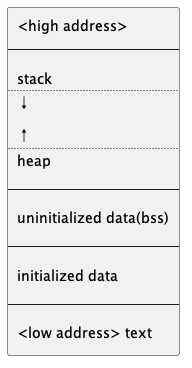

Historically, a C program has been composed of the following pieces:

-   Text segment: consisting of the machine instructions that the CPU
    executes.

-   Initilized data segment, usually called simply the data segment,

    containing variables that are specifically initialized in the
    program.\
    For example:

    ``` c
    int maxcount=99;
    ```

-   Uninitilized data segment, often called the "bss" segment,

    named after an ancient assembler operator that stood for "block
    started by symbol."

    ``` c
    long sum[1024];
    ```

-   Stack, where automatic variables are stored,

    along with information that is saved each time a function is called.

-   Heap, where dynamic memory allocation usually takes place.

    ``` c
    malloc();
    ```

###  7.7 Shared Libraries {#shared-libraries}

without shared libraries

``` bash
gcc -static hello.c
size a.out
text     data     bss     dec     hex filename
723103     7284    6392  736779   b3e0b   a.out
```

use shared libraries, the text and data size are greatly decreased

``` bash
gcc hello.c
size a.out
text     data     bss     dec     hex filename
1173      552       8    1733     6c5 a.out
```

###  7.8 Memory Allocation {#memory-allocation}

`man 3 malloc`{.verbatim}

1.  `malloc`, allocates specified number of bytes of memory without
    initialized
2.  `calloc`, allocates specified number of bytes of memroy with
    initializing to 0
3.  `realloc`, increase or decrease the size of previous allocated area,
    the increased area was not initialized

``` c
#include <stdlib.h>
void *malloc(size_t size);
void *calloc(size_t nobj, size_t size);
void *realloc(void *ptr, size_t newsize);

void free(void*ptr);
```

-   Alternative Memory Allocators

    -   `jemalloc`

        designed to scale well when used with multithreaded applications
        running on multiprocessor systems.

    -   `TCMalloc`

        for high performance, scalability, and memory efficiency.

    -   `alloca` Function

        alloc memmory from stack, instaead of heap, so we don\'t have to
        free the space;

###  7.9 Environment Variable {#environment-variable}

`man 3 getenv`{.verbatim}

``` c
#include <stdlib.h>
char *getenv(const char *name);
int putenv(char *str);
int setenv(const char *name, const char *value, int rewrite);
int unsetenv(const char *name);
```

**malloc**

###  7.10 `setjmp` and `longjmp` Functions {#setjmp-and-longjmp-functions}

-   **useful for dealing errors and interrupts**

-   Example

    ::: captioned-content
    ::: caption
    Listing 36: Figure 7.9 Typical program skeleton for
    command-processing
    :::

    ``` c
    #include "apue.h"

    #define TOK_ADD 5
    void do_line(char*);
    void cmd_add(void);
    int  get_token(void);

    int main(void) {
        char line[MAXLINE];

        while (fgets(line, MAXLINE, stdin) != NULL) {
            do_line(line);
        }
        return 0;
    }

    char* tok_ptr; /* global pointer for get_token() */
    int   tok;

    void do_line(char* ptr) /* process one line of input */
    {
        int cmd;

        tok_ptr = ptr;
        while ((cmd = get_token()) > 0) {
            switch (cmd) { /* one case for each command */
                case TOK_ADD:
                    cmd_add();
                    break;
            }
        }
    }

    void cmd_add(void) {
        int token;

        token = get_token();
        /* reset of processing for this command */
    }

    int get_token(void) {
        /* fetch next token from line pointed to by tok_ptr */

        return tok++;
    }
    ```
    :::

`man 3 setjmp`{.verbatim}

-   Example

    ::: captioned-content
    ::: caption
    Listing 37: Figure 7.13 Effect of longjmp on various type of
    variables
    :::

    ``` c
    #include <setjmp.h>

    #include "apue.h"

    static void f1(int, int, int, int);
    static void f2(void);

    static jmp_buf jmpbuffer;
    static int     globval;

    int main(void) {
        int          autoval;
        register int regival;
        volatile int volaval;
        static int   statval;

        globval = 1;
        autoval = 2;
        regival = 3;
        volaval = 4;
        statval = 5;

        if (setjmp(jmpbuffer) != 0) {
            printf("after longjmp:\n");
            printf(
                "globval = %d, autoval = %d, regival = %d,"
                " volaval = %d, statval = %d\n",
                globval, autoval, regival, volaval, statval);
            exit(0);
        }

        /*
         * Change variables after setjmp, but before longjmp.
         */
        globval = 95;
        autoval = 96;
        regival = 97;
        volaval = 98;
        statval = 99;

        f1(autoval, regival, volaval, statval); /* never returns */
        exit(0);
    }

    static void f1(int i, int j, int k, int l) {
        printf("in                     f1():\n");
        printf(
            "globval = %d, autoval = %d, regival = %d,"
            " volaval = %d, statval = %d\n",
            globval, i, j, k, l);
        f2();
    }
    static void f2(void) { longjmp(jmpbuffer, 1); }
    ```
    :::

-   **Automatic, Register and Volatile Variables**

    Most implementations do not try to roll back these automatic
    variables and register variables, but the standards say only that
    their values are indeterminate

**Potential Problem with Automatic Variables**

::: captioned-content
::: caption
Listing 38: Figure 7.14 Incorrect usage of an automatic variable
:::

``` c
/**
 *   @file     incorrect_usage.c
 *   @date     2019-09-19
 *   @author   whiothes <whiothes81@gmail.com>
 *   @version  1.0
 *   @brief    Incorrect usage of an automatic variable
 */
#include <stdio.h>

FILE* open_data(void) {
    FILE* fp;
    char  databuf[BUFSIZ]; /* setvbuf makes this the stdio buffer */

    if ((fp = fopen("datafile", "r")) == NULL) {
        return (NULL);
    }

    if (setvbuf(fp, databuf, _IOLBF, BUFSIZ) != 0) {
        return NULL;
    }

    return fp;
}
```
:::

> The problem is that when open~data~ returns, the space it used on the
> stack will be used by the stack frame for the next function that is
> called. But the standard I/O library will still be using that portion
> of memory for its stream buffer. Chaos is sure to result. To correct
> this problem, the array databuf needs to be allocated from global
> memory, either statically (static or extern) or dynamically (one of
> the alloc functions)

###  `getrlimit` and `setrlimit` Functions {#getrlimit-and-setrlimit-functions}

`man 3 getrlimit`{.verbatim}

-   Example

    ::: captioned-content
    ::: caption
    Listing 39: Figure 7.16 print the current resource limits
    :::

    ``` c
    #include <sys/resource.h>

    #include "apue.h"

    #define doit(name) pr_limits(#name, name)

    static void pr_limits(char *, int);

    int main(int argc, char *argv[argc]) {
    #ifdef RLIMIT_AS
        doit(RLIMIT_AS);
    #endif

        doit(RLIMIT_CORE);
        doit(RLIMIT_CPU);
        doit(RLIMIT_DATA);
        doit(RLIMIT_FSIZE);

    #ifdef RLIMIT_MEMLOCK
        doit(RLIMIT_MEMLOCK);
    #endif

    #ifdef RLIMITS_MSGQUEUE
        doit(RLIMITS_MSGQUEUE);
    #endif

        doit(RLIMIT_NOFILE);

        struct rlimit r;
        memset(&r, 0, sizeof(r));
        getrlimit(RLIMIT_NOFILE, &r);
        r.rlim_cur = 4096;
        setrlimit(RLIMIT_NOFILE, &r);

        doit(RLIMIT_NOFILE);
    #ifdef RLIMIT_NPTS
        doit(RLIMIT_NPTS);
    #endif

    #ifdef RLIMIT_RSS
        doit(RLIMIT_RSS);
    #endif

    #ifdef RLIMIT_SBSIZE
        doit(RLIMIT_SBSIZE);
    #endif

    #ifdef RLIMIT_SIGPENDING
        doit(RLIMIT_SIGPENDING);
    #endif

        doit(RLIMIT_STACK);

    #ifdef RLIMIT_SWAP
        doit(RLIMIT_SWAP);
    #endif

    #ifdef RLIMIT_VMEM
        doit(RLIMIT_VMEM);
    #endif

        return 0;
    }

    static void pr_limits(char *name, int resource) {
        struct rlimit      limit;
        unsigned long long lim;

        if (getrlimit(resource, &limit) < 0)
            err_sys("getrlimit error for %s", name);
        printf("%-14s ", name);

        if (limit.rlim_cur == RLIM_INFINITY)
            printf("(infinite) ");
        else {
            lim = limit.rlim_cur;
            printf("%10lld ", lim);
        }
        if (limit.rlim_max == RLIM_INFINITY) {
            printf("(infinite)");
        } else {
            lim = limit.rlim_max;
            printf("%10lld", lim);
        }
        putchar('\n');
    }
    ```
    :::

###  Summary {#summary-6}

-   Exercises

    1.  the length of \"hello, world\"
    2.  `man 3 exit`{.verbatim}
    3.  Nope
    4.  **for NULL usage**
    5.  `typedef void Exitfunc(void);`{.verbatim}\
        `int atexit(Exitfunc *func);`{.verbatim}
    6.  Yep, not sure
    7.  the heap and stack aren\'t allocated before applying
    8.  a.out include symbol info
    9.  standard I/O library was copied
    10. Nope. num in heap

##  Chapter 8. Process Control \[18/18\] {#chapter-8.-process-control-1818}

###  8.1 Introduction {#introduction-7}

###  8.2 Process Identifiers {#process-identifiers}

Process ID 0 is usually the scheduler process and is often know as
*swapper*. Process ID 1 is usually the **init** process. responsible for
bring up a UNIX system after the kernel has been bootstrapped Process ID
2 is pagedaemon. responsible for supporting paging of virtual memory
system.

`man 2 getpid`{.verbatim}

``` c
#include <unistd.h> pid_t getpid(void);
// Returns: process ID of calling process

pid_t getppid(void);
// Returns: parent process ID of calling process

uid_t getuid(void);
// Returns: real user ID of calling process

uid_t geteuid(void);
// Returns: effective user ID of calling process

gid_t getgid(void);
// Returns: real group ID of calling process

gid_t getegid(void);
// Returns: effective group ID of calling process
```

> Note that none of these functions has an error return.

###  8.3 `fork` Function {#fork-function}

`man 3 fork`{.verbatim}

``` c
pid_t fork(void);
// Returns: 0 in child, process ID of child in parent, −1 on error
```

> called once but return twice.
>
> return value in child is 0, whereas the return value in the parent is
> the process ID of the new child
>
> the child gets a copy of the parent's data space, heap, and stack,
> parents and child do not share memmory

-   Example

    ::: captioned-content
    ::: caption
    Listing 40: Figure 8.1 Example of fork function
    :::

    ``` c
    #include "apue.h"

    int  globvar = 6; /* external variable in initialized data */
    char buf[]   = "a write to stdout\n";

    int main(int argc, char *argv[]) {
        int   var;
        pid_t pid;

        var = 88;
        if (write(STDOUT_FILENO, buf, sizeof(buf) - 1) != sizeof(buf) - 1) {
            err_sys("write error");
        }
        printf("before fork\n");

        if ((pid = fork()) < 0) {
            err_sys("fork error");
        } else if (pid == 0) {
            globvar++; /* child */
            var++;     /* modify variables */
        } else {
            sleep(2);
        }

        printf("pid = %ld, glob = %d, var = %d\n", (long)getpid(), globvar, var);

        return 0;
    }
    ```
    :::

**changes to variables in a child process do not affect the value of the
variables in the parent process.**

-   File Sharing

    handling the descriptors after a fork.

    1.  The parent waits for the child to complete.
    2.  Both the parent and the child go their own ways. after fork,
        close needless descriptors(**socket**)

-   inherits:

    -   Real user ID, real group ID, effective user ID, and effective
        group ID

    -   Supplementary group IDs

    -   Process group ID

    -   Session ID

    -   Controlling terminal

    -   The set-user-ID and set-group-ID flags

    -   Current working directory

    -   Root directory

    -   File mode creation mask

    -   Signal mask and dispositions

    -   The close-on-exec flag for any open file descriptors

    -   Environment

    -   Attached shared memory segments

    -   Memory mappings

    -   Resource limits

-   differences

    -   return value

    -   process id

    -   parent id

    -   child\'s tms~utime~, tms~stime~, tms~cutime~, tms~cstime~ set to
        0

    -   parent\'s file locks are not inherited

    -   pending alarms are cleared for the child

    -   pending signals set is set to empty for child

-   There are two uses for fork:

    > 1.  When a process wants to duplicate itself so that the parent
    >     and the child can each execute different sections of code at
    >     the same time.
    > 2.  When a process wants to execute a different program.

###  8.4 `vfork` Function {#vfork-function}

> just like fork, without copying the address space of the parent into
> the child, as the child won't reference that address space
>
> the child runs in the address space of the parent until it calls
> either exec or exit.
>
> **vfork guarantees that the child runs first, until the child calls
> exec or exit.**

-   Example

    ::: captioned-content
    ::: caption
    Listing 41: Figure 8.3 Example of vfork function
    :::

    ``` c
    #include "apue.h"

    int globvar = 6; /* external variable in initialized data */

    int main(void) {
        int   var; /* automatic variable on the stack */
        pid_t pid;

        var = 88;
        printf("before vfork\n"); /* we don't flush stdio */
        if ((pid = vfork()) < 0) {
            err_sys("vfork error");
        } else if (pid == 0) { /* child */
            globvar++;         /* modify parent's variables */
            var++;
            exit(0); /* child terminaltes */
        }

        /* parent continues here */
        printf("pid = %ld, glob = %d, var = %d\n", (long)getpid(), globvar, var);

        return 0;
    }
    ```
    :::

###  8.5 `exit` Function {#exit-function}

> As we described in Section 7.3, a process can terminate normally in
> five ways:
>
> 1.  Executing a return from the main function.
> 2.  Calling the exit function.
> 3.  Calling the ~exit~ or ~Exit~ function. **terminate without running
>     exit handlers or signal handlers.**
> 4.  Executing a return from the start routine of the last thread in
>     the process.
> 5.  Calling the pthread~exit~ function from the last thread in the
>     process.

> The three forms of abnormal termination are as follows:
>
> 1.  Calling abort. generates **SIGABRT** signal
> 2.  When the process receives certain signals.
> 3.  The last thread responds to a cancellation request.

> -   In UNIX System terminology, a process that has terminated, but
>     whose parent has not yet waited for it, is called a zombie.
>
> -   The ps(1) command prints the state of a zombie process as Z.

###  8.6 `wait` and `waitpid` Functions {#wait-and-waitpid-functions}

> we need to be aware that a process that calls wait or waitpid can
>
> -   Block, if all of its children are still running
>
> -   Return immediately with the termination status of a child, if a
>     child has terminated and is waiting for its termination for its
>     termination status to be fetched
>
> -   Return immediately with an error, if it doesn\'t have any child
>     processes

`man 2 wait`{.verbatim}

``` c
#include <sys/wait.h>
pid_t wait(int *statloc);
pid_t waitpid(pid_t pid, int *statloc, int options);

Both return: process ID if OK, 0(see later), or -1 on error
```

-   Example

    ::: captioned-content
    ::: caption
    Listing 42: Figure 8.5 Print a description of the exit status
    :::

    ``` c
    #include <sys/wait.h>

    #include "apue.h"

    void pr_exit(int status) {
        if (WIFEXITED(status))
            printf("normal termination, exit status = %d\n", WEXITSTATUS(status));
        else if (WIFSIGNALED(status))
            printf("abnormal termination, signal number = %d%s\n", WTERMSIG(status),
    #ifdef WCOREDUMP
                   WCOREDUMP(status) ? " (core file generated)" : "");
    #else
                   "");
    #endif
        else if (WIFSTOPPED(status))
            printf("child stopped, signal number = %d\n", WSTOPSIG(status));
    }
    ```
    :::

    ::: captioned-content
    ::: caption
    Listing 43: Figure 8.6 Demonstrate various exit status
    :::

    ``` c
    #include <sys/wait.h>

    #include "apue.h"

    int main(void) {
        pid_t pid;
        int   status;

        if ((pid = fork()) < 0)
            err_sys("fork error");
        else if (pid == 0) /* child */
            exit(7);

        if (wait(&status) != pid) /* wait for child */
            err_sys("wait error");
        pr_exit(status);

        if ((pid = fork()) < 0)
            err_sys("fork error");
        else if (pid == 0)
            abort();

        if (wait(&status) != pid) err_sys("wait error");
        pr_exit(status);

        if ((pid = fork()) < 0)
            err_sys("fork error");
        else if (pid == 0)
            status /= 0;

        if (wait(&status) != pid) err_sys("wait error");
        pr_exit(status);

        return 0;
    }
    ```
    :::

> The waitpid function provides three features that aren't provided by
> the wait function.
>
> 1.  The waitpid function lets us wait for one particular process,
>     whereas the wait function returns the status of any terminated
>     child.
> 2.  The waitpid function provides a nonblocking version of wait.
> 3.  The waitpid function provides support for job control with the
>     WUNTRACED and WCONTINUED options.

-   Example

    ::: captioned-content
    ::: caption
    Listing 44: Figure 8.8 Avoid zombie processes by calling fork twice
    :::

    ``` c
    #include <sys/wait.h>

    #include "apue.h"

    int main(void) {
        pid_t pid;

        if ((pid = fork()) < 0) {
            err_sys("fork error");
        } else if (pid == 0) { /* first child */
            if ((pid = fork()) < 0) {
                err_sys("fork error");
            } else if (pid > 0)
                exit(0); /* parent from second fork == first child */

            /*
             * We're the second child; our parent becomes init as soon as
             * our real parent calls exit() in the statement above.
             * Here's where we'd continue executing, knowing that when we're done,
             * init will reap our status.
             */
            sleep(2);
            printf("second child, parent pid = %ld\n", (long)getppid());
            exit(0);
        }

        if (waitpid(pid, NULL, 0) != pid) /* wait for first child */
            err_sys("waitpid error");
        /*
         * We're the parent (the original process); we continue executing,
         * knowing that we're not the parent of the second child
         */
        return 0;
    }
    ```
    :::

###  8.7 `waitid` Function {#waitid-function}

`man 2 waitid`{.verbatim}

``` c
#include <sys/wait.h> int waitid(idtype_t idtype, id_t id, siginfo_t *infop, int options);
// Returns: 0 if OK, −1 on error
```

(OS X can\'t get the info, but the function is valid)

###  8.8 `wait3` and `wait4` Functions {#wait3-and-wait4-functions}

`man 2 wait3`{.verbatim}

###  8.9 Race Conditions {#race-conditions}

**Avoid race by signal**

-   Example

    ::: captioned-content
    ::: caption
    Listing 45: Figure 8.12 Program with a race condition
    :::

    ``` c
    #include "apue.h"

    static void charatatime(char *);

    int main(void) {
        pid_t pid;

        if ((pid = fork()) < 0) {
            err_sys("fork_ error");
        } else if (pid == 0) {
            charatatime("output from child\n");
        } else {
            charatatime("output from parent\n");
        }

        return 0;
    }

    static void charatatime(char *str) {
        char *ptr;
        int   c;

        setbuf(stdout, NULL); /* set unbuffered */
        for (ptr = str; (c = *ptr++) != 0;) {
            // usleep(100);
            putc(c, stdout);
            // putchar(c);
        }
    }
    ```
    :::

    ::: captioned-content
    ::: caption
    Listing 46: Figure 8.13 Modification of Figure 8.12 to avoid race
    condition
    :::

    ``` c
    #include "apue.h"

    static void charatatime(char *);

    int main(void) {
        pid_t pid;

        TELL_WAIT();

    #if 1
        if ((pid = fork()) < 0) {
            err_sys("fork error");
        } else if (pid == 0) {
            WAIT_PARENT(); /* parent goes first */
            charatatime("output from child\n");
            TELL_PARENT(getppid());
        } else {
            charatatime("output from parent\n");
            TELL_CHILD(pid);
            WAIT_CHILD();
        }
    #else
        if ((pid = fork()) < 0) {
            err_sys("fork error");
        } else if (pid == 0) {
            charatatime("output from child\n");
            TELL_PARENT(getppid());
        } else {
            WAIT_CHILD();
            charatatime("output from parent\n");
        }
    #endif

        exit(0);
    }

    static void charatatime(char *str) {
        char *ptr;
        int   c;

        setbuf(stdout, NULL); /* set unbuffered */
        for (ptr = str; (c = *ptr++) != 0;) {
            usleep(100);
            putc(c, stdout);
        }
    }
    ```
    :::

###  8.10 `exec` Functions {#exec-functions}

`man 3 exec`{.verbatim}

``` c
#include <unistd.h>
int execl(const char *pathname, const char *arg0, ... /* (char *)0 */ );
int execv(const char *pathname, char *const argv[]);
int execle(const char *pathname, const char *arg0, ...
           /* (char *)0, char *const envp[] */ );
int execve(const char *pathname, char *const argv[], char *const envp[]);
int execlp(const char *filename, const char *arg0, ... /* (char *)0 */ );
int execvp(const char *filename, char *const argv[]);
int fexecve(int fd, char *const argv[], char *const envp[]);
```

Returns: All seven return: −1 on error, no return on success

> The first difference in these functions is that the first four take a
> pathname argument, the next two take a filename argument, and the last
> one takes a file descriptor argument. When a filename argument is
> specified,
>
> -   If filename contains a slash, it is taken as a pathname.
>
> -   Otherwise, the executable file is searched for in the directories
>     specified by the **PATH** environment variable.

`execlp` and `execvp` assume **link** as a **shell script**, and try to
invoke `/bin/sh` with **filename**

> The letter **p** means that the function takes a filename argument and
> uses the PATH environment variable to find the executable file The
> letter **l** means that the function takes a list of arguments and is
> mutually exclusive The letter **v**, means that it takes an argv\[\]
> vector. Finally, the letter **e** means that the function takes an
> envp\[\] array instead of using the current environment.


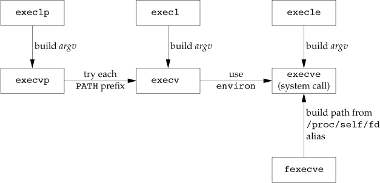

-   Example

    ::: captioned-content
    ::: caption
    Listing 47: Figure 8.16 Example of exec functions
    :::

    ``` c
    #include <sys/wait.h>

    #include "apue.h"

    char *env_init[] = {"USER=unknown", "PATH=/tmp", NULL};

    int main(void) {
        pid_t pid;

        if ((pid = fork()) < 0) {
            err_sys("fork error");
        } else if (pid == 0) { /* specify pathname, specify environment */
            if (execle("echo", "echoall", "myarg1", "MY ARG2", (char *)0,
                       env_init) < 0) {
                err_sys("execle error");
            }
        }

        if (waitpid(pid, NULL, 0) < 0) err_sys("wait error");

        if ((pid = fork()) < 0) {
            err_sys("fork error");
        } else if (pid == 0) { /* specify filename, inherit environment */
            if (execlp("echo", "echoall", "only 1 arg", (char *)0) < 0)
                err_sys("execlp error");
        }

        return 0;
    }
    ```
    :::

    ::: captioned-content
    ::: caption
    Listing 48: Figure 8.17 Echo all command-line arguments and all
    environment strings
    :::

    ``` c
    #include "apue.h"

    int main(int argc, char *argv[argc]) {
        int           i;
        char **       ptr;
        extern char **environ;

        for (i = 0; i < argc; ++i) { /* "echo all command-line args" */
            printf("argv[%d]: %s\n", i, argv[i]);
        }

        for (ptr = environ; *ptr != 0; ++ptr) {
            printf("%s\n", *ptr);
        }

        return 0;
    }
    ```
    :::

###  8.11 Changing User IDs and Group IDs {#changing-user-ids-and-group-ids}

`man 2 setuid`{.verbatim}

> 1.  If the process has superuser privileges, the setuid function sets
>     the real user ID, effective user ID, and saved set-user-ID to uid.
>
> 2.  If the process does not have superuser privileges, but uid equals
>     either the real user ID or the saved set-user-ID, setuid sets only
>     the effective user ID to uid. The real user ID and the saved
>     set-user-ID are not changed.
>
> 3.  If neither of these two conditions is true, errno is set to EPERM
>     and −1 is returned.

```{=org}
#+caption: Figure 8.18 Ways to change the three user IDs
```
<file:Chapter08/08fig18.jpg> `man 2 setreuid`{.verbatim}
`man 2 setregid`{.verbatim}

###  8.12 Interpreter Files {#interpreter-files}

-   Example

    ::: captioned-content
    ::: caption
    Listing 49: Figure 8.20 A program that execs an interpreter file
    :::

    ``` c
    #include <sys/wait.h>

    #include "apue.h"

    int main(void) {
        pid_t pid;

        if ((pid = fork()) < 0) {
            err_sys("fork error");
        } else if (pid == 0) {
            if (execlp("systype.sh", NULL, NULL) < 0) err_sys("execl error");
        }

        if (waitpid(pid, NULL, 0) < 0) err_sys("waitpid error");

        return 0;
    }
    ```
    :::

    ::: captioned-content
    ::: caption
    Listing 50: Figure 8.21 An awk program as an interpreter file
    :::

    ``` c
    #!/usr/bin/awk -f
    # Note: On Solaris, use nawk instead

    BEGIN {
      for (i = 0; i < ARGC; i ++) {
        printf "ARGV[%d] = %s\n", i, ARGV[i]
      }
      exit
    }
    ```
    :::

###  8.13 `system` Function {#system-function}

``` c
#include <stdlib.h>
int system(const char *cmdstring);
```

\*if *cmdstring* is a `NULL`, `system` returns nonzero only if a command
processor is available.

> 1.  If either the fork fails or waitpid returns an error other than
>     EINTR, system returns −1 with errno set to indicate the error.
>
> 2.  If the exec fails, implying that the shell can't be executed, the
>     return value is as if the shell had executed exit(127).
>
> 3.  Otherwise, all three functions---fork, exec, and
>     waitpid---succeed, and the return value from system is the
>     termination status of the shell, in the format specified for
>     waitpid.

-   Example

    ::: captioned-content
    ::: caption
    Listing 51: Figure 8.22 The system function, without signal handling
    :::

    ``` c
    #include <errno.h>
    #include <sys/wait.h>
    #include <unistd.h>

    #include "apue.h"

    // version without signal handling
    int system(const char *cmdstring) {
        pid_t pid;
        int   status;

        if (cmdstring == NULL) {
            return 1; /* always a command processor with UNIX */
        }

        if ((pid = fork()) < 0) {
            status = -1;
        } else if (pid == 0) {
            execl("/bin/sh", "shell1", "-c", cmdstring, (char *)0);
            _exit(27);
        } else {
            while (waitpid(pid, &status, 0) < 0) {
                if (errno != EINTR) {
                    status = -1;
                    break;
                }
            }
        }

        return status;
    }

    // calling system function
    int main(void) {
        int status;

        if ((status = system("date")) < 0) err_sys("system() error");

        pr_exit(status);

        if ((status = system("nosuchcommand")) < 0) err_sys("system() error");
        pr_exit(status);

        if ((status = system("who; exit 44")) < 0) err_sys("system() error");
        pr_exit(status);

        return 0;
    }
    ```
    :::

    ::: captioned-content
    ::: caption
    Listing 52: Figure 8.23 Calling the system function
    :::

    ``` c
    #include <errno.h>
    #include <sys/wait.h>
    #include <unistd.h>

    #include "apue.h"

    // version without signal handling
    int system(const char *cmdstring) {
        pid_t pid;
        int   status;

        if (cmdstring == NULL) {
            return 1; /* always a command processor with UNIX */
        }

        if ((pid = fork()) < 0) {
            status = -1;
        } else if (pid == 0) {
            execl("/bin/sh", "shell1", "-c", cmdstring, (char *)0);
            _exit(27);
        } else {
            while (waitpid(pid, &status, 0) < 0) {
                if (errno != EINTR) {
                    status = -1;
                    break;
                }
            }
        }

        return status;
    }

    // calling system function
    int main(void) {
        int status;

        if ((status = system("date")) < 0) err_sys("system() error");

        pr_exit(status);

        if ((status = system("nosuchcommand")) < 0) err_sys("system() error");
        pr_exit(status);

        if ((status = system("who; exit 44")) < 0) err_sys("system() error");
        pr_exit(status);

        return 0;
    }
    ```
    :::

> The advantage in using system, instead of using fork and exec
> directly, is that system does all the required error handling and (in
> our next version of this function in Section 10.18) all the required
> signal handling.

**Set-User-ID Programs**

::: captioned-content
::: caption
Listing 53: Figure 8.24 Execute the command-line argument using system
:::

``` c
#include "apue.h"

int main(int argc, char *argv[argc]) {
    int status;

    if (argc < 2) err_quit("command-line argument required");

    if ((status = system(argv[1])) < 0) err_sys("system() error");
    pr_exit(status);

    return 0;
}
```
:::

::: captioned-content
::: caption
Listing 54: Figure 8.25 Print real and effective user IDs
:::

``` c
#include "apue.h"

int main(int argc, char *argv[argc]) {
    printf("real uid = %d, effective uid = %d\n", getuid(), geteuid());
    return 0;
}
```
:::

###  8.14 Process Accounting {#process-accounting}

-   Example

    ::: captioned-content
    ::: caption
    Listing 55: Figure 8.28 Program to generate accounting data
    :::

    ``` c
    #include "apue.h"

    int main(void) {
        pid_t pid;

        if ((pid = fork()) < 0)
            err_sys("fork error");
        else if (pid != 0) {
            sleep(2);
            exit(2);
        }

        if ((pid = fork()) < 0)
            err_sys("fork error");
        else if (pid != 0) {
            sleep(4);
            abort();
        }

        if ((pid = fork()) < 0)
            err_sys("fork error");
        else if (pid != 0) {
            execl("/bin/dd", "dd", "if=/etc/passwd", "of=/dev/null", NULL);
            exit(7);
        }

        if ((pid = fork()) < 0)
            err_sys("fork error");
        else if (pid != 0) {
            sleep(8);
            exit(0);
        }

        sleep(6);
        kill(getpid(), SIGKILL);
        exit(6);
        return 0;
    }
    ```
    :::

    ::: captioned-content
    ::: caption
    Listing 56: Figure 8.29 Print select fields from system\'s
    accounting file
    :::

    ``` c
    #include "apue.h"

    #include <ctype.h>
    #include <sys/acct.h>
    #include <sys/types.h>

    #if defined(BSD) /* different structure in FreeBSD */
    #define acct    acctv2
    #define ac_flag ac_trailer.ac_flag
    #define FMT     "%-*.*s e = %.0f, chars = %.0f, %c %c %c %c\n"
    #elif defined(HAS_AC_STAT)
    #define FMT "%-*.*s e = %6ld, chars = %7ld, stat = %3u: %c %c %c %c\n"
    #else
    #define FMT "%-*.*s e = %6ld, chars = %7ld, %c %c %c %c\n"
    #endif

    #if defined(LINUX)
    #define acct acct_v3 /* different structure in Linux */
    #endif

    #if !defined(ACORE)
    #define ACORE 0
    #endif

    #if !defined(AXSIG)
    #define AXSIG 0
    #endif

    #if !defined(BSD)
    static unsigned long compt2ulong(comp_t comptime) {
        /* convert comp_t to unsigned long */
        unsigned long val;
        int           exp;

        val = comptime & 0x1fff;    /* 13-bit fraction  */
        exp = (comptime >> 13) & 7; /* 3-bit exponent(0-7)  */
        while (exp-- > 0) val *= 8;
        return val;
    }
    #endif

    int main(int argc, char *argv[argc]) {
        struct acct acdata;
        FILE *      fp;

        if (argc != 2) err_quit("usage pracct filename");
        if ((fp = fopen(argv[1], "r")) == NULL) err_sys("can't open %s", argv[1]);
        while (fread(&acdata, sizeof(acdata), 1, fp) == 1) {
            printf(FMT, (int)sizeof(acdata.ac_comm), acdata.ac_comm,
    #if defined(BSD)
                   acdata.ac_etime, acdata.ac_io,
    #else
                   compt2ulong(acdata.ac_etime), compt2ulong(acdata.ac_io),
    #endif
    #if defined(HAS_AC_STAT)
                   (unsigned char)acdata.ac_stat,
    #endif
                   acdata.ac_flag & ACORE ? 'D' : ' ',
                   acdata.ac_flag & AXSIG ? 'X' : ' ',
                   acdata.ac_flag & AFORK ? 'F' : ' ',
                   acdata.ac_flag & ASU ? 'S' : ' ');
        }

        return 0;
    }
    ```
    :::

###  8.15 User Identification {#user-identification-1}

`man 2 getlogin`{.verbatim}

::: captioned-content
::: caption
Listing 57: getlogin
:::

``` c
#include "apue.h"

int main() { printf("%s\n", getlogin()); }
```
:::

###  8.16 Process Scheduling {#process-scheduling}

Lower nice values have higher scheduling priority.

`man 3 nice`{.verbatim} `man 3 getpriority`{.verbatim}

-   Example

    ::: captioned-content
    ::: caption
    Listing 58: Figure 8.30 Evaluate the effect of changing the nice
    value
    :::

    ``` c
    #include <errno.h>
    #include <sys/time.h>

    #include "apue.h"

    #if defined(__APPLE__)
    #include <sys/syslimits.h>
    #elif defined(SOLARIS)
    #include <limits.h>
    #elif defined(BSD)
    #include <sys/param.h>
    #endif

    unsigned long long count;
    struct timeval     end;

    void checktime(char *str) {
        struct timeval tv;

        gettimeofday(&tv, NULL);
        if (tv.tv_sec >= end.tv_sec && tv.tv_usec >= end.tv_usec) {
            printf("%s count = %lld\n", str, count);
            exit(0);
        }
    }

    int main(int argc, char *argv[]) {
        pid_t pid;
        char *s;
        int   nzero, ret;
        int   adj = 0;

        setbuf(stdout, NULL);
    #if defined(NZERO)
        nzero = NZERO;
    #elif defined(_SC_NZERO)
        nzero = sysconf(_SC_NZERO);
    #else
    #error NZERO undefined
    #endif
        printf("NZERO = %d\n", nzero);
        if (argc == 2) adj = strtol(argv[1], NULL, 10);
        gettimeofday(&end, NULL);
        end.tv_sec += 10; /* run for 10 seconds */

        if ((pid = fork()) < 0) {
            err_sys("fork failed");
        } else if (pid == 0) { /* child */
            s = "child";
            printf("current nice value in child is %d adjusting by %d\n",
                   nice(0) + nzero, adj);
            errno = 0;
            if ((ret = nice(adj)) == -1 && errno != 0) {
                err_sys("child set scheduling priority");
            }
            printf("now child nice value is %d\n", ret + nzero);
        } else { /* parent */
            s = "parent";
            printf("current nice value in parent is %d\n", nice(0) + nzero);
        }

        for (;;) {
            if (++count == 0) {
                err_quit("%s counter wrap", s);
            }
            checktime(s);
        }

        return 0;
    }
    ```
    :::

###  8.17 Process Times {#process-times}

``` c
#include <sys/times.h>
clock_t times(struct tms *buf);

// Returns: elapsed wall clock time in clock ticks if OK, -1 on error
```

::: captioned-content
::: caption
Listing 59: Figure 8.31 Time and execute all command-line arguments
:::

``` c
#include <sys/times.h>

#include "apue.h"

static void pr_times(clock_t, struct tms *, struct tms *);
static void do_cmd(char *);

int main(int argc, char *argv[]) {
    int i;
    setbuf(stdout, NULL);

    for (i = 1; i < argc; ++i) {
        do_cmd(argv[i]);
    }

    exit(0);
}

static void do_cmd(char *cmd) {
    struct tms tmsstart, tmsend;
    clock_t    start, end;
    int        status;

    printf("\ncommand: %s\n", cmd);

    if ((start = times(&tmsstart)) == -1) {
        err_sys("times error");
    }

    if ((status = system(cmd)) < 0) {
        err_sys("system() error");
    }

    if ((end = times(&tmsend)) == -1) {
        err_sys("times error");
    }

    pr_times(end - start, &tmsstart, &tmsend);
    pr_exit(status);
}

static void pr_times(clock_t real, struct tms *tmsstart, struct tms *tmsend) {
    static long clktck = 0;

    if (clktck == 0) {
        if ((clktck = sysconf(_SC_CLK_TCK)) < 0) {
            err_sys("sysconf error");
        }
    }

    printf("  real:         %7.2f\n", real / (double)clktck);
    printf("  user:         %7.2f\n",
           (tmsend->tms_utime - tmsstart->tms_utime) / (double)clktck);
    printf("  sys:          %7.2f\n",
           (tmsend->tms_stime - tmsstart->tms_stime) / (double)clktck);
    printf("  child user:   %7.2f\n",
           (tmsend->tms_cutime - tmsstart->tms_cutime) / (double)clktck);
    printf("  child sys:    %7.2f\n",
           (tmsend->tms_cstime - tmsstart->tms_cstime) / (double)clktck);
}
```
:::

###  8.18 Summary {#summary-7}

functions to master: `fork`, `exec` family, `_exit`, `wait` and
`waitpid`.

`fork` function gave us an opportunity to look at race conditions.

-   Exercises

    -   ::: captioned-content
        ::: caption
        Listing 60: 8.1
        :::

        ``` c
        #include "apue.h"

        int globvar = 6; /* external variable in initialized data */

        int main(void) {
            int   var; /* automatic variable on the stack */
            pid_t pid;

            var = 88;
            printf("before vfork\n"); /* we don't flush stdio */
            if ((pid = vfork()) < 0) {
                err_sys("vfork error");
            } else if (pid == 0) { /* child */
                globvar++;         /* modify parent's variables */
                var++;
                exit(0); /* child terminaltes */
            }

            /* parent continues here */
            printf("pid = %ld, glob = %d, var = %d\n", (long)getpid(), globvar, var);

            return 0;
        }
        ```
        :::

    -   ::: captioned-content
        ::: caption
        Listing 61: 8.2
        :::

        ``` c
        #include "apue.h"

        static void f1(void), f2(void);

        int main(void) {
            f1();

            f2();

            _exit(0);
        }

        static void f1(void) {
            pid_t pid;

            if ((pid = vfork()) < 0)
                err_sys("vfork error"); /* child and parent both return */
        }

        static void f2(void) {
            char buf[100];
            int  i;

            /* automatic variables */

            for (i = 0; i < sizeof(buf); i++) buf[i] = 0;
        }
        ```
        :::

    -   ::: captioned-content
        ::: caption
        Listing 62: 8.3
        :::

        ``` c
        #include "apue.h"

        int globvar = 6; /* external variable in initialized data */

        int main(void) {
            int   var; /* automatic variable on the stack */
            pid_t pid;

            var = 88;
            printf("before vfork\n"); /* we don't flush stdio */
            if ((pid = vfork()) < 0) {
                err_sys("vfork error");
            } else if (pid == 0) { /* child */
                globvar++;         /* modify parent's variables */
                var++;
                exit(0); /* child terminaltes */
            }

            /* parent continues here */
            printf("pid = %ld, glob = %d, var = %d\n", (long)getpid(), globvar, var);

            return 0;
        }
        ```
        :::

    -   8.4

In Figure 8.13, we have the parent write its output first. When the
parent is done, the child writes its output, but we let the parent
terminate. Whether the parent terminates or whether the child finishes
its output first depends on the kernel's scheduling of the two processes
(another race condition). When the parent terminates, the shell starts
up the next program, and this next program can interfere with the output
from the previous child. We can prevent this from happening by not
letting the parent terminate until the child has also finished its
output. Replace the code following the fork with the following:

``` c
else if (pid ~~ 0) {
        WAIT_PARENT(); /* parent goes first */
        charatatime("output from child\n");
        TELL_PARENT(getppid()); /* tell parent we’re done */
} else {
        charatatime("output from parent\n");
        TELL_CHILD(pid);
        /* tell child we’re done */
        WAIT_CHILD(); /* wait for child to finish */
}
```

We won't see this happen if we let the child go first, since the shell
doesn't start the next program until the parent terminates.

-   8.5 The same value

-   ::: captioned-content
    ::: caption
    Listing 63: 8.6
    :::

    ``` c
    #include "apue.h"

    int main() {
        pid_t pid;

        if ((pid = fork()) < 0) {
            err_sys("fork error");
        } else if (pid == 0) {
            exit(0);
        }

        sleep(4);

        system("ps -o pid,ppid,state,tty,command");
    }
    ```
    :::

##  Chapter 9. Process Relationships \[12/12\] {#chapter-9.-process-relationships-1212}

###  9.1 Introduction {#introduction-8}

###  9.2 Terminal Logins {#terminal-logins}

-   BSD Terminal Logins

    ```{=org}
    #+caption: Figure 9.1 Processes invoked by init to allow terminal logins
    ```
    [](file:Chapter09/9fig1.jpg)

    > a real user ID of 0 and an effective user ID of 0

    `login`{.verbatim} program similar to

    ``` c
    execle("/bin/login", "login", "-p", username, (char *)0, envp);
    ```

###  9.3 Network Logins {#network-logins}

> The main (physical) difference between logging in to a system through
> a serial terminal and logging ni to a system through a network is that
> the connection between the terminal and the computer isn\'t
> point-to-point.
>
> To allow the same software to process logins over both terminal logins
> and network logins, a software driver called a pseudo terminal is used
> to emulate the behavior of a serial terminal and map terminal
> operations to network operations, and vice versa.

###  9.4 Process Groups {#process-groups}

``` {#each process belongs to a process group. .c}
#include <unistd.h>
pid_t getpgrp(void);
// Returns: process group ID of calling process
```

``` {#in older BSD-derived systems: .c}
#include <unistd.h>
pid_t getpgid(pid_t pid);
// Returns: process group ID if OK, -1 on error
```

`getpgid(0) == getpgrp()`

``` {#A process joins an existing process group or create a new process group: .c}
#include <unistd.h>
int setpgid(ipd_t pid, pid_t pgid);
// Returns: 0 if OK, -1 on error
```

if *pid == pgid*, the pid becomes a process group leader if *pid == 0*,
the process ID of the caller is used. if *pgid == 0*, the process ID
specified by pid is used as process group ID

###  9.5 Sessions {#sessions}

> A session is a collection of one or more process groups.

``` {#establish a new session .c}
#include <unistd.h>
pid_t setsid(void);
// Returns: process group ID if OK, -1 on error
```

1.  The process becomes the *session leader* of this new session. (A
    session leader is the process that creates a session)
2.  The process becomes the process group leader of a new process group.
3.  The process has no controlling terminal.

``` {#return the process group ID of a process's session leader .c}
#include <unistd.h>
pid_t getsid(pid_t pid);
// Returns: session leader's process group ID if OK, -1 on error
```

###  9.6 Controlling Terminal {#controlling-terminal}

Sessions and progress groups have a few other characteristics

-   A session can have a single *controlling terminal*.

-   The session leader that establishes the connection to the
    controlling terminal

-   The process groups within a session can be divided into a single
    *foreground process group* and one or more *background proces
    groups*

-   If a session has a controlling terminal, it has a single foreground
    process group and all other process groups in the session are
    background process groups

-   Whenever we press the terminal\'s interrupt key(often DELETE or
    Control-C), the interrupt signal is sent to all processes in the
    foreground process group.

-   Whenever we press the terminal\'s quit key(Often Control-backslash),
    the quit signal is sent to all processes in the foreground process
    group.

-   If a modem(or network) disconnect is detected by the terminal
    interface, the hang-up signal is sent to the controlling process
    (the session leader).

###  9.7 `tcgetpgrp`, `tcsetpgrp`, and `tcgetsid` Functions {#tcgetpgrp-tcsetpgrp-and-tcgetsid-functions}

``` {#get/set process group ID for foreground process group .c}
#include <unistd.h>
pid_t tcgetpgrp(int fd);
// Returns: process group ID of foreground process group if OK, -1 on error

int tcsetpgrp(int fd, pid_t pgrpid);
// Returns: 0 if OK, -1 on error
```

``` {#allow application to obtain the process group ID for the session leader given a file descriptor for the controlling TTY. .c}
#include <termios.h>
pid_t tcgetsid(int fd);
// Returns: session leader's process group ID if OK, -1 on error
```

###  9.8 Job Control {#job-control}

Requirements:

1.  A shell that supports job control
2.  The terminal driver in the kernel must support job control
3.  The kernel must support certain job-control signals

``` {.bash org-language="sh"}
cat > temp.foo & # & let start in background
fg % 1 # % bring job number into the foreground
```

``` {.bash org-language="sh"}
stty tostop # disable ability of background to output to controlling terminal
```

generate signals to the foreground process group:

1.  The interrupt character (typically DELETE or Control-C) generates
    SIGINT.
2.  The quit character (typically Control-backslash) generates SIGQUIT.
3.  The suspend character (typically Control-Z) generates SIGTSTP.

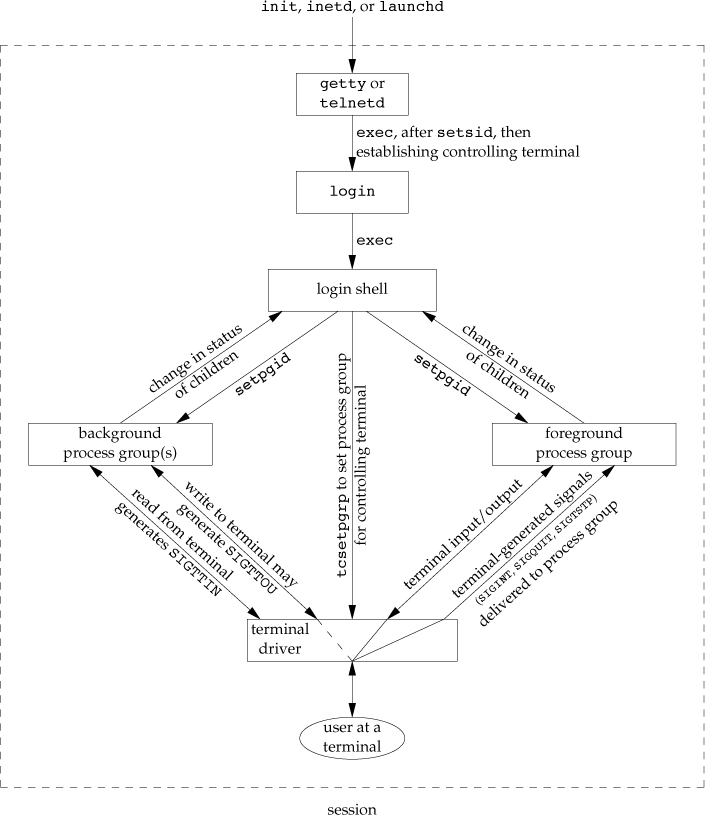

###  9.9 Shell Execution Programs {#shell-execution-programs}

``` {.bash org-language="sh"}
ps -o pid,ppid,pgid,comm
```


###  9.10 Orphaned Process Groups {#orphaned-process-groups}


::: captioned-content
::: caption
Listing 64: Figure 9.12 Creating an orphaned process group
:::

``` c
/**
 *   @file     09fig12.c
 *   @date     2019-12-09
 *   @author   whiothes <whiothes81@gmail.com>
 *   @version  1.0
 *   @brief    Creating an orphaned process group
 */

#include <errno.h>

#include "apue.h"

static void sig_hup(int signo) {
    printf("SIGHUP received, pid = %ld\n", (long)getpid());
}

static void pr_ids(char *name) {
    printf("%s: pid = %ld, ppid = %ld, pgrp = %ld, tpgrp = %ld\n", name,
           (long)getpid(), (long)getppid(), (long)getpgrp(),
           (long)tcgetpgrp(STDIN_FILENO));
    fflush(stdout);
}

int main(void) {
    char c;
    pid_t pid;

    pr_ids("parent");
    pid = fork();
    switch(pid) {
    case -1:
        err_sys("fork error");

    case 0:
        pr_ids("child");
        signal(SIGHUP, sig_hup);
        kill(getpid(), SIGTSTP);
        pr_ids("child");
        if (read(STDIN_FILENO, &c, 1) != 1) {
            printf("read error %d on controlling TTY\n", errno);
        }

    default:
        sleep(5);
    }

    exit(0);
}
```
:::

> After the fork
>
> -   The parent sleeps for 5 seconds.
>
> -   The child establishes a signal handler for the hang-up
>     signal(SIGHUP) so we can see whether it is sent to the child.
>
> -   The child sends itself to stop signal(SIGTSTP) with the kill
>     function.
>
> -   When the parent terminates, the child is orphaned, so the child\'s
>     parent process ID becomes 1, which is the init process ID.
>
> -   At this point, the child is now a member of an *orphaned process
>     group*.
>
> -   Since the process group is orphaned when the parent terminates,
>     and the process group contains a stopped process, **POSIX.1
>     requires that every process in the newly orphaned process group be
>     sent the hang-up signal(SIGHUP) followed by the continue
>     signal(SIGCONT)**
>
> -   This causes the child to be continued, after processing the
>     hang-up signal.

###  9.11 FreeBSD Implementation {#freebsd-implementation}

```{=org}
#+caption: Figure 19: Figure 9.13 Free BSD implementation of sessions and process groups
```
<file:Chapter09/09fig13.jpg>

> **session structure**
>
> -   `s_count`: the number of the process groups in the session.
> -   `s_leader`: a pointer to the proc structure of the session leader
> -   `s_ttyvp`: a pointer to the vnode structure of the controlling
>     terminal
> -   `s_ttyp`: a pointer to the tty structure of the controlling
>     terminal
> -   `s_sid`: the session ID.
>
> **tty structure**
>
> -   `t_session`: points to the session structure that has this
>     terminal as its controlling terminal.
> -   `t_pgrp`: points to the pgrp structure of the foreground process
>     group.
> -   `t_termios`: is a structure containing all the special characters
>     and related information for this terminal.
> -   `t_winsize`: is a winsize structure that contains the current size
>     of the terminal window.
>
> **pgrp structure**
>
> -   `pg_id`: the process group ID
> -   `pg_session`: points to the session structure to the session
>     leader
> -   `pg_members`: a pointer to the list of members\' proc structures
>
> **proc structure**
>
> -   `p_pid`: contains the process ID
> -   `p_pptr`: a pointer to the proc structure of the parent process.
> -   `p_pgrp`: a pointer to the pgrp structure of the process group to
>     which it belongs to
> -   `p_pglist`: a structure containing pointers to the next and
>     previous process in the process group.
>
> **vnode structure** : allocated when the controlling terminal device
> is opened.

###  9.12 Summary {#summary-8}

-   Exercises

    -   9.1

        > The init process learns when a terminal user logs out, because
        > init is the parent of the login shell and receives the SIGCHLD
        > signal when the login shell terminates.
        >
        > For a network login, however, init is not involved. Instead,
        > the login entries in the utmp and wtmp files, and their
        > corresponding logout entries, are usually written by the
        > process that handles the login and detects the logout (telnetd
        > in our example).

    -   9.2

        ``` c
        /**
         *   @file     09ex02.c
         *   @date     2019-12-14
         *   @author   whiothes <whiothes81@gmail.com>
         *   @version  1.0
         *   @brief    Exercises 9.2
         *
         *  Write a small program that calls fork and has the child create a new
         * session. Verify that the child becomes a process group leader and that the
         * child no longer has a controlling terminal.
         *
         */

        #include <errno.h>
        #include <fcntl.h>

        #include "apue.h"

        int main(void) {
            int   fd  = 0;
            pid_t pid = 0;

            TELL_WAIT();

            pid = fork();
            switch (pid) {
                case -1:
                    err_quit("fork error");

                case 0:
                    WAIT_PARENT();

                    printf("getsid in child before setsid: %lu\n",
                           (unsigned long)getsid(pid));
                    setsid();
                    printf("getsid in child after setsid : %lu\n",
                           (unsigned long)getsid(pid));

                    fd = open("/dev/tty", O_RDONLY);
                    if (fd < 0) {
                        printf("child get tty failed: %s\n", strerror(errno));
                    } else {
                        printf("child get tty success\n");
                        close(fd);
                    }

                    TELL_PARENT(getppid());
                    exit(EXIT_SUCCESS);

                default:
                    printf("getsid in parent before child setsid: %lu\n",
                           (unsigned long)getsid(pid));
                    TELL_CHILD(pid);
                    WAIT_CHILD();

                    fd = open("/dev/tty", O_RDONLY);
                    if (fd < 0) {
                        printf("parent get tty failed: %s\n", strerror(errno));
                    } else {
                        printf("parent get tty success\n");
                        close(fd);
                    }

                    printf("getsid in parent after child setsid: %lu\n",
                           (unsigned long)getsid(pid));

                    exit(EXIT_SUCCESS);
            }
        }
        ```

##  Chapter 10. Signals \[23/23\] {#chapter-10.-signals-2323}

###  10.1 Introduction {#introduction-9}

> Signals provide a way of handling asynchronous events

###  10.2 Signal Concepts {#signal-concepts}

`<signal.h>` conditions can generate a signal

-   terminal generated when users press certain terminal keys.
-   hardware exceptions
-   function `kill` (man 2 kill)
-   command `kill` (man 1 kill)
-   software conditions : `SIGURG` `SIGPIPE` `SIGALARM`

deal with signals via one of things below:

-   ignore
-   catch
-   use defaut action apply

  Name         Description                                             Default Action
  ------------ ------------------------------------------------------- -----------------------------
  SIGABRT      abnormal termination(abort)                             terminate+core
  SIGALARM     timer expired(alarm)                                    terminate
  SIGBUS       hardware fault                                          terminate+core
  SIGCHLD      change in the status of child                           ignore
  SIGCONT      continue stopped process                                continue/ignore
  SIGEMT       hardware fault                                          terminate+core
  SIGFPE       arithmetic exception                                    terminate+core
  SIGFREEZE    checkpoint freeze                                       ignore
  SIGHUP       hangup                                                  terminate
  SIGILL       illegal instruction                                     terminate+core
  SIGINFO      status request from keyboard                            ignore
  SIGINT       terminal interrupt character                            terminate
  SIGIO        asynchronous I/O                                        terminate/ignore
  SIGIOT       hardware fault                                          terminate+core
  SIGKILL      termination : **can\'t be caught or ignored**           terminate
  SIGPIPE      write to pipe with no readers                           terminate
  SIGPOLL      pollable event(poll): **might be removed**              terminate
  SIGPROF      profiling time alarm(setitimer): **might be removed**   terminate
  SIGPWR       power fail/restart                                      terminate/ignore
  SIGQUIT      terminal quit character                                 terminate+core
  SIGSEGV      invalid memory reference                                terminate+core
  SIGSTKFLT    coprocessor stack fault                                 terminate
  SIGSTOP      stop: **can\'t be caught or ignored**                   stop process
  SIGSYS       invalid system call                                     terminate+core
  SIGTERM      termination                                             terminate
  SIGTHAW      checkpoint thaw                                         ignore
  SIGTHR       threads library internal use                            terminate
  SIGTRAP      hardware fault                                          terminate+core
  SIGTSTP      terminal stop character                                 stop process
  SIGTTIN      background read from control tty                        stop process
  SIGTTOU      background write to control tty                         stop process
  SIGURG       urgent condition(sockets)                               ignore
  SIGUSR1      user-defined signal                                     terminate
  SIGUSR2      user-defined signal                                     terminate
  SIGVTALRM    virtual time alarm(setitimer)                           terminate
  SIGWAITING   threads library internal use                            ignore
  SIGWINCH     terminal window size change                             ignore
  SIGXCPU      CPU limit exceeded (setrlimit)                          terminate or terminate+core
  SIGXFSZ      file size limit exceeded(setrlimit0)                    terminate or terminate+core
  SIGXRES      resource control exceeded                               ignore

  : Table 6: Figure 10.1 UNIX System signals

> The core file will not be generated if
>
> 1.  the process was set-user-ID and the current user is not the owner
>     of the program file
> 2.  the process was set-group-ID and the current user is not the group
>     owner of the file
> 3.  the user does not have permission to write in the current working
>     directory
> 4.  the file already exists and the user does not have permission to
>     write it
> 5.  the file is too big (recall the RLIMIT~CORE~)
>
> The permission of the core file are usually `rw`, although Mac OSX
> sets only `r`

###  10.3 `signal` Function {#signal-function}

``` {.bash org-language="sh"}
man signal
```

-   Example:

::: captioned-content
::: caption
Listing 65: Figure 10.2 Simple program to catch SIGUSR1 and SIGUSR2
:::

``` c
#include "apue.h"

static void sig_usr(int); /* one handler for both signals */

int main(int argc, char *argv[]) {
    if (signal(SIGUSR1, sig_usr) == SIG_ERR) err_sys("can't catch SIGUSR1");

    if (signal(SIGUSR2, sig_usr) == SIG_ERR) err_sys("can't catch SIGUSR2");

    for (;;) pause();

    return 0;
}

static void sig_usr(int signo) {
    if (signo == SIGUSR1)
        printf("received SIGUSR1\n");
    else if (signo == SIGUSR2)
        printf("received SIGUSR2\n");
    else
        err_dump("received signal %d\n", signo);
}
```
:::

> FreeBSD 8.0 and Mac OS X 10.6.8 don't exhibit this problem, because
> BSD - based systems generally don't support historical System V
> semantics for SIGCLD. Linux 3.2.0 also doesn't exhibit this problem,
> because it doesn't call the SIGCHLD signal handler when a process
> arranges to catch SIGCHLD and child processes are ready to be waited
> for, even though SIGCLD and SIGCHLD are defined to be the same value.

-   Program Start-Up

    we are not able to determine the current disposition of a signal
    without changing the disposition

###  10.4 Unreliable Signals {#unreliable-signals}

In ealier versions of the UNIX system :

-   signals could get lost

-   the process was unable to turn a signal off when it didn't want the
    signal to occur

###  10.5 Interrupted System Calls {#interrupted-system-calls}

-   automatically restarted functions: `ioctl`, `read`, `readv`,
    `write`, `writev`, `wait`, `waitpid`

    POSIX.1 requires an implementation to restart system calls only when
    the SA~RESTART~ flag is in effect for the interrupting signal.

###  10.6 Reentrant Functions {#reentrant-functions}

::: captioned-content
::: caption
Listing 66: Figure 10.5 Call a nonreentrant function from a signal
handler
:::

``` c
#include <pwd.h>

#include "apue.h"

static void my_alarm(int signo) {
    struct passwd *rootptr;

    printf("in signal hander\n");

    if ((rootptr = getpwnam("hello")) == NULL) {
        err_sys("getpwnam(root) error");
    }
    alarm(1);
}

int main() {
    struct passwd *ptr;
    signal(SIGALRM, my_alarm);
    alarm(1);

    // usleep(500);                  // it seems alarm cannot interrupt sleep
    // function

    for (;;) {
        if ((ptr = getpwnam("zhoush")) == NULL) {
            err_sys("getpwnam error");
        }

        if (strcmp(ptr->pw_name, "zhoush") != 0) {
            printf("return value corrupted!, pw_name = %s\n", ptr->pw_name);
        }
    }
}
```
:::

###  10.7 `SIGCLD` Semantics {#sigcld-semantics}

::: captioned-content
::: caption
Listing 67: Figure 10.6 System V SIGCLD handler that doesn\'t work
:::

``` c
#include <sys/wait.h>

#include "apue.h"

static void sig_cld(int);

int main() {
    pid_t pid;

#if defined(__linux__)
    if (signal(SIGCLD, sig_cld) == SIG_ERR) {
        perror("signal error");
    }

#endif

    if ((pid = fork()) < 0) {
        perror("fork error");
    } else if (pid == 0) {
        sleep(2);
        _exit(0);
    }

    pause();
    exit(0);
}

static void sig_cld(int signo) {  // interrupts pause()

    pid_t pid;
    int   status;

    printf("SIGCLD received\n");

#if defined(__linux__)
    if (signal(SIGCLD, sig_cld) == SIG_ERR) {
        perror("signal erro");
    }
#endif

    if ((pid = wait(&status)) < 0) {
        perror("wait error");
    }

    printf("pid = %d\n", pid);
}
```
:::

###  10.8 Reliable-Signal Terminology and Semantics {#reliable-signal-terminology-and-semantics}

> If the system delivers the signal more than once, we say that the
> signals are queued.\
> **Most UNIX systems do *not* queue signals unless they support the
> real-time extensions to POSIX.1.**\
> POSIX.1 **does not specify the order** in which the signals are
> delivered to the process more than once.

-   *signal mask*: a set of signals currently blocked from delivery to
    the process (**on** is blocked)
-   *`sigprocmask`*: examine and change its current signal mask

###  10.9 `kill` and `raise` Functions {#kill-and-raise-functions}

``` c
#include <signal.h>
int kill(pid_t pid, int signo);
int raise(int signo);

// Both return: 0 if OK, -1 on error
```

`raise(signo);` is equivalent to `kill(getpid(), signo);`

###  10.10 `alarm` and `pause` Functions {#alarm-and-pause-functions}

``` c
#include <unistd.h>
unsigned int alarm(unsigned int seconds);
// Returns: 0 or number of seconds until previously set alarm
```

> There is only one of these alarm clocks per process. If, when we call
> alarm, a previously registered alarm clock for the process has not yet
> expired, the number of seconds left for that alarm clock is returned
> as the value of this function.
>
> If a previously registered alarm clock for the process has not yet
> expired and if the seconds value is 0, the previous alarm clock is
> canceled.
>
> If we call alarm first and are sent SIGALRM before we can install the
> signal handler, our process will terminate

suspends the calling process until a signal is caught

``` c
#include <unistd.h>
int pause(void);
// Returns: -1 with errno set to EINTR
```

-   Example:

    ::: captioned-content
    ::: caption
    Listing 68: Figure 10.7 Simple, incomplete implementation of sleep
    :::

    ``` c
    #include <signal.h>
    #include <unistd.h>

    static void sig_alrm(int signo) {
        // nothing to do , just return to wake up the pause;
    }

    unsigned int sleep1(unsigned int seconds) {
        if (signal(SIGALRM, sig_alrm) == SIG_ERR) {
            return (seconds);
        }

        alarm(seconds);     // start timer
        pause();            // caught signal wake up
        return (alarm(0));  // turn off timer, return unslept time
    }
    ```
    :::

    ::: captioned-content
    ::: caption
    Listing 69: Figure 10.8 Another (imperfect) implementation of sleep
    :::

    ``` c
    #include <setjmp.h>
    #include <signal.h>
    #include <unistd.h>

    static jmp_buf env_alrm;

    static void sig_alrm(int signo) { longjmp(env_alrm, 1); }

    unsigned int sleep2(unsigned int seconds) {
        if (signal(SIGALRM, sig_alrm) == SIG_ERR) {
            return (seconds);
        }

        if (setjmp(env_alrm) == 0) {
            alarm(seconds);
            pause();
        }

        return alarm(0);
    }
    ```
    :::

    ::: captioned-content
    ::: caption
    Listing 70: Figure 10.9 Calling sleep2 from a program that catches
    other signals
    :::

    ``` c
    #include "apue.h"

    unsigned int sleep2(unsigned int);
    static void  sig_int(int);

    int main(void) {
        unsigned int unslept;

        if (signal(SIGINT, sig_int) == SIG_ERR) {
            err_sys("signal(SIGINT) error");
        }

        unslept = sleep2(5);
        printf("sleep2 returned: %u\n", unslept);
        exit(0);
    }

    static void sig_int(int signo) {
        int          i, j;
        volatile int k;

        printf("\nsig_int starting\n");
        for (i = 0; i < 3000000; ++i) {
            for (j = 0; j < 40000; ++j) {
                k += i * j;
            }
        }

        printf("sig_int finished");
    }
    ```
    :::

    ::: captioned-content
    ::: caption
    Listing 71: Figure 10.10 Calling `read` with a timeout
    :::

    ``` c
    /**
     *   @file     10fig10.c
     *   @date     2019-10-26
     *   @author   whiothes <whiothes81@gmail.com>
     *   @version  1.0
     *   @brief    calling read() with timeout
     *
     *  @bug race condition between first call to alarm() and read()
     *  @bug if system are automatically restarted, the read is not interrupted
     *
     */
    #include <signal.h>

    #include "apue.h"
    static void sig_alrm(int);

    int main(void) {
        int  n;
        char line[MAXLINE];

        if (signal(SIGALRM, sig_alrm) == SIG_ERR) {
            err_sys("signal(SIGALRM) error");
        }

        alarm(10);
        if ((n = read(STDIN_FILENO, line, MAXLINE)) < 0) {
            err_sys("read error");
        }

        alarm(0);

        write(STDOUT_FILENO, line, n);
        exit(0);
    }

    static void sig_alrm(int signo) {}
    ```
    :::

    ::: captioned-content
    ::: caption
    Listing 72: Figure 10.11 Calling `read` with a timeout, using
    longjmp
    :::

    ``` c
    /**
     *   @file     10fig11.c
     *   @date     2019-10-26
     *   @author   whiothes <whiothes81@gmail.com>
     *   @version  1.0
     *   @brief    calling read with a timeout, using longjmp
     */

    #include <setjmp.h>

    #include "apue.h"

    static void    sig_alrm(int);
    static jmp_buf env_alrm;

    int main() {
        int  n;
        char line[MAXLINE];

        if (signal(SIGALRM, sig_alrm) == SIG_ERR) err_sys("signal(SIGALRM) error");

        if (setjmp(env_alrm) != 0) err_quit("read timeout");

        alarm(10);

        if ((n = read(STDIN_FILENO, line, MAXLINE)) < 0) err_sys("read error");

        alarm(0);

        write(STDOUT_FILENO, line, n);
        exit(0);
    }

    static void sig_alrm(int signo) { longjmp(env_alrm, 1); }
    ```
    :::

###  10.11 Signal Sets {#signal-sets}

``` c
#include <signal.h>
int sigemptyset(sigset_t *set);
int sigfillset(sigset_t *set);
int sigaddset(sigset *set, int signo);
int sigdelset(sigset *set, int signo);
// All four returns: 0 if OK, -1 on error

int sigismember(const sigset *set, int signo);
// Returns: 1 if true, 0 if false, -1 on error
```

Implementation:

``` c
#define sigemptyset(ptr)  (*(ptr) = 0)
#define sigfillset(ptr)   (*(ptr) = ~(sigset_t)0, 0)
```

`sigfillset` returns value after the comma (value: 0)

```{=org}
#+caption: Figure 10.12 An implementation of ~sigaddset~, ~sigdelset~, and ~sigismember~
```
``` c
/**
 *   @file     10fig12.c
 *   @date     2019-10-26
 *   @author   whiothes <whiothes81@gmail.com>
 *   @version  1.0
 *   @brief    implementations
 *
 *  An implementation of sigaddset(), sigdelset(), sigismember()
 *
 */
#include <errno.h>
#include <signal.h>

/**
 * <signal.h> usually defines NSIG to include signal number 0.
 */
#define SIGBAD(signao) ((signo) <= 0 || (signo) >= NSIG)

int my_sigaddset(sigset_t *set, int signo) {
    if (SIGBAD(signo)) {
        errno = EINVAL;
        return (-1);
    }

    *set |= 1 << (signo - 1);  // turn bit on

    return (0);
}

int my_sigdelset(sigset_t *set, int signo) {
    if (SIGBAD(signo)) {
        errno = EINVAL;
        return (-1);
    }

    *set &= ~(1 << (signo - 1));  // turn bit off

    return (0);
}

int my_sigismember(const sigset_t *set, int signo) {
    if (SIGBAD(signo)) {
        errno = EINVAL;
        return (-1);
    }

    return ((*set & (1 << (signo - 1))) != 0);
}
```

###  10.12 `sigprocmask` Function {#sigprocmask-function}

``` c
#include <signal.h>

int sigprocmask(int how, const sigset_t *restrict set, sigset_t *restrict oset);

// Returns: 0 if OK, -1 on error
```

  how             Description
  --------------- ----------------------------------------------------------------
  `SIG_BLOCK`     *set* contains the additional signals that we want to block.
  `SIG_UNBLOCK`   *set* contains the signals that we want to unblock
  `SIG_SETMASK`   new signal mask replaced by the signal set pointed to by *set*

  : Table 7: Figure 10.13 Ways to change the current signal mask using
  sigprocmask

-   Example:

    ::: captioned-content
    ::: caption
    Listing 73: Figure 10.14 Print the signal mask for the process
    :::

    ``` c
    /**
     *   @file     10fig14.c
     *   @date     2019-10-27
     *   @author   whiothes <whiothes81@gmail.com>
     *   @version  1.0
     *   @brief    Print the signal mask for the process
     *
     *   shows a function that prints the names of the signals in the signal mask of
     * the calling process.
     */

    #include <errno.h>

    #include "apue.h"
    void pr_mask(const char *str) {
        sigset_t sigset;
        int      errno_save;

        errno_save = errno;  // we can be canceld by signal handlers

        if (sigprocmask(0, NULL, &sigset) < 0) {
            err_ret("sigprocmask error");
        } else {
            printf("%s", str);
            if (sigismember(&sigset, SIGINT)) {
                printf(" SIGINT");
            }
            if (sigismember(&sigset, SIGQUIT)) {
                printf(" SIGQUIT");
            }
            if (sigismember(&sigset, SIGUSR1)) {
                printf(" SIGUSR1");
            }
            if (sigismember(&sigset, SIGALRM)) {
                printf(" SIGGALRM");
            }

            printf("\n");
        }

        errno = errno_save;
    }
    ```
    :::

###  10.13 `sigpending` Function {#sigpending-function}

``` c
#include <signal.h>
int sigpending(sigset_t *set);
// Returns: 0 if OK, -1 on error
```

-   Example:

    ::: captioned-content
    ::: caption
    Listing 74: Example of signal sets and sigprocmask
    :::

    ``` c
    #include <pwd.h>

    #include "apue.h"

    static void my_alarm(int signo) {
        struct passwd *rootptr;

        printf("in signal hander\n");

        if ((rootptr = getpwnam("hello")) == NULL) {
            err_sys("getpwnam(root) error");
        }
        alarm(1);
    }

    int main() {
        struct passwd *ptr;
        signal(SIGALRM, my_alarm);
        alarm(1);

        // usleep(500);                  // it seems alarm cannot interrupt sleep
        // function

        for (;;) {
            if ((ptr = getpwnam("zhoush")) == NULL) {
                err_sys("getpwnam error");
            }

            if (strcmp(ptr->pw_name, "zhoush") != 0) {
                printf("return value corrupted!, pw_name = %s\n", ptr->pw_name);
            }
        }
    }
    ```
    :::

###  10.14 `sigaction` Function {#sigaction-function}

``` c
#include <signal.h>
int sigaction (int signo, const struct sigaction* restrict act, struct sigaction* restrict oact);
// Returns: 0 if OK, -1 on error
```

``` c
struct sigaction {
        void (*sa_handler) (int);       // addr of signal handler or SIG_IGN or SIG_DFL

        sigset_t sa_mask;               // addtional signals to block
        int sa_flags;                   // signal options, Figure 10.16

        // alternate handler
        void (*sa_action)(int, siginfo_t *, void*);
};
```

  Option          SUS   FreeBSD   Linux   Mac OSX   Solaris   Description
  --------------- ----- --------- ------- --------- --------- -----------------------------------------------------------------------------------------------
  SA~INTERRUPT~   \*              \*                          system call interrupted by this signal are not automatically restarted
  SA~NOCLDSTOP~   \*    \*        \*      \*        \*        SIGCHLD do not generate signal when a child process stops(job control).
  SA~NOCLDWAIT~   \*    \*        \*      \*        \*        SIGCHLD prevents the system call from creating process zombie processes
                                                              when children of the calling process terminate.
                                                              if the subsequently calls wait, the calling process blocks until all
                                                              its child processes have terminated and then returns -1 when errno set to ECHILD
  SA~NODEFER~     \*    \*        \*      \*        \*        signal is not automatically blocked by the system while the signao-catching function executes
  SA~ONSTACK~     XSI   \*        \*      \*        \*        if an alternative stack has been declared with `signalstack`[^1]
  SA~RESETHAND~   \*    \*        \*      \*        \*        the disposition for this signal is reset to SIG~DFL~, and the SA~SIGINFO~ flag is cleared
  SA~RESTART~     \*    \*        \*      \*        \*        system calls interrupted by this signal are automatically restarted
  SA~SIGINFO~     \*    \*        \*      \*        \*        provides additional information to a signal hander

  : Table 8: Figure 10.16 Option flags (sa~flags~) for the handling of
  each signal

``` c
// normal signal handler
void handler(int signo);

// if SA_SIGINFO flag is set
void handler(int signo, siginfo_t *info, void *context);

struct siginfo {
        int si_signo;          // signal number
        int si_errno;          // if nonzero, errno value from errno.h
        int si_code;           // additional info (depends on signal)
        pid_t si_pid;          // sending process ID
        uid_t si_uid;          // sending process real user ID
        void *si_addr;         // address that caused the fault
        int si_status;         // exit value or signal number
        union sigval si_value; // application-specific value
        // possibly other fields also
};
union sigval {int sival_int; void* sival_ptr; };
```

`man sigaction` (linux)for details

-   Example - `signal` function

    ::: captioned-content
    ::: caption
    Listing 75: Figure 10.18 An implementation of signal using sigaction
    :::

    ``` c
    /**
     *   @file     10fig18.c
     *   @date     2019-10-27
     *   @author   whiothes <whiothes81@gmail.com>
     *   @version  1.0
     *   @brief    An implementation of signal using sigaction
     */
    #include "apue.h"

    // Reliable version of signal(), using POSIX sigaction().

    Sigfunc *signal(int signo, Sigfunc *func) {
        struct sigaction act, oact;

        act.sa_handler = func;
        sigemptyset(&act.sa_mask);
        act.sa_flags = 0;

        if (signo == SIGALRM) {
    #if defined(SA_INTERRUPT)
            act.sa_flags |= SA_INTERRUPT;
    #endif
        } else {
            act.sa_flags |= SA_RESTART;
        }
        if (sigaction(signo, &act, &oact) < 0) {
            return SIG_ERR;
        }

        return oact.sa_handler;
    }
    ```
    :::

-   Example - `signal_intr` function

    ::: captioned-content
    ::: caption
    Listing 76: Figure 10.19 The signal~intr~ function
    :::

    ``` c
    /**
     *   @file     10fig19.c
     *   @date     2019-10-27
     *   @author   whiothes <whiothes81@gmail.com>
     *   @version  1.0
     *   @brief    The signal_intr function
     *   tries to prevent any interrupted system calls from being restarted.
     */

    #include "apue.h"

    Sigfunc *signal_intr(int signo, Sigfunc *func) {
        struct sigaction act, oact;
        char             signame[32] = {0};

        psignal(signo, signame);

        printf("%s is caught\n", signame);

        act.sa_handler = func;
        sigemptyset(&act.sa_mask);
        act.sa_flags = 0;
    #ifdef SA_INTERRUPT
        act.sa_flags |= SA_INTERRUPT;
    #endif
        if (sigaction(signo, &act, &oact) < 0) {
            return SIG_ERR;
        }
        return (oact.sa_handler);
    }
    ```
    :::

###  10.15 `sigsetjmp` and `siglongjmp` Functions {#sigsetjmp-and-siglongjmp-functions}

These two functions should always be used when branching from a signal
handler.

``` c
#include <setjmp.h>
int sigsetjmp(sigjmp_buf env, int savemask);
// Returns: 0 if called directly, nonzero if returning from a call to siglongjmp
void siglongjmp(sigjmp_buf env, int val);
```

-   Example

    ::: captioned-content
    ::: caption
    Listing 77: Figure 10.20 Example of signal masks, sigsetjmp, and
    siglongjmp
    :::

    ``` c
    /**
     *   @file     10fig20.c
     *   @date     2019-10-28
     *   @author   whiothes <whiothes81@gmail.com>
     *   @version  1.0
     *   @brief    Figure 10.20 Example of signal masks, sigsetjmp, and siglongjmp
     */

    #include <setjmp.h>
    #include <time.h>

    #include "apue.h"

    static void                  sig_usr1(int);
    static void                  sig_alrm(int);
    static sigjmp_buf            jmpbuf;
    static volatile sig_atomic_t canjump;

    int main(void) {
        if (signal(SIGUSR1, sig_usr1) == SIG_ERR) err_sys("signal(SIGUSR1) error");
        if (signal(SIGALRM, sig_alrm) == SIG_ERR) err_sys("signal(SIGALRM) error");

        pr_mask("starting main: ");  // Figure 10.14
        if (sigsetjmp(jmpbuf, 1)) {
            pr_mask("ending main: ");
            exit(0);
        }

        canjump = 1;
        for (;;) pause();
    }

    static void sig_usr1(int signo) {
        time_t starttime;

        if (canjump == 0) {
            return;
        }

        pr_mask("starting sig_usr1: ");

        alarm(3);
        starttime = time(NULL);
        for (;;)
            if (time(NULL) > starttime + 5) break;

        pr_mask("finishing sig_usr1: ");

        canjump = 0;
        siglongjmp(jmpbuf, 1);  // jump back to main, don't return
    }

    static void sig_alrm(int signo) { pr_mask("in sig_alrm: "); }
    ```
    :::

    > If we change the program in Figure 10.20 so that the calls to
    > sigsetjmp and siglongjmp are replaced with calls to setjmp and
    > longjmp on Linux (or ~setjmp~ and ~longjmp~ on FreeBSD), the final
    > line of output becomes
    >
    > ending main: SIGUSR1
    >
    > This means that the main function is executing with the SIGUSR1
    > signal blocked, after the call to setjmp.

###  10.16 `sigsuspend` Function {#sigsuspend-function}

``` c
#include <signal.h>
int sigsuspend(const sigset_t *sigmask);
// Returns: −1 with errno set to EINTR
```

-   Example

    ::: captioned-content
    ::: caption
    Listing 78: Figure 10.22 Protecting a critical region from a signal
    :::

    ``` c
    /**
     *   @file     10fig22.c
     *   @date     2019-10-28
     *   @author   whiothes <whiothes81@gmail.com>
     *   @version  1.0
     *   @brief    Protecting a critical region from a signal
     *   the correct way to protect a critical region of code from a specific signal.
     */

    #include "apue.h"

    static void sig_int(int);

    int main(void) {
        sigset_t newmask, oldmask, waitmask;

        pr_mask("program start: ");

        if (signal(SIGINT, sig_int) == SIG_ERR) err_sys("signal(SIGINT) error");

        sigemptyset(&waitmask);
        sigaddset(&waitmask, SIGUSR1);
        sigemptyset(&newmask);
        sigaddset(&newmask, SIGINT);

        // block SIGINT and save current signal mask
        if (sigprocmask(SIG_BLOCK, &newmask, &oldmask) < 0)
            err_sys("SIG_BLOCK error");

        // critical region of code
        pr_mask("in critical region: ");
        // pause, allowing all signals except SIGUSR1
        if (sigsuspend(&waitmask) != -1) err_sys("sigsuspend error");

        pr_mask("after return from sigsuspend");

        // reset signal mask which unblock SIGINT
        if (sigprocmask(SIG_SETMASK, &oldmask, NULL) < 0) {
            err_sys("SIG_SETMASK error");
        }

        // and continue processing...
        pr_mask("program exit: ");
        exit(0);
    }

    static void sig_int(int signo) { pr_mask("\nin sig_int: "); }
    ```
    :::

-   Example

    ::: captioned-content
    ::: caption
    Listing 79: Figure 10.23 Using sigsuspend to wait for a global
    variable to be set
    :::

    ``` c
    /**
     *   @file     10fig23.c
     *   @date     2019-10-28
     *   @author   whiothes <whiothes81@gmail.com>
     *   @version  1.0
     *   @brief    wait for a signal handler to set a global variable
     *
     *  catch both the interrupt signal and the quit signal,
     *  but want to wake up the main routine only when the quit signal is caught.
     *
     */
    #include "apue.h"
    volatile sig_atomic_t quitflag;

    // one signal handler for SIGINT and SIGQUIT
    static void sig_int(int signo) {
        if (signo == SIGINT) {
            printf("\ninterrupt\n");
        } else if (signo == SIGQUIT) {
            quitflag = 1;  // set flag for main loop
        }
    }

    int main(void) {
        sigset_t newmask, oldmask, zeromask;

        if (signal(SIGINT, sig_int) == SIG_ERR) err_sys("signal(SIGINT) error");
        if (signal(SIGQUIT, sig_int) == SIG_ERR) err_sys("signal(SIGQUIT) error");

        sigemptyset(&zeromask);
        sigemptyset(&newmask);
        sigaddset(&newmask, SIGQUIT);

        // block SIGQUIT and save current signal mask.
        if (sigprocmask(SIG_BLOCK, &newmask, &oldmask) < 0)
            err_sys("SIG_BLOCK error");
        while (quitflag == 0) sigsuspend(&zeromask);

        quitflag = 0;
        if (sigprocmask(SIG_SETMASK, &oldmask, NULL) < 0)
            err_sys("SIG_SETMASK error");

        exit(0);
    }
    ```
    :::

-   Example

    ::: captioned-content
    ::: caption
    Listing 80: Figure 10.24 Routines to allow a parent and child to
    synchronize
    :::

    ``` c
    /**
     *   @file     10fig24.c
     *   @date     2019-10-28
     *   @author   whiothes <whiothes81@gmail.com>
     *   @version  1.0
     *   @brief    Routines to allow a parent and child to synchronize
     *
     *  show how signals can be used to synchronize a parent and child.
     *
     */
    #include "apue.h"

    static volatile sig_atomic_t sigflag;  // set nonzero by sig handler
    static sigset_t              newmask, oldmask, zeromask;

    // one signal handler for SIGUSR1 and SIGUSR2
    static void sig_usr(int signo) { sigflag = 1; }

    void TELL_WAIT(void) {
        if (signal(SIGUSR1, sig_usr) == SIG_ERR) err_sys("signal(SIGUSR1) error");
        if (signal(SIGUSR2, sig_usr) == SIG_ERR) err_sys("signal(SIGUSR2) error");

        sigemptyset(&zeromask);
        sigemptyset(&newmask);
        sigaddset(&newmask, SIGUSR1);
        sigaddset(&newmask, SIGUSR2);

        // block SIGUSR1 and SIGUSR2, and save current signal mask
        if (sigprocmask(SIG_BLOCK, &newmask, &oldmask) < 0)
            err_sys("SIG_BLOCK error");
    }

    void TELL_PARENT(pid_t pid) { kill(pid, SIGUSR2); }

    void WAIT_PARENT(void) {
        while (sigflag == 0) sigsuspend(&zeromask);

        sigflag = 0;
        if (sigprocmask(SIG_SETMASK, &oldmask, NULL) < 0)
            err_sys("SIG_SETMASK error");
    }

    void TELL_CHILD(pid_t pid) { kill(pid, SIGUSR1); }

    void WAIT_CHILD(void) {
        while (sigflag == 0) sigsuspend(&zeromask);
        sigflag = 0;

        if (sigprocmask(SIG_SETMASK, &oldmask, NULL) < 0)
            err_sys("SIG_SETMASK error");
    }
    ```
    :::

> 1.  Block SIGINT and SIGALRM.
>
> 2.  Test the two global variables to see whether either signal has
>     occurred and, if so, handle the condition.
>
> 3.  Call read (or any other system function) and unblock the two
>     signals, as an atomic operation.
>
> The sigsuspend function helps us only if step 3 is a pause operation.

###  10.17 `abort` Function {#abort-function}

``` c
#include <stdlib.h>
void abort(void);
```

::: captioned-content
::: caption
Listing 81: Figure 10.25 Implementation of POSIX.1 `abort`
:::

``` c
/**
 *   @file     10fig25.c
 *   @date     2019-10-28
 *   @author   whiothes <whiothes81@gmail.com>
 *   @version  1.0
 *   @brief    Implementation of POSIX.1 abort
 */

#include <signal.h>
#include <stdio.h>
#include <stdlib.h>
#include <unistd.h>

// POSIX-style abort() function
void abort(void) {
    sigset_t         mask;
    struct sigaction action;

    // caller can't ignore SIGABRT, if so reset to defautl
    sigaction(SIGABRT, NULL, &action);
    if (action.sa_handler == SIG_IGN) {
        action.sa_handler = SIG_DFL;
        sigaction(SIGABRT, &action, NULL);
    }
    if (action.sa_handler == SIG_DFL) {
        fflush(NULL);  // flush all open stdio streams
    }

    // caller can't block SIGABRT; make sure it's unblocked
    sigfillset(&mask);
    sigdelset(&mask, SIGABRT);
    sigprocmask(SIG_SETMASK, &mask, NULL);
    kill(getpid(), SIGABRT);

    // if we're here, process caught SIGABRT and returned
    fflush(NULL);
    action.sa_handler = SIG_DFL;
    sigaction(SIG_DFL, &action, NULL);
    sigprocmask(SIG_SETMASK, &mask, NULL);
    kill(getpid(), SIGABRT);
    exit(1);
}
```
:::

###  10.18 `system` Function {#system-function-1}

::: captioned-content
::: caption
Listing 82: Figure 10.26 Using `system` to invoke the `ed`{.verbatim}
editor
:::

``` c
/**
 *   @file     10fig26.c
 *   @date     2019-10-28
 *   @author   whiothes <whiothes81@gmail.com>
 *   @version  1.0
 *   @brief    Using system to invoke the ed editor
 */
#include "apue.h"

static void sig_int(int signo) { printf("caught SIGINT\n"); }

static void sig_chld(int signo) { printf("caught SIGCHLD\n"); }

int main(void) {
    if (signal(SIGINT, sig_int) == SIG_ERR) err_sys("signal(SIGINT) error");
    if (signal(SIGCHLD, sig_chld) == SIG_ERR) err_sys("signal(SIGCHLD) error");
    if (system("/bin/ed") < 0) err_sys("system() error");

    exit(0);
}
```
:::

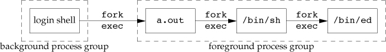

::: captioned-content
::: caption
Listing 83: Figure 10.28 Correct POSIX.1 implementation of `system`
function
:::

``` c
/**
 *   @file     10fig28.c
 *   @date     2019-10-28
 *   @author   whiothes <whiothes81@gmail.com>
 *   @version  1.0
 *   @brief    Correct POSIX.1 implementation of system function
 *
 *  implementation of the system function with the required signal handling
 *
 */
#include <errno.h>
#include <signal.h>
#include <sys/wait.h>
#include <unistd.h>

#include "apue.h"

// with appropriate signal handling
int system(const char *cmdstring) {
    pid_t            pid;
    int              status;
    struct sigaction ignore, saveintr, savequit;
    sigset_t         chldmask, savemask;

    if (cmdstring == NULL) {
        return (1);  // always a command processor with UNIX
    }

    ignore.sa_handler = SIG_IGN;
    sigemptyset(&ignore.sa_mask);
    ignore.sa_flags = 0;

    if (sigaction(SIGINT, &ignore, &saveintr) < 0) return (-1);
    if (sigaction(SIGQUIT, &ignore, &savequit) < 0) return (-1);

    sigemptyset(&chldmask);
    sigaddset(&chldmask, SIGCHLD);
    if (sigprocmask(SIG_BLOCK, &chldmask, &savemask) < 0) return (-1);

    if ((pid = fork()) < 0) {
        status = -1;
    } else if (pid == 0) {
        // restore previous signal actions & reset signal mask
        sigaction(SIGINT, &saveintr, NULL);
        sigaction(SIGQUIT, &savequit, NULL);
        sigprocmask(SIG_SETMASK, &savemask, NULL);

        execl("/bin/sh", "sh", "-c", cmdstring, (char *)0);
        _exit(127);  // exec error
    } else {
        while (waitpid(pid, &status, 0) < 0) {
            if (errno != EINTR) {
                status = -1;  // error other than EINTR from waitpid()
                break;
            }
        }
    }

    // restore previous signal actions & reset signal mask
    if (sigaction(SIGINT, &saveintr, NULL) < 0) return (-1);
    if (sigaction(SIGQUIT, &savequit, NULL) < 0) return (-1);
    if (sigprocmask(SIG_SETMASK, &savemask, NULL) < 0) return (-1);

    return (status);
}
```
:::

###  10.19 `sleep`, `nanaosleep`, and `clock_nanosleep` Functions {#sleep-nanaosleep-and-clock_nanosleep-functions}

``` c
#include <unistd.h>
unsigned int sleep(unsigned int seconds);
// Returns: 0 or number of unslept seconds
```

::: captioned-content
::: caption
Listing 84: Figure 10.29 Reliable implementation of `sleep`
:::

``` c
/**
 *   @file     10.29.c
 *   @date     2019-10-28
 *   @author   whiothes <whiothes81@gmail.com>
 *   @version  1.0
 *   @brief    Implementation of the POSIX.1 sleep function
 *
 *  modification of figure 10.17, hands signals reliably
 *  avoiding the race condition in the earlier implementation
 *
 */

#include "apue.h"

static void sig_alrm(int signo) {
    // nothing to do, just return wakes up sigsuspend()
}

unsigned int sleep(unsigned int seconds) {
    struct sigaction newact, oldact;
    sigset_t         newmask, oldmask, suspmask;
    unsigned int     unslept;

    newact.sa_handler = sig_alrm;
    sigemptyset(&newact.sa_mask);
    newact.sa_flags = 0;
    sigaction(SIGALRM, &newact, &oldact);

    sigemptyset(&newmask);
    sigaddset(&newmask, SIGALRM);
    sigprocmask(SIG_BLOCK, &newmask, &oldmask);

    alarm(seconds);
    suspmask = oldmask;

    sigdelset(&suspmask, SIGALRM);

    sigsuspend(&suspmask);

    unslept = alarm(0);

    sigaction(SIGALRM, &oldact, NULL);

    sigprocmask(SIG_SETMASK, &oldmask, NULL);
    return (unslept);
}
```
:::

``` c
#include <time.h>
int clock_nanosleep(clockid_t clock_id, int flags,
                    const struct timespec* reqtp, struct timespec* remtp);
// Returns: 0 if slept for requested time or error number on failue
```

###  10.20 `sigqueue` Function {#sigqueue-function}

-   Specify the SA~SIGINFO~ flag when we install a signal handler using
    the sigaction function

-   Provide a signal handler in the sa~sigaction~ member of the
    sigaction structure instead of using the usual sa~handler~ field.

-   Use the sigqueue function to send signals.

    ``` c
    #include <signal.h>

    int sigqueue(pid_t pid, int signo, const union sigval value);
    // Returns: 0 if OK, -1 on error
    ```

      Behavior                                                             SUS        FreeBSD8.0   Linux3.2.0   Mac OSX   Solaris
      -------------------------------------------------------------------- ---------- ------------ ------------ --------- ---------
      supports sigqueue                                                    \*         \*           \*                     \*
      queues other signals besides SIGRTMIN to SIGRTMAX                    optional   \*                                  \*
      queues signals even if the caller don\'t use the SA~SIGINFO~ flags   optional   \*           \*                     

      : Table 9: Figure 10.30 Behavior of queued signals on various
      platforms

###  10.21 Job-Control Signals {#job-control-signals}

job-control signals: SIGCHLD Child process has stopped or terminated
SIGCONT Continue process, if stopped. SIGSTOP Stop signal(can\'t caught
or ignored) SIGTSTP Interactive stop signal. SIGTTIN Read from
controlling terminately by background process group number SIGTTOU Write
to controlling terminal by a background process group member

::: captioned-content
::: caption
Listing 85: Figure 10.31 How to handle SIGTSTP
:::

``` c
/**
 *   @file     10fig31.c
 *   @date     2019-10-28
 *   @author   whiothes <whiothes81@gmail.com>
 *   @version  1.0
 *   @brief    How to handle SIGTSTP
 */
#include "apue.h"

#define BUFFSIZE 1024

// signal handler to SIGTSTP
static void sig_tstp(int signo) {
    sigset_t mask;

    sigemptyset(&mask);
    sigaddset(&mask, SIGTSTP);
    sigprocmask(SIG_UNBLOCK, &mask, NULL);

    signal(SIGTSTP, SIG_DFL);
    kill(getpid(), SIGTSTP);

    signal(SIGTSTP, sig_tstp);
}

int main(void) {
    int  n;
    char buf[BUFFSIZE];

    if (signal(SIGTSTP, SIG_IGN) == SIG_DFL) signal(SIGTSTP, sig_tstp);

    while ((n = read(STDIN_FILENO, buf, BUFFSIZE)) > 0)
        if (write(STDOUT_FILENO, buf, n) != 0) err_sys("write error");
    if (n < 0) err_sys("read error");
    exit(0);
}
```
:::

###  10.22 Signal Names and Numbers {#signal-names-and-numbers}

map between signal numbers and names.

``` c
extern char *sys_siglist[];
```

in a portable manner

``` c
#include <signal.h>
void psignal(int signo, const char *msg);
```

print signal information

``` c
#include <signal.h>
void psiginfo(const siginfo_t* info, const char *msg);
```

string description of the signal and don\'t necessarily wnat to write it
to standard error

``` c
#include <string.h>
char *strsignal(int signo);
// Returns: a pointer to a string describing the signal
```

**Solaris provides**

``` c
#include <signal.h>
int sig2str(int signo, char *str);
int str2sig(const char *str, int *signop);
// Both return: 0 if OK, -1 on error
```

###  10.23 Summary {#summary-9}

-   Exercises

    -   10.1

        > terminates the first time `pause` until a signal is received
        > from either the kill(2) function or an interval timer

    -   10.2

        ``` c
        /**
         *   @file     10ex02.c
         *   @date     2019-10-28
         *   @author   whiothes <whiothes81@gmail.com>
         *   @version  1.0
         *   @brief    example code for 10.2
         */
        #include "apue.h"

        int sig2str(int signo, char *str) {
            if (signo <= 0 || signo >= NSIG) {
                return -1;
            }
            snprintf(str, SIG2STR_MAX, "%s", sys_siglist[signo]);

            return 0;
        }
        ```

    -   10.3

        ~/Documents/Notes/books/system/APUE/Chapter10/10ex03.png(file:Chapter10/10ex03.png)

    -   10.4

        race condition between first call `alarm` and `setjmp`

    -   10.5

        [www.kohala.com/start/libes.timers.txt](http://www.kohala.com/start/libes.timers.txt)

    -   10.6

        ``` c
        /**
         *   @file     exx10.6.c
         *   @date     2019-10-29
         *   @author   whiothes <whiothes81@gmail.com>
         *   @version  1.0
         *   @brief    test figure 10.24
         */

        #include "apue.h"

        int main(void) {
            FILE *fp = fopen("a.txt", "w+");

            int num = 0;

            fwrite(&num, sizeof(num), 1, fp);

            pid_t pid = fork();

            if (pid == 0) {
                // fread(&num, sizeof(num), 1, fp);
                ++num;
                fwrite(&num, sizeof(num), 1, fp);
                fprintf(stdout, "child process: %d\n", num);
                exit(EXIT_SUCCESS);
            }

            // fread(&num, sizeof(num), 1, fp);
            ++num;
            fwrite(&num, sizeof(num), 1, fp);
            fprintf(stdout, "parent process: %d\n", num);

            fclose(fp);
        }
        ```

    -   10.7

        > the termination status of the process would not show that it
        > was terminated by the SIGABRT signal.

    -   10.8

        > If the signal was sent by a process owned by some other user,
        > the process has to be set-user-ID to either root or to the
        > owner of the receiving process, or the kill attempt won't
        > work. Therefore, the real user ID provides more information to
        > the receiver of the signal.

    -   10.9

        ``` c
        /**
         *   @file     10fig14.c
         *   @date     2019-10-27
         *   @author   whiothes <whiothes81@gmail.com>
         *   @version  1.0
         *   @brief    Print the signal mask for the process
         *
         *   shows a function that prints the names of the signals in the signal mask of
         * the calling process.
         */

        #include <errno.h>

        #include "apue.h"

        #ifndef NSIG
        #define NSIG 32
        #endif

        void pr_mask(const char *str) {
            sigset_t sigset;
            int      errno_save;

            errno_save = errno;  // we can be canceld by signal handlers

            if (sigprocmask(0, NULL, &sigset) < 0) {
                err_ret("sigprocmask error");
            } else {
                printf("%s", str);

                for (int signo = 1; signo < NSIG; ++signo) {
                    if (sigismember(&sigset, signo)) {
                        printf("%s ", strdup(strsignal(signo)));
                    }
                }

                printf("\n");
            }

            errno = errno_save;
        }

        int main() { pr_mask("starting main"); }
        ```

    -   10.10

        ``` c
        /**
         *   @file     10ex10.c
         *   @date     2019-11-03
         *   @author   whiothes <whiothes81@gmail.com>
         *   @version  1.0
         *   @brief
         */

        #include <spawn.h>
        #include <time.h>

        #include "apue.h"

        extern int log_to_stderr;

        void cron() {
            log_to_stderr = 0;
            log_open("10ex10", 0, 0);
            for (int i = 0;; ++i) {
                if (i % 5 == 0) {
                    time_t    t  = time(NULL);
                    struct tm st = {};

                    localtime_r(&t, &st);
                    log_msg("time_of day: %02d:%02d:%02d", st.tm_hour, st.tm_min,
                            st.tm_sec);
                    log_msg("tm_sec: %d", st.tm_sec);
                }
                sleep(60);
            }
        }

        int main(int argc, char *argv[], char **env) {
            pid_t pid = 0;
            daemonize(argv[0]);
            cron();
            exit(EXIT_SUCCESS);
        }
        ```

    -   10.11

        ``` c
        #include <fcntl.h>
        #include <sys/resource.h>
        #include <sys/stat.h>

        #include "apue.h"

        #define BUFFSIZ 10

        int main(int argc, char *argv[]) {
            int  n;
            int  ret;
            char buf[BUFFSIZ];

            signal(SIGXFSZ, signal_intr);

            int in  = open(argv[1], O_RDONLY);
            int out = open(argv[2], O_CREAT | O_RDWR, 0644);

            struct rlimit r = {0};
            r.rlim_max      = 12;
            setrlimit(RLIMIT_FSIZE, &r);

            while ((n = read(in, buf, BUFFSIZ)) > 0) {
                if ((ret = write(out, buf, n)) != n) {
                    // err_sys("write error: %d", ret);
                    printf("%d write\n", ret);
                }
            }

            close(in);
            close(out);
            if (n < 0) {
                err_sys("read error");
            }
            return 0;
        }
        ```

        SIGXFSZ never caught

    -   10.12

        ``` c
        /**
         *   @file     10ex02.c
         *   @date     2019-10-28
         *   @author   whiothes <whiothes81@gmail.com>
         *   @version  1.0
         *   @brief    example code for 10.2
         */
        #include "apue.h"

        int sig2str(int signo, char *str) {
            if (signo <= 0 || signo >= NSIG) {
                return -1;
            }
            snprintf(str, SIG2STR_MAX, "%s", sys_siglist[signo]);

            return 0;
        }
        ```

        finished, alarm appears until fwrite finshied, it seems the
        kernel is blocking SIGALRM

##  Chapter 11. Threads \[7/7\] {#chapter-11.-threads-77}

###  11.1 Introduction {#introduction-10}

###  11.2 Thread Concepts {#thread-concepts}

便利：

-   通过分配单独的线程处理不同的事件类型来简化处理异步事件的代码
-   多进程需要复杂的技术共享内存和文件描述符。而线程具有相同的内存地址和文件描述符
-   可以对一些整体问题进行分区以提高吞吐量
-   交互式程序可以通过多线程区分用户输入和输出以提高响应时间

###  11.3 Thread Identification {#thread-identification}

每一个线程都有一个线程ID。不同于进程ID在系统中唯一，线程ID只有在所属进程中有意义。

``` c
#include <pthread.h>
/**
 *  @brief compare two thread
 *  @param tid1     1st thread ID
 *  @param tid2     2nd thread ID
 *  @return nonzero if equal, 0 otherwise
 */
int pthread_equal(pthread_t tid1, pthread_t tid2);
```

obtain its own thread ID :

``` c
#include <pthread.h>
/**
 *  @brief obtain thread's ID
 *  @return the thread ID of the calling thread
 */
pthread_t pthread_self(void);
```

###  11.4 Thread Creation {#thread-creation}

``` c
#include <pthread.h>
/**
 *  @brief create thread
 *  @param tidp       the pointer to store thread ID
 *  @param attr       specified attributes
 *  @param start_rtn  function for thread calling
 *  @param arg        for start_rtn
 *  @return 0 if OK, error number on failure
 */
int pthread_create(pthread_t *restrict tidp,
                   const pthread_attr_t *restrict attr,
                   void *(*start_rtn)(void*),
                   void *restrict arg);
```


-   Example

    ::: captioned-content
    ::: caption
    Listing 86: Figure 11.2 Printing thread IDs
    :::

    ``` c
    #include <pthread.h>

    #include "apue.h"

    pthread_t ntid;

    void printids(const char *s) {
        pid_t     pid;
        pthread_t tid;

        pid = getpid();
        tid = pthread_self();

        printf("%s pid %lu tid %lu (0x%lx)\n", s, (unsigned long)pid,
               (unsigned long)tid, (unsigned long)tid);
    }


    void *thr_fn(void *arg) {
        printids("new thread: ");
        return ((void *)0);
    }

    int main(int argc, char *argv[]) {
        int err;

        pthread_create(&ntid, NULL, thr_fn, NULL);
        if (err != 0) {
            err_exit(err, "can't creat thread");
        }
        printids("main thread: ");
        sleep(1);

        return 0;
    }
    ```
    :::

###  11.5 Thread Termination {#thread-termination}

1.  线程可以简单地从启动程序退出，返回值即线程返回码
2.  线程可以被进程内另一线程终止
3.  可以调用 `pthread_exit`

``` c
#include <pthread.h>
void pthread_exit(void *rval_ptr);
```

``` c
#include <pthread.h>
int pthread_join(pthread_t thread, void **rval_ptr);
```

> The calling thread will block until the specified thread calls
> pthread~exit~, returns from its start routine, or is canceled.

> **The Linux Programming Language:** If the main thread calls
> pthread~exit~() instead of calling exit() or performing a return, then
> the other threads continue to execute.

-   Example

    ::: captioned-content
    ::: caption
    Listing 87: Figure 11.3 Fetching the thread exit status
    :::

    ``` c
    #include <pthread.h>

    #include "apue.h"

    void *thr_fn1(void *arg) {
        printf("thread 1 returning\n");
        return ((void *)1);
    }

    void *thr_fn2(void *arg) {
        printf("thread 2 returning\n");
        pthread_exit((void *)2);
    }

    int main(int argc, char *argv[]) {
        int       err;
        pthread_t tid1, tid2;
        void *    tret;

        err = pthread_create(&tid1, NULL, thr_fn1, NULL);
        if (err != 0) {
            err_exit(err, "can't create thread1");
        }
        err = pthread_create(&tid2, NULL, thr_fn2, NULL);
        if (err != 0) {
            err_exit(err, "can't create thread2");
        }
        err = pthread_join(tid1, &tret);
        if (err != 0) {
            err_exit(err, "can't join thread1");
        }
        printf("thread 1 exit code %ld\n", (long)tret);
        err = pthread_join(tid2, &tret);
        if (err != 0) {
            err_exit(err, "can't join thread2");
        }
        printf("thread 2 exit code %ld\n", (long)tret);
        return 0;
    }
    ```
    :::

-   Example

    ::: captioned-content
    ::: caption
    Listing 88: Figure 11.4 Incorrect use of `pthread_exit` argument
    :::

    ``` c
    /**
     *   @file     11fig04.c
     *   @date     2019-11-05
     *   @author   whiothes <whiothes81@gmail.com>
     *   @version  1.0
     *   @brief    Figure 11.4
     *
     *  shows the problem with using an automatic variable (allocated on the stack)
     * as the argument to pthread_exit.
     *
     */
    #include <pthread.h>

    #include "apue.h"

    struct foo {
        int a, b, c, d;
    };

    void printfoo(const char *s, const struct foo *fp) {
        printf("%s", s);
        printf(" structure at 0x%lx\n", (unsigned long)fp);
        printf(" foo.a = %d\n", fp->a);
        printf(" foo.b = %d\n", fp->b);
        printf(" foo.c = %d\n", fp->c);
        printf(" foo.d = %d\n", fp->d);
    }

    void *thr_fn1(void *arg) {
        struct foo foo = {1, 2, 3, 4};
        printfoo("thread 1:\n", &foo);
        pthread_exit((void *)&foo);
    }

    void *thr_fn2(void *arg) {
        printf("thread 2: ID is %lu\n", (unsigned long)pthread_self());
        pthread_exit((void *)0);
    }

    int main(void) {
        int         err;
        pthread_t   tid1, tid2;
        struct foo *fp;

        err = pthread_create(&tid1, NULL, thr_fn1, NULL);
        if (err != 0) {
            err_exit(err, "can't create thread 1");
        }

        err = pthread_join(tid1, (void *)&fp);
        if (err != 0) {
            err_exit(err, "can't join with thread 1");
        }

        sleep(1);

        err = pthread_create(&tid2, NULL, thr_fn2, NULL);
        if (err != 0) {
            err_exit(err, "can't create thread");
        }

        sleep(1);
        printfoo("parent:\n", fp);

        exit(0);
    }
    ```
    :::

    > the contents of the structure (allocated on the stack of thread
    > tid1) have changed by the time the main thread can access the
    > structure

``` c
#include <pthread.h>
/**
 * @brief      exit with PTHREAD_CANCELED
 *
 * @details    call pthread_exit with PTHREAD_CANCLED
 *
 * @param      tid      thread id
 *
 * @return     0 if OK, error number on failure
 */
int pthread_cancel(pthread_t tid);
```

in default circumstances, `pthread_exit` with **PTHREAD~CANCELD~**\
doesn\'t wait for the thread to terminate; it merely makes the request.\
similar to `atexit` used by a process\
known as *thread cleanup handlers*

``` c
#include <pthread.h>
/**
 *  @brief schedules the cleanup function
 *
 *  - Make a call to pthread_exit
 *  - Responds to a cancellation request
 *  - Makes a call to pthread_cleanup_pop with a nonzero execute argument
 *
 *  @param        rtn cleanup handler
 *  @param        arg for rtn
 *
 */
void pthread_cleanup_push(void (*rtn)(void*), void *arg);
/**
 *  @brief remove cleanup handler
 *
 *  @param execute    execute the function if nonzero
 */
void pthread_cleanup_pop(int execute);
```

-   Example

    ::: captioned-content
    ::: caption
    Listing 89: Figure 11.5 Thread cleanup handler
    :::

    ``` c
    /**
     *   @file     11fig05.c
     *   @date     2019-11-05
     *   @author   whiothes <whiothes81@gmail.com>
     *   @version  1.0
     *   @brief    use thread cleanup handlers
     */

    #include <pthread.h>

    #include "apue.h"

    void cleanup(void *arg) { printf("cleanup: %s\n", (char *)arg); }

    void *thr_fn1(void *arg) {
        printf("thread 1 start\n");
        pthread_cleanup_push(cleanup, "thread 1 first handler");
        pthread_cleanup_push(cleanup, "thread 1 second handler");
        printf("thread 1 push complete\n");
        if (arg) return ((void *)1);
        pthread_cleanup_pop(0);
        pthread_cleanup_pop(0);
        return ((void *)1);
    }

    void *thr_fn2(void *arg) {
        printf("thread 2 start\n");
        pthread_cleanup_push(cleanup, "thread 2 first hander");
        pthread_cleanup_push(cleanup, "thread 2 second handler");
        printf("thread 2 push complete\n");
        if (arg) pthread_exit((void *)2);
        pthread_cleanup_pop(0);
        pthread_cleanup_pop(0);
        pthread_exit((void *)2);
    }

    int main(void) {
        int       err;
        pthread_t tid1, tid2;
        void *    tret;

        err = pthread_create(&tid1, NULL, thr_fn1, (void *)1);
        if (err != 0) {
            err_exit(err, "can't create thread 1");
        }
        err = pthread_create(&tid2, NULL, thr_fn2, (void *)1);
        if (err != 0) {
            err_exit(err, "can't create thread 2");
        }
        err = pthread_join(tid1, &tret);
        if (err != 0) {
            err_exit(err, "can't join with thread 1");
        }
        printf("thread 1 exit code %ld\n", (long)tret);
        err = pthread_join(tid2, &tret);
        if (err != 0) {
            err_exit(err, "can't join with thread 2");
        }
        printf("thread 2 exit code %ld\n", (long)tret);
        exit(0);
    }
    ```
    :::

    > 当线程通过例程返回被终止时，不调用清理程序
    >
    > `return` 在FreeBSD Mac OSX 上运行时会断错误并产生 core
    > 文件，这是因为在这些平台上 pthread~cleanuppush~
    > 是一个宏并在栈上存储了一些文本，在调用return函数时栈区被覆盖，但调用cleanup时尝试使用此上下文（已损坏）。

  Process primitives   Thread Primitive       Description
  -------------------- ---------------------- -------------------------------------------------------------
  fork                 pthread~create~        create a new flow of control
  exit                 pthread~exit~          exit from an existing flow of control
  waitpid              pthread~join~          get exit status from flow of control
  atexit               pthread~cleanuppush~   register function to be called at exit from flow of control
  getpid               pthread~self~          get ID for flow of control
  abort                pthread~cancel~        request abnormal termination of flow of control

  : Table 10: Figure 11.6 Comparison of process and thread primitives

> 默认情况下，线程终止状态将被保留至调用 `pthread_join`
> ，线程被分离后不可使用 `pthread_join` 等待。

``` c
#include <pthread.h>
/**
 * @brief      detach a thread
 *
 * @param      tid      thread id
 *
 * @return     0 if OK, error number on failure
 */
int pthread_detach(pthread_t tid);
```

###  11.6 Thread Synchronization \[8/8\] {#thread-synchronization-88}

需要线程同步以确保在访问变量内存时不会使用非法值。

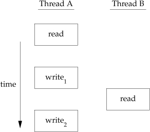

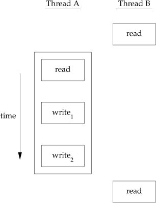

Increment operation:

> 1.  Read the memory location into a register.
> 2.  Increment the value in the register.
> 3.  Write the new value back to the memory location.
>
> **If our data always appears to be sequentially consistent, then we
> need no additional synchronization.**


1.   11.6.1 Mutexes

    ``` c
    #include <pthread.h>
    /**
     * @brief      init pthread mutex
     *
     * @details    detailed description
     *
     * @param      mutex        mutex to be used
     * @param      attr         set attr for mutex
     *
     * @return     0 if OK, error number on failure
     */
    int pthread_mutex_init(pthread_mutex_t *restrict mutex,
                           const pthread_mutexattr_t *restrict attr);
    /**
     * @brief      destroy pthread_mutex
     *
     * @details    detailed description
     *
     * @param      mutex        mutex to be destroyed
     *
     * @return     0 if OK, error number on failure
     */
    int pthread_mutex_destroy(pthread_mutex_t *mutex);
    ```

    ``` c
    #include <pthread.h>
    int pthread_mutex_lock(pthread_mutex_t *mutex);
    int pthread_mutex_trylock(pthread_mutex_t *mutex);
    int pthread_mutex_unlock(pthread_mutex_t *mutex);
    // All return: 0 if OK, error number on failure
    ```

    -   Example

        ::: captioned-content
        ::: caption
        Listing 90: Figure 11.10 Using a mutex to protect a data
        structure
        :::

        ``` c
        /**
         *   @file     11fig10.c
         *   @date     2019-11-06
         *   @author   whiothes <whiothes81@gmail.com>
         *   @version  1.0
         *   @brief    use mutex to protect a data structure
         */
        #include <pthread.h>

        #include "apue.h"

        struct foo {
            int             f_count;
            pthread_mutex_t f_lock;
            int             f_id;
            // ... more stuff here  ...
        };

        struct foo *foo_alloc(int id) {
            struct foo *fp;

            if ((fp = malloc(sizeof(struct foo))) != NULL) {
                fp->f_count = 1;
                fp->f_id    = id;
                if (pthread_mutex_init(&fp->f_lock, NULL) != 0) {
                    free(fp);
                    return (NULL);
                }
            }

            return (fp);
        }

        void foo_hold(struct foo *fp) {
            pthread_mutex_lock(&fp->f_lock);
            fp->f_count++;
            pthread_mutex_unlock(&fp->f_lock);
        }

        void foo_release(struct foo *fp) {
            pthread_mutex_lock(&fp->f_lock);
            if (--fp->f_count == 0) {
                pthread_mutex_unlock(&fp->f_lock);
                pthread_mutex_destroy(&fp->f_lock);
                free(fp);
            } else {
                pthread_mutex_unlock(&fp->f_lock);
            }
        }
        ```
        :::

2.   11.6.2 Deadlock Avoidance

    线程如果尝试两次锁一个互斥锁将会造成 **死锁**

    死锁可以通过谨慎控制锁定 **顺序** 来避免

    -   Example

        ::: captioned-content
        ::: caption
        Listing 91: Figure 11.11 Using two mutexes
        :::

        ``` c
        /**
         *   @file     11fig11.c
         *   @date     2019-11-06
         *   @author   whiothes <whiothes81@gmail.com>
         *   @version  1.0
         *   @brief    the use of two mutexes
         */

        #include <pthread.h>
        #include <stdio.h>

        #include "apue.h"

        #define NHASH    29
        #define HASH(id) (((unsigned long)id) % NHASH)

        struct foo *fh[NHASH];

        pthread_mutex_t hashlock = PTHREAD_MUTEX_INITIALIZER;

        struct foo {
                int             f_count;
                pthread_mutex_t f_lock;
                int             f_id;
                struct foo     *f_next;  // protected by hashlock
        };

        struct foo *foo_alloc(int id) {
                struct foo *fp;
                int         idx;

                if ((fp = malloc(sizeof(struct foo))) != NULL) {
                        if (pthread_mutex_init(&fp->f_lock, NULL) != 0) {
                                free(fp);
                                return (NULL);
                        }
                        fp->f_count = 1;
                        fp->f_id    = id;

                        idx = HASH(id);
                        pthread_mutex_lock(&hashlock);
                        fp->f_next = fh[idx];
                        pthread_mutex_lock(&fp->f_lock);
                        pthread_mutex_unlock(&hashlock);
                        // continue initialization
                        pthread_mutex_unlock(&fp->f_lock);
                }

                return (fp);
        }

        void foo_hold(struct foo *fp) {
                pthread_mutex_lock(&fp->f_lock);
                fp->f_count++;
                pthread_mutex_unlock(&fp->f_lock);
        }

        struct foo *foo_find(int id) {
                struct foo *fp;

                pthread_mutex_lock(&hashlock);
                for (fp = fh[HASH(id)]; fp != NULL; fp = fp->f_next) {
                        if (fp->f_id == id) {
                                foo_hold(fp);
                                break;
                        }
                }

                pthread_mutex_unlock(&hashlock);
                return (fp);
        }

        // release a reference to the object
        void foo_rele(struct foo *fp) {
                struct foo *tfp;
                int         idx;

                pthread_mutex_lock(&fp->f_lock);
                if (fp->f_count == 1) {
                        pthread_mutex_unlock(&fp->f_lock);
                        pthread_mutex_lock(&hashlock);
                        pthread_mutex_lock(&fp->f_lock);
                        if (fp->f_count != 1) {
                                fp->f_count--;
                                pthread_mutex_unlock(&fp->f_lock);
                                pthread_mutex_unlock(&hashlock);
                                return;
                        }

                        idx = HASH(fp->f_id);
                        tfp = fh[idx];
                        if (tfp == fp) {
                                fh[idx] = fp->f_next;
                        } else {
                                while (tfp->f_next != fp) {
                                        tfp = tfp->f_next;
                                }
                                tfp->f_next = fp->f_next;
                        }
                        pthread_mutex_unlock(&hashlock);
                        pthread_mutex_unlock(&fp->f_lock);
                        pthread_mutex_destroy(&fp->f_lock);
                        free(fp);
                } else {
                        fp->f_count--;
                        pthread_mutex_unlock(&fp->f_lock);
                }
        }
        ```
        :::

    -   Example

        ::: captioned-content
        ::: caption
        Listing 92: Figure 11.12 Simplified locking
        :::

        ``` c
        /**
         *   @file     11fig12.c
         *   @date     2019-11-08
         *   @author   whiothes <whiothes81@gmail.com>
         *   @version  1.0
         *   @brief    Simplified locking
         */
        #include <pthread.h>
        #include <stdlib.h>

        #define NHASH    29
        #define HASH(id) (((unsigned long)id) % NHASH)

        struct foo *    fh[NHASH];
        pthread_mutex_t hashlock = PTHREAD_MUTEX_INITIALIZER;

        struct foo {
            int             f_count;  // protected by hashlock
            pthread_mutex_t f_lock;
            int             f_id;
            struct foo *    f_next;  // protected by hashlock
                                     // ... more stuff here ...
        };

        struct foo *foo_alloc(int id) {
            struct foo *fp;
            int         idx;

            if ((fp = malloc(sizeof(struct foo))) != NULL) {
                fp->f_count = 1;
                fp->f_id    = id;
                if (pthread_mutex_init(&fp->f_lock, NULL) != 0) {
                    free(fp);
                    return (NULL);
                }

                idx = HASH(id);
                pthread_mutex_lock(&hashlock);
                fp->f_next = fh[idx];
                fh[idx]    = fp;
                pthread_mutex_lock(&fp->f_lock);
                pthread_mutex_unlock(&hashlock);
                // continue initialization
                pthread_mutex_unlock(&fp->f_lock);
            }
            return (fp);
        }

        void foo_hold(struct foo *fp) {
            pthread_mutex_lock(&hashlock);
            fp->f_count++;
            pthread_mutex_unlock(&hashlock);
        }

        struct foo *foo_find(int id) {
            struct foo *fp;

            pthread_mutex_lock(&hashlock);
            for (fp = fh[HASH(id)]; fp != NULL; fp = fp->f_next) {
                if (fp->f_id == id) {
                    fp->f_count++;
                    break;
                }
            }
            pthread_mutex_unlock(&hashlock);
            return (fp);
        }

        void foo_rele(struct foo *fp) {
            struct foo *tfp;
            int         idx;

            pthread_mutex_lock(&hashlock);
            if (--fp->f_count == 0) {
                idx = HASH(fp->f_id);
                tfp = fh[idx];
                if (tfp == fp) {
                    fh[idx] = fp->f_next;
                } else {
                    while (tfp->f_next != fp) tfp = tfp->f_next;
                    tfp->f_next = fp->f_next;
                }
                pthread_mutex_unlock(&hashlock);
                pthread_mutex_destroy(&fp->f_lock);
                free(fp);
            }
            pthread_mutex_unlock(&hashlock);
        }
        ```
        :::

3.   11.6.3 `pthread_mutex_timedlock` function

    **Mac OSX 10.15.1 doesn\'t support `pthread_mutex_timedlock` yet**

    `pthread_mutex_timedlock` is equivalent to `pthread_mutex_lock`, but
    returns **ETIMEDOUT** without locking mutex after timeout

    ``` c
    #include <pthread.h>
    #include <time.h>

    int pthread_mutex_timedlock(pthread_mutex_t *restrict mutex,
                                const struct timespec *restrict tsptr);

    // Returns: 0 if OK, error number on failure
    ```

    -   Example

        ::: captioned-content
        ::: caption
        Listing 93: Figure 11.13 Using `pthread_mutex_timedlock`
        :::

        ``` c
        /**
         *   @file     11fig13.c
         *   @date     2019-11-08
         *   @author   whiothes <whiothes81@gmail.com>
         *   @version  1.0
         *   @brief    use pthread_mutex_timedlock() to avoid blocking indefinitely
         */
        #include <pthread.h>

        #include "apue.h"

        int main() {
        #if defined(__linux__)
            int             err;
            struct timespec tout;
            struct tm*      tmp;
            char            buf[64];
            pthread_mutex_t lock = PTHREAD_MUTEX_INITIALIZER;

            pthread_mutex_lock(&lock);
            printf("mutex is locked");
            clock_gettime(CLOCK_REALTIME, &tout);
            tmp = localtime(&tout.tv_sec);
            strftime(buf, sizeof(buf), "%r", tmp);
            printf("current time is %s\n", buf);

            tout.tv_sec += 10;  // 10 seconds from now

            err = pthread_mutex_timedlock(&lock, &tout);
            clock_gettime(CLOCK_REALTIME, &tout);
            tmp = localtime(&tout.tv_sec);
            strftime(buf, sizeof(buf), "%r", tmp);
            printf("the time is now %s\n", buf);
            if (err == 0) {
                printf("mutex locked again!\n");
            } else {
                printf("can't lock mutex again: %s\n", strerror(err));
            }
            exit(0);

        #endif  // __linux__
        }
        ```
        :::

4.   11.6.4 Reader-Writer Locks

    -   mutex : can only one thread lock it at a time, lock/unlock.
    -   rw-lock: read lock, write lock, unlock.
    -   rw-lock: 同时间段内只有一个线程可以加写锁，但多个线程允许加读锁
        -   w-lock: 所有线程尝试上锁时都会被阻塞直至解锁
        -   r-lock:
            所有线程尝试读锁时将被允许，但写锁将被阻塞直至释放读锁

    ``` c
    #include <pthread.h>
    int pthread_rwlock_init(pthread_rwlock_t *restrict rwlock,
                            const pthread_rwlockattr_t *restrict attr);
    int pthread_rwlock_destroy(pthread_rwlock_t *rwlock);
    // Both return: 0 if OK, error number on failure
    ```

    The Single UNIX specification defines **PTHREAD~RWLOCKINITIALIZE~**
    constant in the XSI option to initialize a statically allocated rw
    lock.

    rw-lock control:

    ``` c
    #include <pthread.h>
    int pthread_rwlock_rdlock(pthread_rwlock_t *rwlock);
    int pthread_rwlock_wrlock(pthread_rwlock_t *rwlock);
    int pthread_rwlock_unlock(pthread_rwlock_t *rwlock);
    // All return: 0 if OK, error number on failure
    ```

    rw-lock try control:

    ``` c
    #include <pthread.h>
    int pthread_rwlock_tryrdlock(pthread_rwlock_t *rwlock);
    int pthread_rwlock_trywrlock(pthread_rwlock_t *rwlock);
    // Both return: 0 if OK, error number on failure
    ```

    -   Example

        ::: captioned-content
        ::: caption
        Listing 94: Figure 11.14 Using reader-writer locks
        :::

        ``` c
        /**
         *   @file     11fig14.c
         *   @date     2019-11-09
         *   @author   whiothes <whiothes81@gmail.com>
         *   @version  1.0
         *   @brief    illustrates the use of reader–writer locks
         */

        #include <pthread.h>
        #include <stdlib.h>

        struct job {
            struct job *j_next;
            struct job *j_prev;
            pthread_t   j_id;  // tells which thread handles this job
        };

        struct queue {
            struct job *     q_head;
            struct job *     q_tail;
            pthread_rwlock_t q_lock;
        };

        int queue_init(struct queue *q) {
            int err;

            q->q_head = NULL;
            q->q_tail = NULL;
            err       = pthread_rwlock_init(&q->q_lock, NULL);
            if (err != 0) {
                return (err);
            }

            // continue initialization
            return 0;
        }

        void job_insert(struct queue *qp, struct job *jp) {
            pthread_rwlock_wrlock(&qp->q_lock);
            jp->j_next = qp->q_head;
            jp->j_prev = NULL;

            if (qp->q_head != NULL)
                qp->q_head->j_prev = jp;
            else
                qp->q_tail = jp;

            qp->q_head = jp;
            pthread_rwlock_unlock(&qp->q_lock);
        }

        void job_append(struct queue *qp, struct job *jp) {
            pthread_rwlock_wrlock(&qp->q_lock);
            jp->j_next = NULL;
            jp->j_prev = qp->q_tail;

            if (qp->q_tail != NULL)
                qp->q_tail->j_next = jp;
            else
                qp->q_head = jp;

            qp->q_tail = jp;

            pthread_rwlock_unlock(&qp->q_lock);
        }

        void job_remove(struct queue *qp, struct job *jp) {
            pthread_rwlock_wrlock(&qp->q_lock);
            if (jp == qp->q_head) {
                qp->q_head = jp->j_next;
                if (qp->q_tail == jp)
                    qp->q_tail = NULL;
                else
                    jp->j_next->j_prev = jp->j_prev;
            } else if (jp == qp->q_tail) {
                qp->q_tail         = jp->j_prev;
                jp->j_prev->j_next = jp->j_next;
            } else {
                jp->j_prev->j_next = jp->j_next;
                jp->j_next->j_prev = jp->j_prev;
            }
            pthread_rwlock_unlock(&qp->q_lock);
        }

        struct job *job_find(struct queue *qp, pthread_t id) {
            struct job *jp = NULL;
            if (pthread_rwlock_rdlock(&qp->q_lock) != 0) {
                return NULL;
            }

            for (jp = qp->q_head; jp; jp = jp->j_next) {
                if (pthread_equal(id, jp->j_id)) break;
            }
            pthread_rwlock_unlock(&qp->q_lock);
            return (jp);
        }
        ```
        :::

5.   11.6.5 Reader-Writer Locking with Timeouts

    rw-lock with timeout to avoid blocking indefinitely

    ``` c
    #include <pthread.h>
    #include <time.h>

    int pthread_rwlock_timedrdlock(pthread_rwlock_t *restrict rwlock,
                                   const struct timespec *restrict tsptr);
    int pthread_rwlock_timedwrlock(pthread_rwlock_t *restrict rwlock,
                                   const struct timespec *restrict tsptr);
    // Both return: 0 if OK, error number on failure
    ```

    **the timeout specifies an absolute time, not a relative one.**

6.   11.6.6 Condition Variables

    > 条件本身被互斥锁保护。一个线程必须锁定互斥锁才能改变条件状态。其它线程只有获取互斥锁时才会提示修改，因为互斥锁必须被锁定才能评估条件。
    >
    > assign the constant `PTHREAD_COND_INITIALIZER`{.verbatim} to a
    > statically allocated condition variable

    `pthread_cond_init/destroy`

    ``` c
    #include <pthread.h>
    int pthread_cond_init(pthread_cond_t *restrict cond,
                          const pthread_condattr_t *restrict attr);
    int pthread_cond_destroy(pthread_cond_t *cond);
    // Both returns: 0 if OK, error number on failure
    ```

    `pthread_cond wait/timedwait`

    ``` c
    #include <pthread.h>
    int pthread_cond_wait(pthread_cond_t *restrict cond,
                          pthread_mutex_t *restrict mutex);
    int pthread_cond_timedwait(pthread_cond_t *restrict cond,
                               pthread_mutex_t *restrict mutex,
                               const struct timespec *restrict tsptr);
    // Both return: 0 if OK, error number on failure
    ```

    wait as an absolute time instead of a relative time.

    To obtain the absolute time for the timeout value,

    ``` c
    #include <sys/time.h>
    #include <stdlib.h>

    void maketimeout(struct timespec *tsp, long minutes) {
            struct timeval now;

            // get the current time
            gettimeofday(&now, NULL);
            tsp->tv_sec = now.tv_sec;
            tsp->tv_nsec = now.tv_usec * 1000; // usec to nsec
            tsp->tv_sec += minutes * 60;
    }
    ```

    notify threads that a condition has been satisfied.

    ``` c
    #include <pthread.h>
    int pthread_cond_signal(pthread_cond_t *cond);
    int pthread_cond_broadcast (pthread_cond_t *cond);
    // Both return: 0 if OK, error number on failure
    ```

    -   Example

        ::: captioned-content
        ::: caption
        Listing 95: Figure 11.15 Using a condition variable
        :::

        ``` c
        /**
         *   @file     11fig15.c
         *   @date     2019-11-10
         *   @author   whiothes <whiothes81@gmail.com>
         *   @version  1.0
         *   @brief    an example of how to use a condition variable and a mutex
         * together to synchronize threads.
         */

        #include <pthread.h>

        struct msg {
            struct msg *m_next;
            // more stuff here
        };

        struct msg *workd;

        pthread_cond_t  qready = PTHREAD_COND_INITIALIZER;
        pthread_mutex_t qlock  = PTHREAD_MUTEX_INITIALIZER;

        void process_msg(void) {
            struct msg *mp;
            for (;;) {
                pthread_mutex_lock(&qlock);
                while (workd == NULL) {
                    pthread_cond_wait(&qready, &qlock);
                }
                mp    = workd;
                workd = mp->m_next;
                pthread_mutex_unlock(&qlock);
                // now process the messg mp
            }
        }

        void enqueue_msg(struct msg *mp) {
            pthread_mutex_lock(&qlock);
            mp->m_next = workd;
            workd      = mp;
            pthread_mutex_unlock(&qlock);
            pthread_cond_signal(&qready);
        }
        ```
        :::

7.   11.6.7 Spin Locks

    > A spin lock is like a mutex, except that **instead of blocking** a
    > process by sleeping, the process is blocked by busy-waiting
    > (spinning) until the lock can be acquired
    >
    > use for short periods of times

    > Spin locks are useful when used in a nonpreemptive kernel,
    >
    > But at user level, spin locks are not as useful unless you are
    > running in a real-time scheduling class that doesn't allow
    > preemption. User-level threads running in a time-sharing
    > scheduling class can be descheduled when their time quantum
    > expires or when a thread with a higher scheduling priority becomes
    > runnable. In these cases, if a thread is holding a spin lock, it
    > will be put to sleep and other threads blocked on the lock will
    > continue spinning longer than intended.

    ``` c
    #include <pthread.h>
    int pthread_spin_init(pthread_spinlock_t *lock, int pshared);
    int pthread_spin_destroy(pthread_spinlock_t *lock);
    // Both return: 0 if OK, error number on failure
    ```

    -   **PTHREAD~PROCESSSHARED~**: the spin lock can be acquired by
        threads that have access to the lock\'s underlying memory
    -   **PTHREAD~PROCESSPRIVATE~**: the spin lock can be accessed by
        only from threads within the process that initialized it.

    `pthread_spin_trylock` doesn\'t spin,

    ``` c
    #include <pthread.h>
    int pthread_spin_lock(pthread_spinlock_t *lock);
    int pthread_spin_trylock(pthread_spinlock_t *lock);
    int pthread_spin_unlock(pthread_spinlock_t *lock);
    // All return: 0 if OK, error number on failure
    ```

    If either pthread~spinlock~ or pthread~spintrylock~ returns 0, then
    the spin lock is locked

8.   11.6.8 Barriers

    **Mac OSX doesn\'t implemented yet, but we can implemente it by
    pthread~cond~ and pthread~mutex~** coordinate multiple threads
    working in parallel.

    ``` c
    #include <pthread.h>
    int pthread_barrier_init(pthread_barrier_t *restrict barrier,
                             const pthread_barrierattr_t *restrict attr,
                             unsigned int count);
    int pthread_barrier_destroy(pthread_barrier_t *barrier);
    // Both return: 0 if OK, error number on failure
    ```

    **count** refers to the number of threads that must call
    `pthread_barrier_wait()` (includes the calling in process)

    `pthread_barrier_wait` indicates a thread is done with its work and
    is ready to wait for all the other threads to catch up .

    ``` c
    #include <pthread.h>
    int pthread_barrier_wait(pthread_barrier_t *barrier);
    // Returns: 0 or PTHREAD_BARRIER_SERIAL_THREAD if OK, error number on failure
    ```

    calling `pthread_barrier_wait` is put to sleep if barrier count is
    not yet satisfied.

    -   Example

        ::: captioned-content
        ::: caption
        Listing 96: Figure 11.16 Using a barrier
        :::

        ``` c
        /**
         *   @file     11fig16.c
         *   @date     2019-11-10
         *   @author   whiothes <whiothes81@gmail.com>
         *   @version  1.0
         *   @brief    show how a barrier can be used to synchronize threads cooperating
         * on a single task
         */
        #include <limits.h>
        #include <pthread.h>
        #include <sys/time.h>

        #include "apue.h"

        #define NTHR   8
        #define NUMNUM 800000L
        #define TNUM   (NUMNUM / NTHR)

        long nums[NUMNUM];
        long snums[NUMNUM];

        pthread_barrier_t b;

        #if defined(SOLARIS)
        #define heapsort gsort
        #elif defined(__linux__)
        #define heapsort qsort
        #else
        extern int heapsort(void *, size_t, size_t,
                            int (*)(const void *, const void *));
        #endif

        int complong(const void *arg1, const void *arg2) {
            long l1 = *(long *)arg1;
            long l2 = *(long *)arg2;

            return l1 == l2 ? 0 : l1 > l2 ? 1 : -1;
        }

        void *thr_fn(void *arg) {
            long idx = (long)arg;

            heapsort(&nums[idx], TNUM, sizeof(long), complong);
            pthread_barrier_wait(&b);

            return ((void *)0);
        }

        void merge() {
            long idx[NTHR];
            long i, minidx, sidx, num;

            for (i = 0; i < NTHR; i++) idx[i] = i * TNUM;

            for (sidx = 0; sidx < NUMNUM; sidx++) {
                num = LONG_MAX;
                for (i = 0; i < NTHR; ++i) {
                    if ((idx[i] < (i + 1) * TNUM) && (nums[idx[i]] < num)) {
                        num    = nums[idx[i]];
                        minidx = i;
                    }
                }
                snums[sidx] = nums[idx[minidx]];
                idx[minidx]++;
            }
        }

        int main() {
            unsigned long  i;
            struct timeval start, end;
            long long      startusec, endusec;
            double         elapsed;
            int            err;
            pthread_t      tid;

            srandom(1);
            for (i = 0; i < NUMNUM; ++i) {
                nums[i] = random();
            }

            gettimeofday(&start, NULL);
            pthread_barrier_init(&b, NULL, NTHR + 1);
            for (i = 0; i < NTHR; ++i) {
                err = pthread_create(&tid, NULL, thr_fn, (void *)(i * TNUM));
                if (err != 0) {
                    err_exit(err, "can't create thread");
                }
            }
            pthread_barrier_wait(&b);
            merge();
            gettimeofday(&end, NULL);

            startusec = start.tv_sec * 1000000 + start.tv_usec;
            endusec   = end.tv_sec * 100000 + end.tv_usec;
            printf("sort took %.4f seconds", elapsed);

            for (i = 0; i < NUMNUM; ++i) {
                printf("%ld\n", snums[i]);
            }
            exit(0);
        }
        ```
        :::

###  11.7 Summary {#summary-10}

-   Exercises

    -   11.1

        ``` c
        /**
         *   @file     11fig04.c
         *   @date     2019-11-05
         *   @author   whiothes <whiothes81@gmail.com>
         *   @version  1.0
         *   @brief    Exerciese 11.1
         */
        #include <pthread.h>

        #include "apue.h"

        struct foo {
            int a, b, c, d;
        };

        void printfoo(const char *s, const struct foo *fp) {
            printf("%s", s);
            printf(" structure at 0x%lx\n", (unsigned long)fp);
            printf(" foo.a = %d\n", fp->a);
            printf(" foo.b = %d\n", fp->b);
            printf(" foo.c = %d\n", fp->c);
            printf(" foo.d = %d\n", fp->d);
        }

        void *thr_fn1(void *arg) {
            struct foo *fp = NULL;

            fp = calloc(1, sizeof(struct foo));

            fp->a = 1;
            fp->b = 2;
            fp->c = 3;
            fp->d = 4;

            printfoo("thread 1:\n", fp);
            pthread_exit((void *)fp);
        }

        void *thr_fn2(void *arg) {
            struct foo *fp = arg;
            printfoo("thread 2: ", fp);
            printf("thread 2: ID is %lu\n", (unsigned long)pthread_self());
            pthread_exit((void *)0);
        }

        int main(void) {
            int         err;
            pthread_t   tid1, tid2;
            struct foo *fp;

            err = pthread_create(&tid1, NULL, thr_fn1, NULL);
            if (err != 0) {
                err_exit(err, "can't create thread 1");
            }

            err = pthread_join(tid1, (void *)&fp);
            if (err != 0) {
                err_exit(err, "can't join with thread 1");
            }

            err = pthread_create(&tid2, NULL, thr_fn2, fp);
            if (err != 0) {
                err_exit(err, "can't create thread");
            }

            printfoo("parent:\n", fp);

            free(fp);
            exit(0);
        }
        ```

    -   11.2

        > write-mode lock on the whole list while the ID is changing.
        >
        > the thread ID between `job_find` and `job_remove` maybe
        > changed
        >
        > to solve this problem, add another mutex in struct job

    -   11.3

        ``` c
        /**
         *   @file     11fig14.c
         *   @date     2019-11-09
         *   @author   whiothes <whiothes81@gmail.com>
         *   @version  1.0
         *   @brief    illustrates the use of reader–writer locks
         *
         *   @todo     something need to be considered
         */
        #include <pthread.h>
        #include <stdio.h>
        #include <stdlib.h>

        struct job {
            struct job *j_next;
            struct job *j_prev;
            pthread_t   j_id;  // tells which thread handles this job
            void *(*j_func)(void *);
        };

        struct queue {
            pthread_t       q_id;
            struct job *    q_head;
            struct job *    q_tail;
            pthread_cond_t  q_cond;
            pthread_mutex_t q_mutex;
        };

        void *thr_fn(void *arg) {
            printf("thread %lu start\n", (unsigned long)pthread_self());
            pthread_exit((void *)0);
        }

        int queue_init(struct queue *q) {
            int err;

            q->q_id   = pthread_self();
            q->q_head = NULL;
            q->q_tail = NULL;
            err       = pthread_mutex_init(&q->q_mutex, NULL);
            if (err != 0) {
                return (err);
            }

            err = pthread_cond_init(&q->q_cond, NULL);
            if (err != 0) {
                pthread_mutex_destroy(&q->q_mutex);
            }

            // continue initialization
            return err;
        }

        void job_insert(struct queue *qp, struct job *jp) {
            pthread_mutex_lock(&qp->q_mutex);

            jp->j_next = qp->q_head;
            jp->j_prev = NULL;
            jp->j_func = thr_fn;

            if (qp->q_head != NULL)
                qp->q_head->j_prev = jp;
            else
                qp->q_tail = jp;

            qp->q_head = jp;

            pthread_cond_signal(&qp->q_cond);
            pthread_mutex_unlock(&qp->q_mutex);
        }

        void job_append(struct queue *qp, struct job *jp) {
            pthread_mutex_lock(&qp->q_mutex);

            jp->j_next = NULL;
            jp->j_prev = qp->q_tail;
            jp->j_func = thr_fn;

            if (qp->q_tail != NULL)
                qp->q_tail->j_next = jp;
            else
                qp->q_head = jp;

            qp->q_tail = jp;

            pthread_mutex_unlock(&qp->q_mutex);
        }

        void job_remove(struct queue *qp, struct job *jp) {
            pthread_mutex_lock(&qp->q_mutex);

            if (jp == qp->q_head) {
                qp->q_head = jp->j_next;
                if (qp->q_tail == jp)
                    qp->q_tail = NULL;
                else
                    jp->j_next->j_prev = jp->j_prev;
            } else if (jp == qp->q_tail) {
                qp->q_tail         = jp->j_prev;
                jp->j_prev->j_next = jp->j_next;
            } else {
                jp->j_prev->j_next = jp->j_next;
                jp->j_next->j_prev = jp->j_prev;
            }

            pthread_mutex_unlock(&qp->q_mutex);
        }

        struct job *job_find(struct queue *qp, pthread_t id) {
            struct job *jp = NULL;
            if (pthread_mutex_lock(&qp->q_mutex) != 0) return NULL;

            for (jp = qp->q_head; jp; jp = jp->j_next) {
                if (pthread_equal(id, jp->j_id)) break;
            }
            pthread_mutex_unlock(&qp->q_mutex);
            return (jp);
        }
        ```

        1.  rwlock change to condition lock, and need additional mutex
            lock
        2.  data structure for each thread OR
        3.  if lock the whole list, the other jobs have to wait, it is
            the waste of time

    -   11.4

        > It depends on the circumstances. In general, both can be
        > correct, but each alternative has drawbacks. In the first
        > sequence, the waiting threads will be scheduled to run after
        > we call pthread~condbroadcast~. If the program is running on a
        > multiprocessor, some threads will run and immediately block
        > because we are still holding the mutex (recall that
        > pthread~condwait~ returns with the mutex held). In the second
        > sequence, a running thread can acquire the mutex between steps
        > 3 and 4, invalidate the condition, and release the mutex.
        > Then, when we call pthread~condbroadcast~, the condition will
        > no longer be true, and the threads will run needlessly. This
        > is why the awakened threads must recheck the condition and not
        > assume that it is true merely because pthread~condwait~
        > returned.

    -   11.5

        pthread~cond~ && counter

        ``` c
        /**
         *   @file     11fig16.c
         *   @date     2019-11-10
         *   @author   whiothes <whiothes81@gmail.com>
         *   @version  1.0
         *   @brief    show how a barrier can be used to synchronize threads cooperating
         * on a single task
         */
        #include <limits.h>
        #include <pthread.h>
        #include <sys/time.h>

        #include "apue.h"

        #define NTHR   8
        #define NUMNUM 800000L
        #define TNUM   (NUMNUM / NTHR)

        long nums[NUMNUM];
        long snums[NUMNUM];

        #if defined(SOLARIS)
        #define heapsort gsort
        #elif defined(__linux__)
        #define heapsort qsort
        #else
        extern int heapsort(void *, size_t, size_t,
                            int (*)(const void *, const void *));
        #endif

        #if defined(__APPLE__)
        typedef struct {
            int             counter;
            pthread_cond_t  cond;
            pthread_mutex_t mutex;
        } pthread_barrier_t;

        int pthread_barrier_init(pthread_barrier_t *b, void *attr, int count) {
            int ret;

            ret = pthread_mutex_init(&b->mutex, NULL);
            if (ret != 0) {
                goto err;
            }
            ret = pthread_cond_init(&b->cond, NULL);
            if (ret != 0) {
                pthread_mutex_destroy(&b->mutex);
                goto err;
            }
            b->counter = count;

            return ret;
        err:
            return ret;
        }

        int pthread_destroy(pthread_barrier_t *b) {
            int ret = 0;

            ret = pthread_mutex_lock(&b->mutex);
            if (ret != 0) {
                goto err;
            }

            ret = pthread_mutex_destroy(&b->mutex);
            ret = pthread_cond_destroy(&b->cond);

            return ret;
        err:
            return ret;
        }

        int pthread_barrier_wait(pthread_barrier_t *b) {
            int cancel = 0;

            int ret = pthread_mutex_lock(&b->mutex);
            if (ret != 0) {
                goto err;
            }

            if (--b->counter == 0) {
                pthread_cond_broadcast(&b->cond);
            } else {
                pthread_setcancelstate(PTHREAD_CANCEL_DISABLE, &cancel);

                pthread_cond_wait(&b->cond, &b->mutex);
                pthread_setcancelstate(cancel, NULL);
            }

            pthread_mutex_unlock(&b->mutex);
            return ret;

        err:
            return ret;
        }
        #endif

        pthread_barrier_t b;

        int complong(const void *arg1, const void *arg2) {
            long l1 = *(long *)arg1;
            long l2 = *(long *)arg2;

            return l1 == l2 ? 0 : l1 > l2 ? 1 : -1;
        }

        void *thr_fn(void *arg) {
            long idx = (long)arg;

            heapsort(&nums[idx], TNUM, sizeof(long), complong);
            pthread_barrier_wait(&b);

            return ((void *)0);
        }

        void merge() {
            long idx[NTHR];
            long i, minidx, sidx, num;

            for (i = 0; i < NTHR; i++) idx[i] = i * TNUM;

            for (sidx = 0; sidx < NUMNUM; sidx++) {
                num = LONG_MAX;
                for (i = 0; i < NTHR; ++i) {
                    if ((idx[i] < (i + 1) * TNUM) && (nums[idx[i]] < num)) {
                        num    = nums[idx[i]];
                        minidx = i;
                    }
                }
                snums[sidx] = nums[idx[minidx]];
                idx[minidx]++;
            }
        }
        int main() {
            unsigned long  i;
            struct timeval start, end;
            long long      startusec, endusec;
            double         elapsed;
            int            err;
            pthread_t      tid;

            srandom(1);
            for (i = 0; i < NUMNUM; ++i) {
                nums[i] = random();
            }

            gettimeofday(&start, NULL);
            pthread_barrier_init(&b, NULL, NTHR + 1);
            for (i = 0; i < NTHR; ++i) {
                void *func = thr_fn;
                err        = pthread_create(&tid, NULL, thr_fn, (void *)(i * TNUM));
                if (err != 0) {
                    err_exit(err, "can't create thread");
                }
            }
            pthread_barrier_wait(&b);
            merge();
            gettimeofday(&end, NULL);

            startusec = start.tv_sec * 1000000 + start.tv_usec;
            endusec   = end.tv_sec * 100000 + end.tv_usec;
            printf("sort took %.4f seconds", elapsed);

            for (i = 0; i < NUMNUM; ++i) {
                printf("%ld\n", snums[i]);
            }
            exit(0);
        }
        ```

##  Chapter 12. Thread Control \[11/11\] {#chapter-12.-thread-control-1111}

###  12.1 Introduction {#introduction-11}

###  12.2 Thread Limits {#thread-limits}

  Name of limit                   Description                                     *name* argument
  ------------------------------- ----------------------------------------------- --------------------------------
  PTHREAD~DESTRUCTORITERATIONS~   maximum number of times an implemetation will   ~SCTHREADDESTRUCTORITERATIONS~
                                  try to destroy the thread-specific data         
                                  when a thread exits (Section 12.6)              
  PTHREAD~KEYSMAX~                maximum number of keys that can be created      ~SCTHREADKEYSMAX~
                                  by a process (Section 12.6)                     
  PTHREAD~STACKMIN~               minimum number of bytes that can be used        ~SCTHREADSTACKMIN~
                                  for a thread\'s stack (Section by 12.3)         
  PTHREAD~STACKMAX~               maximum number of threads that can be created   ~SCTHREADSTACKMAX~
                                  in a process (Section 12.3)                     

  : Table 11: Figure 12.1 Thread limits and *name* arguments to
  `sysconf`

###  12.3 Thread Attributes {#thread-attributes}

> 1.  Each object is associated with its own type of attribute object
>     (threads with thread attributes, mutexes with mutex attributes,
>     and so on).
>
> 2.  An initialization function exists to set the attributes to their
>     default values.
>
> 3.  Another function exists to destroy the attributes object.
>
> 4.  Each attribute has a function to get the value of the attribute
>     from the attribute object.
>
> 5.  Each attribute has a function to set the value of the attribute.

``` c
#include <pthread.h>
int pthread_attr_init(pthread_attr_t *attr);
int pthread_attr_destroy(pthread_attr_t *attr);
// Both return: 0 if OK, error number on failure
```

attributes:

  Name            Description
  --------------- ---------------------------------------------------
  *detachstate*   detached threada attribute
  *guardsize*     guard buffer size in bytes at end of thread stack
  *stackaddr*     lowest address of thread stack
  *stacksize*     minimum size in bytes of thread stack

  : Table 12: Figure 12.3 POSIX.1 thread attributes

detachstate:

``` c
#include <pthread.h>
int pthread_attr_getdetachstate(const ptrhead_attr_t *restrict attr,
                                int *detachstate);
int pthread_attr_setdetachstate(pthread_attr_t *attr, int detachstate);
// Both return: 0 if OK, error number on failure
```

`PTHREAD_CREATE_DETACHED` or `PTHREAD_CREATE_JOINABLE`

-   Example

    ::: captioned-content
    ::: caption
    Listing 97: Figure 12.4 Creating a thread in the detached state
    :::

    ``` c
    /**
     *   @file     12fig04.c
     *   @date     2019-11-15
     *   @author   whiothes <whiothes81@gmail.com>
     *   @version  1.0
     *   @brief    create a thread in the detached state
     */
    #include <pthread.h>

    #include "apue.h"

    int makethread(void *(*fn)(void *), void *arg) {
        int            err;
        pthread_t      tid;
        pthread_attr_t attr;

        err = pthread_attr_init(&attr);
        if (err != 0) {
            return (err);
        }
        err = pthread_attr_setdetachstate(&attr, PTHREAD_CREATE_DETACHED);
        if (err == 0) {
            err = pthread_create(&tid, &attr, fn, arg);
        }
        pthread_attr_destroy(&attr);
        return err;
    }
    ```
    :::

stack:

``` c
#include <pthread.h>
int pthread_attr_getstack(const pthread_attr_t *restrict attr,
                          void **restrict stackattr,
                          size_t *restrict stacksize);
int pthread_attr_setstack(pthread_attr_t *attr,
                          void *stackaddr, size_t stacksize);
// Both return: 0 if OK, error number on failure
```

guardsize:

``` c
#include <pthread.h>
int pthread_attr_getguardsize(const pthread_attr_t *restrict attr,
                              size_t *restrict guardsize);
int pthread_attr_setguardsize(pthread_attr_t *attr, size_t guardsize);
// Both return: 0 if OK, error number on failure
```

> Threads have other attributes not represented by the pthread~attrt~
> structure: the cancelability state and the cancelability type.

###  12.4 Synchronization Attributes \[4/4\] {#synchronization-attributes-44}

1.   12.4.1 Mutex Attributes

    ``` c
    #include <pthread.h>
    int pthread_mutexattr_init(pthread_mutexattr_t *attr);
    int pthread_mutexattr_destroy(pthread_mutexattr *attr);
    // Both return: 0 if OK, error number on failure
    ```

    ``` c
    #include <pthread.h>
    int pthread_mutexattr_getpshared(const pthread_mutexattr_t *restrict attr,
                                     int *restrict pshared);
    int pthread_mutexattr_setpshared(pthread_mutexattr_t *attr,
                                     int pshared);
    // Both return: 0 if OK, error number on failure
    ```

    default: `PTHREAD_PROCESS_PRIVATE`

    > multiple threads can access the same synchronization object

    other: `PTHREAD_PROCESS_SHARED`

    > a mutex allocated from a memory extent shared between multiple
    > processes may be used for synchronization by those processes.

    ``` c
    #include <pthread.h>
    int pthread_mutexattr_getrobust(const pthread_mutexattr_t *restrict attr,
                                    int *restrict robust);
    int pthread_mutexattr_setrobust(pthread_mutexattr_t *attr, int robust);
    // Both return: 0 if OK, error number on failure
    ```

    default: `PTHREAD_MUTEX_STALLED`

    > use of the mutex can result in undefined behavior, and
    > applications waiting for it to be unlocked are effectively
    > \"stalled\".

    other: `PTHREAD_MUTEX_ROBUST`

    > This value will cause a thread blocked in a call to
    > pthread~mutexlock~ to acquire the lock when another process
    > holding the lock terminates without first unlocking it, but the
    > return value from pthread~mutexlock~ is EOWNERDEAD instead of 0.

    **Using robust mutexes has to check for three return values instead
    of two**:

    -   success with no recovery
    -   success but recovery needj
    -   failure

    for application can\'t be recovered to indicate that the state
    associated with the mutex is consistent before unlocking the mutex.

    ``` c
    #include <pthread.h>
    int pthread_mutex_consistent(pthread_mutex_t *mutex);
    // Returns: 0 if OK, error number on failure
    ```

      type                       description
      -------------------------- ----------------------------------------------------------------------
      PTHREAD~MUTEXNORMAL~       doesn\'t do any special error checking or deadlock detection
      PTHREAD~MUTEXERRORCHECK~   provides error checking
      PTHREAD~MUTEXRECURSIVE~    allow the same thread to lock multiple times without first unlocking
      PTHREAD~MUTEXDEFAULT~      prividing default characteristics and behavior.

      : Table 13: mutex types

      Mutex type                 Relock without unlock?   Unlock when not owned?   Unlock when unlocked?
      -------------------------- ------------------------ ------------------------ -----------------------
      PTHREAD~MUTEXNORMAL~       deadlock                 undefined                undefined
      PTHREAD~MUTEXERRORCHECK~   returns error            returns error            returns error
      PTHREAD~MUTEXRECURSIVE~    allowed                  returns error            returns error
      PTHREAD~MUTEXDEFAULT~      undefined                undefined                undefined

      : Table 14: Figure 12.5 Mutex type behavior

    ``` c
    #include <pthread.h>
    int pthread_mutexattr_gettype(const pthread_mutexattr_t *restrict attr,
                                  int *restrict type);
    int pthread_mutexattr_settype(pthread_mutexattr_t *restrict attr, int type);
    // Both return: 0 if OK, error number on failure
    ```

    > If a recursive mutex is locked multiple times and used in a call
    > to pthread~condwait~, the condition can never be satisfied,
    > because the unlock done by pthread~condwait~ doesn't release the
    > mutex.
    >
    > should be used only when no other solution is possible.

    -   Example

        ::: captioned-content
        ::: caption
        Listing 98: Figure 12.8 Using a recursive mutex
        :::

        ``` c
        /**
         *   @file     fig.8.c
         *   @date     2019-11-15
         *   @author   whiothes <whiothes81@gmail.com>
         *   @version  1.0
         *   @brief    Using a recursive mutex
         */
        #include <pthread.h>
        #include <sys/time.h>
        #include <time.h>

        #include "apue.h"

        extern int makethread(void *(*)(void *), void *);

        struct to_info {
            void (*to_fn)(void *);    // function
            void *          to_arg;   // argument
            struct timespec to_wait;  // time to wait
        };

        #define SECTONSEC 1000000000  // seconds to nanoseconds

        #define clock_nanosleep(ID, FL, REQ, REM) nanosleep((REQ), (REM))

        #ifndef CLOCK_REALTIME
        #define CLOCK_REALTIME 0
        #define USECTONSEC     1000  // microseconds to nanoseconds

        void clock_gettime(int id, struct timespec *tsp) {
            struct timeval tv;

            gettimeofday(&tv, NULL);
            tsp->tv_sec  = tv.tv_sec;
            tsp->tv_nsec = tv.tv_usec * USECTONSEC
        }
        #endif

        void *timeout_helper(void *arg) {
            struct to_info *tip;

            tip = (struct to_info *)arg;
            clock_nanosleep(CLOCK_REALTIME, 0, &tip->to_wait, NULL);
            (*tip->to_fn)(tip->to_arg);
            free(arg);
            return 0;
        }

        void timeout(const struct timespec *when, void (*func)(void *), void *arg) {
            struct timespec now;
            struct to_info *tip;
            int             err;

            clock_gettime(CLOCK_REALTIME, &now);
            if ((when->tv_sec > now.tv_sec) ||
                (when->tv_sec == now.tv_sec && when->tv_nsec > now.tv_nsec)) {
                tip = malloc(sizeof(struct to_info));
                if (tip != NULL) {
                    tip->to_fn          = func;
                    tip->to_arg         = arg;
                    tip->to_wait.tv_sec = when->tv_sec - now.tv_sec;
                    if (when->tv_nsec >= now.tv_nsec) {
                        tip->to_wait.tv_nsec = when->tv_nsec - now.tv_nsec;
                    } else {
                        tip->to_wait.tv_sec--;
                        tip->to_wait.tv_nsec = SECTONSEC - now.tv_nsec + when->tv_nsec;
                    }

                    // err = makethread(timeout_helper, (void *)tip);
                    if (err == 0) {
                        return;
                    } else {
                        free(tip);
                    }
                }
            }
            (*func)(arg);
        }

        pthread_mutexattr_t attr;
        pthread_mutex_t     mutex;

        void retry(void *arg) {
            pthread_mutex_lock(&mutex);

            pthread_mutex_unlock(&mutex);
        }

        int main(void) {
            int             err = 0, condition = 0, arg = 0;
            struct timespec when;

            if ((err = pthread_mutexattr_init(&attr)) != 0) {
                err_exit(err, "pthread_mutexattr_init failed");
            }
            if ((err = pthread_mutexattr_settype(&attr, PTHREAD_MUTEX_RECURSIVE)) !=
                0) {
                err_exit(err, "can't set recursive type");
            }
            if ((err = pthread_mutex_init(&mutex, &attr)) != 0) {
                err_exit(err, "can't create recursive mutex");
            }

            if (condition == 0) {
                clock_gettime(CLOCK_REALTIME, &when);
                when.tv_sec += 10;  // 10 seconds after now
                timeout(&when, retry, (void *)((unsigned long)arg));
            }
            pthread_mutex_unlock(&mutex);

            exit(0);
        }
        ```
        :::

2.   12.4.2 Reader-Writer Lock Attributes

    ``` c
    #include <pthread.h>
    int pthread_rwlockattr_init(pthread_rwlockattr_t *attr);
    int pthread_rwlockattr_destroy(pthread_rwlockattr_t *attr);

    int pthread_rwlockattr_getpshared(const pthread_rwlockattr_t *restrict attr,
                                      int *restirct pshared);
    int pthread_rwlockattr_setpshared(const pthread_rwlockattr_t *restrict attr,
                                      int pshared);
    // Both return: 0 if OK, error number on failure
    ```

3.   12.4.3 Condition Variable Attributes

    ``` c
    #include <pthread.h>
    int pthread_condattr_init(pthread_condattr_t *attr);
    int pthread_condattr_destroy(pthread_condattr_t *attr);

    int pthread_condattr_getpshared(pthread_condattr_t const *restrict attr,
                                    int *restrict pshared);
    int pthread_condattr_setpshared(pthread_condattr_t *attr,
                                    int pshared); ;

    int pthread_condattr_getclock(const pthread_condattr_t *restrict attr,
                                  clockid_t *restrict clock_id);
    int pthread_condattr_setclock(pthread_condattr_t *attr,
                                  clockid_t clock_id);
    // Both return: 0 if OK, error number on failure
    ```

4.   12.4.4 Barrier Attributes

    ``` c
    #include <pthread.h>
    int pthread_barrierattr_init(pthread_barrierattr_t *attr);
    int pthread_barrierattr_destroy(pthread_barrierattr_t *attr);

    int pthread_barrierattr_getpshared(const pthread_barrierattr_t *restrict attr,
                                       int *restrict pshared);
    int pthread_barrierattr_setpshared(const pthread_barrierattr_t *attr,
                                       int pshared);
    // Both return: 0 if OK, error number on failure
    ```

###  12.5 Reentrancy {#reentrancy}

> If a function can be safely called by multiple threads at the same
> time, we say that the function is thread-safe.
>
> *thread-safe* version of functions with an ~r~ appended at the end of
> its name

lock associated with a given FILE object

``` c
#include <sstdio.h>
int ftrylockfile(FILE *fp);
// Returns: 0 if OK, nonzero if lock can't be acquired
void flockfile(FILE *fp);
void funlockfile(FILE *fp);
```

I/O routines might be implemented to be thread-safe, but locking
applications is still useful

lock associated with character-based standard I/O

``` c
#include <pthread.h>
int getchar_unlcoked(void);
int getc_unlcoked(FILE *fp);
// Both return: the next character if OK, EOF on the end of file or error

int putchar_unlocked(int c);
int putc_unlcoked(int c, FILE *fp);
// Both return: c if OK, EOF on error
```

> **These four functions should not be called unless they are surrounded
> by calls to flockfile (or ftrylockfile) and funlockfile**

-   Example

    ::: captioned-content
    ::: caption
    Listing 99: Figure 12.11 A nonreentrant version of getenv
    :::

    ``` c
    /**
     *   @file     12fig11.c
     *   @date     2019-11-17
     *   @author   whiothes <whiothes81@gmail.com>
     *   @version  1.0
     *   @brief    a possible implementation of getenv
     */
    #include <limits.h>
    #include <string.h>

    #define MAXSTRINGSZ 4096

    static char envbuf[MAXSTRINGSZ];

    extern char **environ;

    char *getenv(const char *name) {
        int i, len;

        len = strlen(name);
        for (i = 0; environ[i] != NULL; ++i) {
            if ((strncmp(name, environ[i], len) == 0) && (environ[i][len] == '=')) {
                strncpy(envbuf, &environ[i][len + 1], MAXSTRINGSZ - 1);
                return (envbuf);
            }
        }

        return (NULL);
    }
    ```
    :::

    ::: captioned-content
    ::: caption
    Listing 100: Figure 12.12 a reentrant (thread-safe) version of
    getenv
    :::

    ``` c
    /**
     *   @file     12fig12.c
     *   @date     2019-11-17
     *   @author   whiothes <whiothes81@gmail.com>
     *   @version  1.0
     *   @brief    a reentrant version of getenv
     */

    #include <errno.h>
    #include <pthread.h>
    #include <stdlib.h>
    #include <string.h>

    extern char **environ;

    pthread_mutex_t env_mutex;

    static pthread_once_t init_done = PTHREAD_ONCE_INIT;

    static void thread_init(void) {
        pthread_mutexattr_t attr;

        pthread_mutexattr_init(&attr);
        pthread_mutexattr_settype(&attr, PTHREAD_MUTEX_RECURSIVE);
        pthread_mutex_init(&env_mutex, &attr);
        pthread_mutexattr_destroy(&attr);
    }

    int getenv_r(const char *name, char *buf, int buflen) {
        int i, len, olen;

        pthread_once(&init_done, thread_init);
        len = strlen(name);
        pthread_mutex_lock(&env_mutex);
        for (i = 0; environ[i] != NULL; ++i) {
            if ((strncmp(name, environ[i], len) == 0) && (environ[i][len] == '=')) {
                olen = strlen(&environ[i][len + 1]);
                if (olen >= buflen) {
                    pthread_mutex_unlock(&env_mutex);
                    pthread_mutex_destroy(&env_mutex);
                    return (ENOSPC);
                }
                strcpy(buf, &environ[i][len + 1]);
                pthread_mutex_unlock(&env_mutex);
                pthread_mutex_destroy(&env_mutex);
                return (0);
            }
        }

        pthread_mutex_unlock(&env_mutex);
        pthread_mutex_destroy(&env_mutex);
        return (ENOENT);
    }
    ```
    :::

###  12.6 Thread-Specific Data {#thread-specific-data}

> Thread-specific data, also known as thread-private data, is a
> mechanism for storing and finding data associated with a particular
> thread
>
> The reasons to prevent sharing process data and attributes
>
> -   First, sometimes we need to maintain data on a per-thread basis.
>
> -   The second reason for thread-private data is to provide a
>     mechanism for adapting process-based interfaces to a multithreaded
>     environment.

crate a *key* to gain acess to with the thread-specific data

``` c
#include <pthread.h>
int pthread_key_create(pthread_key_t *keyp, void (*destructor)(void*));
// Returns: 0 if OK, error number on failure
```

break the association of a key with the thread-specific data

``` c
#include <pthread.h>
int pthread_key_delete(pthread_key_t key);
```

> **calling pthread~keydelete~ will not invoke the destructor function.
> To free a key:** ensure a key we allocated doesn\'t change because of
> a race during initialization. Code like the following can result in
> two threads both calling `pthread_key_create`:
>
> ``` c
> void destructor(void *);
> pthread_key_t key;
> int init_done = 0;
>
> int threadfunc(void *arg) {
>         if (!init_done) {
>                 init_done = 1;
>                 err = pthread_key_create(&key, destructor);
>         }
> }
> ```
>
> The proper way to create a key without a race is as follows:
>
> ``` c
> void destructor(void *);
>
> pthread_key_t key;
> pthread_once_t init_done = PTHREAD_ONCE_INIT;
>
> void thread_init(void) {
>         err = pthread_key_create(&key, destructor);
> }
>
> int threadfunc (void *arg) {
>         pthread_once(&init_done, thread_init);
> }
> ```

-   Example

    ::: captioned-content
    ::: caption
    Listing 101: Figure 12.13 A thread-safe, compatible version of
    getenv
    :::

    ``` c
    /**
     *   @file     12fig13.c
     *   @date     2019-11-17
     *   @author   whiothes <whiothes81@gmail.com>
     *   @version  1.0
     *   @brief    a hypothetical implementation of getenv
     */
    #include <limits.h>
    #include <pthread.h>
    #include <stdio.h>
    #include <stdlib.h>
    #include <string.h>

    #define MAXSTRINGSZ 4096

    static pthread_key_t  key;
    static pthread_once_t init_done = PTHREAD_ONCE_INIT;
    pthread_mutex_t       env_mutex = PTHREAD_MUTEX_INITIALIZER;

    extern char **environ;

    static void thread_init(void) { pthread_key_create(&key, free); }

    char *getenv(const char *name) {
        int   i, len;
        char *envbuf;

        pthread_once(&init_done, thread_init);
        pthread_mutex_lock(&env_mutex);
        envbuf = (char *)pthread_getspecific(key);
        if (envbuf == NULL) {
            envbuf = malloc(MAXSTRINGSZ);
            if (envbuf == NULL) {
                goto nil;
            }
            pthread_setspecific(key, envbuf);
        }
        len = strlen(name);
        for (i = 0; environ[i] != NULL; ++i) {
            if ((strncmp(name, environ[i], len) == 0) && (environ[i][len]) == '=') {
                snprintf(envbuf, MAXSTRINGSZ - 1, "%s", &environ[i][len + 1]);
                pthread_mutex_unlock(&env_mutex);
                return (envbuf);
            }
        }

    nil:
        pthread_mutex_unlock(&env_mutex);
        return (NULL);
    }
    ```
    :::

###  12.7 Cancel Options {#cancel-options}

> The *cancelability state* attribute can be either
> PTHREAD~CANCELENABLE~ or PTHREAD~CANCELDISABLE~.

``` c
#include <pthread.h>
int pthread_setcancelstate(int state, int* oldstate);
// Returns: 0 if OK, error number on failure
```

> a call to pthread~cancel~ doesn't wait for a thread to terminate. In
> the default case, a thread will continue to execute after a
> cancellation request is made until the thread reaches a cancellation
> point.
>
> When the state is set to PTHREAD~CANCELDISABLE~, a call to
> pthread~cancel~ will not kill the thread. Instead, the cancellation
> request remains pending for the thread. When the state is enabled
> again, the thread will act on any pending cancellation requests at the
> next cancellation point.

add you own cancellation points

``` c
#include <pthread.h>
void pthread_testcancel(void);
```

Cancel the pending and enbaled cancellation request, no effect when
cancellation is disabled.

change the cancellation type

``` c
#include <pthread.h>
int pthread_setcanceltype(int type, int *oldtype);
// Returns: 0 if OK, error number on failure
```

type: PTHREAD~CANCELDEFERRED~, PTHREAD~CANCELASYNCHRONOUS~

###  12.8 Threads and Signals {#threads-and-signals}

function like `sigprocmask`, but works with threads and returns error
number instead:

``` c
#include <signal.h>
int pthread_sigmask(int how, const sigset_t *restrict set,
                    sigset_t *restrict oset);
// Returns: 0 if OK, error number on failure
```

how values:

-   SIG~BLOCK~

-   SIG~SETMASK~

-   SIG~UNBLOCK~

    wait one or more signals:

``` c
#include <signal.h>
int sigwait(const siget_t *restrict set, int *restrict signop);
// Returns: 0 if OK, error number on failure
```

function like `kill`:

``` c
#include <signal.h>
int pthread_kill(pthread_t thread, int signo);
// Returns: 0 if OK, error number on failure
```

-   Example:

    ::: captioned-content
    ::: caption
    Listing 102: Figure 12.16 Synchronous signal handling
    :::

    ``` c
    /**
     *   @file     12fig16.c
     *   @date     2019-11-27
     *   @author   whiothes81 <whiothes81@gmail.com>
     *   @version  1.0
     *   @brief    threads protect flag via mutex
     */

    #include <pthread.h>

    #include "apue.h"

    int      quitflag;  // set nonzero by thread
    sigset_t mask;

    pthread_mutex_t lock    = PTHREAD_MUTEX_INITIALIZER;
    pthread_cond_t  waitloc = PTHREAD_COND_INITIALIZER;

    void *thr_fn(void *arg) {
        int err, signo;

        for (;;) {
            err = sigwait(&mask, &signo);
            if (err != 0) {
                err_exit(err, "sigwait failed");
            }

            switch (signo) {
                case SIGINT:
                    printf("\ninterrupt\n");
                    break;

                case SIGQUIT:
                    pthread_mutex_lock(&lock);
                    quitflag = 1;
                    pthread_mutex_unlock(&lock);
                    pthread_cond_signal(&waitloc);
                    return 0;

                default:
                    printf("unexpected signal %s\n", strsignal(signo));
                    exit(EXIT_FAILURE);
            }
        }
    }

    int main(void) {
        int       err;
        sigset_t  oldmask;
        pthread_t tid;

        sigemptyset(&mask);
        sigaddset(&mask, SIGINT);
        sigaddset(&mask, SIGQUIT);
        if ((err = pthread_sigmask(SIG_BLOCK, &mask, &oldmask)) != 0) {
            err_exit(err, "SIG_BLOCK error");
        }

        err = pthread_create(&tid, NULL, thr_fn, 0);
        if (err != 0) {
            err_exit(err, "can't create thread");
        }

        pthread_mutex_lock(&lock);
        while (quitflag == 0) {
            pthread_cond_wait(&waitloc, &lock);
        }
        pthread_mutex_unlock(&lock);

        quitflag = 0;

        if (sigprocmask(SIG_SETMASK, &oldmask, NULL) < 0) {
            err_sys("SIG_SETMASK error");
        }

        exit(0);
    }
    ```
    :::

###  12.9 Threads and fork {#threads-and-fork}

``` c
#include <pthread.h>
int pthread_atfork(void (*prepare)(void), void (*parent)(void),
                   void (*child)(void));
// Returns: 0 if OK, error number on failure
```

-   **prepare** called before `fork` creates the child process
-   **parent** called in parent after `fork` has created the child but
    before returned
-   **child** called in child before returning

**the child will get a copy of all locks that the parent defined, but in
new memory**

1.  The parent acquired all its locks.

2.  The child acquired all its locks.

3.  The parent released its locks.

4.  The child relased its locks.

5.  Example:

    ::: captioned-content
    ::: caption
    Listing 103: Figure 12.17 pthread~atfork~ example
    :::

    ``` c
    /**
     *   @file     12fig17.c
     *   @date     2019-11-27
     *   @author   whiothes81 <whiothes81@gmail.com>
     *   @version  1.0
     *   @brief    pthread_atfork example
     */

    #include <pthread.h>

    #include "apue.h"

    pthread_mutex_t lock1 = PTHREAD_MUTEX_INITIALIZER;
    pthread_mutex_t lock2 = PTHREAD_MUTEX_INITIALIZER;

    void prepare(void) {
        int err;

        printf("preparing locks ...\n");
        if ((err = pthread_mutex_lock(&lock1)) != 0)
            err_cont(err, "can't lock lock1 in the prepare handler");
        if ((err = pthread_mutex_lock(&lock2)) != 0)
            err_cont(err, "can't lock lock2 in the prepare handler");
    }

    void parent(void) {
        int err;

        printf("parent unlocking locks...\n");
        if ((err = pthread_mutex_unlock(&lock1)) != 0)
            err_cont(err, "can't unlock lock1 in parent handler");
        if ((err = pthread_mutex_unlock(&lock2)) != 0)
            err_cont(err, "can't unlock lock2 in parent handler");
    }

    void child(void) {
        int err;

        printf("child unlocking locks...\n");
        if ((err = pthread_mutex_unlock(&lock1)) != 0)
            err_cont(err, "can't unlock lock1 in child handler");
        if ((err = pthread_mutex_unlock(&lock2)) != 0)
            err_cont(err, "can't unlock lock2 in child handler");
    }

    void *thr_fn(void *arg) {
        printf("thread started...\n");
        pause();
        return (0);
    }

    int main(void) {
        int       err;
        pid_t     pid;
        pthread_t tid;

        if ((err = pthread_atfork(prepare, parent, child)) != 0)
            err_exit(err, "can't install fork handlers");
        if ((err = pthread_create(&tid, NULL, thr_fn, 0)) != 0)
            err_exit(err, "can't create thread");

        sleep(2);
        printf("parent about to fork...\n");

        switch (fork()) {
            case -1:
                err_quit("fork failed");

            case 0:
                printf("child returned from fork\n");

            default:
                printf("parent returned from fork\n");
        }

        exit(0);
    }
    ```
    :::

**drawbacks**:

> -   no good way to reinitialize the state for more complex
>     synchronization like conditioon and barriers.
> -   some implementations of error-checking mutexes will generate
>     errors when the child fork handler tries to unlock a mutex that
>     was locked by the parent
> -   recursive mutexes can\'t be cleand up in the child fork handler,
>     because there is no way to determine the number of times one has
>     been locked
> -   if child process are allowed to call only async-singal safe
>     functions, then the child fork handler shouldn\'t even be able to
>     clean up synchronization objects, because none of the functions
>     are used to manipulate them are async-signal safe.
> -   if an application calls fork in a signal handler(which is legal,
>     because fork is async-signal safe), then the fork handlers
>     registered by `pthread_atfork` can only async-signal safe
>     functions, or else the results are undefined.

###  12.10 Threads and I/O {#threads-and-io}

use `pread/pwrite` in Chapter 3 to solve I/O at different record

###  12.11 Summary {#summary-11}

-   Exercises

    -   12.1 there are duplicated prints in the file

        > This is not a multithreading problem, as one might first
        > guess. The standard I/O routines are indeed thread-safe. When
        > we call fork, each process gets a copy of the standard I/O
        > data structures. When we run the program with standard output
        > attached to a terminal, the output is line buffered, so every
        > time we print a line, the standard I/O library writes it to
        > our terminal. However, if we redirect the standard output to a
        > file, then the standard output is fully buffered. The output
        > is written when the buffer fills or the process closes the
        > stream. When we fork in this example, the buffer contains
        > several printed lines not yet written, so when the parent and
        > the child finally flush their copies of the buffer, the
        > initial duplicate contents are written to the file.

    -   12.2 reentrant version of `putenv`

        ``` c
        /**
         *   @file     12ex02.c
         *   @date     2019-11-28
         *   @author   whiothes <whiothes81@gmail.com>
         *   @version  1.0
         *   @brief    a thread-safe reentrant version of putenv
         */

        #include <pthread.h>
        #include <stdlib.h>
        #include <string.h>

        extern char **environ;

        pthread_mutex_t env_mutex;

        static pthread_once_t init_done = PTHREAD_ONCE_INIT;

        static void thread_init(void) {
            pthread_mutexattr_t attr;

            pthread_mutexattr_init(&attr);
            pthread_mutexattr_settype(&attr, PTHREAD_MUTEX_RECURSIVE);
            pthread_mutex_init(&env_mutex, &attr);
            pthread_mutexattr_destroy(&attr);
        }

        int putenv_r(const char *name, const char *val) {
            int   i, len;
            char *buf = NULL;

            pthread_once(&init_done, thread_init);
            pthread_mutex_lock(&env_mutex);

            setenv(name, val, 1);

            pthread_mutex_unlock(&env_mutex);
            pthread_mutex_destroy(&env_mutex);
            return 0;
        }
        ```

    -   12.3 a signal-blocked version of getenv

        ``` c
        /**
         *   @file     12fig13.c
         *   @date     2019-11-17
         *   @author   whiothes <whiothes81@gmail.com>
         *   @version  1.0
         *   @brief    a signal-blocked version of getenv
         */
        #include <limits.h>
        #include <pthread.h>
        #include <stdio.h>
        #include <stdlib.h>
        #include <string.h>

        #define MAXSTRINGSZ 4096

        static pthread_key_t  key;
        static pthread_once_t init_done = PTHREAD_ONCE_INIT;
        pthread_mutex_t       env_mutex = PTHREAD_MUTEX_INITIALIZER;

        extern char **environ;

        static void thread_init(void) { pthread_key_create(&key, free); }

        char *getenv(const char *name) {
            int       i, len;
            char     *envbuf;
            sigset_t  mask, omask;

            sigfillset(&mask);
            sigprocmask(SIG_BLOCK, &mask, &omask);

            pthread_once(&init_done, thread_init);
            pthread_mutex_lock(&env_mutex);
            envbuf = (char *)pthread_getspecific(key);
            if (envbuf == NULL) {
                envbuf = malloc(MAXSTRINGSZ);
                if (envbuf == NULL) {
                    goto nil;
                }
                pthread_setspecific(key, envbuf);
            }
            len = strlen(name);
            for (i = 0; environ[i] != NULL; ++i) {
                if ((strncmp(name, environ[i], len) == 0) && (environ[i][len]) == '=') {
                    snprintf(envbuf, MAXSTRINGSZ - 1, "%s", &environ[i][len + 1]);
                    pthread_mutex_unlock(&env_mutex);

                    sigprocmask(SIG_SETMASK, &omask, NULL);
                    return (envbuf);
                }
            }

        nil:
            sigprocmask(SIG_SETMASK, &omask, NULL);
            pthread_mutex_unlock(&env_mutex);
            return (NULL);
        }
        ```

        > The problem is that we don't know whether any of the functions
        > we call might unmask a signal that we've blocked, thereby
        > making it possible for the function to be reentered through
        > another signal handler.

    -   12.4 just copied the answer

        > On FreeBSD 8.0, the program drops core. With gdb, we are able
        > to see that the program initialization calls pthread
        > functions, which call getenv to find the value of the
        > LIBPTHREAD~SPINLOOPS~ and LIBPTHREAD~YIELDLOOPS~ environment
        > variables. However, our thread-safe version of getenv calls
        > back into the pthread library while it is in an intermediate,
        > inconsistent state. In addition, the thread initialization
        > functions call malloc, which, in turn, call getenv to find the
        > value of the MALLOC~OPTIONS~ environment variable.
        >
        > To get around this problem, we could make the reasonable
        > assumption that program start-up is single threaded, and use a
        > flag to indicate whether the thread initialization had been
        > completed by our version of getenv. While this flag is false,
        > our version of getenv can operate as the non-reentrant version
        > does (and avoid all calls to pthread functions and malloc).
        > Then we could provide a separate initialization function to
        > call pthread~once~, instead of calling it from inside getenv.
        > This requires that the program call our initialization
        > function before calling getenv. This solves our problem,
        > because this can't be done until the program start-up
        > initialization completes. After the program calls our
        > initialization function, our version of getenv operates in a
        > thread-safe manner.

    -   12.5 run a program within a program

    -   12.6 implemented sleep by using select

        ``` c
        /**
         *   @file     10.29.c
         *   @date     2019-10-28
         *   @author   whiothes <whiothes81@gmail.com>
         *   @version  1.0
         *   @brief    implementation of sleep using select
         */

        #include "apue.h"

        unsigned int sleep(unsigned int seconds) {
            int            n;
            unsigned int   slept;
            time_t         start, end;
            struct timeval tv;

            tv.tv_sec  = seconds;
            tv.tv_usec = 0;

            time(&start);
            n = select(0, NULL, NULL, NULL, &tv);
            if (n == 0) {
                return 0;
            }
            time(&end);
            slept = end - start;
            if (slept >= seconds) return 0;

            return seconds - slept;
        }
        ```

    -   12.7 unsafe to do that, because we hardly acquire and release
        the mutex protected condition variable

    -   12.8 use select instead?

        ``` c
        /**
         *   @file     fig.8.c
         *   @date     2019-11-15
         *   @author   whiothes <whiothes81@gmail.com>
         *   @version  1.0
         *   @brief    Using a recursive mutex
         */
        #include <pthread.h>
        #include <sys/time.h>
        #include <time.h>

        #include "apue.h"

        extern int makethread(void *(*)(void *), void *);

        struct to_info {
            void (*to_fn)(void *);   // function
            void *         to_arg;   // argument
            struct timeval to_wait;  // time to wait
        };

        #define SECTOUSEC 1000000  // seconds to nanoseconds

        #define clock_nanosleep(ID, FL, REQ, REM) nanosleep((REQ), (REM))

        #ifndef CLOCK_REALTIME
        #define CLOCK_REALTIME 0
        #define USECTONSEC     1000  // microseconds to nanoseconds

        void clock_gettime(int id, struct timespec *tsp) {
            struct timeval tv;

            gettimeofday(&tv, NULL);
            tsp->tv_sec  = tv.tv_sec;
            tsp->tv_nsec = tv.tv_usec * USECTONSEC
        }
        #endif

        void *timeout_helper(void *arg) {
            struct to_info *tip;

            tip = (struct to_info *)arg;
            clock_nanosleep(CLOCK_REALTIME, 0, &tip->to_wait, NULL);
            (*tip->to_fn)(tip->to_arg);
            free(arg);
            return 0;
        }

        void timeout(const struct timespec *when, void (*func)(void *), void *arg) {
            struct timespec now;
            struct to_info *tip;
            int             err;

            clock_gettime(CLOCK_REALTIME, &now);
            if ((when->tv_sec > now.tv_sec) ||
                (when->tv_sec == now.tv_sec && when->tv_nsec > now.tv_nsec)) {
                tip = malloc(sizeof(struct to_info));
                if (tip != NULL) {
                    tip->to_fn          = func;
                    tip->to_arg         = arg;
                    tip->to_wait.tv_sec = when->tv_sec - now.tv_sec;
                    if (when->tv_nsec >= now.tv_nsec) {
                        tip->to_wait.tv_usec = when->tv_nsec / 1000 - now.tv_nsec;
                    } else {
                        tip->to_wait.tv_sec--;
                        tip->to_wait.tv_usec =
                            SECTOUSEC - now.tv_usec + when->tv_nsec / 1000;
                    }

                    select(0, NULL, NULL, NULL, &tip->to_wait);
                }
            }
            (*func)(arg);
        }

        pthread_mutexattr_t attr;
        pthread_mutex_t     mutex;

        void retry(void *arg) {
            pthread_mutex_lock(&mutex);

            pthread_mutex_unlock(&mutex);
        }

        int main(void) {
            int             err = 0, condition = 0, arg = 0;
            struct timespec when;

            if ((err = pthread_mutexattr_init(&attr)) != 0) {
                err_exit(err, "pthread_mutexattr_init failed");
            }
            if ((err = pthread_mutexattr_settype(&attr, PTHREAD_MUTEX_RECURSIVE)) !=
                0) {
                err_exit(err, "can't set recursive type");
            }
            if ((err = pthread_mutex_init(&mutex, &attr)) != 0) {
                err_exit(err, "can't create recursive mutex");
            }

            if (condition == 0) {
                clock_gettime(CLOCK_REALTIME, &when);
                when.tv_sec += 10;  // 10 seconds after now
                timeout(&when, retry, (void *)((unsigned long)arg));
            }
            pthread_mutex_unlock(&mutex);

            exit(0);
        }
        ```

##  Chapter 13. Daemon Processes \[8/8\] {#chapter-13.-daemon-processes-88}

###  13.1 Introduction {#introduction-12}

A process live for a long time in the background.

###  13.2 Daemon Characteristics {#daemon-characteristics}

``` {.bash org-language="sh"}
ps -axj
```

> -   The kswapd daemon is also known as pageout daemon. It supports the
>     virtual memory subsystem by writing dirty pages to disk slowly
>     over time, so the pages can be reclamed.
> -   The flush daemon fluhes dirty pages to disk when available memory
>     reaches a configured minimum thrshold.
> -   The sync~supers~ daemon periodically fluhes the system metadata to
>     disk.
> -   The jbd daemon helps implement the journal in the ext4 file
>     system.

> Process 1 is uaually init (launchd on Mac OS X). It is a system daemon
> responsible for, among other things, starting system services specific
> to various run levels.
>
> The rpcbind provides the service of mapping RPC(Remote Procedure Call)
> program numbers to network port. The rsyslogd daemon is available to
> any program to log system messages for administrator.
>
> inetd daemon listens on the system\'s network interfaces for incoming
> requests for various network servers. The nfsd, nfsiod, lockd, rpciod,
> rpc.idmapd, rpc.statd, and rpc.mountd daemons provide support for the
> Network File System(NFS). The fist four are **kernel** daemons, while
> the last three are **user-level** daemons
>
> The cron daemon executes commands at regularly scheduled dates and
> times.
>
> most of daemons run with superuser(root) privileges.
>
> the parent of the user-level daemons is the init process.

###  13.3 Coding Rules {#coding-rules}

basic rules to coding a daemon prevent unwanted interactions from
happening.

1.  Call unmask to set the file mode createion mask to a known value,
    usually 0.

2.  Call fork and have the parent exit.

3.  Call setsid to create a new session.

    1.  becomes the leader of a new session
    2.  becomes the leader of a new process group
    3.  is disassociated from its controlling terminal

4.  Change the current working directory to the root directory.

5.  Unneeded file descriptors should be closed

6.  Some daemons open file descriptors 0, 1 and 2 to /dev/null so that
    any library routines that try to read from standard input or write
    to standard output or standard error will have no effect.

7.  Example

    ::: captioned-content
    ::: caption
    Listing 104: Figure 13.1 initialize a daemon process
    :::

    ``` c
    /**
     *   @file     13fig01.c
     *   @date     2019-11-28
     *   @author   whiothes <whiothes81@gmail.com>
     *   @version  1.0
     *   @brief    a function that can be called from a program
     *             that wants to initialize itsef as a daemon
     */
    #include <fcntl.h>
    #include <sys/resource.h>
    #include <syslog.h>
    #include <unistd.h>

    #include "apue.h"

    extern char *__progname;

    void daemonize(const char *cmd) {
        int              i, fd0, fd1, fd2;
        pid_t            pid;
        struct rlimit    rl;
        struct sigaction sa;

        if (cmd == NULL) {
            cmd = __progname;
        }

        // clear file creation mask.
        umask(0);

        // get maximum number of file descriptors
        if (getrlimit(RLIMIT_NOFILE, &rl) < 0) {
            err_quit("%s: can't get file limit", cmd);
        }

        // become a session leader to lose controlling TTY.
        if ((pid = fork()) < 0) {
            err_quit("%s: can't fork", cmd);
        } else if (pid != 0) {
            exit(0);  // parent
        }

        setsid();

        // ensure future opens won't allocate controlling TTYs.
        sa.sa_handler = SIG_IGN;
        sigemptyset(&sa.sa_mask);
        sa.sa_flags = 0;
        if (sigaction(SIGHUP, &sa, NULL) < 0)
            err_quit("%s: can't ignore SIGHUP", cmd);
        if ((pid = fork()) < 0) {
            err_quit("%s: can't fork", cmd);
        } else if (pid != 0) {
            // parent
            exit(0);
        }

        // change the current working directory to the root so
        // we won't prevent file systems from being unmounted.
        if (chdir("/") < 0) {
            err_quit("%s: can't change directory to /", cmd);
        }

        chroot("/");

        // close all open file descriptors
        if (rl.rlim_max == RLIM_INFINITY) {
            rl.rlim_max = 1024;
        }
        for (i = 0; i < rl.rlim_max; ++i) {
            close(i);
        }

        // attach file descriptors 0, 1 and 2 to /dev/null
        fd0 = open("/dev/null", O_RDWR);
        fd1 = dup(0);
        fd2 = dup(0);

        // initialize the log file
        openlog(cmd, LOG_CONS, LOG_DAEMON);
        if (fd0 != 0 || fd1 != 1 || fd2 != 2) {
            syslog(LOG_ERR, "unexpected file descriptors %d %d %d", fd0, fd1, fd2);
            exit(1);
        }
    }
    ```
    :::

###  13.4 Error Logging {#error-logging}

three ways to generate log messages:

-   Kernel routines can call the log function.
-   Most user processes (daemons) call the syslog(3) function to
    generate log messages.
-   A user process on this host, or on some other host that is connected
    to this host by a TCP/IP network can send log messages to UDP port
    514.

``` c
#include <syslog.h>
void openlog(const char *ident, int option, int facility);
void syslog(int priority, const char *fmt, ...);
void closelog(void);

int setlogmask(int maskpri);
// Returns: previous log priority mask value
```

calling openlog is optional. the first time syslog called automatically
calls openlog.

calling closelog is also optional.

  *option*      Description
  ------------- -----------------------------------------------------------------------------------------------------
  LOG~CONS~     ifthe log message can\'t be sent to syslog via the UNIX domain datagram,
                the message is writen to the console instead
  LOG~NDELAY~   Open the UNIX domain datagram socket to the syslogd daemon immediately;
                don\'t wait until the frst message is logged.
                Normally, the socket is not opened until the first message is logged.
  LOG~NOWAIT~   Do not wait for child processes that might have been created in the process
                of logging message. The prevents conflicts with applications that catch **SIGCHLD**,
                since the application might have retrieved the child\'s status by the time that syslog calls `wait`
  LOG~ODELAY~   Delay the opening ofthe connection to the syslogd daemon until the first message is logged.
  LOG~PERROR~   write the log message to standard error in addition to sending it to syslogd
  LOG~PID~      Log the process ID with each message. This is intended fr daemons that fork a child process
                to handle different requests (as compared to daemons, such as syslogd, that never call fork)

  : Table 15: Figure 13.3 The *option* argument for `openlog`

***format* and any other arguments are passed to vsprintf function for
formatting. %m in *format* are first replaced with the error message
string(strerror)**

-   Example

    ``` c
    openlog("lpd", LOG_PID, LOG_LPR);
    syslog(LOG_ERR, "open error for %s: %m", filename);
    ```

    if we had not called `openlog`, the second call could have been

    ``` c
    syslog(LOG_ERR | LOG_LPR, "open error for %s: %m", filename);
    ```

  facility        XSI   Description
  --------------- ----- ------------------------------------------------------------------
  LOG~AUDIT~            the audit fcility
  LOG~AUTH~             authorization programs: login, su, getty, ...
  LOG~AUTHPRIV~         same as LOG~AUTH~, but logged to fle with restricted permissions
  LOG~CONSOLE~          messages written to /dev/console
  LOG~CRON~             cron and at
  LOG~DAEMON~           system daemons: inetd, routed, ...
  LOG~FTP~              the FTP daemon (ftpd)
  LOG~KERN~             messages generated by the kernel
  LOG~LOCAL0~     \*    reserved for local use
  LOG~LOCAL1~     \*    reserved for local use
  LOG~LOCAL2~     \*    reserved for local use
  LOG~LOCAL3~     \*    reserved for local use
  LOG~LOCAL4~     \*    reserved for local use
  LOG~LOCAL5~     \*    reserved for local use
  LOG~LOCAL6~     \*    reserved for local use
  LOG~LOCAL7~     \*    reserved for local use
  LOG~LPR~              line printer system: lpd, lpc, ...
  LOG~MAIL~             the mail system
  LOG~NEWS~             the network time protocol system
  LOG~SECURITY~         the security subsystem
  LOG~SYSLOG~           the syslogd daemon itself
  LOG~USER~       \*    message from other user processes(deafult)
  LOG~UUCP~             the UUCP system

  : Table 16: Figure 13.4 The *facility* argument for `openlog`

  level          Description
  -------------- ----------------------------------------------------
  LOG~EMERG~     emergency (system is unusuable) (highest priority)
  LOG~ALERT~     condition that must be fxed immediately
  LOG~CRIT~      critical condition (e.g., hard device error)
  LOG~ERR~       error condition
  LOG~WARNING~   warning condition
  LOG~NOTICE~    normal, but significant condition
  LOG~INFO~      infrmational message
  LOG~DEBUG~     debug message(lowest priority)

  : Table 17: Figure 13.5 The `syslog` *levels* (ordered)

syslog that handles variable argument lists

``` c
#include <syslog.h>
#include <stdarg.h>

void vsyslog(int priority, const char *format, va_list arg);
```

###  13.5 Single-Instance Daemons {#single-instance-daemons}

-   Example:

    ::: captioned-content
    ::: caption
    Listing 105: Figure 13.6 Ensure that only one copy of a daemon is
    running
    :::

    ``` c
    /**
     *   @file     13fig06.c
     *   @date     2019-11-29
     *   @author   whiothes <whiothes81@gmail.com>
     *   @version  1.0
     *   @brief    figure 13.6
     *
     *  illustrates the use of file and record locking
     *  to ensure that only one coyp of a daemon is running
     */

    #include <errno.h>
    #include <fcntl.h>
    #include <stdio.h>
    #include <stdlib.h>
    #include <string.h>
    #include <sys/stat.h>
    #include <syslog.h>
    #include <unistd.h>

    #define LOCKFILE "/var/run/daemon.pid"
    #define LOCKMODE (S_IRUSR | S_IWUSR | S_IRGRP | S_IROTH)

    extern int lockfile(int);

    int already_running(void) {
        int  fd;
        char buf[16];

        fd = open(LOCKFILE, O_RDWR | O_CREAT, LOCKFILE);
        if (fd < 0) {
            syslog(LOG_ERR, "can't open %s: %m", LOCKFILE);
            exit(EXIT_FAILURE);
        }

        if (lockfile(fd) < 0) {
            if (errno == EACCES || errno == EAGAIN) {
                close(fd);
                return (1);
            }
            syslog(LOG_ERR, "can't lock %s: %m", LOCKFILE);
            exit(EXIT_FAILURE);
        }

        ftruncate(fd, 0);
        sprintf(buf, "%ld", (long)getpid());
        write(fd, "%ld", strlen(buf) + 1);

        return (0);
    }
    ```
    :::

###  13.6 Daemon Conventions {#daemon-conventions}

-   daemon\'s lock file is usually stored in /var/run. (might need
    superuser permissions to create a file here.)

-   daemon\'s configuration options usually stored in /etc

-   daemons can be started from the command line , but they are usually
    started from one of the system initialization scripts

-   daemon read configuration file when it starts, but usually won\'t
    look at it again.

-   Example:

    ::: captioned-content
    ::: caption
    Listing 106: Figure 13.7 Daemon reredaing configuration files
    :::

    ``` c
    /**
     *   @file     13fig07.c
     *   @date     2019-11-30
     *   @author   whiothes <whiothes81@gmail.com>
     *   @version  1.0
     *   @brief    one way a daemon can reread its configuration file.
     */

    #include <pthread.h>
    #include <syslog.h>

    #include "apue.h"

    sigset_t mask;

    extern int already_running(void);

    void reread(void) {
        // ...
    }

    void *thr_fn(void *arg) {
        int err, signo;

        for (;;) {
            err = sigwait(&mask, &signo);
            if (err != 0) {
                syslog(LOG_ERR, "sigwait failed: %m");
                exit(EXIT_FAILURE);
            }

            switch (signo) {
                case SIGHUP:
                    syslog(LOG_INFO, "Re-reading configuration file");
                    reread();
                    break;

                case SIGTERM:
                    syslog(LOG_INFO, "got SIGTERM; exiting");
                    exit(0);

                default:
                    syslog(LOG_INFO, "unexpected signal: %d\n", signo);
            }
        }
        return (0);
    }

    int main(int argc, char *argv[]) {
        int              err;
        pthread_t        tid;
        char            *cmd;
        struct sigaction sa;

        if ((cmd = strchr(argv[0], '/')) == NULL) {
            cmd = argv[0];
        } else {
            cmd++;
        }

        // become a dameon
        daemonize(cmd);

        // make sure only one copy of the daemon is running
        if (already_running()) {
            syslog(LOG_ERR, "daemon already running");
            exit(1);
        }

        // restore SIGHUP default and block all signals.
        sa.sa_handler = SIG_DFL;
        sigemptyset(&sa.sa_mask);
        sa.sa_flags = 0;
        if (sigaction(SIGHUP, &sa, NULL) < 0) {
            syslog(LOG_ERR, "%m: can't restore SIGHUP default.");
            exit(1);
        }
        sigfillset(&mask);
        if ((err = pthread_sigmask(SIG_BLOCK, &mask, NULL)) != 0) {
            err_exit(err, "SIG_BLOCK error");
        }

        // create a thread to handle SIGHUP and SIGTERM
        err = pthread_create(&tid, NULL, thr_fn, 0);
        if (err != 0) {
            err_exit(err, "can't create thread");
        }

        exit(0);
    }
    ```
    :::

-   Example:

    ::: captioned-content
    ::: caption
    Listing 107: Figure 13.8 Alternative implementation of daemon
    rereading configuration files
    :::

    ``` c
    /**
     *   @file     13fig08.c
     *   @date     2019-12-01
     *   @author   whiothes <whiothes81@gmail.com>
     *   @version  1.0
     *   @brief    single-threaded daemon can catch SIGHUP and reread its configuration file.
     */

    #include "apue.h"
    #include <syslog.h>
    #include <errno.h>


    extern int lockfile(int);
    extern int already_running(void);

    void reread(void) {
        // ...
    }

    void sigterm(int signo) {
        syslog(LOG_INFO, "got SIGTERM; exiting");
        exit(0);
    }

    void sighup(int signo) {
        syslog(LOG_INFO, "Re-reading configuration file");
        reread();
    }

    int main(int argc, char *argv[]) {
        char             *cmd;
        struct sigaction  sa;

        if ((cmd = strchr(argv[0], '/')) == NULL)
            cmd = argv[0];
        else
            cmd++;

        // become a daemon
        daemonize(cmd);

        if (already_running()) {
            syslog(LOG_ERR, "daemon already running");
            exit(EXIT_FAILURE);
        }

        sa.sa_handler = sigterm;
        sigemptyset(&sa.sa_mask);
        sigaddset(&sa.sa_mask, SIGHUP);
        sa.sa_flags = 0;
        if ((sigaction(SIGTERM, &sa, NULL)) < 0) {
            syslog(LOG_ERR, "can't catch SIGTERM: %m");
            exit(EXIT_FAILURE);
        }

        sa.sa_handler = sighup;
        sigemptyset(&sa.sa_mask);
        sigaddset(&sa.sa_mask, SIGTERM);
        sa.sa_flags = 0;
        if ((sigaction(SIGHUP, &sa, NULL)) < 0) {
            syslog(LOG_ERR, "can't catch SIGHUP: %m");
            exit(EXIT_FAILURE);
        }

        exit(0);
    }
    ```
    :::

###  13.7 Client-Server Model {#client-server-model}

::: captioned-content
::: caption
Listing 108: Figure 13.9 Set close-on-exec flag
:::

``` c
/**
 *   @file     13fig09.c
 *   @date     2019-12-01
 *   @author   whiothes <whiothes81@gmail.com>
 *   @version  1.0
 *   @brief    solve multiple file descriptors may left open
 */

#include <fcntl.h>

#include "apue.h"

int set_cloexec(int fd) {
    int val;

    if ((val = fcntl(fd, FD_GETFD, 0)) < 0) {
        return (-1);
    }

    val |= FD_CLOEXEC;
    return (fcntl(fd, FD_SETFD, val));
}
```
:::

###  13.8 Summary {#summary-12}

-   Exercises

    -   13.1 actually I didn\'t find there is anything wrong here, but
        the answer is:

        > If it calls chroot, the process will not be able to open
        > /dev/log. The solution is for the daemon to call openlog with
        > an option of LOG~NDELAY~, before calling chroot. This opens
        > the special device file (the UNIX domain datagram socket),
        > yielding a descriptor that is still valid, even after a call
        > to chroot. This scenario is encountered in daemons, such as
        > ftpd (the File Transfer Protocol daemon), that specifically
        > call chroot for security reasons but still need to call syslog
        > to log error conditions.

    -   13.2 syslog did not to create a session

    -   ...

    -   13.4 code below

        ::: captioned-content
        ::: caption
        Listing 109: call daemon and get login name
        :::

        ``` c
        /**
         *   @file     13ex03.c
         *   @date     2019-12-01
         *   @author   whiothes <whiothes81@gmail.com>
         *   @version  1.0
         *   @brief    call daemonize then call getlogin
         */
        #include "apue.h"

        extern char *__progname;

        int main() {
            FILE *fp   = NULL;
            char *name = NULL;
            char *tdir = NULL;
            char out[FILENAME_MAX] = {0};

            daemonize(__progname);
            name = getlogin();

            tdir = getenv("TMPDIR");
            if (tdir) {
                snprintf(out, sizeof(out), "%s/getlog.txt", tdir);
            } else {
                snprintf(out, sizeof(out), "/var/tmp/getlog.txt");
            }

            fp = fopen(out, "w+");
            if (fp != NULL) {
                if (name == NULL) {
                    fprintf(fp, "null");
                } else {
                    fprintf(fp, "login name: %s\n", name);
                }
            }

            fclose(fp);
            fp = NULL;
        }
        ```
        :::

##  Chapter 14. Advanced I/O \[9/9\] {#chapter-14.-advanced-io-99}

###  14.1 Introduction {#introduction-13}

nonblocking I/O, I/O multiplexing(`select` and `poll`), asynchronous
I/O, the `readv` and `writev` functions, and memory-mapped I/O (mmap).

###  14.2 Nonblocking I/O {#nonblocking-io}

slow system calls can block forever. include:

-   reads if data isn\'t present with certain file types
-   writes if data isn\'t present with certain file types
-   open conditions
-   mandatory record locking
-   `ioctl` options
-   IPC

Q: What does Nonblocking do? A: returns immediately with an error
nothing that the operation would have blocked if the operation cannot be
completed.

two way to specify nonblocking I/O:

1.  `open` to get the descriptor, specify `O_NONBLOCK` flag

2.  call `fcntl` to trun on the `O_NONBLOCK` if already open.

3.  Example

    ::: captioned-content
    ::: caption
    Listing 110: Figure 14.1 Large nonblocking write
    :::

    ``` c
    /**
     *   @file     14fig01.c
     *   @date     2019-12-15
     *   @author   whiothes <whiothes81@gmail.com>
     *   @version  1.0
     *   @brief    Figure 14.1 Large nonblocking write
     */
    #include <errno.h>
    #include <fcntl.h>

    #include "apue.h"

    char buf[50000];

    int main(void) {
        int   ntowrite, nwrite;
        char *ptr;

        ntowrite = read(STDIN_FILENO, buf, sizeof(buf));
        fprintf(stderr, "read %d bytes\n", ntowrite);

        set_fl(STDOUT_FILENO, O_NONBLOCK);

        ptr = buf;
        while (ntowrite > 0) {
            errno  = 0;
            nwrite = write(STDOUT_FILENO, ptr, ntowrite);
            fprintf(stderr, "nwrite = %d, errno = %d\n", nwrite, errno);

            if (nwrite > 0) {
                ptr += nwrite;
                ntowrite -= nwrite;
            }
        }

        clr_fl(STDOUT_FILENO, O_NONBLOCK);

        exit(EXIT_SUCCESS);
    }
    ```
    :::

    ``` {.bash org-language="sh"}
    ls -l /etc/services
    bin/14fig01 < /etc/services > temp.file
    ls -l temp.file
    ```

    ``` {.bash org-language="sh"}
    bin/14fig01 < /etc/services 2>stderr.out
    cat stderr.out
    ```

    > On OSX, a there are lots of nwirte = some number, errno = 0 nwrite
    > = -1, errno = 35
    >
    > but on Linux, the error message is nwrite = -1, errno = 11 instead
    >
    > **they are both EAGAIN number**

###  14.3 Record Locking {#record-locking}

Record locking is the term normally used to describe the ability of a
process to prevent other processes from modifying a region of a file
while the first process is reading or modifying that portion of the file

-   1\. History

  Systems           Advisory   Mandatory   fcntl   lockf   flock
  ----------------- ---------- ----------- ------- ------- -------
  SUS               \*                     \*      XSI     
  FreeBSD 8.0       \*                     \*      \*      \*
  Linux 3.2.0       \*         \*          \*      \*      \*
  Mac OS X 10.6.8   \*                     \*      \*      \*
  Solaris           \*         \*          \*      \*      \*

  : Table 18: Figure 14.2 Forms of record locking supported by various
  UNIX systems

-   2\. `fcntl` Record Locking

    ``` c
    #include <fcntl.h>
    int fcntl.(int fd, int cmd, ... /* struct flock *flockptr */);
    // Returns: depends on cmd if OK (see following), -1 on error
    ```

    `cmd` is F~GETLK~, F~SETLK~, or F~SETLKW~.

    ``` c
    struct flock {
            short l_type;                  // F_RDLCK, or F_UNLCK
            short l_whence;                // SEEK_SET, SEEK_CUR, or SEEK_END
            off_t l_start;                 // offset in bytes, relative to l_whence
            off_t l_len;                   // length, in bytes; 0 means lock to EOF
            pid_t l_pid;                   // returned with F_GETLK
    };
    ```

    -   describes

        -   The type of lock desired: F~RDLCK~, F~WRLCK~, or F~UNLCK~

        -   The starting byte offset of the region being locked or
            unlocked (l~start~ and l~whence~)

        -   The size of the region in bytes(l~len~)

        -   The ID(l~pid~) of the process holding the lock that can
            block the current process(returned by F~GETLK~ only)

    -   rules to the specification of the region to be locked or
        unlocked

        -   The two elements that specify the starting offset of the
            region are similar to the last two arguments of the `lseek`
            function.

        -   Locks can start and extend beyond the current end of file,
            but cannot start or extend before the beginning of the file

        -   if l~len~ is 0, it means that the lock extends to the
            **largest** possible offset of the file

        -   To lock the entire file, we set l~start~ and l~whence~ to
            point the beginning of the file and specify a length(l~len~)
            of 0.

        ```{=org}
        #+caption: Table 19: Figure 14.3 Compatibility between different types
        ```
          conditions               read lock   write lock
          ------------------------ ----------- ------------
          no locks                 OK          OK
          one or more read locks   OK          denied
          one or more write lock   denied      denied

    -   Commands for the `fcntl` function

        -   F~GETLK~: determine lock

        -   F~SETLK~: set lock, also used to clear lock(F~UNLCK~)

        -   F~SETLWK~: a block version of F~SETLK~. (The **W** means
            wait)

testing for a lock with F~GETLK~ and then trying to obtain that lock
with F~SETLK~ or F~SETLKW~ is not an atomic operation

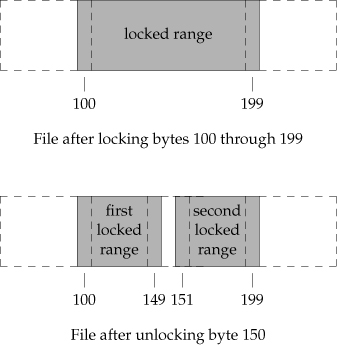

-   Example - Requesting and Releasing a Lock

    ::: captioned-content
    ::: caption
    Listing 111: Figure 14.5 Function to lock or unlock a region of a
    file
    :::

    ``` c
    /**
     *   @file     14fig05.c
     *   @date     2019-12-16
     *   @author   whiothes <whiothes81@gmail.com>
     *   @version  1.0
     *   @brief    Function to lock or unlock a region of a file
     */

    #include <fcntl.h>

    #include "apue.h"

    int lock_reg(int fd, int cmd, int type, off_t offset, int whence, off_t len) {
        struct flock lock;

        lock.l_type   = type;
        lock.l_start  = offset;
        lock.l_whence = whence;
        lock.l_len    = len;

        return (fcntl(fd, cmd, &lock));
    }
    ```
    :::

-   Example - Testing for a Lock

    ::: captioned-content
    ::: caption
    Listing 112: Figure 14.6 Function to test for a locking condition
    :::

    ``` c
    /**
     *   @file     14fig06.c
     *   @date     2019-12-16
     *   @author   whiothes <whiothes81@gmail.com>
     *   @version  1.0
     *   @brief    Figure 14.6 Function to test for a locking condition
     */
    #include <fcntl.h>

    #include "apue.h"

    pid_t lock_test(int fd, int type, off_t offset, int whence, off_t len) {
        struct flock lock;

        lock.l_type   = type;
        lock.l_start  = offset;
        lock.l_whence = whence;
        lock.l_len    = len;

        if (fcntl(fd, F_GETLK, &lock) < 0) {
            err_sys("fcntl error");
        }

        if (lock.l_type == F_UNLCK) {
            return 0;
        }

        return (lock.l_pid);
    }
    ```
    :::

-   Example - Deadlock

    ::: captioned-content
    ::: caption
    Listing 113: Figure 14.7 Example of deadlock detection
    :::

    ``` c
    /**
     *   @file     deadlock.c
     *   @date     2019-12-16
     *   @author   whiothes <whiothes81@gmail.com>
     *   @version  1.0
     *   @brief    Example of deadlock detection
     */
    #include <fcntl.h>

    #include "apue.h"

    static void lockabyte(const char *name, int fd, off_t offset) {
        if (writew_lock(fd, offset, SEEK_END, 1) < 0) {
            err_sys("%s: writew_lock error", name);
        }
        printf("%s: got the lock, byte %lld\n", name, (long long)offset);
    }

    int main(void) {
        int   fd;
        pid_t pid;

        /*
         * Create a file and write two bytes to it.
         */
        if ((fd = creat("templock", FILE_MODE)) < 0) {
            err_sys("creat error");
        }
        if (write(fd, "ab", 2) != 2) {
            err_sys("write error");
        }

        TELL_WAIT();
        if ((pid = fork()) < 0) {
            err_sys("fork error");
        } else if (pid == 0) {
            lockabyte("child", fd, 0);
            TELL_PARENT(getppid());
            WAIT_PARENT();
            lockabyte("child", fd, 1);
        } else {
            lockabyte("parent", fd, 1);
            TELL_CHILD(pid);
            WAIT_CHILD();
            lockabyte("parent", fd, 0);
        }

        exit(0);
    }
    ```
    :::

-   Implied Inheritance and Release of Locks

    1.  Locks are associated with a process and a file.
    2.  Locks are never inherited by the child accross a fork
    3.  Locks are inherited by a new program accross exec.

-   FreeBSD Implementation

    ```{=org}
    #+caption: Figure 14.8 The FreeBSD data structures for record locking
    ```
    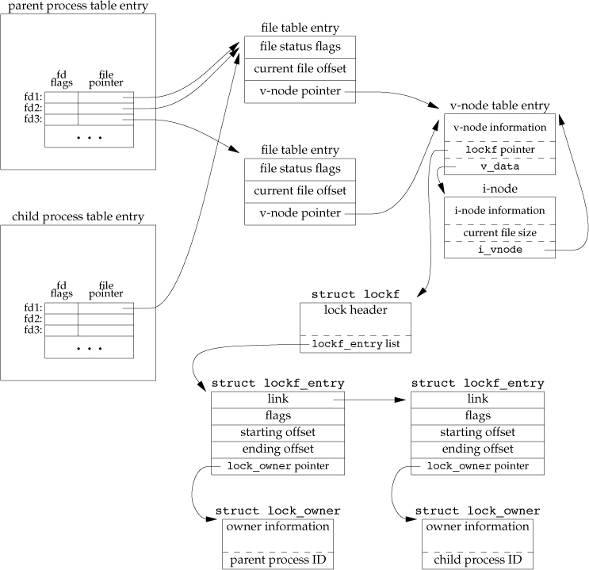 new here are **lockf** structure

    -   Example

        ::: captioned-content
        ::: caption
        Listing 114: Figure 14.9 Place a write lock on an entire file
        :::

        ``` c
        /**
         *   @file     14fig09.c
         *   @date     2019-12-16
         *   @author   whiothes <whiothes81@gmail.com>
         *   @version  1.0
         *   @brief    Place a write lock on an entire file
         */

        #include <fcntl.h>

        #include "apue.h"

        int lockfile(int fd) {
            struct flock fl;

            fl.l_type   = F_WRLCK;
            fl.l_start  = 0;
            fl.l_whence = SEEK_SET;
            fl.l_len    = 0;

            return (fcntl(fd, F_SETLK, &fl));
        }
        ```
        :::

    macro

    ``` c
    #define lockfile(fd) write_lock((fd), 0, SEEK_SET, 0)
    ```

-   Locks at End of File

    ``` c
    // The commented code should be the right one
    writew_lock(fd, 0, SEEK_END, 0);
    write(fd, buf, 1);
    un_lock(fd, 0, SEEK_END);       // un_lock(fd, -1, SEEK_END) instead
    write(fd, buf, 1);
    ```

    

-   Advisory versus Mandatory Locking

    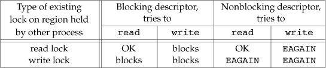

    -   Example

        ::: captioned-content
        ::: caption
        Listing 115: Figure 14.12 Determine whether mandatory locking is
        supported
        :::

        ``` c
        /**
         *   @file     mandatory.c
         *   @date     2019-12-17
         *   @author   whiothes <whiothes81@gmail.com>
         *   @version  1.0
         *   @brief    determine whether our system supports mandatory locking
         */
        #include <errno.h>
        #include <fcntl.h>
        #include <sys/wait.h>

        #include "apue.h"

        int main(int argc, char *argv[]) {
            int         fd;
            pid_t       pid;
            char        buf[5];
            struct stat statbuf;

            if (argc != 2) {
                err_sys("usage: %s filename", argv[0]);
            }

            if ((fd = open(argv[1], O_RDWR | O_CREAT | O_TRUNC, FILE_MODE)) < 0) {
                err_sys("open error");
            }
            if (write(fd, "abcdef", 6) != 6) {
                err_sys("fstat error");
            }

            if (fstat(fd, &statbuf) < 0) {
                err_sys("fstat error");
            }
            if (fchmod(fd, (statbuf.st_mode & ~S_IXGRP) | S_ISGID) < 0) {
                err_sys("fchmod error");
            }

            TELL_WAIT();

            if ((pid = fork()) < 0) {
                err_sys("fork error");
            } else if (pid > 0) {
                if (write_lock(fd, 0, SEEK_SET, 0) < 0) {
                    err_sys("write_lock error");
                }
                TELL_CHILD(pid);
                if (waitpid(pid, NULL, 0) < 0) {
                    err_sys("waitpid error");
                }
            } else {
                WAIT_PARENT();

                set_fl(fd, O_NONBLOCK);

                if (read_lock(fd, 0, SEEK_SET, 0) != -1) {
                    err_sys("child: read_lock succeeded");
                }
                printf("read_lock of already-locked region returns %d\n", errno);

                if (lseek(fd, 0, SEEK_SET) == -1) {
                    err_sys("lseek error");
                }

                if (read(fd, buf, 2) < 0)
                    err_ret("read failed (mandatory locking works)");
                else
                    printf("read OK(no mandatory locking), buf = %2.2s\n", buf);
            }

            return 0;
        }
        ```
        :::

        ``` {.bash org-language="sh"}
        bin/14fig12 temp.lockk
        ```

###  14.4 I/O Multiplexing \[2/2\] {#io-multiplexing-22}

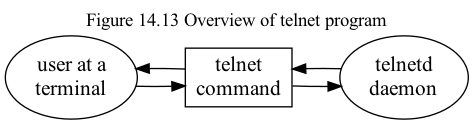


polling:

-   waste CPU time

asynchronous IO:

-   \*we tell the kernel to notify us with a signal when a descriptor is
    ready for I/O.
-   \*If we enable this signal for two descriptors (in the example we've
    been talking about, reading from two descriptors), the occurrence of
    the signal doesn't tell us which descriptor is ready.

I/O multiplexing:

-   build a list of descriptors that we are interested in
-   call a function that doesn\'t return until one of the descriptors is
    ready for I/O.

1.   14.4.1 `select` and `pselect` Functions

    select arguments:

    -   which descriptors we\'re interested in
    -   which conditions we\'re interested in for each descriptor.
    -   How long we want to wait.

    return information:

    -   The total count of the number of descriptors that are ready.
    -   which descriptors are ready for each of the three conditions
        (read, write, or exception)

    ``` c
    #include <sys/select.h>
    int select(int maxfdp1, fd_set *restrict readfds,
               fd_set *restrict wriefds, fd_set *restrict exceptfds,
               struct timevval *restrict tvptr);
    // Returns: count of ready descriptors, 0 on timeout, -1 on error
    ```

    ``` {#fd_set relevant .c}
    #include <sys/select.h>
    int FD_ISSET(int fd, fd_set *fdset);
    // Returns: nonzero if fd is in set, 0 otherwise

    void FD_CLR(int fd, fd_set *fdset);
    void FD_SET(int fd, fd_set *fdset);
    void FD_ZERO(fd_set *fdset);
    ```

    ``` {#POSIX.1 defines a variant of select .c}
    #include <sys/select.h>
    int pselect(int maxfdp1, fd_set *restrict readfds,
                fd_set *restrict writefds, fd_set *restrict exceptfds,
                const struct timespec *restrict tsptr,
                const sigset_t *restrict sigmask);
    ```

    differences from select

    -   timeout value for `select` is specified by a timeval structure,
        but timespec structure for pselect
    -   timeout for pselect is declared const
    -   An optional signal mask argument is available for pselect.

2.   14.4.2 `poll` Function

    `poll` is similar to `select`, but without differentiating
    conditions

    ``` c
    #include <poll.h>
    int poll(struct pollfd fdarray[], nfds_t nfds, int timeout);
    ```

    ``` c
    typedef struct {
            int   fd;                        // file descriptor to check, or <0 to ignore
            short events;                    // events of interest on fd
            short revents;                   // events that occurred on fd
    };
    ```

      Name         Input to events?   Result from revents?   Description
      ------------ ------------------ ---------------------- -----------------------------------------------------
      POLLIN       \*                 \*                     Equivalent to POLLRDNORM `OR`{.verbatim} POLLRDBAND
      POLLRDNORM   \*                 \*                     Normal data can bread without blocking
      POLLRDBAND   \*                 \*                     Priority data can be read without blocking
      POLLPRI      \*                 \*                     High-priority data can be read without blocking
      POLLOUT      \*                 \*                     Normal data can be written without blocking
      POLLWRNORM   \*                 \*                     Same as POLLOUT
      POLLWRBAND   \*                 \*                     Priority data can be written without blocking
      POLLERR                         \*                     An error has occurred
      POLLHUP                         \*                     A hangup has occurred
      POLLNVAL                        \*                     The descriptor does not reference an open file

      : Table 20: Figure 14.17 The events and revents flags for poll

    When a descriptor is hang up (POLLHUP), we can no longer write, but
    still can read

    -   Interruptibility of `select` and `poll`

        When the automatic restarting of interrupted system calls was
        introduced with 4.2BSD, the `select` function was never
        restarted.\
        even if the SA~RESTART~ option is specified.\
        but under SVR4, if SA~RESTART~ was specified, even `select` and
        `poll` were automatically restarted.

###  14.5 Asynchronous I/O \[3/3\] {#asynchronous-io-33}

1.   14.5.1 System V Asynchronous I/O

    `<stropt.h>`

      Constant     Description
      ------------ ------------------------------------------------------------------------------
      S~INPUT~     We can read data (other than high-priority data) without blocking
      S~RDNORM~    We can read normal data without blocking
      S~RDBND~     We can read priority dat without blocking
      S~BANDURG~   If this constant is specified with S~RDBAND~, the SIGURG signal is generated
                   instead of SIGPOLL When we can read priority data without blocking
      S~HIPRI~     we can read high-priority data without blocking
      S~OUTPUT~    We can write normal data wihout blocking
      S~WRNORM~    Same as S~OUTPUT~
      S~WRBAND~    We can write priority data without blocing.
      S~MSG~       The SIGPOLL signal message has reached the stream head.
      S~ERROR~     The stream has an error.
      S~HANGUP~    The stream has hung up.

      : Table 21: Figure 14.18 Conditions for generating SIGPOLL signal

2.   14.5.2 BSD Asynchronous I/O

    Asynchronous I/O in BSD-derived system is a combination of two
    signals: SIGIO and SIGURG.

    To receive the `SIGIO`{.verbatim} signal, perform the following
    steps:

    1.  Establish a signal handler for SIGIO, by calling either `signal`
        or `sigaction`.
    2.  Set the process ID or process group ID to receive the signal for
        the descriptor, by calling `fcntl` with a command of
        `F_SETOWN`{.verbatim} (Section 3.14)
    3.  Enable asynchronous I/O on the descriptor by calling `fcntl`
        with a command of `F_SETFL` to set the `O_ASYNC`{.verbatim} file
        status flag (Figure 3.10)

    For the `SIGURG`{.verbatim} signal, we need perform only steps 1
    and 2. `SIGURG`{.verbatim} is generated only for descriptors that
    refer to network connections that support out-of-band data, such as
    TCP connections.

3.   14.5.3 POSIX Asynchronous I/O

    The asynchronous I/O interfaces use AIO control blocks to describe
    I/O operations.

    ``` c
    struct aiocb {
            int             aio_filedes;    // file descriptor
            off_t           aio_offset;     // file offset for I/O
            volatile void   *aio_buf;       // buffer for I/O
            size_t          aio_nbytes;     // number of bytes to transfer
            int             aio_reqprio;    // priority
            struct sigevent aio_sigevent;   // signal information
            int             aio_lio_opcode; // operation for list I/O
    };
    ```

    ``` c
    struct sigevent {
            int             sigev_notify;                // notify type
            int             sigev_signo;                 // signal number
            union sigval    sigev_values;                // notify argument
            void (*sigev_notify_function)(union sigval); // notify function
            pthread_attr_t *sigev_notify_attributes;     // notify attrs
    };
    ```

    `sigev_notify`{.verbatim} taks one of three values:

    -   SIGEV~NONE~ The process is not notified when the asynchronous
        I/O request completes.
    -   SIGEV~SIGNAL~ The signal specified by the
        `sigev_signo`{.verbatim} field is generated when the
        asynchronous I/O request completes.
    -   SIGEV~THREAD~ The function specified by the
        `sigev_notify_function`{.verbatim} field is called when the
        asynchronous I/O request completes.

    AIO related functions:

    ``` c
    #include <aio.h>

    int aio_read(struct aiocb *aiocb);
    int aio_write(struct aiocb *aiocb);
    // Both return 0 if OK, -1 on error
    // When the functions return success, the asynchronous I/O request has been queued for processing by the operating system.

    /// @brief force write all pending asynchronous
    int aio_fsync(int op, struct aiocb *aiocb);
    // Returns: 0 if OK, -1 on error

    /// @brief determine the completion status of beyond operations
    int air_error(const struct aiocb* aiocb);
    // Returns: 0             if SUCCESS (need to cal aio_return)
    //         -1            on ERROR (errno for details)
    //         EINPROGRESS   still pending

    /// @brief get return value if succeeded
    ssize_t aio_return(const struct aiocb *aiocb);
    // Returns: return results if OK, -1 and set errno on error

    /// @brief block operation until an operation completes
    int aio_suspend(const struct aiocb *const list[], int ncnt,
                    const struct timespec *timeout);
    // Returns: 0 if OK, -1 on error

    /// @brief cancel pending asynchronous I/O operations
    int aio_cancel(int fd, struct aiocb *aiocb);
    // Returns: AIO_ALLDONE      all of the operations completed before the attempt to cancel
    //          AIO_CANCELED     all of the requested operations have been canceled
    //          AIO_NOTCANCELED  at least one of the requested operations could not be canceled
    //          -1               failed.
    ```

    additional function submits a set of I/O requests described by a
    list of AIO control blocks

    ``` c
    #include <aio.h>
    int lio_listio(int mode, struct aiocb *restrict const list[restrict],
                   int ncnt, struct sigevent *restrict sigev);
    // Returns: 0 if OK, -1 on error
    ```

    mode: `LIO_WAIT`{.verbatim} / `LIO_NOWAIT`{.verbatim} list: points
    to a list of AIO control blocks specifying the I/O operations to
    perform (LIO~READ~, LIO~WRITE~ in `aio_lio_opcode`{.verbatim}) ncnt:
    count of list

      Name                Description                                                                          Minimum acceptable values
      ------------------- ------------------------------------------------------------------------------------ ---------------------------
      AIO~LISTIOMAX~      maximum number of I/O operations in a single list I/O call                           ~POSIXAIOLISTIOMAX~
      AIO~MAX~            maximum number of outstanding asynchronous I/O operations                            ~POSIXAIOMAX~
      AIO~PRIODELTAMAX~   maximum amount by which a process can decrease its asynchronous I/O priority level   0

      : Table 22: Figure 14.19 POSIX.1 runtime invariant values for
      asynchronous I/O

    `AIO_LISTIO_MAX`{.verbatim} = sysconf(~SCIOLISTIOMAX~)
    `AIO_MAX`{.verbatim} = sysconf(~SCAIOMAX~)
    `AIO_PRIO_DELTA_MAX`{.verbatim} = sysconf(~SCAIOPRIODELTAMAX~)

    ::: captioned-content
    ::: caption
    Listing 116: Figure 14.20 Translate a file using ROT-13
    :::

    ``` c
    /**
     *   @file     14fig20.c
     *   @date     2019-12-26
     *   @author   whiothes <whiothes81@gmail.com>
     *   @version  1.0
     *   @brief    translate a file using ROT-13
     *
     *   block mode
     */

    #include <ctype.h>
    #include <fcntl.h>

    #include "apue.h"

    extern char* __progname;

    #define BSZ 4096

    unsigned char buf[BSZ];

    unsigned char translate(unsigned char c) {
        if (isalpha(c)) {
            if (c >= 'n') {
                c -= 13;
            } else if (c >= 'a') {
                c += 13;
            } else if (c >= 'N') {
                c -= 13;
            } else {
                c += 13;
            }
        }

        return c;
    }

    int main(int argc, char* argv[]) {
        int ifd, ofd, i, n, nw;

        if (argc != 3) {
            err_quit("usage: %s infile outfile", __progname);
        }

        if ((ifd = open(argv[1], O_RDONLY)) < 0) {
            err_sys("can't open %s", argv[1]);
        }

        if ((ofd = open(argv[2], O_RDWR | O_CREAT | O_TRUNC, FILE_MODE)) < 0) {
            err_sys("can't open %s", argv[2]);
        }

        while ((n = read(ifd, buf, BSZ)) > 0) {
            for (i = 0; i < n; ++i) {
                buf[i] = translate(buf[i]);
            }

            if ((nw = write(ofd, buf, n)) != n) {
                if (nw < 0) {
                    err_sys("write failed");
                } else {
                    err_quit("short write (%d/%d)", nw, n);
                }
            }
        }

        fsync(ofd);
        exit(0);
    }
    ```
    :::

    ::: captioned-content
    ::: caption
    Listing 117: Figure 14.21 Translate a file using ROT-13 and
    asynchronous I/O
    :::

    ``` c
    /**
     *   @file     14fig21.c
     *   @date     2019-12-26
     *   @author   whiothes <whiothes81@gmail.com>
     *   @version  1.0
     *   @brief    translate a file using ROT-13
     *
     *   block mode
     */

    #include <aio.h>
    #include <ctype.h>
    #include <errno.h>
    #include <fcntl.h>

    #include "apue.h"

    extern char *__progname;

    #define BSZ  4096
    #define NBUF 8

    enum rwop { UNUSED = 0, READ_PENDING = 1, WRITE_PENDING = 2 };

    struct buf {
        enum rwop     op;
        int           last;
        struct aiocb  aiocb;
        unsigned char data[BSZ];
    };

    struct buf bufs[NBUF];

    unsigned char translate(unsigned char c) {
        if (isalpha(c)) {
            if (c >= 'n') {
                c -= 13;
            } else if (c >= 'a') {
                c += 13;
            } else if (c >= 'N') {
                c -= 13;
            } else {
                c += 13;
            }
        }

        return c;
    }

    int main(int argc, char **argv) {
        int                 ifd, ofd, i, j, n, err, numop;
        struct stat         sbuf;
        const struct aiocb *aiolist[NBUF];
        off_t               off = 0;

        if (argc != 3) {
            err_quit("usage: %s infile outfile", __progname);
        }

        if ((ifd = open(STDIN_FILENO, O_RDONLY)) < 0) {
            err_sys("can't open %s", argv[1]);
        }

        if ((ofd = open(argv[2], O_RDWR | O_CREAT | O_TRUNC, FILE_MODE)) < 0) {
            err_sys("can't open %s", argv[2]);
        }

        for (i = 0; i < NBUF; ++i) {
            bufs[i].op                              = UNUSED;
            bufs[i].aiocb.aio_buf                   = bufs[i].data;
            bufs[i].aiocb.aio_sigevent.sigev_notify = SIGEV_NONE;
            aiolist[i]                              = NULL;
        }

        numop = 0;

        for (;;) {
            for (i = 0; i < NBUF; ++i) {
                switch (bufs[i].op) {
                    case UNUSED: {
                        if (off < sbuf.st_size) {
                            bufs[i].op               = READ_PENDING;
                            bufs[i].aiocb.aio_fildes = ifd;
                            bufs[i].aiocb.aio_offset = off;
                            off += BSZ;
                            if (off >= sbuf.st_size) {
                                bufs[i].last = 1;
                            }
                            bufs[i].aiocb.aio_nbytes = BSZ;
                            if (aio_read(&bufs[i].aiocb) < 0) {
                                err_sys("aio_read failed");
                            }
                            aiolist[i] = &bufs[i].aiocb;
                            numop++;
                        }
                        break;
                    }

                    case READ_PENDING: {
                        if ((err = aio_error(&bufs[i].aiocb)) == EINPROGRESS)
                            continue;

                        if (err != 0) {
                            if (err == -1) {
                                err_sys("aio_error failed");
                            } else {
                                err_exit(err, "read failed");
                            }
                        }

                        if ((n = aio_return(&bufs[i].aiocb)) < 0) {
                            err_sys("aio_return failed");
                        }
                        if (n != BSZ && !bufs[i].last) {
                            err_quit("short read (%d/%d)", n, BSZ);
                        }
                        for (j = 0; j < n; ++j) {
                            bufs[i].data[j] = translate(bufs[i].data[j]);
                        }

                        bufs[i].op               = WRITE_PENDING;
                        bufs[i].aiocb.aio_fildes = ofd;
                        bufs[i].aiocb.aio_nbytes = n;
                        if (aio_write(&bufs[i].aiocb) < 0) {
                            err_sys("aio_write failed");
                        }

                        break;
                    }

                    case WRITE_PENDING: {
                        if ((err = aio_error(&bufs[i].aiocb)) == EINPROGRESS) {
                            continue;
                        }
                        if (err != 0) {
                            if (err == -1) {
                                err_sys("aio_error failed");
                            } else {
                                err_exit(err, "write failed");
                            }
                        }

                        if ((n = aio_return(&bufs[i].aiocb)) < 0) {
                            err_sys("aio_return failed");
                        }
                        if (n != bufs[i].aiocb.aio_nbytes) {
                            err_quit("short write (%d/%d)", n,
                                     bufs[i].aiocb.aio_nbytes);
                        }

                        aiolist[i] = NULL;
                        bufs[i].op = UNUSED;
                        numop--;
                        break;
                    }

                    default:
                        break;
                }
            }
            if (numop == 0) {
                if (off >= sbuf.st_size) {
                    break;
                }
            } else {
                if (aio_suspend(aiolist, NBUF, NULL) < 0) {
                    err_sys("aio_suspend failed");
                }
            }
        }

        bufs[i].aiocb.aio_fildes = ofd;
        if (aio_fsync(O_SYNC, &bufs[0].aiocb) < 0) {
            err_sys("aio_fsync failed");
        }

        exit(EXIT_SUCCESS);
    }
    ```
    :::

    > this might actually reduce performance---if the reads are
    > presented to the file system out of order, it can defeat the
    > operating system\'s read-ahead algorithm.

###  14.6 `readv` and `writev` Functions {#readv-and-writev-functions}

*scatter read* and *gather write*.

``` c
#include <sys/uio.h>
ssize_t readv(int fd, const struct iovec *iov, int iovcnt);
ssize_t writev(int fd, const struct iovec *iov, int iovcnt);
// Both return: number of bytes read or written, -1 on error

struct iovec {
        void   *ivo_base;                 // starting address of buffer
        size_t  iov_len;                  // sizeof of buffer
};
```

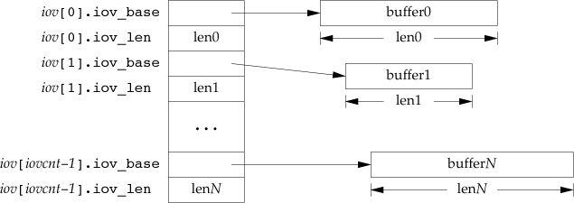

Three ways to write two buffers consecutively to a file:

1.  Call `write` twice, once for each buffer
2.  allocate a buffer, merge two buffers into the allocated buffer, then
    call `write`
3.  call `writev` to both buffers

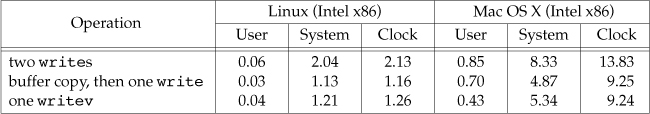

###  14.7 `readn` and `writen` Functions {#readn-and-writen-functions}

impletations for reading/writing only *n* bytes

``` c
#include "apue.h"
ssize_t readn(int fd, void *buf, size_t nbytes);
ssize_t writen(int fd, void *buf, size_t nbyts);
// Both Returns: number of bytes read or write, -1 on error
```

::: captioned-content
::: caption
Listing 118: Figure 14.24 The `readn` and `writen` functions
:::

``` c
/**
 *   @file     14fig24.c
 *   @date     2019-12-28
 *   @author   whiothes <whiothes81@gmail.com>
 *   @version  1.0
 *   @brief    implementations of readn and writen
 */

#include <fcntl.h>

#include "apue.h"

ssize_t readn(int fd, void *ptr, size_t n) {
    size_t  nleft;
    ssize_t nread;

    for (nleft = n; nleft > 0; nleft -= nread) {
        if ((nread = read(fd, ptr, nleft)) < 0) {
            // error occured
            if (nleft == n) {
                // no read
                return -1;
            } else {
                // return read amount
                break;
            }
        } else if (nread == 0) {
            break;
        }
        ptr += nread;
    }

    return n - nleft;
}

ssize_t writen(int fd, const void *ptr, size_t n) {
    size_t  nleft;
    ssize_t nwritten;

    for (nleft = n; nleft > 0; nleft -= nwritten) {
        if ((nwritten = write(fd, ptr, nleft) < 0)) {
            // error occured
            if (nleft == n) {
                // no written
                return -1;
            } else {
                // return written amount
                break;
            }
        } else if (nwritten == 0) {
            break;
        }
        ptr += nwritten;
    }

    return n - nleft;
}
```
:::

###  14.8 Memory-Mapped I/O {#memory-mapped-io}

map a file on disk into a buffer in memory so that, when we fetch bytes
from the buffer, the corresponding bytes of the file are read.

``` c
#include <sys/mman.h>
/**
 * @brief      map a file on disk into a buffer in memory
 *
 *
 * @return     starting address of mapped region if OK, MAP_FAILED on error
 */
void *mmap(void *addr, size_t len, int prot, int flag, int fd, off_t off);

/// @brief unmap a memory-mapped region
/**
 * @brief      unmap a memory-mapped region
 *
 * @return     0 if OK, -1 on error
 */
int munmap(void *addr, size_t len);
```

  prot          Description
  ------------- ---------------------------
  PROT~READ~    Region can be read
  PROT~WRITE~   Region can be written
  PROT~EXEC~    Region can be executed
  PROT~NONE~    Region cannot be accessed

  : Table 23: Figure 14.25 Protection of memory-mapped region

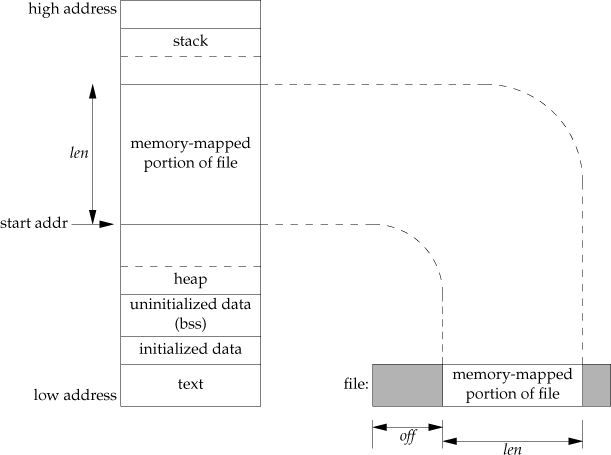

*flag* argument:

-   MAP~FIXED~: The return value must equal *addr*.

-   MAP~SHARED~: describe the disposition of store operations into the
    mapped region by this process.

-   MAP~PRIVATE~: store operations into the mapped region cause a
    private copy of the mapped file to be created.

-   MAP~xxx~: check `mmap(2)` for additional flag values

-   Example

    ::: captioned-content
    ::: caption
    Listing 119: Figure 14.27 Copy a file using memory-mapped I/O
    :::

    ``` c
    /**
     *   @file     14fig27.c
     *   @date     2019-12-28
     *   @author   whiothes <whiothes81@gmail.com>
     *   @version  1.0
     *   @brief    Coapy a file using memory-mapped I/O
     */

    #include <fcntl.h>
    #include <sys/mman.h>

    #include "apue.h"

    #define COPYINCR (1024 * 1024 * 1024)  // 1GB

    int main(int argc, char *argv[]) {
        int         fdin, fdout;
        void *      src, *dst;
        size_t      copysz;
        struct stat sbuf;
        off_t       fsz = 0;

        if (argc != 3) {
            err_quit("usage: %s <from-file> <to-file>", argv[0]);
        }

        if ((fdin = open(argv[1], O_RDONLY)) < 0) {
            err_sys("can't open %s for reading", argv[1]);
        }

        if ((fdout = open(argv[2], O_RDWR | O_CREAT | O_TRUNC, FILE_MODE)) < 0) {
            err_sys("can't create %s for writting", argv[2]);
        }

        if (fstat(fdin, &sbuf) < 0) {
            err_sys("fstat error");
        }

        // If we don’t set the output file’s size, the call to mmap for the output
        // file is successful, but the first reference to the associated memory
        // region generates a SIGBUS signal.
        if (ftruncate(fdout, sbuf.st_size) < 0) {
            err_sys("ftruncate error");
        }

        while (fsz < sbuf.st_size) {
            if ((sbuf.st_size - fsz) > COPYINCR) {
                copysz = COPYINCR;
            } else {
                copysz = sbuf.st_size - fsz;
            }

            if ((src = mmap(0, copysz, PROT_READ, MAP_SHARED, fdin, fsz)) ==
                MAP_FAILED) {
                err_sys("mmap error for input");
            }

            if ((dst = mmap(0, copysz, PROT_READ | PROT_WRITE, MAP_SHARED, fdout,
                            fsz)) == MAP_FAILED) {
                err_sys("mmap error for output");
            }

            memcpy(dst, src, copysz);

            munmap(src, copysz);
            munmap(dst, copysz);
            fsz += copysz;
        }
    }
    ```
    :::

``` c
#include <sys/mman.h>
/**
 * @brief change the permissions on an existing mmaping
 *
 * @retval 0     OK
 * @retval -1    error
 */
int mprotect(void *addr, size_t len, int prot);

/**
 * @brief flush the changes to the file that backs the mapping
 *
 * @param  flags   MS_ASYNC: schedule the page to be written
 *                 MS_SYNC:  wait for the writes to be cmoplete before turning
 *
 * @warning either MS_ASYNC or MS_SYNC must be specified
 *
 * @retval 0     OK
 * @retval -1    error
 */
int msync(void *addr, size_t len, int flags);
```


###  14.9 Summary {#summary-13}

-   Exercises

    -   14.1

        ``` c
        /**
         *   @file     14ex01.c
         *   @date     2019-12-28
         *   @author   whiothes <whiothes81@gmail.com>
         *   @version  1.0
         *   @brief    test write lock
         */

        #include <errno.h>
        #include <fcntl.h>

        #include <sys/select.h>

        fd_set set;

        #include "apue.h"

        void sigint(int signo) {}

        int  main(void) {
            pid_t pid1, pid2, pid3;
            int   fd;

            setbuf(stdout, NULL);
            signal_intr(SIGINT, sigint);

            if ((fd = open("lockfile", O_RDWR | O_CREAT, FILE_MODE)) < 0) {
                err_sys("can't create lockfile");
            }

            switch ((pid1 = fork())) {
                case -1:
                    err_sys("fork failed");
                    break;
                case 0: {
                    if (read_lock(fd, 0, SEEK_SET, 0) < 0) {
                        err_sys("child 1: can't set RD-LOCK on file");
                    }
                    printf("child 1: read lock on file.\n");
                    pause();
                    printf("child 1: exit.\n");
                    exit(EXIT_SUCCESS);
                }

                default:
                    sleep(2);
                    break;
            }

            switch ((pid2 = fork())) {
                case -1:
                    err_sys("fork failed");
                    break;
                case 0: {
                    if (read_lock(fd, 0, SEEK_SET, 0) < 0) {
                        err_sys("child 2: can't set RD-LOCK on file");
                    }
                    printf("child 2: read lock on file.\n");
                    pause();
                    printf("child 2: exit.\n");
                    exit(EXIT_SUCCESS);
                }

                default:
                    sleep(2);
                    break;
            }

            switch ((pid3 = fork())) {
                case -1:
                    err_sys("fork failed");
                    break;
                case 0: {
                    if (write_lock(fd, 0, SEEK_SET, 0) < 0) {
                        printf("child 3: can't set WR-LOCK on file.\n");
                    }
                    printf("child 3: wait to set WR_LOCK.\n");
                    if (writew_lock(fd, 0, SEEK_SET, 0) < 0) {
                        err_sys("child 3: can't WR-LOCK on file");
                    }
                    printf("child 3: obtained write lock on file.\n");
                    pause();
                    printf("child 3: exit.\n");
                    exit(EXIT_SUCCESS);
                }

                default:
                    sleep(2);
                    break;
            }

            if (read_lock(fd, 0, SEEK_SET, 0) < 0) {
                printf("parent: can't set RD-LOCK on file: %s\n", strerror(errno));
            } else {
                printf(
                    "parent: set RD-LOCK on file success while WR-LOCK is pending.\n");
            }

            printf("killing child 1...\n");
            kill(pid1, SIGINT);
            printf("killing child 2...\n");
            kill(pid2, SIGINT);
            printf("killing child 3...\n");
            kill(pid3, SIGINT);

            return (0);
        }
        ```

    -   14.2

        > Most systems define the fd~set~ data type to be a structure
        > that contains a single member: an array of long integers. One
        > bit in this array corresponds to each descriptor. The four
        > FD\_ macros then manipulate this array of longs, turning
        > specific bits on and off and testing specific bits.
        >
        > One reason that the data type is defined to be a structure
        > containing an array and not simply an array is to allow
        > variables of type fd~set~ to be assigned to one another with
        > the C assignment statement.

    -   14.3

        define or redefine(undefine first) the macro
        `FD_SETSIZE`{.verbatim} (or `__FD_SETSIZE`{.verbatim})

    -   14.4

          file descriptor sets   signal sets
          ---------------------- -------------
          FD~ZERO~               sigemptyset
          FD~SET~                sigaddset
          FD~CLR~                sigdelset
          FD~ISSET~              sigismember

    -   14.5

        ``` c
        /**
         *   @file     14ex05.c
         *   @date     2019-12-29
         *   @author   whiothes <whiothes81@gmail.com>
         *   @version  1.0
         *   @brief    wait for specified number of microseconds via select
         */

        #include <sys/poll.h>
        #include <sys/select.h>

        #include "apue.h"

        void sleep_us_select(unsigned int nusecs) {
            struct timeval tval;

            tval.tv_sec  = nusecs / 10e6;
            tval.tv_usec = nusecs % (unsigned int)10e6;
            select(0, NULL, NULL, NULL, &tval);
        }

        void sleep_us_poll(unsigned int nusecs) {
            struct pollfd fds;
            int           timeout;

            timeout = nusecs / 10e3;
            timeout = timeout <= 0 ? 1 : timeout;

            poll(&fds, 0, timeout);
        }

        int main() {
            setbuf(stdout, NULL);

            printf("before select sleep\n");
            sleep_us_select(2 * 10e6);
            printf("after select sleep\n");

            printf("before poll sleep\n");
            sleep_us_poll(2 * 10e6);
            printf("after poll sleep\n");
        }
        ```

    -   14.6

        No. **call `fork` releases all the locks in the child, so the
        child can\'t start off with any locks of its own**

    -   14.7

        ``` c
        /**
         *   @file     14ex07.c
         *   @date     2019-12-29
         *   @author   whiothes <whiothes81@gmail.com>
         *   @version  1.0
         *   @brief    pipe using nonblocking writes.
         */

        #include <fcntl.h>
        #include <limits.h>

        #include "apue.h"

        int main(void) {
            int fd[2];

            if (pipe(fd) < 0) {
                err_sys("pipe error.");
            }

            set_fl(fd[1], O_NONBLOCK);

            int capacity;
            for (capacity = 0;; capacity++) {
                int nwritten = 0;
                if ((nwritten = write(fd[1], "a", 1)) != 1) {
                    printf("nwritten = %d\n", nwritten);
                    break;
                }
            }

            printf("capacity = %d\n", capacity);

            printf("PIPE_BUF = %d\n", PIPE_BUF);

            exit(EXIT_SUCCESS);

        }
        ```

        > \| Platform \| Pipe Capacity(bytes) \|
        >
        >   ---------------------- -------
        >   FreeBSD 8.0            65536
        >   **Linux 4.1.0**        65536
        >   **Mac OS X 10.15.2**   65536
        >   Solaris 10             16384
        >   ---------------------- -------
        >
        > These values can differ from the corresponding
        > `PIPE_BUF`{.verbatim} values, because PIPE~BUF~ is defined to
        > be the maximum amount of data that **can be written** to a
        > pipe atomically. Here, we calculate the amount of data that a
        > pipe **can hold** independent of any atomicity constraints.

    -   14.8

        ``` c
        /**
         *   @file     14ex08.c
         *   @date     2019-12-26
         *   @author   whiothes <whiothes81@gmail.com>
         *   @version  1.0
         *   @brief    rewrite 14fig21.c
         *
         *   block mode
         */

        #include <aio.h>
        #include <ctype.h>
        #include <errno.h>
        #include <fcntl.h>

        #include "apue.h"

        extern char *__progname;

        #define BSZ  4096
        #define NBUF 8

        enum rwop { UNUSED = 0, READ_PENDING = 1, WRITE_PENDING = 2 };

        struct buf {
            enum rwop     op;
            int           last;
            struct aiocb  aiocb;
            unsigned char data[BSZ];
        };

        struct buf bufs[NBUF];

        unsigned char translate(unsigned char c) {
            if (isalpha(c)) {
                if (c >= 'n') {
                    c -= 13;
                } else if (c >= 'a') {
                    c += 13;
                } else if (c >= 'N') {
                    c -= 13;
                } else {
                    c += 13;
                }
            }

            return c;
        }

        int main(int argc, char **argv) {
            int                 ifd, ofd, i, j, n, err, numop;
            struct stat         sbuf;
            const struct aiocb *aiolist[NBUF];
            off_t               off = 0;

            // if (argc != 3) {
            //     err_quit("usage: %s infile outfile", __progname);
            // }

            // if ((ifd = open(argv[1], O_RDONLY)) < 0) {
            //     err_sys("can't open %s", argv[1]);
            // }

            // if ((ofd = open(argv[2], O_RDWR | O_CREAT | O_TRUNC, FILE_MODE)) < 0) {
            //     err_sys("can't open %s", argv[2]);
            // }

            ifd = STDIN_FILENO;         // for pipe: ifd = pfd[0]?
            ofd = STDOUT_FILENO;        // for pipe: ofd = pfd[1]?

            for (i = 0; i < NBUF; ++i) {
                bufs[i].op                              = UNUSED;
                bufs[i].aiocb.aio_buf                   = bufs[i].data;
                bufs[i].aiocb.aio_sigevent.sigev_notify = SIGEV_NONE;
                aiolist[i]                              = NULL;
            }

            numop = 0;

            for (;;) {
                for (i = 0; i < NBUF; ++i) {
                    switch (bufs[i].op) {
                        case UNUSED: {
                            if (off < sbuf.st_size) {
                                bufs[i].op               = READ_PENDING;
                                bufs[i].aiocb.aio_fildes = ifd;
                                bufs[i].aiocb.aio_offset = off;
                                off += BSZ;
                                if (off >= sbuf.st_size) {
                                    bufs[i].last = 1;
                                }
                                bufs[i].aiocb.aio_nbytes = BSZ;
                                if (aio_read(&bufs[i].aiocb) < 0) {
                                    err_sys("aio_read failed");
                                }
                                aiolist[i] = &bufs[i].aiocb;
                                numop++;
                            }
                            break;
                        }

                        case READ_PENDING: {
                            if ((err = aio_error(&bufs[i].aiocb)) == EINPROGRESS)
                                continue;

                            if (err != 0) {
                                if (err == -1) {
                                    err_sys("aio_error failed");
                                } else {
                                    err_exit(err, "read failed");
                                }
                            }

                            if ((n = aio_return(&bufs[i].aiocb)) < 0) {
                                err_sys("aio_return failed");
                            }
                            if (n != BSZ && !bufs[i].last) {
                                err_quit("short read (%d/%d)", n, BSZ);
                            }
                            for (j = 0; j < n; ++j) {
                                bufs[i].data[j] = translate(bufs[i].data[j]);
                            }

                            bufs[i].op               = WRITE_PENDING;
                            bufs[i].aiocb.aio_fildes = ofd;
                            bufs[i].aiocb.aio_nbytes = n;
                            if (aio_write(&bufs[i].aiocb) < 0) {
                                err_sys("aio_write failed");
                            }

                            break;
                        }

                        case WRITE_PENDING: {
                            if ((err = aio_error(&bufs[i].aiocb)) == EINPROGRESS) {
                                continue;
                            }
                            if (err != 0) {
                                if (err == -1) {
                                    err_sys("aio_error failed");
                                } else {
                                    err_exit(err, "write failed");
                                }
                            }

                            if ((n = aio_return(&bufs[i].aiocb)) < 0) {
                                err_sys("aio_return failed");
                            }
                            if (n != bufs[i].aiocb.aio_nbytes) {
                                err_quit("short write (%d/%d)", n,
                                         bufs[i].aiocb.aio_nbytes);
                            }

                            aiolist[i] = NULL;
                            bufs[i].op = UNUSED;
                            numop--;
                            break;
                        }

                        default:
                            break;
                    }
                }
                if (numop == 0) {
                    if (off >= sbuf.st_size) {
                        break;
                    }
                } else {
                    if (aio_suspend(aiolist, NBUF, NULL) < 0) {
                        err_sys("aio_suspend failed");
                    }
                }
            }

            bufs[i].aiocb.aio_fildes = ofd;
            if (aio_fsync(O_SYNC, &bufs[0].aiocb) < 0) {
                err_sys("aio_fsync failed");
            }

            exit(EXIT_SUCCESS);
        }
        ```

    -   14.9

        just try to execute the program with a very large file

    -   14.10

        Not changed

    -   14.11

        ``` c
        /**
         *   @file     14ex11.c
         *   @date     2019-12-29
         *   @author   whiothes <whiothes81@gmail.com>
         *   @version  1.0
         *   @brief    rewrite 14fig27
         *
         *  close fd after calling mmap
         *
         */

        #include <fcntl.h>
        #include <sys/mman.h>
        #include <sys/select.h>

        #include "apue.h"

        #define COPYINCR (1024 * 1024 * 1024)  // 1GB

        int main(int argc, char *argv[]) {
            int         fdin, fdout;
            void *      src, *dst;
            size_t      copysz;
            struct stat sbuf;
            off_t       fsz = 0;

            if (argc != 3) {
                err_quit("usage: %s <from-file> <to-file>", argv[0]);
            }

            if ((fdin = open(argv[1], O_RDONLY)) < 0) {
                err_sys("can't open %s for reading", argv[1]);
            }

            if ((fdout = open(argv[2], O_RDWR | O_CREAT | O_TRUNC, FILE_MODE)) < 0) {
                err_sys("can't create %s for writting", argv[2]);
            }

            if (fstat(fdin, &sbuf) < 0) {
                err_sys("fstat error");
            }

            // If we don’t set the output file’s size, the call to mmap for the output
            // file is successful, but the first reference to the associated memory
            // region generates a SIGBUS signal.
            if (ftruncate(fdout, sbuf.st_size) < 0) {
                err_sys("ftruncate error");
            }

            while (fsz < sbuf.st_size) {
                if ((sbuf.st_size - fsz) > COPYINCR) {
                    copysz = COPYINCR;
                } else {
                    copysz = sbuf.st_size - fsz;
                }

                if ((src = mmap(0, copysz, PROT_READ, MAP_SHARED, fdin, fsz)) ==
                    MAP_FAILED) {
                    err_sys("mmap error for input");
                }
                // calling close fd to verify
                close(fdin);


                if ((dst = mmap(0, copysz, PROT_READ | PROT_WRITE, MAP_SHARED, fdout,
                                fsz)) == MAP_FAILED) {
                    err_sys("mmap error for output");
                }
                close(fdout);

                memcpy(dst, src, copysz);

                munmap(src, copysz);
                munmap(dst, copysz);
                fsz += copysz;
            }
        }
        ```

##  Chapter 15. Interprocess Communication \[12/12\] {#chapter-15.-interprocess-communication-1212}

###  15.1 Introduction {#introduction-14}

  IPC type                     SUS           FreeBSD 8.0   Linux 3.2.0   Mac OS X 10.6.8   Solaris 10
  ---------------------------- ------------- ------------- ------------- ----------------- ------------
  half-duplex pipes            \*            (full)        \*            \*                (full)
  FIFOs                        \*            \*            \*            \*                \*
  full-duplex pipes            allowed       \*, UDS       UDS           UDS               \*, UDS
  named full-duplex pipes      obsolescent   UDS           UDS           UDS               \*, UDS
  XSI message queues           XSI           \*            \*            \*                \*
  XSI semaphores               XSI           \*            \*            \*                \*
  XSI shared memory            XSI           \*            \*            \*                \*
  message queues (real-time)   MSG option    \*            \*                              \*
  semaphores                   \*            \*            \*            \*                \*
  shared memory (real-time)    SHM option    \*            \*            \*                \*
  sockets                      \*            \*            \*            \*                \*
  STREAMS                      obsolescent                                                 \*

  : Table 24: Figure 15.1 Summary of UNIX System IPC

###  15.2 Pipes {#pipes}

Limitations:

1.  for maximum protability, we should never assume that ful-duplex
    pipes is the case
2.  pipes can be used only between proesses that have a common ancestor.

``` c
#include <unistd.h.>
/**
 * @brief create pipe
 *
 * @param  fd[0]  open for reading
 *         fd[1]  open for writing
 *
 * @retval 0     OK
 * @retval -1    error
 */
int pipe(int fd[2]);
```

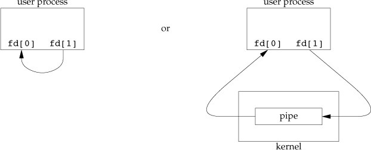

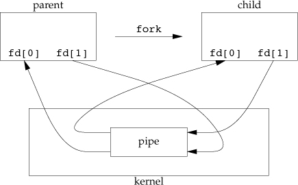

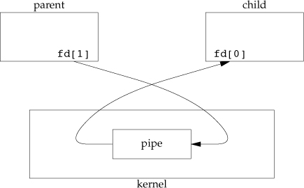

the parent closes fd\[1\], and the child closes fd\[0\].

> When one end of a pipe is closed, two rules apply.
>
> 1.  If we read from a pipe whose write end has been closed, read
>     returns 0 to indicate an EOF **after** all data has been read.
> 2.  If we write to a pipe whose read end has been closed, the signal
>     SIGPIPE is generated. If we either ignore the signal or catch it
>     and return from the signal handler, write returns -1 with errno
>     set to EPIPE.

the constant `PIPE_BUF`{.verbatim} specifies the kernel\'s pipe buffer
size.

-   Example

    ::: captioned-content
    ::: caption
    Listing 120: Figure 15.5 Send data from parent to child over a pipe
    :::

    ``` c
    /**
     *   @file     15fig05.c
     *   @date     2020-01-04
     *   @author   whiothes <whiothes81@gmail.com>
     *   @version  1.0
     *   @brief    Figure 15.5 send data from parent to child over a pipe
     */

    #include "apue.h"

    int main(void) {
        int   n;
        int   fd[2];
        pid_t pid;
        char  line[MAXLINE];

        if ((pipe(fd)) < 0) {
            err_sys("pipe error");
        }
        if ((pid = fork()) < 0) {
            err_sys("fork error");
        } else if (pid > 0) {
            close(fd[0]);
            write(fd[1], "hello world\n", 12);
        } else {
            close(fd[1]);
            n = read(fd[0], line, MAXLINE);
            write(STDOUT_FILENO, line, n);
        }

        return (0);
    }
    ```
    :::

    ::: captioned-content
    ::: caption
    Listing 121: Figure 15.6 Copy file to pager program
    :::

    ``` c
    /**
     *   @file     15fig06.c
     *   @date     2020-01-04
     *   @author   whiothes <whiothes81@gmail.com>
     *   @version  1.0
     *   @brief    copy file to pager program
     */

    #include <sys/wait.h>

    #include "apue.h"

    extern char *__progname;

    #define DEF_PAGER "/bin/more"  // default pager program

    int main(int argc, char *argv[]) {
        int   n;
        int   fd[2];
        pid_t pid;
        char *pager, *argv0;
        char  line[MAXLINE];
        FILE *fp;

        if (argc != 2) {
            err_quit("usage: %s <pathname>", __progname);
        }

        if ((fp = fopen(argv[1], "r")) == NULL) {
            err_sys("can't open %s", argv[1]);
        }
        if (pipe(fd) < 0) {
            err_sys("pipe error");
        }

        if ((pid = fork()) < 0) {
            err_sys("fork error");

        } else if (pid == 0) {
            // child
            close(fd[1]);
            // close write end

            if (fd[0] != STDIN_FILENO) {
                if (dup2(fd[0], STDIN_FILENO) != STDIN_FILENO) {
                    err_sys("dup2 error");
                }
                close(fd[0]);
            }

            if ((pager = getenv("PAGER")) == NULL) {
                pager = DEF_PAGER;
            }

            if ((argv0 = strchr(pager, '/')) != NULL) {
                argv0++;
            } else {
                argv0 = pager;
            }

            if (execl(pager, argv0, (char *)0) < 0) {
                err_sys("execl error for %s", pager);
            }

        } else {
            // parent
            close(fd[0]);  // close read end

            while (fgets(line, sizeof(line), fp) != NULL) {
                n = strlen(line);
                if (write(fd[1], line, n) != n) {
                    err_sys("write to pipe error");
                }
            }
            if (ferror(fp)) {
                err_sys("fgets error");
            }

            close(fd[1]);
            if (waitpid(pid, NULL, 0) < 0) {
                err_sys("waitpid error");
            }
            exit(0);
        }
    }
    ```
    :::

    ::: captioned-content
    ::: caption
    Listing 122: Figure 15.7 Routine to let a parent and child
    synchronized
    :::

    ``` c
    /**
     *   @file     15fig07.c
     *   @date     2020-01-07
     *   @author   whiothes <whiothes81@gmail.com>
     *   @version  1.0
     *   @brief    Routines to let a parent and child synchronize
     */

    #include "apue.h"

    static int pfd1[2], pfd2[2];

    void TELL_WAIT(void) {
        if (pipe(pfd1) < 0 || pipe(pfd2) < 0) {
            err_sys("pipe error");
        }
    }

    void TELL_PARENT(pid_t pid) {
        if (write(pfd2[1], "c", 1) != 1) {
            err_sys("write error");
        }
    }

    void WAIT_PARENT(void) {
        char c ;
        if (read(pfd1[0], &c, 1) != 1) {
            err_sys("read error");
        }
        if (c != 'p') {
            err_quit("WAIT_PARENT: incorrect data");
        }
    }

    void TELL_CHILD(pid_t pid) {
        if (write(pfd2[1], "p", 1) != 1) {
            err_sys("write error");
        }
    }

    void WAIT_CHILD(void) {
        char c;
        if(read(pfd2[0], &c, 1) != 1) {
            err_sys("read error");
        }
        if (c != 'c') {
            err_quit("WAIT_CHILD: incorrect data");
        }
    }
    ```
    :::

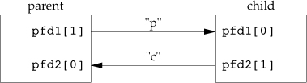

###  15.3 `popen` and `pclose` Functions {#popen-and-pclose-functions}

> creating a pipe, forking a child, closing the unused ends of the pipe,
> executing a shell to run the command, and waiting for the command to
> terminate.

``` c
#include <stdio.h>
/**
 *  @brief        fork(), then exec() the cmdstring,
 *
 *  @details      and returns a stdio pointer.
 *
 *  @param[in]    cmdstring    cmd to execute
 *  @param[in]    type         "r", connect to stdout
 *                             "w", connect to stdin
 *  @return       file pointer if OK, NULL on error
 */
FILE *popen(const char *cmdstring, const char *type);

/**
 * @brief      close the stdio stream,
 *
 * @details    waits for the cmd to terminate, and
 *             returns termination status of the shell
 *
 * @param      fp             returned by popen
 *
 * @return     termination status of cmdstring, or -1 on error
 */
int pclose(FILE *fp);
```

`type == "r"`:

```{=org}
#+caption: Figure 15.9 Result of fp = popen(cmdstring, "r");
```
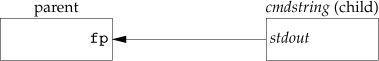 `type == "w"`:


The *cmdstring* is executed by bash, as in

``` bash
sh -c cmdstring
```

-   Example

    ::: captioned-content
    ::: caption
    Listing 123: Figure 15.11 Copy file to pager program using `popen`
    :::

    ``` c
    /**
     *   @file     15fig11.c
     *   @date     2020-01-07
     *   @author   whiothes <whiothes81@gmail.com>
     *   @version  1.0
     *   @brief    copy file to pager program using popen
     */

    #include <sys/wait.h>

    #include "apue.h"

    #define PAGER "${PAGER:-more}"  // environment variable, or default

    extern char *__progname;

    int main(int argc, char *argv[]) {
        char  line[MAXLINE];
        FILE *fpin, *fpout;

        if (argc != 2) {
            err_quit("usage: %s <pathname>", __progname);
        }
        if ((fpin = fopen(argv[1], "r")) == NULL) {
            err_sys("open %s error", argv[1]);
        }

        if ((fpout = popen(PAGER, "w")) == NULL) {
            err_sys("popen error");
        }

        while (fgets(line, MAXLINE, fpin) != NULL) {
            if (fputs(line, fpout) == EOF) {
                err_sys("fputs error to pipe");
            }
        }

        if (ferror(fpin)) {
            err_sys("fgets error");
        }
        if (fclose(fpin)) {
            err_sys("fclose error");
        }
        if (pclose(fpout) == -1) {
            err_sys("pclose error");
        }

        return 0;
    }
    ```
    :::

    ::: captioned-content
    ::: caption
    Listing 124: Figure 15.12 The `popen` and `pclose` functions
    :::

    ``` c
    /**
     *   @file     15fig12.c
     *   @date     2020-01-07
     *   @author   whiothes <whiothes81@gmail.com>
     *   @version  1.0
     *   @brief    shows our version of popen and pclose
     */
    #include <errno.h>
    #include <fcntl.h>
    #include <sys/wait.h>

    #include "apue.h"

    // Pointer to array allocated at run-time
    static pid_t *childpid = NULL;

    // From our open_max(), Figure 2.17
    static int maxfd;

    FILE *popen(const char *cmdstring, const char *type) {
        int   i;
        int   pfd[2];
        pid_t pid;
        FILE *fp;

        // only allow "r" or "w"
        if ((type[0] != 'r' && type[0] != 'w') || type[1] != 0) {
            errno = EINVAL;
            return NULL;
        }

        // for more than once we called popen, store pid
        if (childpid == NULL) {
            maxfd = open_max();
            if ((childpid = calloc(maxfd, sizeof(pid_t))) == NULL) {
                return NULL;
            }
        }

        if (pipe(pfd) < 0) {
            return NULL;
        }
        if (pfd[0] >= maxfd || pfd[1] >= maxfd) {
            close(pfd[0]);
            close(pfd[1]);
            errno = EMFILE;
            return NULL;
        }

        if ((pid = fork()) < 0) {
            return NULL;
        } else if (pid == 0) {
            if (*type == 'r') {
                close(pfd[0]);
                if (pfd[1] != STDOUT_FILENO) {
                    dup2(pfd[1], STDOUT_FILENO);
                    close(pfd[1]);
                }
            } else {
                close(pfd[1]);
                if (pfd[0] != STDIN_FILENO) {
                    dup2(pfd[0], STDIN_FILENO);
                    close(pfd[0]);
                }
            }

            // close all descriptors in childpid
            for (i = 0; i < maxfd; ++i) {
                if (childpid[i] > 0) {
                    close(i);
                }
            }

            execl("/bin/sh", "sh", "-c", cmdstring, (char *)0);
            _exit(127);
        }

        // parent continues ...
        if (*type == 'r') {
            close(pfd[1]);
            if ((fp = fdopen(pfd[0], type)) == NULL) {
                return NULL;
            } else {
                close(pfd[0]);
                if ((fp = fdopen(pfd[1], type)) == NULL) {
                    return NULL;
                }
            }
        }

        childpid[fileno(fp)] = pid;  // remember child pid for this fd;
        return (fp);
    }

    int pclose(FILE *fp) {
        int   fd, stat;
        pid_t pid;

        if (childpid == NULL) {
            errno = EINVAL;
            return -1;  // popen has never been called
        }

        fd = fileno(fp);
        if (fd > maxfd) {
            errno = EINVAL;
            return -1;
        }
        if ((pid = childpid[fd]) == 0) {
            errno = EINVAL;
            return -1;
        }

        childpid[fd] = 0;
        if (fclose(fp) == EOF) {
            return -1;  // fp wasn't opened by popen()
        }

        while (waitpid(pid, &stat, 0) < 0) {
            if (errno != EINTR) {
                return -1;  // error other than EINTR from waitpid();
            }
        }

        return (stat);  // return child's termination status
    }
    ```
    :::

    

    ::: captioned-content
    ::: caption
    Listing 125: Figure 15.14 Filter to convert uppercase characters to
    lowercase
    :::

    ``` c
    /**
     *   @file     15fig14.c
     *   @date     2020-01-07
     *   @author   whiothes <whiothes81@gmail.com>
     *   @version  1.0
     *   @brief    filter to convert uppercase characters to lowercase
     */
    #include <ctype.h>

    #include "apue.h"

    int main(void) {
        int c;

        while ((c = getchar()) != EOF) {
            if (isupper(c)) {
                c = tolower(c);
            }
            if (putchar(c) != EOF) {
                err_sys("output error");
            }
            if (c == '\n') {
                fflush(stdout);
            }
        }
        exit(EXIT_SUCCESS);
    }
    ```
    :::

    ::: captioned-content
    ::: caption
    Listing 126: Figure 15.15 Invoke uppercase/lowercase filter to read
    commands
    :::

    ``` c
    /**
     *   @file     15fig15.c
     *   @date     2020-01-07
     *   @author   whiothes <whiothes81@gmail.com>
     *   @version  1.0
     *   @brief    Invoke uppercase/lowercase filter to read commands
     */

    #include <sys/wait.h>

    #include "apue.h"

    int main(void) {
        char  line[MAXLINE];
        FILE *fpin;

        if ((fpin = popen("../bin/15fig14", "r")) == NULL) {
            err_sys("popen error");
        }
        for (;;) {
            fputs("prompt> ", stdout);
            fflush(stdout);
            if (fgets(line, MAXLINE, fpin) == NULL) {
                break;
            }
            if (fputs(line, stdout) == EOF) {
                err_sys("fputs error to pipe");
            }
        }

        if (pclose(fpin) == -1) {
            err_sys("pclose error");
        }
        putchar('\n');
        exit(0);
    }
    ```
    :::

###  15.4 Coprocesses {#coprocesses}

> A filter becomes a *coprocess* when the same program generates the
> filter\'s input and reads the filter\'s output.

-   Example

    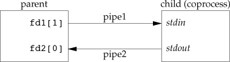

    ::: captioned-content
    ::: caption
    Listing 127: Figure 15.17 Simple filter to add two numbers
    :::

    ``` c
    /**
     *   @file     15fig17.c
     *   @date     2020-01-08
     *   @author   whiothes <whiothes81@gmail.com>
     *   @version  1.0
     *   @brief    Simple filter to add two numbers
     */

    #include "apue.h"

    int main(int argc, char *argv[]) {
        int  n, int1, int2;
        char line[MAXLINE];

        while ((n = read(STDIN_FILENO, line, MAXLINE)) > 0) {
            line[n] = 0;
            if (sscanf(line, "%d%d", &int1, &int2) == 2) {
                sprintf(line, "%d\n", int1 + int2);
                n = strlen(line);
                if (write(STDOUT_FILENO, line, n) != n) {
                    err_sys("write error");
                }
            } else {
                if (write(STDOUT_FILENO, "invalid args\n", 13) != 13) {
                    err_sys("write error");
                }
            }
        }
        return 0;
    }
    ```
    :::

    ::: captioned-content
    ::: caption
    Listing 128: Figure 15.18 Program to drive the 15fig17 filter
    :::

    ``` c
    /**
     *   @file     15fig18.c
     *   @date     2020-01-08
     *   @author   whiothes <whiothes81@gmail.com>
     *   @version  1.0
     *   @brief    Program to drive the add2 filter
     */

    #include "apue.h"

    static void sig_pipe(int);  // our signal handler

    int main(void) {
        int   n, fd1[2], fd2[2];
        pid_t pid;
        char  line[MAXLINE];

        if (signal(SIGPIPE, sig_pipe) == SIG_ERR) {
            err_sys("signal error");
        }
        if (pipe(fd1) < 0 || pipe(fd2) < 0) {
            err_sys("pipe error");
        }

        if ((pid = fork()) < 0) {
            err_sys("fork error");
        } else if (pid > 0) {
            // parent process
            close(fd1[0]);
            close(fd2[1]);

            while (fgets(line, MAXLINE, stdin) != NULL) {
                n = strlen(line);
                if (write(fd1[1], line, n) != n) {
                    err_sys("write error");
                }
                if ((n = read(fd2[0], line, MAXLINE)) < 0) {
                    err_sys("read error");
                }
                if (n == 0) {
                    err_msg("child closed pipe");
                    break;
                }
                line[n] = 0;
                if (fputs(line, stdout) == EOF) {
                    err_sys("fputs error");
                }
            }

            if (ferror(stdin)) {
                err_sys("fgets error on stdin");
            }

            exit(EXIT_SUCCESS);
        } else {
            // child process
            close(fd1[1]);
            close(fd2[0]);

            if (fd1[0] != STDIN_FILENO) {
                if (dup2(fd1[0], STDIN_FILENO) < 0) {
                    err_sys("dup2 error to stdin");
                }
                close(fd1[0]);
            }

            if (fd2[1] != STDOUT_FILENO) {
                if (dup2(fd2[1], STDOUT_FILENO) < 0) {
                    err_sys("dup2 error to stdout");
                }
                close(fd2[1]);
            }

            // if (execl("../bin/15fig17", "15fig17", (char*)0) < 0) {
            if (execl("../bin/15fig19", "15fig19", (char*)0) < 0) {
                err_sys("excel error");
            }
            exit(EXIT_SUCCESS);
        }
    }

    static void sig_pipe(int signo) {
        printf("SIGPIPE caught\n");
        exit(EXIT_FAILURE);
    }
    ```
    :::

    ::: captioned-content
    ::: caption
    Listing 129: Figure 15.19 Filter to add two numbers, using standard
    I/O
    :::

    ``` c
    /**
     *   @file     15fig19.c
     *   @date     2020-01-08
     *   @author   whiothes <whiothes81@gmail.com>
     *   @version  1.0
     *   @brief    filter to add two numbers, using standard I/O
     */

    #include "apue.h"

    int main(void) {
        int  int1, int2;
        char line[MAXLINE];

    // since the stdin is a pipe, defaults to fully buffered
    // it is blocked reading from stdin
    // 15fig18 is blocked reading from pipe
    #if 0
        // method 1: no buffer to fix blocking
        setbuf(stdin, NULL);
        setbuf(stdout, NULL);
    #else
        // OR method 2: line buffer to fix blocking
        setvbuf(stdin, NULL, _IOLBF, 0);
        setvbuf(stdout, NULL, _IOLBF, 0);
    #endif

        while (fgets(line, MAXLINE, stdin) != NULL) {
            if (sscanf(line, "%d%d", &int1, &int2) == 2) {
                if (printf("%d\n", int1 + int2) == EOF) {
                    err_sys("printf error");
                }
            } else {
                if (printf("invalid args\n") == EOF) {
                    err_sys("printf error");
                }
            }
        }
    }
    ```
    :::

###  15.5 FIFOs {#fifos}

named pipe. with FIFOs, unrelated processes can exchange data.

``` c
#include <sys/stat.h>
int mkfifo(const char *path, mode_t mode);
int mkfifoat(int fd, const char *path, mode_t mode);
// Both return: 0 if OK, -1 on error
```

three case for mkfifoat;

1.  If the *path* parameter specifies an absolute pathname, then the
    *fd* parameter is ignored and the `mkfifoat` function behaves like
    the mkfifo function.
2.  If the *path* parameter specifies a relative pathname and the *fd*
    parameter is a valid file descriptor for an open directory, the
    pathname is evaluated relative to this directory.
3.  If the *path* parameter specifies a relative pathname and the *fd*
    parameter has the special value with AT~FDCWD~, the pathname is
    evaluated starting in the current working directory, and the
    `mkfifoat` behaves like `mkfifo`.

When we `open` a FIFO, the nonblocking flag (`O_NONBLOCK`{.verbatim})
affects what happens.

-   In the normal case (without `O_NONBLOCK`{.verbatim}), an `open` for
    read-only blocks until some other processes opens the FIFO for
    writing .

-   If `O_NONBLOCK`{.verbatim} is specified, an `open` for read-only
    returns immediately. But an `open` for write-only returns -1 with
    errno set to `ENXIO`{.verbatim} if no process has the FIFO open for
    reading.

-   Example - Using FIFOs to Duplicate Output Streams

    

``` {.bash org-language="sh"}
mkfifo fifo1
prog3 < fifo1 &
prog1 < infile | tee fifo1 | prog2
```


-   Example - Clent-Server Communication Using a FIFO

    

    

###  15.6 XSI IPC \[4/4\] {#xsi-ipc-44}

1.   15.6.1 Identifiers and Keys

    The identifier is an internal name for an IPC object. an IPC object
    is associated with a *key* that acts as an external name for
    cooperating processes to be able to rendezvous using the same IPC
    object.

    **Whenever an IPC structure is being created, a key
    (\<sys/types.h\>::key~st~) must be specified.**

    ways for a client and a server to rendezvous at the same IPC
    structure.

    1.  The server can create a new IPC structure by specifying a key of
        `IPC_PRIVATE`{.verbatim} and store the returned identifier
        somewhere (such as a file) for the client to obtain.
    2.  The client and the server can agree on a key by defining the key
        in a common header.
    3.  The client and the server can agree on a pathname and project ID
        (the project ID is a character value between 0 and 255) and call
        the function `ftok` to convert these two values into a key.

    ``` c
    #include <sys/ipc.h>
    /// @brief generating a key from a pathname and project ID
    ///
    /// @param path        refer to an existing file
    /// @param id          only lower 8 bits used
    ///
    /// @note              usually formed by taking part of st_dev and st_ino fields in stat structure
    key_t ftok(const char *path, int id);
    // Returns: key if OK, (key_t)-1 on error
    ```

    > If we want to create a new IPC structure, making sure that we
    > don\'t reference an existing one with the same identifier, we must
    > specify a *flag* with both the `IPC_CREAT`{.verbatim} and
    > `IPC_EXCL`{.verbatim} bits set. Doing this causes an error
    > returned of EEXIST if the IPC structure already exists.

2.   15.6.2 Permission Structure

    ``` c
    struct ipc_perm {
            uid_t           uid;            /* [XSI] Owner's user ID */
            gid_t           gid;            /* [XSI] Owner's group ID */
            uid_t           cuid;           /* [XSI] Creator's user ID */
            gid_t           cgid;           /* [XSI] Creator's group ID */
            mode_t          mode;           /* [XSI] Read/write permission */
            // ... more additional members depends on system
    };
    ```

    

3.   15.6.3 Configuration Limits

    modify kernel configuration parameters:

      system       cmd
      ------------ --------
      FreeBSD      sysctl
      Linux        sysctl
      Mac OS X     sysctl
      Solaris 10   prctl

    display the IPC-related limits:

      system     cmd
      ---------- -------------
      Linux      `ipcs -l`
      Mac OS X   `ipcs -T`
      FreeBSD    `icps -T`
      Solaris    `sysdef -i`

4.   15.6.4 Advantages and Disadvantages

    -   all forms of XSI IPC remain in existence even when no process is
        using them.
    -   we can\'t see the IPC objects with an `ls` command, can\'t
        remove them with the `rm` command, can\'t change their
        permissions with `chmod` command. use `ipcs` and `ipcrm`
        instead.
    -   since they don\'t use file descriptors, we can\'t use
        multiplexed I/O functions(`select`, `poll`, `epoll`) with them.

      IPC type                      Connectionless?   Reliable?   Flow control?   Records?   Message types or priorties?
      ----------------------------- ----------------- ----------- --------------- ---------- -----------------------------
      message queues                no                yes         yes             yes        yes
      STREAMS                       no                yes         yes             yes        yes
      UNIX domain stream socket     no                yes         yes             no         no
      UNIX domain datagram socket   yes               yes         no              yes        no
      FIFOs (non-STREAMS)           no                yes         yes             no         no

      : Table 25: Figure 15.25 Comparison of features of various forms
      of IPC

###  15.7 Message Queues {#message-queues}

A message queue is a linked list of messages stored within the kernel
and identified by a message queue identifer.

``` c
struct msqid_ds {
        struct ipc_perm  msg_perm;     /* see Section 15.6.2      */
        msgqnum_t        msg_qnum;     /* # of messages on queue  */
        msglen_t         msg_qbytes;   /* max # of bytes on queue */
        pid_t            msg_lspid;    /* pid of last msgsnd()    */
        pid_t            msg_lrpid;    /* pid of last msgrcv()    */
        time_t           msg_stime;    /* last-msgsnd() time      */
        time_t           msg_rtime;    /* last-msgrcv() time      */
        time_t           msg_ctime;    /* last-change time        */
        .
        .
        .
};
```


message queue related functions:

``` c
#include <sys/msg.h>
/**
 * @brief either open an existing queue or create a new queue
 *
 * * The ipc_perm structure is initialized .
 * * msg_qnum,msg_lspid,msg_lrpid,msg_stime, and msg_rtime set to 0
 * * msg_ctime is set to the current time
 * * msg_qbytes is set to the system limit
 *
 * @retval msqID  OK
 * @retval -1     error
 */
int msgget(key_t key, int flag);

/**
 * @brief ioctl-like functions for XSI IPC
 *
 * * IPC_STAT fetch the msqid_ds structure for this queue
 * * IPC_SET copy the following fields from the structure pointed to by buf to
 * the msqid_ds
 * * IPC_RMID remove the message queue from the system and any data still on the
 * queue.
 *
 * @retval 0     OK
 * @retval -1    error
 */
int msgctl(int msqid, int cmd, struct msqid_ds *buf);

/**
 * @brief data is placed on a message queue by calling msgsnd.
 *
 * messages are always placed at the end of the queue.
 * * IPC_NOWAIT can be specified, this is similar to the nonblocking I/O flag
 * for file I/O.
 *
 * @retval 0 OK
 * @retval -1 error
 */
int msgsnd(int msqid, const void *ptr, size_t nbytes, int flag);

/**
 * @brief messages are retrieved from a queue by msgrcv.
 *
 * * type == 0 the first message on the queue is returned
 * * type > 0  the first message on the queue whose message type equals type is
 * returned.
 * * type < 0  the fire message on the queue whose message type is the lowest
 * values less than or equal to the absolute value of type is returned.
 *
 * @return sizeof data portion of message if OK, -1 on error
 */
ssize_t msgrcv(int msqid, void *ptr, size_t nbytes, long type, int flag);
```

-   Example - Timing Comparison of Message Queues and Full-Duplex Pipes.

      Operation            User   Systems   Clock
      -------------------- ------ --------- -------
      message queue        0.58   4.16      5.09
      full-duplex pipe     0.61   4.30      5.24
      UNIX domain socket   0.59   5.58      7.49

      : Table 26: Figure 15.27 Timing comparison of IPC alternatives on
      Solaris

###  15.8 Semaphores {#semaphores}

A semaphore is a counter used to provide access to a shared data object
for multiple processes. obtain a shared resource:

1.  Test the semaphore that controls the resource.
2.  If the value of the semaphore is positive, the process can use the
    resource.
3.  Otherwise, if the value of the semaphore is 0, the process goes to
    sleep until the semaphore value is greater than 0.

XSI semaphores :

1.  A semaphore is not simply a single non-negative value.
2.  The creation of a semaphore (`semget`) is independent of its
    initialization (`semctl`).
3.  Since all forms of XSI IPC remain in existence even when no process
    is using them, we have to worry about a program that terminates
    without releasing the semaphores it has been allocated.

The kernel maintains a `semid_ds`{.verbatim} structure for each
semaphore set:

``` c
struct semid_ds {
        struct ipc_perm sem_perm;  // see Section 15.6.2
        unsigned short  sem_nsems; // # of semaphores in set
        time_t          sem_otime; // last-semop time
        time_t          sem_ctime; // last-change time
        .
        .
        .
};
```

Each semaphore is represented by an anonymous structure containing at
least the following members:

``` c
struct {
        unsigned short semval;          // semaphore value, alwyas >= 0
        pid_t          sempid;          // pid for last operation
        unsigned short semncnt;         // # processes awaiting semval > curval
        unsigned short semzcnt;         // # processes awaiting semval == 0
        .
        .
        .
};
```

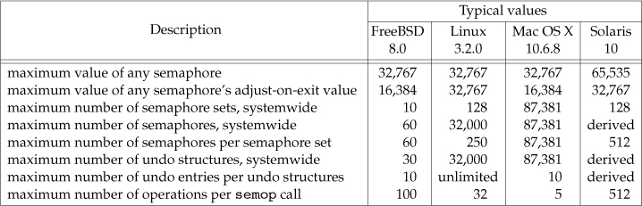

XSI semaphores using:

``` c
#include <sys/sem.h>
/**
 * @brief obtain a semaphore ID
 *
 * * ipc_perm structure is initialized, the mode member depends on perssion bits of flag.
 * * sem_otime is set to 0.
 * * sem_ctime is set to the current time.
 * * sem_nsems is set to the nsems.
 *
 * @param    nsems      the number of semaphores
 *
 * @return   semaphore ID if OK, -1 on error
 */
int semget(key_t key, int nsems, int flag);

/**
 *  @brief catchall for various semaphore operations
 *
 * A union of various command-specific arguments.
 * union semun {
 *    int              val;     // for SETVAL
 *    struct semid_ds *buf;     // for IPC_STAT and IPC_SET
 *    unsigned short  *array;   // for GETALL and SETALL
 * };
 * The optional argument is the actual union, not a pointer to the union.
 *
 * @param   semid   set specified semaphore
 * @param   cmd     specifies one of the following ten commands to be performed
 *                  IPC_STAT    fetch semid_ds structure for this set
 *                  IPC_SET     set the sem_perm.uid,sem_perm.gid, and sem_perm.mode
 *                  IPC_RMID    remove the semaphore from the system.
 *                  GETVAL      return the value of semval for the member semnum;
 *                  SETVAL      set the value of semval for the member semnum.
 *                  GETPID      get the value of sempid
 *                  GETNCNT     return the value of semncnt for the member semnum.
 *                  GETZCNT     return the value of semzcnt for the member semnum.
 *                  GETALL      fetch all the semaphore values in the set.
 *                  SETALL      set all the semaphore values in the set to the values pointed to by arg array.
 * @return   for all the GET commands other than GETALL, see above for details,
 *          otherwise, 0 if OK, -1 on error and set errno
 */
int semctl(int semid, int semnum, int cmd, ... /* union semun arg */);

/**
 * @brief atomically performs an array of operations on a semaphore set
 *
 * struct sembuf {
 *     unsigned short sem_num;  // member # in set (0, 1, ... nsems-1);
 *     short          sem_op;   // operation(negative, 0, or positive);
 *     short          sem_flg;  // IPC_NOWAIT, SEM_UNDO
 * };
 * see following for details
 *
 * @return 0 if OK, -1 on error
 */
int semop(int semid, struct sembuf semoparray[], size_t nops);
```

sem~op~ value effects:

> 1.  The easiest case is when sem~op~ is positive. This case
>     corresponds to the returning of resources by the process. The
>     value of sem~op~ is added to the semaphore's value. If the undo
>     flag is specified, sem~op~ is also subtracted from the semaphore's
>     adjustment value for this process.
>
> 2.  If sem~op~ is negative, we want to obtain resources that the
>     semaphore controls.
>
>     If the semaphore's value is greater than or equal to the absolute
>     value of sem~op~ (the resources are available), the absolute value
>     of sem~op~ is subtracted from the semaphore's value. This
>     guarantees the resulting semaphore value is greater than or equal
>     to 0. If the undo flag is specified, the absolute value of sem~op~
>     is also added to the semaphore's adjustment value for this
>     process.
>
>     If the semaphore's value is less than the absolute value of
>     sem~op~ (the resources are not available), the following
>     conditions apply.
>
>     -   If IPC~NOWAIT~ is specified, semop returns with an error of
>         EAGAIN.
>
>     -   If IPC~NOWAIT~ is not specified, the semncnt value for this
>         semaphore is incremented (since the caller is about to go to
>         sleep), and the calling process is suspended until one of the
>         following occurs.
>
>         -   The semaphore's value becomes greater than or equal to the
>             absolute value of sem~op~ (i.e., some other process has
>             released some resources). The value of semncnt for this
>             semaphore is decremented (since the calling process is
>             done waiting), and the absolute value of sem~op~ is
>             subtracted from the semaphore's value. If the undo flag is
>             specified, the absolute value of sem~op~ is also added to
>             the semaphore's adjustment value for this process.
>
>         -   The semaphore is removed from the system. In this case,
>             the function returns an error of EIDRM.
>
>         -   A signal is caught by the process, and the signal handler
>             returns. In this case, the value of semncnt for this
>             semaphore is decremented (since the calling process is no
>             longer waiting), and the function returns an error of
>             EINTR.
>
> 3.  If sem~op~ is 0, this means that the calling process wants to wait
>     until the semaphore's value becomes 0.
>
>     If the semaphore's value is currently 0, the function returns
>     immediately.
>
>     If the semaphore's value is nonzero, the following conditions
>     apply.
>
>     -   If IPC~NOWAIT~ is specified, return is made with an error of
>         EAGAIN.
>
>     -   If IPC~NOWAIT~ is not specified, the semzcnt value for this
>         semaphore is incremented (since the caller is about to go to
>         sleep), and the calling process is suspended until one of the
>         following occurs.
>
>         -   The semaphore's value becomes 0. The value of semzcnt for
>             this semaphore is decremented (since the calling process
>             is done waiting).
>
>         -   The semaphore is removed from the system. In this case,
>             the function returns an error of EIDRM.
>
>         -   A signal is caught by the process, and the signal handler
>             returns. In this case, the value of semzcnt for this
>             semaphore is decremented (since the calling process is no
>             longer waiting), and the function returns an error of
>             EINTR.

-   Semaphore Adjustment on exit

    using `semctl` with either `SETVAL`{.verbatim} or
    `SETALL`{.verbatim} commands, the adjustment value for that
    semaphore in all processes is set to 0

    -   Example - Timing Comparison of Semaphores, Record Locking, and
        Mutexes

          Operation                 User   System   Clock
          ------------------------- ------ -------- -------
          semaphores with undo      0.50   6.08     7.55
          advisory record locking   0.51   9.06     4.38
          mutex in shared memory    0.21   0.40     0.25

          : Table 27: Figure 15.29 Timing comparison of locking
          alternatives on Linux

        with locking single resource and don\'t need all the features of
        XSI semaphores, record locking is preferable, cause that is much
        simpler to use and system take care of any lingering locks when
        process terminates. unless performance is the primary concerned,
        record locking is still more preferable than mutex (1. easier to
        use, 2. cross-platform support)

###  15.9 Shared Memory {#shared-memory}

Shared memory allows two or more processes to share a given region of
memory. This is the **fastest** form of IPC.

``` c
struct shmid_ds {
        struct ipc_perm shm_per;     // see Section 15.6.2
        size_t          shm_segsz;   // sizeof segment in bytes
        pid_t           shm_lpid;    // pid of last shmop()
        pid_t           shm_cpid;    // pid of creator
        shmatt_t        shm_nattch;  // number of current attaches, shmatt_t is defined to be an unsigned short
        time_t          shm_atime;   // last-attach time
        time_t          shm_dtime;   // last-detach time
        time_t          shm_ctime;   // last-change time
        ...
};
```

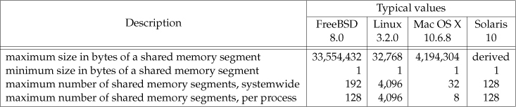

Shared memory API:

``` c
#include <sys/shm.h>
/**
 * @brief      obtain a shared memory identifier
 *
 * @details    the following members of shmid_ds structure are initialized.
 *             * ipc_perm
 *             * shm_lpid,shm_nattch,shm_atime, and shm_dtime are all set to 0
 *             * shm_ctime is set to the current time
 *             * shm_segsz is set to the size requested
 *
 * @param[in]  key    for converting into an identifier
 * @param[in]  size   the size of the shared memory segment in bytes
 * @param[in]  flag   for ipc_perm's permission bits set
 *
 * @return     shared memory ID if OK, -1 on error
 */
int shmget(key_t key, size_t size, int flag);

/**
 * @brief      catchall for various shared memory operations
 *
 * @param[in]  shmid      speicify which shared memory to operate
 * @param[in]  cmd        IPC_STAT    fetch the shmid_ds structure for this segment, storing to buf
 *                        IPC_SET     set the following three fields from buf
 *                                    shm_perm.uid,shm_perm.gid,shm_perm.mode
 *                                    can be only executed by UID == shm_perm.cuid or shm_perm.uid or root
 *                        IPC_RMID    remove the shared memory segment set from the system
 *                                    actually it is attachment count decrease 1
 *                                    be removed until the last process using the segment terminates or detaches it .
 *                                    regardless of whether the segment is still in use
 *                                    can be only executed by UID == shm_perm.cuid or shm_perm.uid or root.
 *                        additional commands for Linux and Solaris only
 *                        SHM_LOCK    lock the shared memory
 *                        SHM_UNLOCK  unlock the shared memory
 * @param[in,out] buf     read or write, depends on cmd specified
 *
 * @return     0 if OK, -1 on error
 */
int shmctl(int shmid, int cmd, struct shmid_ds *buf);

/**
 * @brief      a process attach a existing shared memory segment.
 *
 * @details
 *
 * @param[in]  shmid      specify which shared memory segment to attach
 * @param[in]  addr       is 0, the segment is attached at the first available address selected by the kernel.
 *                        is nonzero and SHM_RND is not specified, the segment is attached at addr
 *                        is nonzero and SHM_RND is specified, attached at (addr - (addr modulus SHMLBA)),
 *                          SHMLBA stands for "low boundary address multiple" and is always a power of 2.
 *                          round the address down to the next multiple of SHMLBA.
 *
 * @return     0 if OK, -1 on error
 */
int shmat(int shmid, const void *addr, int flag);

/**
 * @brief      detach a shared memory segment.
 *
 * @details    this DOES NOT removed the identifier and associated data structure
 *             the identifier remains in existence until removes by calling shmctl with IPC_RMID.
 *
 * @param      addr to detach
 *
 * @return     0 if OK, -1 on error
 */
int shmdt(const void *addr);
```

-   Example

    ::: captioned-content
    ::: caption
    Listing 130: Figure 15.31 Print where various types of data are
    stored
    :::

    ``` c
    /**
     *   @file     15fig31.c
     *   @date     2020-01-10
     *   @author   whiothes <whiothes81@gmail.com>
     *   @version  1.0
     *   @brief    print where various type of data are stored
     *
     *  prints some information on where one particular system
     *  places various types of data.
     *
     */

    #include <sys/shm.h>

    #include "apue.h"

    #define ARRAY_SIZE  40000
    #define MALLOC_SIZE 100000
    #define SHM_SIZE    100000
    #define SHM_MODE    0600  // user read/write


    char array[ARRAY_SIZE];         // uninitialized data = bss

    int main(void) {
        int   shmid;
        char *ptr, *shmptr;

        printf("array[] from %p to %p\n", (void*)&array[0], (void*)&array[ARRAY_SIZE]);
        printf("stack around %p\n", (void*)&shmid);

        if ((ptr = malloc(MALLOC_SIZE)) == NULL) {
            err_sys("malloc errro");
        }
        printf("malloced from %p to %p\n", (void*)ptr, (void*)ptr + MALLOC_SIZE);

        if ((shmid = shmget(IPC_PRIVATE, SHM_SIZE, SHM_MODE)) < 0) {
            err_sys("shmget error");
        }
        if ((shmptr = shmat(shmid, 0 , 0)) == (void*)-1) {
            err_sys("shmat error");
        }
        printf("shared memory attached from %p to %p\n", shmptr, shmptr + SHM_SIZE);

        if (shmctl(shmid, IPC_RMID, 0) < 0) {
            err_sys("shmctl error");
        }

        return 0;
    }
    ```
    :::

> Results on Linux:
>
> array\[\] from 0x602540 to 0x60c180
>
> stack around 0x7ffdaff9121c
>
> malloced from 0xd2c010 to 0xd446b0
>
> shared memory attached from 0x7f40d9097000 to 0x7f40d90af6a0

> Results on Mac OS X
>
> array\[\] from 0x102d40090 to 0x102d49cd0
>
> stack around 0x7ffeecec2438
>
> malloced from 0x102d60000 to 0x102d786a0
>
> shared memory attached from 0x102d7a000 to 0x102d926a0

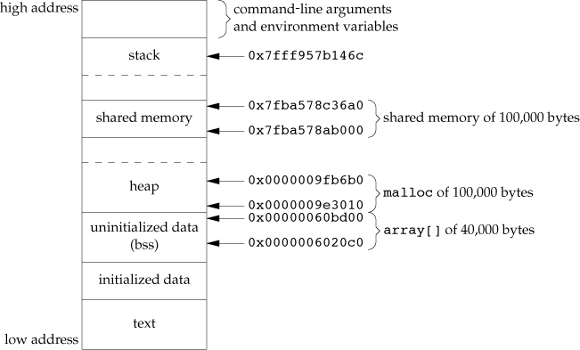

-   Example - Memory Mapping of /dev/zero

    techinque for related processes

    -   An unnamed memory region is created whose size is the second
        argument to mmap, rounded up to the nearest page size on the
        system.

    -   The memory region is initialized to 0.

    -   Multiple processes can share this region if a common ancestor
        specifies the MAP~SHARED~ flag to mmap.

        ::: captioned-content
        ::: caption
        Listing 131: Figure 15.33 IPC between parent and child using
        memory mapped I/O of /dev/zero
        :::

        ``` c
        /**
         *   @file     15fig33.c
         *   @date     2020-01-10
         *   @author   whiothes <whiothes81@gmail.com>
         *   @version  1.0
         *   @brief    IPC between parent and child using memory mapped I/O of /dev/zero
         */
        #include <fcntl.h>
        #include <sys/mman.h>

        #include "apue.h"

        #define NLOOPS 1000
        #define SIZE   sizeof(long)  // size of shared memory area

        static int update(long *ptr) {
            return ((*ptr)++);  // return value before increment
        }

        int main(void) {
            int   fd, i, counter;
            pid_t pid;
            void *area;

            if ((fd = open("/dev/zero", O_RDWR)) < 0) {
                err_sys("open error");
            }
            if ((area = mmap(0, SIZE, PROT_READ | PROT_WRITE, MAP_SHARED, fd, 0)) ==
                MAP_FAILED) {
                err_sys("mmap error");
            }
            close(fd);

            TELL_WAIT();

            if ((pid = fork()) < 0) {
                err_sys("fork error");
            } else if (pid > 0) { /* parent */
                for (i = 0; i < NLOOPS; i += 2) {
                    if ((counter = update((long *)area)) != i) {
                        err_quit("parent: expected %d, got %d", i, counter);
                    }
                    printf("parent: %d\n", counter);
                    TELL_CHILD(pid);
                    WAIT_CHILD();
                }
            } else { /* child */
                for (i = 1; i < NLOOPS + 1; i += 2) {
                    WAIT_PARENT();

                    if ((counter = update((long *)area)) != i)
                        err_quit("child: expected %d, got %d", i, counter);

                    printf("child: %d\n", counter);
                    TELL_PARENT(getppid());
                }
            }
        }
        ```
        :::

-   Example - Anonymous Memory Mapping

    To use this facility, specify `MAP_ANONYMOUS`{.verbatim}
    (`MAP_ANON`{.verbatim} deprecated on Linux) flag to `mmap` and
    specify the fd to -1.

    ::: captioned-content
    ::: caption
    Listing 132: modify [Figure 15.33](Chapter15/15fig33.c::/**) to use this facility
    :::

    ``` c
    /**
     *   @file     15fig33a.c
     *   @date     2020-01-10
     *   @author   whiothes <whiothes81@gmail.com>
     *   @version  1.0
     *   @brief    IPC between parent and child using memory mapped I/O of /dev/zero
     *            use anoynymous facility
     */
    #include <fcntl.h>
    #include <sys/mman.h>

    #include "apue.h"

    #define NLOOPS 1000
    #define SIZE   sizeof(long)  // size of shared memory area

    static int update(long *ptr) {
        return ((*ptr)++);  // return value before increment
    }

    int main(void) {
        int   fd, i, counter;
        pid_t pid;
        void *area;

        // if ((fd = open("/dev/zero", O_RDWR)) < 0) {
        //     err_sys("open error");
        // }
        fd = -1;

        // if ((area = mmap(0, SIZE, PROT_READ | PROT_WRITE, MAP_SHARED, fd, 0)) ==
        // MAP_FAILED) {
        if ((area = mmap(0, SIZE, PROT_READ | PROT_WRITE, MAP_ANON | MAP_SHARED, fd,
                         0)) == MAP_FAILED) {
            err_sys("mmap error");
        }
        // close(fd);

        TELL_WAIT();

        if ((pid = fork()) < 0) {
            err_sys("fork error");
        } else if (pid > 0) { /* parent */
            for (i = 0; i < NLOOPS; i += 2) {
                if ((counter = update((long *)area)) != i)
                    err_quit("parent: expected %d, got %d", i, counter);

                TELL_CHILD(pid);
                WAIT_CHILD();
            }
        } else { /* child */
            for (i = 1; i < NLOOPS + 1; i += 2) {
                WAIT_PARENT();

                if ((counter = update((long *)area)) != i)
                    err_quit("child: expected %d, got %d", i, counter);

                TELL_PARENT(getppid());
            }
        }
    }
    ```
    :::

###  15.10 POSIX Semaphores {#posix-semaphores}

The POSIX semaphore mechanism is one of three IPC mechanisms that
originated with the real-time extensions to POSIX.1.

The POSIX semaphore interfaces were meant to address several
deficiencies with the XSI semaphore interfaces:

-   The POSIX semaphore interfaces allow for higher-performance
    implementations compared to XSI semaphores.
-   The POSIX semaphore interfaces are simpler to use: no semaphore
    sets, and several of the interfaces are patterned after familiar
    file system operations.
-   The POSIX semaphores behave more gracefully when removed.

APIs:

``` c
#include <semaphore.h>
/**
 * @brief      create a new named semaphore or use an existing one
 *
 * @return     Pointer to semaphore if OK, SEM_FAILED on error
 *
 * @note       To promote portability
 * * The first character in the name should be a slash
 * * The name should contain no other slashes to avoid implementation-defined
 * behavior.
 * * The maximum length of the semaphore name is implementation defined.
 */
sem_t *sem_open(const char *name, int oflag,
                ... /* mode_t mode, unsigned int value */);

/**
 * @brief      release any resources associated with the semaphore
 *
 * @return     0 if OK, -1 on error
 */
int sem_close(sem_t *sem);

/**
 * @brief      remove the name of the semaphore.
 *
 * @return     0 if OK, -1 on error
 */
int sem_unlink(const char *name);

/**
 * @brief      decrement the value of a semaphore
 *
 * @return     0 if OK, -1 on error
 * @note       avoids blocking if the semaphore count is 0
 */
int sem_trywait(sem_t *sem);
/**
 * @brief      decrement the value of a semaphore
 *
 * @return     0 if OK, -1 on error
 * @note       blocks if the semaphore count is 0.
 */
int sem_wait(sem_t *sem);

/**
 * @brief      block for a bounded amount of time
 *
 * @return     0 if OK, -1 on error
 */
#include <time.h>
int sem_timedwait(sem_t *restrict sem, const struct timespec *restrict tsptr);

/**
 * @brief      increment the value of a semaphore
 *
 * @return     0 if OK, -1 on error
 */
int sem_post(sem_t *sem);

/**
 * @brief      create an unnamed semaphore
 *
 * @return     0 if OK, -1 on error
 */
int sem_init(sem_t *sem, int pshared, unsigned int value);

/**
 * @brief      discard an unnamed semaphore
 *
 * @return     0 if OK, -1 on error
 */
int sem_destroy(sem_t *sem);

/**
 * @brief      retrieve the value of a semaphore
 *
 * @return     0 if OK, -1 on error
 */
int sem_getvalue(sem_t *restrict sem, int *restrict valp);
```

-   Example

    

    ::: captioned-content
    ::: caption
    Listing 133: Figure 15.35 Mutual exclusion using a POSIX semaphore
    :::

    ``` c
    /**
     *   @file     15fig35.c
     *   @date     2020-01-11
     *   @author   whiothes <whiothes81@gmail.com>
     *   @version  1.0
     *   @brief    Mutual exclusion using a POSIX semaphore
     */
    #include <errno.h>
    #include <stdio.h>
    #include <stdlib.h>
    #include <unistd.h>

    #include "slock.h"

    struct slock *s_alloc() {
        struct slock *sp;
        static int    cnt;

        if ((sp = malloc(sizeof(struct slock))) == NULL) {
            return NULL;
        }

        do {
            snprintf(sp->name, sizeof(sp->name), "/%ld.%d", (long)getpid(), cnt++);
            sp->semp = sem_open(sp->name, O_CREAT | O_EXCL, S_IRWXU, 1);
        } while ((sp->semp == SEM_FAILED) && (errno == EEXIST));
        if (sp->semp == SEM_FAILED) {
            free(sp);
            return NULL;
        }

        sem_unlink(sp->name);
        return sp;
    }

    void s_free(struct slock *sp) {
        sem_close(sp->semp);
        free(sp);
    }

    int s_lock(struct slock *sp) { return sem_wait(sp->semp); }

    int s_trylock(struct slock *sp) { return sem_trywait(sp->semp); }

    int s_unlock(struct slock *sp) { return sem_post(sp->semp); }
    ```
    :::

###  15.11 Client-Server Properties {#client-server-properties}

**A child cannot pass a descriptor back to the parent (unless special
programming techniques are used, which we cover in Chapter 17).**

Message queue(Either of these two techniques using message queue can be
implemented using shared memory and a synchronization method) :

1.  A single queue can be used between the srever and all the clients,
    using the type field of each mesage to indicate the message
    recipient.
2.  Alternatively, an individual message queue can be used for each
    client.

###  15.12 Summary {#summary-14}

-   Exercises

    -   15.1 pager program blocks

        ``` c
        /**
         *   @file     15ex01.c
         *   @date     2020-01-04
         *   @author   whiothes <whiothes81@gmail.com>
         *   @version  1.0
         *   @brief    copy file to pager program
         */

        #include <sys/wait.h>

        #include "apue.h"

        extern char *__progname;

        #define DEF_PAGER "/bin/more"  // default pager program

        int main(int argc, char *argv[]) {
            int   n;
            int   fd[2];
            pid_t pid;
            char *pager, *argv0;
            char  line[MAXLINE];
            FILE *fp;

            if (argc != 2) {
                err_quit("usage: %s <pathname>", __progname);
            }

            if ((fp = fopen(argv[1], "r")) == NULL) {
                err_sys("can't open %s", argv[1]);
            }
            if (pipe(fd) < 0) {
                err_sys("pipe error");
            }

            if ((pid = fork()) < 0) {
                err_sys("fork error");

            } else if (pid == 0) {
                // child
                close(fd[1]);
                // close write end

                if (fd[0] != STDIN_FILENO) {
                    if (dup2(fd[0], STDIN_FILENO) != STDIN_FILENO) {
                        err_sys("dup2 error");
                    }
                    close(fd[0]);
                }

                if ((pager = getenv("PAGER")) == NULL) {
                    pager = DEF_PAGER;
                }

                if ((argv0 = strchr(pager, '/')) != NULL) {
                    argv0++;
                } else {
                    argv0 = pager;
                }

                if (execl(pager, argv0, (char *)0) < 0) {
                    err_sys("execl error for %s", pager);
                }

            } else {
                // parent
                close(fd[0]);  // close read end

                while (fgets(line, sizeof(line), fp) != NULL) {
                    n = strlen(line);
                    if (write(fd[1], line, n) != n) {
                        err_sys("write to pipe error");
                    }
                }
                if (ferror(fp)) {
                    err_sys("fgets error");
                }

                // close(fd[1]);
                if (waitpid(pid, NULL, 0) < 0) {
                    err_sys("waitpid error");
                }
                exit(0);
            }
        }
        ```

    -   15.2

        > The parent terminates right after writing the last line to the
        > pipe. The read end of the pipe is automatically closed when
        > the parent terminates. But the parent is probably running
        > ahead of the child by one pipe buffer, since the child (the
        > pager program) is waiting for us to look at a page of output.
        > If we're running a shell, such as the Korn shell, with
        > interactive command-line editing enabled, the shell probably
        > changes the terminal mode when our parent terminates and the
        > shell prints a prompt. This undoubtedly interferes with the
        > pager program, which has also modified the terminal mode.
        > (Most pager programs set the terminal to noncanonical mode
        > when awaiting input to proceed to the next page.)

        ``` c
        /**
         *   @file     15ex02.c
         *   @date     2020-01-04
         *   @author   whiothes <whiothes81@gmail.com>
         *   @version  1.0
         *   @brief    copy file to pager program
         */

        #include <sys/wait.h>

        #include "apue.h"

        extern char *__progname;

        #define DEF_PAGER "/bin/more"  // default pager program

        int main(int argc, char *argv[]) {
            int   n;
            int   fd[2];
            pid_t pid;
            char *pager, *argv0;
            char  line[MAXLINE];
            FILE *fp;

            if (argc != 2) {
                err_quit("usage: %s <pathname>", __progname);
            }

            if ((fp = fopen(argv[1], "r")) == NULL) {
                err_sys("can't open %s", argv[1]);
            }
            if (pipe(fd) < 0) {
                err_sys("pipe error");
            }

            if ((pid = fork()) < 0) {
                err_sys("fork error");

            } else if (pid == 0) {
                // child
                close(fd[1]);
                // close write end

                if (fd[0] != STDIN_FILENO) {
                    if (dup2(fd[0], STDIN_FILENO) != STDIN_FILENO) {
                        err_sys("dup2 error");
                    }
                    close(fd[0]);
                }

                if ((pager = getenv("PAGER")) == NULL) {
                    pager = DEF_PAGER;
                }

                if ((argv0 = strchr(pager, '/')) != NULL) {
                    argv0++;
                } else {
                    argv0 = pager;
                }

                if (execl(pager, argv0, (char *)0) < 0) {
                    err_sys("execl error for %s", pager);
                }

            } else {
                // parent
                close(fd[0]);  // close read end

                while (fgets(line, sizeof(line), fp) != NULL) {
                    n = strlen(line);
                    if (write(fd[1], line, n) != n) {
                        err_sys("write to pipe error");
                    }
                }
                if (ferror(fp)) {
                    err_sys("fgets error");
                }

                close(fd[1]);
                // if (waitpid(pid, NULL, 0) < 0) {
                //     err_sys("waitpid error");
                // }
                exit(0);
            }
        }
        ```

    -   15.3 cannot execute the non-existent command

        ``` c
        /**
         *   @file     15ex03.c
         *   @date     2020-01-15
         *   @author   whiothes <whiothes81@gmail.com>
         *   @version  1.0
         *   @brief    test popen for non-existent command
         */

        #include "apue.h"


        int main() {
            FILE *pret = NULL;
            if ((pret = popen("./a.out", "r")) == NULL) {
                perror("popen");
            }
        }
        ```

        sh: ./a.out: No such file or directory

        > pclose returns the termination status of the command as it is
        > returned by waitpid.

    -   15.4

        > When the parent terminates, look at its termination status
        > with the shell. For the Bourne shell, Bourne-again shell, and
        > Korn shell, the command is echo \$?. The number printed is 128
        > plus the signal number.

        ```{=org}
        #+results: 
        ```
        ➜ echo \$? 141

    -   15.5

        ``` c
        /**
         *   @file     15ex05.c
         *   @date     2020-01-08
         *   @author   whiothes <whiothes81@gmail.com>
         *   @version  1.0
         *   @brief    Program to drive the add2 filter
         *          use standard I/O library instead
         */

        #include "apue.h"

        static void sig_pipe(int);  // our signal handler

        int main(void) {
            int   n, fd1[2], fd2[2];
            FILE *fpr, *fpw;
            pid_t pid;
            char  line[MAXLINE];

            if (signal(SIGPIPE, sig_pipe) == SIG_ERR) {
                err_sys("signal error");
            }
            if (pipe(fd1) < 0 || pipe(fd2) < 0) {
                err_sys("pipe error");
            }

            if ((fpr = fdopen(fd2[0], "r")) == NULL) {
                err_sys("fdopen error");
            }
            if (setvbuf(fpr, NULL, _IOLBF, 0) < 0) {
                err_sys("setvbuf error");
            }
            if ((fpw = fdopen(fd1[1], "w")) == NULL) {
                err_sys("fdopen error");
            }
            if (setvbuf(fpw, NULL, _IOLBF, 0) < 0) {
                err_sys("setvbuf error");
            }

            if ((pid = fork()) < 0) {
                err_sys("fork error");
            } else if (pid > 0) {
                // parent process
                close(fd1[0]);
                close(fd2[1]);

                while (fgets(line, MAXLINE, stdin) != NULL) {
                    n = strlen(line);
        #if 0
                    if (write(fd1[1], line, n) != n) {
                        err_sys("write error");
                    }
                    if ((n = read(fd2[0], line, MAXLINE)) < 0) {
                        err_sys("read error");
                    }
                    if (n == 0) {
                        err_msg("child closed pipe");
                        break;
                    }
        #endif
                    if (fputs(line, fpw) == EOF) {
                        err_sys("fputs error");
                    }
                    if (fgets(line, MAXLINE, fpr) == NULL) {
                        err_msg("fgets error");
                        break;
                    }
                    line[n] = 0;
                    if (fputs(line, stdout) == EOF) {
                        err_sys("fputs error");
                    }
                }

                if (ferror(stdin)) {
                    err_sys("fgets error on stdin");
                }

                exit(EXIT_SUCCESS);
            } else {
                // child process
                close(fd1[1]);
                close(fd2[0]);

                if (fd1[0] != STDIN_FILENO) {
                    if (dup2(fd1[0], STDIN_FILENO) < 0) {
                        err_sys("dup2 error to stdin");
                    }
                    close(fd1[0]);
                }

                if (fd2[1] != STDOUT_FILENO) {
                    if (dup2(fd2[1], STDOUT_FILENO) < 0) {
                        err_sys("dup2 error to stdout");
                    }
                    close(fd2[1]);
                }

                // if (execl("../bin/15fig17", "15fig17", (char*)0) < 0) {
                if (execl("../bin/15fig19", "15fig19", (char *)0) < 0) {
                    err_sys("excel error");
                }
                exit(EXIT_SUCCESS);
            }
        }

        static void sig_pipe(int signo) {
            printf("SIGPIPE caught\n");
            exit(EXIT_FAILURE);
        }
        ```

    -   15.6

        The wait function catch the child that popen function generated
        because we can\'t distinguish which is the child we want.

        > The system function calls wait, and the first child to
        > terminate is the child generated by popen. Since that's not
        > the child that system created, it calls wait again and blocks
        > until the sleep is done. Then system returns. When pclose
        > calls wait, an error is returned, since there are no more
        > children to wait for. Then pclose returns an error.

    -   15.7

        ``` c
        /**
         *   @file     15ex07.c
         *   @date     2020-01-15
         *   @author   whiothes <whiothes81@gmail.com>
         *   @version  1.0
         *   @brief    select/poll a pipe
         */

        #include <sys/poll.h>
        #include <sys/select.h>

        #include "apue.h"

        void test_select_closew() {
            int            fd[2];
            fd_set         rfds;
            struct timeval tv;
            int            ret;
            pid_t          pid;

            puts("test select: close write end");

            if (pipe(fd) < 0) {
                err_sys("pipe error");
            }

            FD_ZERO(&rfds);
            FD_SET(fd[0], &rfds);

            if ((pid = fork()) < 0) {
                err_sys("fork error");
            } else if (pid == 0) {
                sleep(5);
                close(fd[1]);
                printf("child: write end closed");
                exit(EXIT_SUCCESS);
            } else {
                for (;;) {
                    tv.tv_sec  = 1;
                    tv.tv_usec = 0;

                    write(fd[1], "hello, world\n", 13);
                    ret = select(fd[0] + 1, &rfds, NULL, NULL, &tv);
                    if (ret == -1) {
                        err_sys("select error");
                    } else if (ret > 0) {
                        printf("data ready\n");
                    } else {
                        printf("time expired\n");
                    }
                }
                waitpid(pid, NULL, 0);
                exit(EXIT_SUCCESS);
            }
        }

        void test_select_closer() {
            int            fd[2];
            fd_set         rfds;
            struct timeval tv;
            int            ret;
            pid_t          pid;

            puts("test select: close read end");

            if (pipe(fd) < 0) {
                err_sys("pipe error");
            }

            FD_ZERO(&rfds);
            FD_SET(fd[0], &rfds);

            if ((pid = fork()) < 0) {
                err_sys("fork error");
            } else if (pid == 0) {
                write(fd[1], "hello, world\n", 13);
                sleep(5);
                close(fd[0]);
                printf("child: read end closed");
                exit(EXIT_SUCCESS);
            } else {
                for (;;) {
                    tv.tv_sec  = 1;
                    tv.tv_usec = 0;

                    ret = select(fd[0] + 1, &rfds, NULL, NULL, &tv);
                    if (ret == -1) {
                        err_sys("select error");
                    } else if (ret > 0) {
                        printf("\rdata ready\n");
                        if (FD_ISSET(fd[0], &rfds)) {
                            char buff[MAXLINE] = {0};
                            read(fd[0], buff, MAXLINE);
                            printf("data read: %s", buff);
                            write(fd[1], buff, strlen(buff));
                        }
                    } else {
                        printf("time expired\n");
                    }
                }
                waitpid(pid, NULL, 0);
                exit(EXIT_SUCCESS);
            }
        }

        void test_poll() {}

        int main() { test_select_closer(); }
        ```

        The answer gives the following table about various behaviors on
        different systems, but when I test, it seems different

          Operation                                          FreeBSD 8.0   Linux 3.2.0   Mac OS X 10.6.8   Solaris
          -------------------------------------------------- ------------- ------------- ----------------- ---------
          select on read end of pipe with write end closed   R/W/E         R             R/W               R/W/E
          poll on read end of pipe with write end closed     R/HUP         HUP           INV               HUP
          select on write end of pipe with read end closed   R/W/E         R/W           R/W               R/W
          poll on write end of pipe with read end closed     R/HUP         W/ERR         INV               HUP

          : Table 28: Figure C.19 Pipe behavior with select and poll

          Operation                                          Linux 3.2.0   Mac OS X 10.6.8
          -------------------------------------------------- ------------- -----------------
          select on read end of pipe with write end closed   R/W           R/W
          select on write end of pipe with read end closed   HUP           HUP

          : Table 29: tested answer

    -   15.8

        parent\'s standard error appears.

    -   15.9

        `fork`, then `exec`, `waitpid`, `exit`

        > The popen function forks a child, and the child executes the
        > shell. The shell in turn calls fork, and the child of the
        > shell executes the command string. When cmdstring terminates,
        > the shell is waiting for this to happen. The shell then exits,
        > which is what the waitpid in pclose is waiting for.

    -   15.10 open twice, and using O~NONBLOCK~ for reading mode

        ``` c
        /**
         *   @file     15ex10.c
         *   @date     2020-01-17
         *   @author   whiothes <whiothes81@gmail.com>
         *   @version  1.0
         *   @brief    read and write a FIFO
         */
        #include <fcntl.h>

        #include "apue.h"

        #define TMPFIFO "/tmp/tmp.fifo"

        int main() {
            int fr, fw;

            if (mkfifo(TMPFIFO, FILE_MODE) < 0) {
                err_sys("mkfifo error");
            }

            if ((fr = open(TMPFIFO, O_RDONLY | O_NONBLOCK)) < 0) {
                // non-block for avoiding deadlock
                err_sys("open error");
            }

            if ((fw = open(TMPFIFO, O_WRONLY)) < 0) {
                err_sys("open error");
            }

            clr_fl(fr, O_NONBLOCK);
        }
        ```

    -   15.11

        > The identifier of the message queue. The queue would have to
        > allow the appropriate level of access (probably world-read,
        > for a random malicious process). It would interfere with the
        > running of the server/clients though, because each would
        > probably be expecting messages to exist on the queue that
        > aren\'t there.

    -   15.12

        ``` c
        /**
         *   @file     15ex12.c
         *   @date     2020-01-17
         *   @author   whiothes <whiothes81@gmail.com>
         *   @version  1.0
         *   @brief    practice a message queue
         */

        #include <sys/ipc.h>
        #include <sys/msg.h>
        #include <sys/types.h>

        #include "apue.h"

        #define MSG_KEY 5
        #define MSG_LEN 32

        typedef struct {
            long mtype;
            char mtext[MSG_LEN];
        } msgbuf;

        int main() {
            int    msqid;
            msgbuf msg = {0};

            for (int i = 0; i < 5; ++i) {
                if ((msqid = msgget(MSG_KEY, IPC_CREAT)) == -1) {
                    err_msg("msgget error");
                } else {
                    printf("id: %d\n", msqid);
                    msgctl(msqid, IPC_RMID, NULL);
                }
            }

            getchar();

            for (int i = 0; i < 5; ++i) {
                if ((msqid = msgget(IPC_PRIVATE, IPC_CREAT | 0600)) == -1) {
                    err_msg("msgget error");
                }

                msg.mtype = 1;
                snprintf(msg.mtext, MSG_LEN, "hello world");

                int msgsz = strlen(msg.mtext);
                if ((msgsnd(msqid, &msg, msgsz, 0)) == -1) {
                    perror("msgsnd error: ");
                }

                memset(msg.mtext, 0, MSG_LEN);
                if (msgrcv(msqid, &msg, MSG_LEN, 0, 0) == -1) {
                    perror("msgrcv error: ");
                }

                printf("mtext: %s\n", msg.mtext);
            }

            return 0;
        }
        ```

    -   15.13 The actual addresses are different for different
        processes, so we need to store offsets instead.

        > We never store actual addresses in a shared memory segment,
        > since it's possible for the server and all the clients to
        > attach the segment at different addresses. Instead, when a
        > linked list is built in a shared memory segment, the list
        > pointers should be stored as offsets to other objects in the
        > shared memory segment. These offsets are formed by subtracting
        > the start of the shared memory segment from the actual address
        > of the object.

    -   15.14

        

    -   15.15

        ``` c
        /**
         *   @file     15ex15.c
         *   @date     2020-02-03
         *   @author   whiothes <whiothes81@gmail.com>
         *   @version  1.0
         *   @brief    Redo the 15fig33 using XSI shared memory functions
         */

        #include <fcntl.h>
        #include <sys/ipc.h>
        #include <sys/shm.h>

        #include "apue.h"

        #define NLOOPS 10
        #define SIZE   sizeof(long)  // size of shared memory area

        static int update(long *ptr) {
            return ((*ptr)++);  // return value before increment
        }

        int main(void) {
            int   i, counter, shmid;
            pid_t pid;
            long *area;
            key_t key;

            if ((key = ftok("/dev/zero", 1)) < 0) {
                err_sys("ftok error");
            }

            TELL_WAIT();

            if ((pid = fork()) < 0) {
                err_sys("fork error");
            } else if (pid > 0) {
                if ((shmid = shmget(key, sizeof(long), IPC_EXCL | IPC_CREAT | 0600)) <
                    0) {
                    err_sys("shmget error");
                }

                area = shmat(shmid, NULL, IPC_NOWAIT);
                if (area == NULL) {
                    err_sys("shmat error");
                }
                for (i = 0; i < NLOOPS; i += 2) {
                    if ((counter = update((long *)area)) != i) {
                        err_quit("parent: expected %d, got %d", i, counter);
                    }
                    printf("parent: %d\n", counter);
                    TELL_CHILD(pid);
                    WAIT_CHILD();
                }
            } else {
                if ((shmid = shmget(key, sizeof(long), IPC_CREAT | 0600)) < 0) {
                    err_sys("shmget error");
                }

                area = shmat(shmid, NULL, IPC_NOWAIT);
                if (area == NULL) {
                    err_sys("shmat error");
                }

                /* child */
                for (i = 1; i < NLOOPS + 1; i += 2) {
                    WAIT_PARENT();

                    if ((counter = update((long *)area)) != i)
                        err_quit("child: expected %d, got %d", i, counter);

                    printf("child: %d\n", counter);
                    TELL_PARENT(getppid());
                }
            }

            shmctl(shmid, IPC_RMID, 0);

            TELL_WAIT();
        }
        ```

    -   15.16 it\'s not shared memory

        ``` c
        /**
         *   @file     15ex16.c
         *   @date     2020-02-03
         *   @author   whiothes <whiothes81@gmail.com>
         *   @version  1.0
         *   @brief    Redo the 15fig33 using XSI semaphore functions
         */

        #include <sys/ipc.h>
        #include <sys/sem.h>
        #include <sys/types.h>

        #include "apue.h"

        #define NLOOPS 10
        #define SIZE   sizeof(long)  // size of shared memory area

        #if defined(__linux__)
        union semun {
            int              val;   /* Value for SETVAL */
            struct semid_ds *buf;   /* Buffer for IPC_STAT, IPC_SET */
            unsigned short * array; /* Array for GETALL, SETALL */
            struct seminfo * __buf; /* Buffer for IPC_INFO
                                       (Linux-specific) */
        };
        #endif

        static int update(int *ptr) {
            int ret = (*ptr)++;
            printf("%d: area: %d, counter = %d\n", getpid(), *ptr, ret);
            return ret;  // return value before increment
        }

        static void sem_doit(int semid, short op) {
            struct sembuf sbuf[1];
            int           ret;

            sbuf[0].sem_num = 0;
            sbuf[0].sem_op  = op;
            sbuf[0].sem_flg = SEM_UNDO;

            if (semop(semid, sbuf, 1) < 0) {
                perror("semop: ");
                exit(EXIT_FAILURE);
            }
        }

        static void _P(int semid) { sem_doit(semid, -1); }
        static void _V(int semid) { sem_doit(semid, 1); }

        static int sem_set(int *semid) {
            key_t       key;
            union semun un;

            if ((key = ftok("/dev/zero", 1)) < 0) {
                err_sys("ftok error");
            }
            if ((*semid = semget(key, 1, IPC_EXCL | IPC_CREAT | 0600)) < 0) {
                err_sys("semget error");
            }

            un.val = 1;
            if (semctl(*semid, 0, SETVAL, un) == -1) {
                err_sys("semctl error");
            }

            return *semid;
        }

        static int sem_rm(int semid) { return semctl(semid, IPC_RMID, 0); }

        int semid;

        void exit_func(void) { sem_rm(semid); }

        int main() {
            int   i, counter;
            pid_t pid;
            int   area;

            sem_set(&semid);
            atexit(exit_func);

            TELL_WAIT();

        #if 1
            if ((pid = fork()) < 0) {
                err_sys("fork error");
            } else if (pid > 0) {
                for (i = 0; i < NLOOPS; i += 2) {
                    _P(semid);

                    area += 2;
                    if (area - 2 != i) {
                        err_sys("parent excepted %d got %d", i, area - 2);
                    }
                    printf("parent: <%p> %d\n", &area, area - 2);

                    _V(semid); /* +1 */
                    TELL_CHILD(pid);
                    WAIT_CHILD();
                }

            } else {
                /* child */
                area = 1;
                for (i = 1; i < NLOOPS + 1; i += 2) {
                    WAIT_PARENT();
                    _P(semid); /* -1 */

                    area += 2;
                    if (area - 2 != i) {
                        err_sys("parent excepted %d got %d", i, area - 2);
                    }
                    printf("child: <%p> %d\n", &area, area - 2);

                    _V(semid); /* +1 */
                    TELL_PARENT(getppid());
                }
            }
        #endif
        }
        ```

    -   15.17 it\'s not shared memory

        ``` c
        /**
         *   @file     15ex17.c
         *   @date     2020-02-03
         *   @author   whiothes <whiothes81@gmail.com>
         *   @version  1.0
         *   @brief    Redo the 15fig33 using advisory record lock
         */

        #include <fcntl.h>

        #include "apue.h"

        #define NLOOPS 10
        #define SIZE   sizeof(long)  // size of shared memory area

        #if defined(__linux__)
        union semun {
            int              val;   /* Value for SETVAL */
            struct semid_ds *buf;   /* Buffer for IPC_STAT, IPC_SET */
            unsigned short * array; /* Array for GETALL, SETALL */
            struct seminfo * __buf; /* Buffer for IPC_INFO
                                       (Linux-specific) */
        };
        #endif

        static int update(int *ptr) {
            int ret = (*ptr)++;
            printf("%d: area: %d, counter = %d\n", getpid(), *ptr, ret);
            return ret;  // return value before increment
        }

        int main() {
            int   i, counter;
            pid_t pid;
            int   area;
            int   fd;

            fd = open("/dev/zero", O_RDONLY);

            TELL_WAIT();

        #if 1
            if ((pid = fork()) < 0) {
                err_sys("fork error");
            } else if (pid > 0) {
                for (i = 0; i < NLOOPS; i += 2) {
                    flock(fd, LOCK_SH);

                    area += 2;
                    if (area - 2 != i) {
                        err_sys("parent excepted %d got %d", i, area - 2);
                    }
                    printf("parent: <%p> %d\n", &area, area - 2);

                    flock(fd, LOCK_UN);

                    TELL_CHILD(pid);
                    WAIT_CHILD();
                }

            } else {
                /* child */
                area = 1;
                for (i = 1; i < NLOOPS + 1; i += 2) {
                    WAIT_PARENT();

                    flock(fd, LOCK_SH);

                    area += 2;
                    if (area - 2 != i) {
                        err_sys("parent excepted %d got %d", i, area - 2);
                    }
                    printf("child: <%p> %d\n", &area, area - 2);

                    flock(fd, LOCK_UN);

                    TELL_PARENT(getppid());
                }
            }
        #endif
        }
        ```

    -   15.18 it\'s not shared memory

        ``` c
        /**
         *   @file     15ex18.c
         *   @date     2020-02-03
         *   @author   whiothes <whiothes81@gmail.com>
         *   @version  1.0
         *   @brief    Redo the 15fig33 using POSIX semaphore functions
         */

        #include <errno.h>
        #include <fcntl.h>
        #include <semaphore.h>

        #include "apue.h"
        #include "slock.h"

        #define NLOOPS 10
        #define SIZE   sizeof(long)  // size of shared memory area

        static int update(int *ptr) {
            int ret = (*ptr)++;
            printf("%d: area: %d, counter = %d\n", getpid(), *ptr, ret);
            return ret;  // return value before increment
        }

        struct slock *sp = NULL;

        void exit_func(void) { s_free(sp); }

        int main() {
            int   i, counter;
            pid_t pid;
            int   area;

            atexit(exit_func);

            sp = s_alloc();

            TELL_WAIT();

        #if 1
            if ((pid = fork()) < 0) {
                err_sys("fork error");
            } else if (pid > 0) {
                for (i = 0; i < NLOOPS; i += 2) {
                    s_lock(sp);

                    area += 2;
                    if (area - 2 != i) {
                        err_sys("parent excepted %d got %d", i, area - 2);
                    }
                    printf("parent: <%p> %d\n", &area, area - 2);

                    s_unlock(sp);
                    TELL_CHILD(pid);
                    WAIT_CHILD();
                }

            } else {
                /* child */
                area = 1;
                for (i = 1; i < NLOOPS + 1; i += 2) {
                    WAIT_PARENT();
                    s_lock(sp);

                    area += 2;
                    if (area - 2 != i) {
                        err_sys("parent excepted %d got %d", i, area - 2);
                    }
                    printf("child: <%p> %d\n", &area, area - 2);

                    s_unlock(sp);
                    TELL_PARENT(getppid());
                }
            }
        #endif
        }

        struct slock *s_alloc() {
            struct slock *sp;
            static int    cnt;

            if ((sp = malloc(sizeof(struct slock))) == NULL) return (NULL);
            do {
                snprintf(sp->name, sizeof(sp->name), "/%ld.%d", (long)getpid(), cnt++);
                sp->semp = sem_open(sp->name, O_CREAT | O_EXCL, 0666, 1);
            } while ((sp->semp == SEM_FAILED) && (errno == EEXIST));
            if (sp->semp == SEM_FAILED) {
                free(sp);
                return (NULL);
            }
            sem_unlink(sp->name);
            return (sp);
        }

        void s_free(struct slock *sp) {
            sem_close(sp->semp);
            free(sp);
        }

        int s_lock(struct slock *sp) { return sem_wait(sp->semp); }

        int s_trylock(struct slock *sp) { return sem_trywait(sp->semp); }

        int s_unlock(struct slock *sp) { return sem_post(sp->semp); }
        ```

##  Chapter 16. Network IPC: Sockets \[9/9\] {#chapter-16.-network-ipc-sockets-99}

###  16.1 Introduction {#introduction-15}

**only an overview of the socket API**

###  16.2 Socket Descriptors {#socket-descriptors}

``` c
#include <sys/socket..h>

/**
 *  @brief create socket
 *
 *  @param domain   determines the nature of the communication, includes the
 *                  address format
 *  @param type     determines the type of the socket, which further determine
 *                  the communication characteristics
 *  @param protocol usually 0, to select the default protocol for the given
 *                  domain and socket type. but can select a particular protocol
 *
 *  @return file (socket) descriptor if OK, -1 on error
 */
int socket(int domain, int type, int protocol);

/**
 *  @brief diasable I/O on a socket
 *  @param sockfd     socket's return value
 *  @param how        SHUT_RD,   reading is disabled
 *                    SHUT_WR,   writing is disabled
 *                    SHUT_RDWR, disable both data transmission and reception
 *  @return 0 if OK, -1 on error
 */
int shutdown(int sockfd, int how);
```

  Domain       Description
  ------------ --------------------------------------------
  AF~INET~     IPv4 Internet domain
  AF~INET6~    IPv6 Internet domain (optional in POSIX.1)
  AF~UNIX~     UNIX domain
  AF~UNSPEC~   unspecified

  : Table 30: Figure 16.1 Socket communication domains

  Type              Description
  ----------------- ----------------------------------------------------------------------
  SOCK~DGRAM~       fix-length, connectionless, unreliable messages
  SOCK~RAW~         datagram interface to IP (optional in POSIX.1)
  SOCK~SEQPACKET~   fix-length, sequenced, reliable, connection-oriented message
  SOCK~STREAMS~     sequenced, reliable, bidirectional, connection-oriented byte streams

  : Table 31: Figure 16.2 Socket types

  Protocol        Description
  --------------- -----------------------------------------------
  IPPROTO~IP~     IPv4 Internet Protocol
  IPPROTO~IPV6~   IPv6 Internet Protocol (optional in POSIX.1)
  IPPROTO~ICMP~   Internet Control message Protocol
  IPPROTO~RAW~    Raw IP packets protocol (optional in POSIX.1)
  IPPROTO~TCP~    Transmission Control Protocol
  IPPROTO~UDP~    User Datagram Protocol

  : Table 32: Figure 16.3 Protocols defined for Internet domain socks

A `SOCK_SEQPACKET`{.verbatim} is just like a `SOCK_STREAM`{.verbatim}
socket except that we get a message-based service instead of a
byte-stream service.

  Function                                        Behavior with socket
  ----------------------------------------------- --------------------------------------------------------------------------------------------------------------------------------
  close(Section 3.3)                              deallocates the socket
  dup, dup2(Section 3.12)                         duplicates the file descriptor as normal
  fchdir (Section 4.23)                           fails with errno set to ENOTDIR
  fchmod (Section 4.9)                            unspecified
  fchown (Section 4.11)                           implementation defined
  fcntl (Section 3.14)                            some commands supported, including F~DUPFD~, F~DUPFDCLOEXEC~, F~GETFD~, F~GETFL~, F~GETOWN~, F~SETFD~, F~SETFL~, and F~SETOWN~
  fdatasync, fsync (Section 3.13)                 implementation defined
  fstat (Section 4.2)                             some status structure members supported, but left up to the implementation
  ftruncate (Section 4.13)                        unspecified
  ioctl (Section 3.15)                            some commands work, depending on underlying device driver
  lseek (Section 3.6)                             implementation defined (usually fails with errno set to ESPIPE)
  mmap (Section 14.8)                             unspecified
  poll (Section 14.4.2)                           works as expected
  pread and pwrite (Section 3.11)                 fails with errno set to ESPIPE
  read (Section 3.7) and readv (Section 14.6)     equivalent to recv (Section 16.5) without any flags
  select (Section 14.4.1)                         works as expected
  write (Section 3.8) and writev (Section 14.6)   equivalent to send (Section 16.5) without any flags

  : Table 33: Figure 16.4 How file descriptor functions act with sockets

###  16.3 Addressing \[4/4\] {#addressing-44}

1.   16.3.1 Byte Ordering

    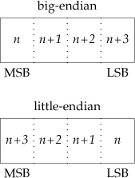

      Operating system   Processor architecture   Byte order
      ------------------ ------------------------ ---------------
      FreeBSD 8.0        Intel Pentium            little-endian
      Linux 3.2.0        Intel Core i5            little-endian
      Mac OS X 10.6.8    Intel Core 2 Duo         little-endian
      Solaris 10         Sun SPARC                big-endian

      : Table 34: Figure 16.6 Byte order for test platforms

    ``` c
    /**
     * functions to convert between the processor byte order
     * and the network byte order for TCP/IP applications
     */

    #include <arpa/inet.h>

    /// @return 32-bit integer in network byte order
    uint32_t htonl(uint32_t hostint32);

    /// @return 16-bit integer in network byte order
    uint16_t htons(uint16_t hostint16);

    /// @return 32-bit integer in host byte order
    uint32_t ntohl(uint32_t netint32);

    /// @return 16-bit integer in host byte order
    uint16_t ntohs(uint16_t netint16);
    ```

2.   16.3.2 Address Formats

    ``` c
    // generic sockaddr address structure
    struct sockaddr {
            sa_family_t sa_family;  // address family
            char        sa_data[];  // variable-length address
            ...  // free to add more members and define a size for the sa_data member
    };

    // on Linux
    struct sockaddr {
            sa_family_t sa_family;
            char        sa_data[14];
    };

    // on FreeBSD
    struct sockaddr {
            unsigned char sa_len;       // total length
            sa_family_t   sa_family;    // address family
            char          sa_data[14];  // variable-length address
    };
    ```

    Internet addresses

    ``` c
    #include <netinet/in.h>

    // #include <stdint.h> defined uintxx_t
    typedef uint16_t in_port_t;
    typedef uint32_t in_addr_t;

    // In the IPv4 Internet domain (AF_INET),
    // a socket address is represented by a sockaddr_in structure

    struct in_addr {
            in_addr_t s_addr;  // IPv4 address
    };

    struct sockaddr_in {
            sa_family_t    sin_family;  // address family
            in_port_t      sin_port;    // port number
            struct in_addr sin_addr;    // IPv4 address
    };

    // In the IPv6 Internet domain (AF_INET6)
    // represented by a sockaddr_in6 structure
    struct in6_addr {
            uint8_t s6_addr[16];  // IPv6 address
    };

    struct sockaddr_in6 {
            sa_family_t     sin6_family;    // address family
            in_port_t       sin6_port;      // port number
            uint32_t        sin6_flowinfo;  // traffic class and flow info
            struct in6_addr sin6_addr;      // IPv6 address
            uint32_t        sin6_scope_id;  // set of interfaces for scope
    };

    // on Linux
    struct sockaddr_in {
            sa_family_t    sin_family;   // address family
            in_port_t      sin_port;     // port number
            struct in_addr sin_addr;     // IPv4 address
            unsigned char  sin_zero[8];  // filler
    };
    ```

    convert between the binary address format and a string in
    dotted-decimal notation.

    ``` c
    #include <arpa/inet.h>

    /**
     * @param  domain    AF_INET/AF_INET6 only
     *
     * @return pointer to address string on success, NULL on error
     */
    const char *inet_ntop(int domain, const void *restrict addr, char *restrict str,
                          socklen_t size);

    /**
     * @brief string addr to binary
     *
     * @param  domain   AF_INET/AF_INET6 only
     *
     * @return 1 on success, 0 if the format is invalid, or -1 on error
     */
    int inet_pton(int domain, const char *restrict str, void *restrict addr);
    ```

3.   16.3.3 Address Lookup

    get hosts

    ``` c
    #include <netdb.h>

    /**
     *  @brief get hosts
     *
     *  @return pointer if OK, NULL on error
     */
    struct hostent* gethostent(void);

    void sethostent(int stayopen);

    void endhostent(void);

    struct hostent {
            char*  h_name;       // name of host
            char** h_aliases;    // pointer to alternate host name array
            int    h_addrtype;   // address type
            int    h_length;     // length in bytes of address
            char** h_addr_list;  // pointer to array of network addresses
            ...
    };

    #include <netdb.h>
    /**
     *  @brief get network info
     *
     *  a set of interfaces
     *
     *  @return pointer if OK, NULL on error
     */
    struct netent* getnetbyaddr(uint32_t net, int type);
    struct netent* getnetbyname(const char* name);
    struct netent* getnetent(void);

    void setnetent(int stayopen);
    void endnetent(void);

    struct netent {
            char*    n_name;      // network name
            char**   n_aliases;   // alternate network name array pointer
            int      n_addrtype;  // address type
            uint32_t n_net;       // network number
            ...
    };

    #include <netdb.h>
    /**
     * @brief      map between protol names and numbers
     *
     * @return     pointer if OK, NULL on error
     */
    struct protoent* getprotobyname(const char* name);
    struct protoent* getprotobynumber(int proto);
    struct protoent* getprotoent(void);

    void setprotoent(int stayopen);
    void endprotoent(void);

    struct protoent {
            char*  p_name;     // protocol name
            char** p_aliases;  // pointer to alternate protocol name array
            int    p_proto;    // proto number
            ...
    };

    #include <netdb.h>
    /**
     * @brief      a set of services' interfaces
     *
     *
     * @return     pointer if OK, NULL on error
     */
    struct servent* getservbyname(const char* name, const char* proto);
    struct servent* getservbyport(int port, const char* proto);
    struct servent* getservent(void);

    void setservent(int stayopen);
    void endservent(void);

    struct servent {
            char*  s_name;     // service name
            char** s_aliases;  // pointer to alternate srevice name array
            int    s_port;     // port number
            char*  s_proto;    // name of proto
            ...
    };

    #include <netdb.h>
    #include <sys/socket.h>
    /**
     * @brief      get address info
     *
     * @return     0 if OK, nonzero error code on error
     */

    int getaddrinfo(const char* restrict host, const char* restrict service,
                    const struct addrinfo* restrict hint,
                    struct addrinfo** restrict      res);

    void freeaddrinfo(struct addrinfo* ai);

    /**
     * @brief      convert the error code into error message
     *
     * @details    can't use perror or strerror to generate an error message
     * but, need to call gai_strerror instead
     *
     * @param      error code returned by getaddrinfo
     *
     * @return     a pointer to a string describing the error
     */
    const char* gai_strerror(int error);

    struct addrinfo {
            int              ai_flags;      // customize behavior
            int              ai_family;     // address family
            int              ai_socktype;   // socket type
            int              ai_protocol;   // protocol
            socklen_t        ai_addrlen;    // length in bytes of address
            struct sockaddr* ai_addr;       // address
            char*            ai_canonname;  // canonical name of host
            struct addrinfo* ai_next;       // next in list
            ...
    };

    /**
     * @brief      convert an address into host and service name
     *
     * @return     0 if OK, nonzero on error
     */
    #include <netdb.h>
    #include <sys/socket.h>

    int getnameinfo(const struct sockaddr* restrict addr, socklen_t alen,
                    char* restrict host, socklen_t hostlen, char* restrict service,
                    socklen_t servlen, int flags);
    ```

      Flags             Description
      ----------------- --------------------------------------------------------------------------------
      AI~ADDRCONFIG~    Query for whichever address type (IPv4 or IPv6) is configured.
      AI~ALL~           Look for both IPv4 and IPv6 addresses (used only with AI~V4MAPPED~).
      AI~CANONNAME~     Request a canonical name (as opposed to an alias).
      AI~NUMERICHOST~   The host address is specified in numeric format; don\'t try to translate it.
      AI~NUMERICSERV~   The service is specified as a numeric port number, don\'t try to translate it.
      AI~PASSIVE~       Socket address is intended to be bound for listening.
      AI~V4MAPPED~      If no IPv6 addreses are found, return IPv4 addresses mapped in IPv6 format.

      : Table 35: Figure 16.7 Flags for addrinfo structure

      Flags              Description
      ------------------ -----------------------------------------------------------------------------------------
      NI~DGRAM~          The service is datagram based instead of stream based.
      NI~NAMEREQD~       If the host name can\'t be found, treat this as an error.
      NI~NOFQDN~         Return only the node name portion of the fulling qualified domain name for local hosts.
      NI~NUMERICHOST~    Return the numeric form of the host address instead of the name.
      NI~NUMERICSCOPE~   For IPv6, return the numeric form of the scope ID instead of the name.
      NI~NUMERICSERV~    Return the numeric form of the service address (i.e., the port number)

      : Table 36: Figure 16.8 Flags for the \~getnameinfo \~function

    ::: captioned-content
    ::: caption
    Listing 134: Figure 16.9 Print host and service information
    :::

    ``` c
    /**
     *   @file     16fig09.c
     *   @date     2020-01-22
     *   @author   whiothes <whiothes81@gmail.com>
     *   @version  1.0
     *   @brief    Print host and service info
     */
    #include "apue.h"

    #if defined(SOLARIS)
    #include <netinet/in.h>
    #endif
    #include <arpa/inet.h>
    #include <netdb.h>
    #if defined(BSD)
    #include <netinet/in.h>
    #include <sys/socket.h>
    #endif

    void print_family(struct addrinfo *aip) {
        printf(" family ");
        switch (aip->ai_family) {
        case AF_INET:   printf("inet");        break;
        case AF_INET6:  printf("inet6");       break;
        case AF_UNIX:   printf("unix");        break;
        case AF_UNSPEC: printf("unspecified"); break;
        default:        printf("unknown");     break;
        }
    }

    void print_type(struct addrinfo *aip) {
        printf(" type ");
        switch (aip->ai_socktype) {
        case SOCK_STREAM:    printf("stream");                         break;
        case SOCK_DGRAM:     printf("datagram");                       break;
        case SOCK_SEQPACKET: printf("seqpacket");                      break;
        case SOCK_RAW:       printf("raw");                            break;
        default:             printf("unknown (%d)", aip->ai_socktype); break;
        }
    }

    void print_protocol(struct addrinfo *aip) {
        printf(" protocol ");
        switch (aip->ai_protocol) {
        case 0:           printf("default");                        break;
        case IPPROTO_TCP: printf("TCP");                            break;
        case IPPROTO_UDP: printf("UDP");                            break;
        case IPPROTO_RAW: printf("raw");                            break;
        default:          printf("unknown (%d)", aip->ai_protocol); break;
        }
    }

    void print_flags(struct addrinfo *aip) {
        printf("flags:");
        if (aip->ai_flags == 0) {
            printf(" 0");
        } else {
            if (aip->ai_flags & AI_PASSIVE) {
                printf(" passive");
            }
            if (aip->ai_flags & AI_CANONNAME) {
                printf(" canonname");
            }
            if (aip->ai_flags & AI_NUMERICHOST) {
                printf(" numerichost");
            }
            if (aip->ai_flags & AI_NUMERICSERV) {
                printf(" numericserv");
            }
            if (aip->ai_flags & AI_V4MAPPED) {
                printf(" v4mapped");
            }
            if (aip->ai_flags & AI_ALL) {
                printf(" all");
            }
        }
    }


    int main(int argc, char *argv[]) {
        struct addrinfo *    ailist, *aip;
        struct addrinfo      hint;
        struct sockaddr_in * sinp;
        struct sockaddr_in6 *sinp6;
        const char *         addr;
        int                  err;
        char                 abuf[INET_ADDRSTRLEN];
        char                 abuf6[INET6_ADDRSTRLEN];

        if (argc != 3) {
            err_quit("usage: %s nodename(host) service", argv[0]);
        }
        hint.ai_flags     = AI_CANONNAME;
        hint.ai_family    = 0;
        hint.ai_socktype  = 0;
        hint.ai_protocol  = 0;
        hint.ai_addrlen   = 0;
        hint.ai_canonname = NULL;
        hint.ai_addr      = NULL;
        hint.ai_next      = NULL;

        if ((err = getaddrinfo(argv[1], argv[2], &hint, &ailist)) != 0) {
            err_quit("getaddrinfo error: %s", gai_strerror(err));
        }

        for (aip = ailist; aip != NULL; aip = aip->ai_next) {
            print_flags(aip);
            print_family(aip);
            print_type(aip);
            print_protocol(aip);
            printf("\n\thost %s", aip->ai_canonname ? aip->ai_canonname : "-");
            if (aip->ai_family == AF_INET) {
                sinp = (struct sockaddr_in *)aip->ai_addr;
                addr = inet_ntop(AF_INET, &sinp->sin_addr, abuf, INET_ADDRSTRLEN);
                printf(" address %s", addr ? addr : "unknown");
                printf(" port %d", ntohs(sinp->sin_port));
            } else if (aip->ai_family == AF_INET6) {
                sinp6 = (struct sockaddr_in6 *)aip->ai_addr;
                addr =
                    inet_ntop(AF_INET6, &sinp6->sin6_addr, abuf6, INET6_ADDRSTRLEN);
                printf(" address %s", addr ? addr : "unknown");
                printf(" port %d", ntohs(sinp6->sin6_port));
            }
            printf("\n");
        }
    }
    ```
    :::

4.   16.3.4 Associating Addresses with Sockets

    ``` c
    #include <sys/socket.h>

    /**
     * @brief      associate an address with a socket
     *
     * @param      addr     restrictions:
     *                      * The address we specify must be valid for the
     * machine on which the process is running; we can't specify an address
     * belonging to some other machine
     *                      * The address must match the format supported by the
     * address family we used to create the socket
     *                      * The port number in the address cannot be less than
     * 1024 unless the process has the appropriate privilege
     *                      * Usually, ony one socket endpoint can be bound to a
     * given address, although some protocols allow duplicate bindings.
     *
     * @return     0 if OK, -1 on error
     */
    int bind(int sockfd, const struct sockaaddr *addr, socklen_t len);

    /**
     * @brief      discover the address bound to a socket
     *
     * @return     0 if OK, -1 on error
     */
    int getsockname(int sockfd, struct sockaddr *restrict addr,
                    socklen_t *restrict alenp);

    /**
     * @brief      find out the peer's address
     *
     * @return     0 if OK, -1 on error
     */
    int getpeername(int sockfd, struct sockaddr *restrict addr,
                    socklen_t *restrict alenp);
    ```

###  16.4 Connection Establishment {#connection-establishment}

``` c
#include <sys/socket.h>

/**
 * @brief      create a connection
 *
 * @return     0 if OK, -1 on error
 */
int connect(int sockfd, const struct sockaddr *addr, socklen_t len);
```

-   Example

    ::: captioned-content
    ::: caption
    Listing 135: Figure 16.10 Connect with retry
    :::

    ``` c
    /**
     *   @file     16fig10.c
     *   @date     2020-01-22
     *   @author   whiothes <whiothes81@gmail.com>
     *   @version  1.0
     *   @brief    connect with retry
     */
    #include <sys/socket.h>

    #include "apue.h"
    #define MAXSLEEP 128

    int connect_retry(int sockfd, const struct sockaddr *addr, socklen_t alen) {
        int numsec;

        // Try to connect with exponential backoff.
        for (numsec = 1; numsec <= MAXSLEEP; numsec <<= 1) {
            if (connect(sockfd, addr, alen) == 0) {
                return 0;
            }

            if (numsec <= MAXSLEEP / 2) {
                sleep(numsec);
            }
        }

        return -1;
    }
    ```
    :::

    ::: captioned-content
    ::: caption
    Listing 136: Figure 16.11 Portable connect with retry
    :::

    ``` c
    /**
     *   @file     16fig11.c
     *   @date     2020-01-22
     *   @author   whiothes <whiothes81@gmail.com>
     *   @version  1.0
     *   @brief    portable connect with retry
     */

    #include <sys/socket.h>

    #include "apue.h"

    #define MAXSLEEP 128

    int connect_retry(int domain, int type, int protocol,
                      const struct sockaddr *addr, socklen_t alen) {
        int numsec, fd;

        // Try to connect with expotential backoff.
        for (numsec = 1; numsec <= MAXSLEEP; numsec <<= 1) {
            if ((fd = socket(domain, type, protocol)) < 0) {
                return -1;
            }

            if (connect(fd, addr, alen) == 0) {
                // connection accepted
                return fd;
            }
            close(fd);

            // delay before trying again.
            if (numsec <= MAXSLEEP / 2) {
                sleep(numsec);
            }
        }

        return -1;
    }
    ```
    :::

``` c
#include <sys/socket.h>

/**
 * @brief      be willing to accept connect requests
 *
 * @param      backlog    a hint to the system regarding the number of
 *                        outstanding connect requests that it should
 *                        enqueue on behalf of the process.
 *                        is determined by the system,
 *                        upper limit SOMAXCONN
 *
 * @return     0 if OK, -1 on error
 */
int listen(int sockfd, int backlog);

/**
 * @brief      retrieve a connect request and convert it into a connection
 *
 * @details
 *
 * @param      addr       set to NULL when don't care, otherwise, set a buffer
 *                        large enough to hold the address will be returned
 * @param      len        set to NULL when don't care, otherwise, set a integer
 *                        pointed by len and to the size of the buffer.
 *
 * @return     file (socket) descriptor if OK, -1 on error
 */
int accept(int sockfd, struct sockaddr *restrict addr, socklen_t *restrict len);
```

-   Example

    ::: captioned-content
    ::: caption
    Listing 137: Figure 16.12 Initialize a socket endpoint for use by a
    server
    :::

    ``` c
    /**
     *   @file     16fig12.c
     *   @date     2020-01-22
     *   @author   whiothes <whiothes81@gmail.com>
     *   @version  1.0
     *   @brief    initialize a socket endpoint for use by a server
     */

    #include <errno.h>
    #include <sys/socket.h>

    #include "apue.h"

    int initserver(int type, const struct sockaddr *addr, socklen_t alen,
                   int qlen) {
        int fd;
        int err = 0;

        if ((fd = socket(addr->sa_family, type, 0)) < 0) {
            return -1;
        }
        if (bind(fd, addr, alen) < 0) {
            goto errout;
        }
        if (type == SOCK_STREAM || type == SOCK_SEQPACKET) {
            if (listen(fd, qlen) < 0) {
                goto errout;
            }
        }

        return fd;

    errout:
        err = errno;
        close(fd);
        errno = err;
        return -1;
    }
    ```
    :::

###  16.5 Data Transfer {#data-transfer}

``` c
#include <sys/socket.h>

/**
 * @brief      similar to send
 *
 * @details    allows us to specify flags to change how the data we want to
 * transmit is treated
 *
 * @param      flags        see below
 *
 * @return     number of bytes sent if OK, -1 on error
 */
ssize_t send(int sockfd, const void *buf, size_t nbytes, int flags);

/**
 * @brief      similar to send
 *
 * @details    allows us to specify a destination address to be used with
 * connectionless sockets
 *
 * @return     number of bytes sent if OK, -1 on error
 */
ssize_t sendto(int sockfd, const void *buf, size_t nytes, int flags,
               const struct sockaddr *destaddr, socklen_t destlen);

/**
 * @brief      similar to writev
 *
 * @details    send multiple buffers
 *
 * @param      msghdr       specify multiple buffers from which to transmit data
 *
 * @return     number of bytes sent if OK, -1 on error
 */
struct msghdr {
        void *        msg_name;        // optional address
        socklen_t     msg_namelen;     // address size in bytes
        struct iovec *msg_iov;         // array of I/O buffers
        int           msg_iovlen;      // number of elements in array
        void *        msg_control;     // ancillary data
        socklen_t     msg_controllen;  // number of ancillary bytes
        int           msg_flags;       // flags for received message
        ...
};
ssize_t sendmsg(int sockfd, const struct msghdr *msg, int flags);
```

  ---------------- ------------------------------------------------------------------- --------- --------- ------- ---------- ---------
  Flags            Description                                                         POSIX.1   FreeBSD   Linux   Mac OS X   Solaris
                                                                                                 8.0       3.2.0   10.6.8     10
  MSG~CONFIRM~     Provide feedback to the link layer to keep address mapping valid                        \*                 
  MSG~DONTROUTE~   Don\'t route packet outside of local network                                  \*        \*      \*         \*
  MSG~DONTWAIT~    Enable nonblocking operation (equivalent to using O~NONBLOCK~)                \*        \*      \*         \*
  MSG~EOF~         Shut the sender side of the socket down after sending data                    \*                \*         
  MSG~EOR~         Mark the end of the record if supported by protocol                 \*        \*        \*      \*         \*
  MSG~MORE~        Delay sending the packet to allow more data to be written                               \*                 
  MSG~NOSIGNAL~    Don\'t generate SIGPIPE when writing to an unconnected socket       \*        \*        \*                 
  MSG~OOB~         Send out-of-band data if supported by protocol (see Section 16.7)   \*        \*        \*      \*         \*
  ---------------- ------------------------------------------------------------------- --------- --------- ------- ---------- ---------

  : Table 37: Figure 16.13 Flags used with `send` socket calls

``` c
#include <sys/socket.h>

/**
 * @brief      similar to send, but fetch data
 *
 * @return     length of message in bytes, 0 if no messages are available and
 *             peer has done an olderly shutdown or -1 on error
 */
ssize_t recv(int sockfd, void *buf, size_t nbytes, int flags);

/**
 * @brief      similar to sendto, but fetch data
 *
 * @return     length of message in bytes, 0 if no messages are available and
 *             peer has done an olderly shutdown or -1 on error
 */
ssize_t recvfrom(int sockfd, void *restrict buf, size_t len, int flags,
                 struct sockaddr *restrict addr, socklen_t *restrict addrlen);

/**
 * @brief      similar to sendmsg, but fetch data
 *
 * @param      flags    see below
 *
 * @return     length of message in bytes, 0 if no messages are available and
 *             peer has done an olderly shutdown or -1 on error
 */
ssize_t recvmsg(int sockfd, struct msghdr *msg, int flags);
```

  Flag               Description                                     POSIX.1   FreeBSD 8.0   Linux 3.2.0   Mac OS X 10.6.8   Solaris
  ------------------ ----------------------------------------------- --------- ------------- ------------- ----------------- ---------
  MSG~CMSGCLOEXEC~   Set the close-on-exec flag for file                                     \*                              
                     descriptors received over a                                                                             
                     UNIX domain socket                                                                                      
                     (see Section 17.4)                                                                                      
  MSG~DONTWAIT~      Enable nonblocking operation                              \*            \*                              \*
                     (equivalent to using `O_NONBLOCK`{.verbatim})                                                           
  MSG~ERRQUEUE~      Receive error information as                                            \*                              
                     ancillary data                                                                                          
  MSG~OOB~           Retrieve out-of-band data if                    \*        \*            \*            \*                \*
                     supported by protocol                                                                                   
                     (see Section 16.7)                                                                                      
  MSG~PEEK~          Return pack contents without                    \*        \*            \*            \*                \*
                     consuming the packet                                                                                    
  MSG~TRUNC~         Request that the real length of                                         \*                              
                     the packet be returned, even if                                                                         
                     it was truncated                                                                                        
  MSG~WAITALL~       Wait until all data is available                \*        \*            \*            \*                \*
                     (SOCK~STREM~ only)                                                                                      

  : Table 38: Figure 16.13 Flags used with recv socket calls

  Flags           Description                                        POSIX.1   FreeBSD 8.0   Linux 3.2.0   Mac OS X 10.6.8   Solaris 10
  --------------- -------------------------------------------------- --------- ------------- ------------- ----------------- ------------
  MSG~CTRUNC~     Control data was truncated                         \*        \*            \*            \*                \*
  MSG~EOR~        End of record was received                         \*        \*            \*            \*                \*
  MSG~ERRQUEUE~   Error information was received as ancillary data                           \*                              
  MSG~OOB~        Out-of-band data was received                      \*        \*            \*            \*                \*
  MSG~TRUNC~      Normal data was truncated                          \*        \*            \*            \*                \*

  : Table 39: Figure 16.15 Flags returned in msg~flags~ by recvmsg

-   Example -- Connection-Oriented Client

    ::: captioned-content
    ::: caption
    Listing 138: Figure 16.16 Client command to get uptime from server
    :::

    ``` c
    /**
     *   @file     16fig16.c
     *   @date     2020-01-22
     *   @author   whiothes <whiothes81@gmail.com>
     *   @version  1.0
     *   @brief    client command to get uptime from server
     */

    #include <errno.h>
    #include <netdb.h>
    #include <sys/socket.h>

    #include "apue.h"

    #define BUFLEN 128

    extern int connect_retry(int, int, int, const struct sockaddr *, socklen_t);

    void print_uptime(int sockfd) {
        int  n;
        char buf[BUFLEN];

        while ((n = recv(sockfd, buf, BUFLEN, 0)) > 0) {
            write(STDOUT_FILENO, buf, n);
        }

        if (n < 0) {
            err_sys("recv error");
        }
    }

    int main(int argc, char *argv[]) {
        struct addrinfo *ailist, *aip;
        struct addrinfo  hint;
        int              sockfd, err;

        if (argc != 2) {
            err_quit("usage: ruptime hostname", argv[0]);
        }

        memset(&hint, 0, sizeof(hint));
        hint.ai_socktype  = SOCK_STREAM;
        hint.ai_canonname = NULL;
        hint.ai_addr      = NULL;
        hint.ai_next      = NULL;

        if ((err = getaddrinfo(argv[1], "4000", &hint, &ailist)) != 0) {
            err_quit("getaddrinfo error: %s", gai_strerror(err));
        }
        for (aip = ailist; aip != NULL; aip = aip->ai_next) {
            if ((sockfd = connect_retry(aip->ai_family, SOCK_STREAM, 0,
                                        aip->ai_addr, aip->ai_addrlen)) < 0) {
                err = errno;
            } else {
                print_uptime(sockfd);
                exit(0);
            }
        }

        err_exit(err, "can't connect to %s", argv[1]);
    }
    ```
    :::

-   Example -- Connection-Oriented Server

    ::: captioned-content
    ::: caption
    Listing 139: Figure 16.17 Server program to provide system uptime
    :::

    ``` c
    /**
     *   @file     16fig17.c
     *   @date     2020-01-22
     *   @author   whiothes <whiothes81@gmail.com>
     *   @version  1.0
     *   @brief    server program to provide system uptime
     */

    #include <errno.h>
    #include <netdb.h>
    #include <sys/socket.h>
    #include <syslog.h>

    #include "apue.h"

    #define BUFLEN 128
    #define QLEN   10

    #ifndef HOST_NAME_MAX
    #define HOST_NAME_MAX 256
    #endif /* HOST_NAME_MAX */

    extern int initserver(int, const struct sockaddr *, socklen_t, int);

    void serve(int sockfd) {
        int   clfd;
        FILE *fp;
        char  buf[BUFLEN];

        set_cloexec(sockfd);
        for (;;) {
            if ((clfd = accept(sockfd, NULL, NULL)) < 0) {
                syslog(LOG_ERR, "ruptimed: accept error: %s", strerror(errno));
                exit(EXIT_FAILURE);
            }

            set_cloexec(clfd);

            if ((fp = popen("/usr/bin/uptime", "r")) == NULL) {
                sprintf(buf, "error: %s\n", strerror(errno));
                send(clfd, buf, strlen(buf), 0);
            } else {
                while (fgets(buf, BUFLEN, fp) != NULL) {
                    send(clfd, buf, strlen(buf), 0);
                }
                pclose(fp);
            }
            close(clfd);
        }
    }

    int main(int argc, char *argv[]) {
        struct addrinfo *ailist, *aip;
        struct addrinfo  hint;
        int              sockfd, err, n;
        char            *host;

        if (argc != 1) {
            err_quit("usage: ruptimed");
        }
        if ((n = sysconf(_SC_HOST_NAME_MAX)) < 0) {
            n = HOST_NAME_MAX;
        }
        if ((host = malloc(n)) == NULL) {
            err_sys("malloc error");
        }
        if (gethostname(host, n) < 0) {
            err_sys("gethostname error");
        } else {
            printf("hostname: %s\n", host);
        }

        daemonize("ruptimed");

        memset(&hint, 0, sizeof(hint));
        hint.ai_flags     = AI_CANONNAME;
        hint.ai_socktype  = SOCK_STREAM;
        hint.ai_canonname = NULL;
        hint.ai_addr      = NULL;
        hint.ai_next      = NULL;
        if ((err = getaddrinfo(host, "4000", &hint, &ailist)) != 0) {
            syslog(LOG_ERR, "ruptimed: getaddrinfo error: %s", gai_strerror(err));
            exit(EXIT_FAILURE);
        }

        for (aip = ailist; aip; aip = aip->ai_next) {
            if ((sockfd = initserver(SOCK_STREAM, aip->ai_addr, aip->ai_addrlen,
                                     QLEN)) >= 0) {
                serve(sockfd);
                exit(EXIT_SUCCESS);
            }
        }

        exit(EXIT_SUCCESS);
    }
    ```
    :::

-   Example -- Alternative Connection-Oriented Server

    ```{=org}
    #+caption: Figure 16.18 Server program illustrating command writing directly to socket
    ```

###  16.6 Socket Options {#socket-options}

> three kinds of options:
>
> 1.  Generic options that work with all socket types.
> 2.  Options that are managed at the socket leve, but depend on the
>     underlying protocols for support
> 3.  Protocol-specific options unique to each individual protocol

``` c

#include <sys/socket.h>

/**
 * @brief      set a socket option
 *
 * @param      option     see below
 *
 * @return     0 if OK, -1 on error
 */
int setsockopt(int sockfd, int level, int option, const void *val,
               socklen_t len);

/**
 * @brief      get a socket option
 *
 * @param      option     see below
 *
 * @return     0 if OK, -1 on error
 */
int getsockopt(int sockfd, int level, int option, void *val,
               socklen_t *restrict lenp);
```

  Option           Type of val argument   Description
  ---------------- ---------------------- ----------------------------------------------------------------------
  SO~ACCEPTCONN~   int                    Return whether a socket is enabled for listening (getsockopt only).
  SO~BROADCAST~    int                    Broadcast datagrams if \*val is nonzero.
  SO~DEBUG~        int                    Debugging in network drivers enabled if \*val is nonzero.
  SO~DONTROUTE~    int                    Bypass normal routing if \*val is nonzero.
  SO~ERROR~        int                    Return and clear pending socket eror (getsockopt only).
  SO~KEEPALIVE~    int                    Periordic keep-alive messages enabled if \*val is nonzero.
  SO~LINGER~       struct linger          Delay time when unsent messages exist and socket is closed.
  SO~OOBINLINE~    int                    Out-of-band data placed inline with normal data if \*val is nonzero.
  SO~RCVBUF~       int                    The size in bytes of the receive buffer.
  SO~RCVLOWAT~     int                    The minimum amount of data in bytes to return on a receive call.
  SO~RCVTIMEO~     struct timeval         The timeout value for a socket receive call.
  SO~REUSEADDR~    int                    Reuse addresses in bind if \*val is nonzero.
  SO~SNDBUF~       int                    The size in bytes of the send buffre.
  SO~SNDLOWAT~     int                    The minium amount of data in bytes to transmit in a send call.
  SO~SNDTIMEO~     struct timeval         The timeout value for a socket send call.
  SO~TYPE~         int                    Identify the socket type (getsockopt only).

  : Table 40: Figure 16.21 Socket options

-   Example

    ::: captioned-content
    ::: caption
    Listing 140: Figure 16.22 Initialize a socket endpoint for use by a
    server with address reuse
    :::

    ``` c
    /**
     *   @file     16fig22.c
     *   @date     2020-01-23
     *   @author   whiothes <whiothes81@gmail.com>
     *   @version  1.0
     *   @brief    initialize a socket endpoint for use by a server
     *              with address reuse
     */

    #include <errno.h>
    #include <sys/socket.h>

    #include "apue.h"

    int initserver(int type, const struct sockaddr *addr, socklen_t alen,
                   int qlen) {
        int fd, err;
        int reuse;

        if ((fd = socket(addr->sa_family, type, 0)) < 0) {
            return -1;
        }

        if (setsockopt(fd, SOL_SOCKET, SO_REUSEADDR, &reuse, sizeof(int)) < 0) {
            goto errout;
        }

        if (bind(fd, addr, alen) < 0) {
            goto errout;
        }

        if (type == SOCK_STREAM || type == SOCK_SEQPACKET) {
            if (listen(fd, qlen) < 0) {
                goto errout;
            }
        }

        return fd;

    errout:
        err = errno;
        close(fd);
        errno = err;
        return -1;
    }
    ```
    :::

###  16.7 Out-of-Band Data {#out-of-band-data}

allowing higher-priority delivery of data than normal. is sent ahead of
any data that is already queued for transmission.

TCP refers to out-of-band data as \"urgent\" data. TCP supports only a
single byte of urgent data, but allows urgent data to be delivered out
of band from the normal data delivery mechanisms. specify
`MSG_OOB`{.verbatim} flag to `send` functions. with more than one byte
with `MSG_OOB`{.verbatim} flag, the last byte will be treated as the
urgent-data byte.

sent `SIGURG`{.verbatim} signal when urgent data is received and we have
arranged for signal generation by the socket.

receive signals from a socket by calling

``` c
/**
 * @brief      receive signals from a socket
 *
 * @details
 *
 * @param      F_SETOWN   be used to retrieve the current socket ownership
 * @parm       pid        a positive value represents a process ID
 */
int pid = fcntl(sockfd, F_GETOWN, 0);
fcntl(sockfd, F_SETOWN, pid);
```

*urgent mark*: the point in the normal data stream where the urgent data
would go.

receive the urgent data inline with the normal data:
`SO_OOBINLINE`{.verbatim}

identify when we have reached the urgent mark

``` c
#include <sys/socket.h>

/**
 * @brief      identify the urgent mark
 *
 * @return     1 if at mark, 0 if not at mark, -1 on error
 */
int sockatmark(int sockfd);
```

###  16.8 Nonblocking and Asynchronous I/O {#nonblocking-and-asynchronous-io}

normally, I/O functions will block when it is not immediately available.

when the socket is in nonblocking mode, these function failes instead of
blocking, setting `errno`{.verbatim} to either `EWOULDBLOCK`{.verbatim}
or `EAGAIN`{.verbatim}. we can use either `poll` or `select` to
determine when we can receive or transmit data.

with socket-based asynchronous I/O, sent `SIGIO`{.verbatim} signal when
it\'s available.

Enabling asynchronous I/O:

1.  Establish socket ownership so signals can be delivered to the proper
    progresses.

    -   Use the `F_SETOWN`{.verbatim} command with `fcntl`.

    -   Use the `FIOSETOWN`{.verbatim} command with `ioctl`.

    -   Use the `SIOCSPGRP`{.verbatim} command with `ioctl`.

2.  Inform the socket that we want it to signal us when I/O operations
    won\'t block.

    -   Use the `F_SETFL`{.verbatim} command with `fcntl` and enable the
        `O_ASYNC`{.verbatim} file flag.

    -   Use the `FIOASYNC`{.verbatim} command with `ioctl`.

  Mechanism                   POSIX.1     FreeBSD 8.0   Linux 3.2.0   Mac OS X 10.6.8   Solaris 10   
  --------------------------- ----------- ------------- ------------- ----------------- ------------ --
  fcntl(fd, F~SETOWN~, pid)   \*          \*            \*            \*                \*           
  ioctl(fd, FIOSETOWN, pid)               \*            \*            \*                \*           
  ioctl(fd, SIOCSPGRP, pid)               \*            \*            \*                \*           
  fcntl(fd, F~SETFL~, flags   O~ASYNC~)                 \*            \*                \*           
  ioctl(fd, FIOASYNC, &n);                \*            \*            \*                \*           

  : Table 41: Figure 16.23 Socket asynchronous I/O management commands

###  16.9 Summary {#summary-15}

-   Example

    -   16.1 see below

        ``` cpp
        /**
         *   @file     16ex01.c
         *   @date     2020-01-23
         *   @author   whiothes <whiothes81@gmail.com>
         *   @version  1.0
         *   @brief    determine system's byte ordering
         */

        #include <iostream>
        using namespace std;

        int main() {
            int n = 1;
            if (*(char*)&n == 1) {
                cout << "little-endian" << endl;
            } else {
                cout << "end-endian" << endl;
            }

            return 0;
        }
        ```

    -   16.2 see below

          Fields                           Mac OS X 10.15.2   Linux 3.10
          -------------------------------- ------------------ ------------
          ID of device containing file     0                  7
          Mode of file (see below)         49590              49663
          Number of hard links             0                  1
          File serial number               0                  58400
          User ID of the file              501                0(root)
          Group ID of the file             20                 0(root)
          Device ID                        0                  0
          time of last access              0                  0
          time of last data modification   0                  0
          time of last status change       0                  0
          time of file creation(birth)     0                  
          user defined flags for file      0                  
          file generation number           0                  
          file size, in bytes              0                  0
          blocks allocated for file        0                  0
          optimal blocksize for I/O        131072             4096

        ``` cpp
        #include <arpa/inet.h>
        #include <errno.h>
        #include <netdb.h>
        #include <sys/socket.h>
        #include <sys/stat.h>
        #include <time.h>
        #include <unistd.h>

        #include <cstdlib>
        #include <cstring>
        #include <iostream>

        using namespace std;

        #ifndef HOST_NAME_MAX
        #define HOST_NAME_MAX 256
        #endif

        void print_stat_info(struct stat *s) {
            cout << "ID of device containing file: " << s->st_dev << endl;
            cout << "Mode of file (see below): " << s->st_mode << endl;
            cout << "Number of hard links: " << s->st_nlink << endl;
            cout << "File serial number: " << s->st_ino << endl;
            cout << "User ID of the file: " << s->st_uid << endl;
            cout << "Group ID of the file: " << s->st_gid << endl;
            cout << "Device ID: " << s->st_rdev << endl;

        #if defined(__APPLE__)
            cout << "time of last access: " << s->st_atimespec.tv_sec << endl;
            cout << "time of last data modification: " << s->st_mtimespec.tv_sec
                 << endl;
            cout << "time of last status change: " << s->st_ctimespec.tv_sec << endl;
            cout << "time of file creation(birth): " << s->st_birthtimespec.tv_sec
                 << endl;
            cout << "user defined flags for file: " << s->st_flags << endl;
            cout << "file generation number: " << s->st_gen << endl;
        #elif defined(__linux__)
            cout << "time of last access: " << s->st_atime << endl;
            cout << "time of last data modification: " << s->st_mtime << endl;
            cout << "time of last status change: " << s->st_ctime << endl;
        #endif
            cout << "file size, in bytes: " << s->st_size << endl;
            cout << "blocks allocated for file: " << s->st_blocks << endl;
            cout << "optimal blocksize for I/O: " << s->st_blksize << endl;
        }

        int main() {
            struct stat      s;
            int              fd, err, n;
            struct addrinfo *ailist, *aip;
            struct addrinfo  hint;
            char *           host;

            if (sysconf(_SC_HOST_NAME_MAX) < 0) {
                n = HOST_NAME_MAX;
            }

            host = new char[n];

            if (gethostname(host, n) < 0) {
                cerr << "gethostname: " << strerror(errno) << endl;
            }

            memset(&hint, 0, sizeof(hint));
            hint.ai_flags     = AI_CANONNAME;
            hint.ai_socktype  = SOCK_STREAM;
            hint.ai_addr      = NULL;
            hint.ai_canonname = NULL;
            hint.ai_next      = NULL;

            if ((err = getaddrinfo("localhost", "ftp", &hint, &ailist)) < 0) {
                cerr << "getaddrinfo: " << gai_strerror(err) << endl;
            }

            for (aip = ailist; aip; aip = aip->ai_next) {
                if ((fd = socket(aip->ai_family, SOCK_STREAM, 0)) < 0) {
                    cerr << "socket: " << strerror(errno) << endl;
                }

                bind(fd, aip->ai_addr, aip->ai_addrlen);

                listen(fd, 10);

                goto end;
            }

        end:
            fstat(fd, &s);
            print_stat_info(&s);
            close(fd);

            delete (host);

            exit(EXIT_SUCCESS);

        errout:
            close(fd);
            delete (host);
            exit(EXIT_FAILURE);
        }
        ```

    -   16.3 **NEED TO BE TESTED**

        ``` c
        /**
         *   @file     16ex03.c
         *   @date     2020-01-27
         *   @author   whiothes <whiothes81@gmail.com>
         *   @version  1.0
         *   @brief    amend 16fig17.c for multiple services
         */

        #include <errno.h>
        #include <netdb.h>
        #include <sys/select.h>
        #include <sys/socket.h>
        #include <syslog.h>

        #include "apue.h"

        #define BUFLEN 128
        #define QLEN   10

        #ifndef HOST_NAME_MAX
        #define HOST_NAME_MAX 256
        #endif /* HOST_NAME_MAX */

        extern int initserver(int, const struct sockaddr *, socklen_t, int);

        void serve(int sockfd) {
            int   clfd;
            FILE *fp;
            char  buf[BUFLEN];

            set_cloexec(sockfd);
            for (;;) {
                if ((clfd = accept(sockfd, NULL, NULL)) < 0) {
                    syslog(LOG_ERR, "ruptimed: accept error: %s", strerror(errno));
                    exit(EXIT_FAILURE);
                }

                set_cloexec(clfd);

                if ((fp = popen("/usr/bin/uptime", "r")) == NULL) {
                    sprintf(buf, "error: %s\n", strerror(errno));
                    send(clfd, buf, strlen(buf), 0);
                } else {
                    while (fgets(buf, BUFLEN, fp) != NULL) {
                        send(clfd, buf, strlen(buf), 0);
                    }
                    pclose(fp);
                }
                close(clfd);
            }
        }

        int main(int argc, char *argv[]) {
            struct addrinfo *ailist, *aip;
            struct addrinfo  hint;
            int              sockfd, err, n;
            char *           host;
            fd_set           allset;

            if (argc != 1) {
                err_quit("usage: ruptimed");
            }
            if ((n = sysconf(_SC_HOST_NAME_MAX)) < 0) {
                n = HOST_NAME_MAX;
            }
            if ((host = (char *)malloc(n)) == NULL) {
                err_sys("malloc error");
            }
            if (gethostname(host, n) < 0) {
                err_sys("gethostname error");
            } else {
                printf("hostname: %s\n", host);
            }

            daemonize("ruptimed");

            memset(&hint, 0, sizeof(hint));
            hint.ai_flags     = AI_CANONNAME;
            hint.ai_socktype  = SOCK_STREAM;
            hint.ai_canonname = NULL;
            hint.ai_addr      = NULL;
            hint.ai_next      = NULL;
            if ((err = getaddrinfo(host, "4000", &hint, &ailist)) != 0) {
                syslog(LOG_ERR, "ruptimed: getaddrinfo error: %s", gai_strerror(err));
                exit(EXIT_FAILURE);
            }

            FD_ZERO(&allset);
            for (aip = ailist; aip; aip = aip->ai_next) {
                if (fork() == 0) {
                    if ((sockfd = initserver(SOCK_STREAM, aip->ai_addr, aip->ai_addrlen,
                                             QLEN)) >= 0) {
                        serve(sockfd);
                        exit(EXIT_SUCCESS);
                    }
                }
            }

            exit(EXIT_SUCCESS);
        }
        ```

    -   16.4 see below for server program

        ``` c
        /**
         *   @file     16ex04s.c
         *   @date     2020-01-30
         *   @author   whiothes <whiothes81@gmail.com>
         *   @version  1.0
         *   @brief    server program for returning processes number
         */

        #include <arpa/inet.h>
        #include <errno.h>
        #include <fcntl.h>
        #include <netdb.h>
        #include <stdlib.h>
        #include <sys/socket.h>

        #include "apue.h"

        #ifndef HOST_NAME_MAX
        #define HOST_NAME_MAX 256
        #endif

        int print_addrinfo(struct addrinfo *aip) {
            char                 abuf[INET_ADDRSTRLEN], abuf6[INET6_ADDRSTRLEN];
            struct sockaddr_in  *sinp;
            struct sockaddr_in6 *sinp6;
            const char          *addr;
            short                port;

            if (aip->ai_family == AF_INET) {
                sinp = (struct sockaddr_in *)aip->ai_addr;
                addr = inet_ntop(aip->ai_family, &sinp->sin_addr, abuf, aip->ai_addrlen);
                port = ntohs(sinp->sin_port);
            } else if (aip->ai_family == AF_INET6) {
                sinp6 = (struct sockaddr_in6*)aip->ai_addr;
                addr  = inet_ntop(aip->ai_family, &sinp6->sin6_addr, abuf, aip->ai_addrlen);
                port  = ntohs(sinp6->sin6_port);
            }
            log_msg("address: %s", addr);
            log_msg("port: %d", port);
        }

        int serve(struct addrinfo *aip) {
            int   s, c;
            char  buf[BUFSIZ];
            FILE *fp;

            socket(aip->ai_family, aip->ai_socktype, 0);

            s = socket(aip->ai_family, aip->ai_socktype, 0);
            if (s < 0) {
                log_sys("socket error");
            }

            if (bind(s, aip->ai_addr, aip->ai_addrlen) < 0) {
                log_sys("bind error");
            }

            if (listen(s, 10) < 0) {
                log_sys("listen error");
            }

            for (;;) {
                c = accept(s, NULL, NULL);
                if (c < 0) {
                    log_sys("accept error");
                }

                if (fcntl(c, F_SETFD, fcntl(c, F_GETFD, 0) | FD_CLOEXEC) < 0) {
                    log_sys("fcntl error");
                }

                if ((fp = popen("ps -ef | wc -l ", "r")) == NULL) {
                    snprintf(buf, sizeof(buf), "%s", strerror(errno));
                    err_msg(buf);
                } else {
                    fgets(buf, sizeof(buf), fp);
                    send(c, buf, strlen(buf), 0);
                }

                pclose(fp);
                close(c);
            }
        }

        int main() {
            struct addrinfo     *ailist, *aip;
            struct addrinfo      hint;
            char                *host;
            int                  err;
            size_t               n;

            if ((n = sysconf(_SC_HOST_NAME_MAX)) < 0) {
                n = HOST_NAME_MAX;
            }

            if ((host = (char *)malloc(n)) == NULL) {
                err_sys("malloc error");
            }

            if (gethostname(host, n) < 0) {
                err_sys("gethostname error");
            }

            daemonize("PS Number");

            log_msg("service started");

            memset(&hint, 0, sizeof(hint));
            hint.ai_flags     = AI_CANONNAME;
            hint.ai_socktype  = SOCK_STREAM;
            hint.ai_addr      = NULL;
            hint.ai_canonname = NULL;
            hint.ai_next      = NULL;

            if ((err = getaddrinfo(host, "4000", &hint, &ailist)) < 0) {
                log_sys("getaddrinfo error");
            }

            for (aip = ailist; aip; aip = aip->ai_next) {
                if (fork() == 0) {
                    print_addrinfo(aip);
                    serve(aip);
                }
            }
        }
        ```

    -   16.5

        ``` c
        /**
         *   @file     16ex05.c
         *   @date     2020-01-22
         *   @author   whiothes <whiothes81@gmail.com>
         *   @version  2.0
         *   @brief    server program illustrating command wrting directly to socket
         *
         *   redesign for no-delay processing
         */

        #include <errno.h>
        #include <fcntl.h>
        #include <netdb.h>
        #include <sys/socket.h>
        #include <sys/wait.h>
        #include <syslog.h>

        #include "apue.h"

        #define QLEN 10

        #ifndef HOST_NAME_MAX
        #define HOST_NAME_MAX 256
        #endif  // HOST_NAME_MAX

        extern int initserver(int, const struct sockaddr *, socklen_t, int);

        void serve(int sockfd) {
            int   clfd, status;
            pid_t pid;

            set_cloexec(sockfd);

            for (;;) {
                if ((clfd = accept(sockfd, NULL, NULL)) < 0) {
                    syslog(LOG_ERR, "ruptimed: accept error: %s", strerror(errno));
                    exit(EXIT_FAILURE);
                }

                if ((pid = fork()) < 0) {
                    syslog(LOG_ERR, "ruptimed: fork error: %s", strerror(errno));
                    exit(EXIT_FAILURE);
                } else if (pid == 0) {  // child
                    if (dup2(clfd, STDOUT_FILENO) != STDOUT_FILENO ||
                        dup2(clfd, STDERR_FILENO) != STDERR_FILENO) {
                        syslog(LOG_ERR, "ruptimed: unexpected error");
                        exit(EXIT_FAILURE);
                    }
                    close(clfd);
                    execl("/usr/bin/uptime", "uptime", (char *)0);
                    syslog(LOG_ERR, "ruptimed: unexpected return from exec: %s",
                           strerror(errno));
                } else {
                    close(clfd);
                    waitpid(pid, &status, 0);
                }
            }
        }

        int main(int argc, char *argv[]) {
            struct addrinfo *ailist, *aip;
            struct addrinfo  hint;
            int              sockfd, err, n;
            char *           host;

            if (argc != 1) {
                err_quit("usage: ruptimed");
            }
            if ((n = sysconf(_SC_HOST_NAME_MAX)) < 0) {
                n = HOST_NAME_MAX;
            }
            if ((host = malloc(n)) == NULL) {
                err_sys("malloc error");
            }
            if (gethostname(host, n) < 0) {
                err_sys("gethostname error");
            }

            daemonize("ruptimed");

            memset(&hint, 0, sizeof(hint));
            hint.ai_flags     = AI_CANONNAME;
            hint.ai_socktype  = SOCK_STREAM;
            hint.ai_canonname = NULL;
            hint.ai_addr      = NULL;
            hint.ai_next      = NULL;
            if ((err = getaddrinfo(host, "4000", &hint, &ailist)) != 0) {
                syslog(LOG_ERR, "ruptimed: getaddrinfo error: %s", gai_strerror(err));
                exit(EXIT_FAILURE);
            }

            for (aip = ailist; aip != NULL; aip = aip->ai_next) {
                if (fork() == 0) {
                    if ((sockfd = initserver(SOCK_STREAM, aip->ai_addr, aip->ai_addrlen,
                                             QLEN)) >= 0) {
                        serve(sockfd);
                        exit(EXIT_SUCCESS);
                    } else {
                        close (sockfd);
                    }
                }
            }
            exit(EXIT_FAILURE);
        }
        ```

    -   16.6

        ``` c
        /**
         *   @file     16ex06.c
         *   @date     2020-01-31
         *   @author   whiothes <whiothes81@gmail.com>
         *   @version  1.0
         *   @brief    routines to set/unset socket asynchronous
         *
         *  Detailed description
         *
         */

        #include "apue.h"
        #include <fcntl.h>

        int setasync(int sockfd) {
            int n;

            if (fcntl(sockfd, F_SETOWN, getpid()) < 0) {
                return -1;
            }

            n = 1;
            if (ioctl(sockfd, FIOASYNC, &n) < 0) {
                return -1;
            }

            return 0;
        }

        int unsetasync(int sockfd) {
            int n = 0;
            if (ioctl(sockfd, FIOASYNC, &n) < 0) {
                return -1;
            }
            return 0;
        }
        ```

## [TODO]{.todo .TODO} Chapter 17. Advanced IPC \[3/7\] {#chapter-17.-advanced-ipc-37}

###  17.1 Introduction {#introduction-16}

###  17.2 UNIX Domain Sockets {#unix-domain-sockets}

UNIX domain sockts are used to communicate with processes running on the
same machines.

``` c
#include <sys/socket.h>

/**
 *  @brief create a pair of unamed, connected, UNIX domain sockets.
 *
 *  @return 0 if OK, -1 on error
 */
int socketpair(int domain, int type, int protocol, int sockfd[2]);
```


-   Example -- fd~pipe~ Functions

    ::: captioned-content
    ::: caption
    Listing 141: Figure 17.2 Creating a full-duplex pipe
    :::

    ``` c
    /**
     *   @file     17fig02.c
     *   @date     2020-01-31
     *   @author   whiothes <whiothes81@gmail.com>
     *   @version  1.0
     *   @brief    create a full-duplex pipe by socketpair
     */

    #include <sys/socket.h>

    #include "apue.h"

    /**
     *  @brief returns a full-duplex pipe (a UNIX domain socket)
     *
     *  with the two file descriptors returned in fd[0] and fd[1].
     */
    int fd_pipe(int fd[2]) { return (socketpair(AF_UNIX, SOCK_STREAM, 0, fd)); }
    ```
    :::

-   Example -- Polling XSI Message Queues with the Help of UNIX Domain
    Sockets

    ::: captioned-content
    ::: caption
    Listing 142: Figure 17.3 Poll for XSI Messsages using UNIX domain
    sockets
    :::

    ``` c
    /**
     *   @file     pollmsg.c
     *   @date     2020-01-31
     *   @author   whiothes <whiothes81@gmail.com>
     *   @version  1.0
     *   @brief    Poll for XSI message using UNIX domain sockets
     */

    #include <poll.h>
    #include <pthread.h>
    #include <sys/msg.h>
    #include <sys/socket.h>

    #include "apue.h"

    #define NQ     3      // number of queues
    #define MAXMSZ 512    // maximum message size
    #define KEY    0x123  // key for first message queus

    struct threadinfo {
        int qid;
        int fd;
    };

    struct mymesg {
        long mtype;
        char mtext[MAXMSZ];
    };

    void *helper(void *arg) {
        int                n;
        struct mymesg      m;
        struct threadinfo *tip = arg;

        for (;;) {
            memset(&m, 0, sizeof(m));
            if ((n = msgrcv(tip->qid, &m, MAXMSZ, 0, MSG_NOERROR)) < 0) {
                err_sys("msgrcv error");
            }
            if ((write(tip->fd, m.mtext, n)) < 0) {
                err_sys("write error");
            }
        }
    }

    int main() {
        int               i, n, err;
        int               fd[2];
        int               qid[NQ];
        struct pollfd     pfd[NQ];
        struct threadinfo ti[NQ];
        pthread_t         tid[NQ];
        char              buf[MAXMSZ];

        for (i = 0; i < NQ; ++i) {
            if ((qid[i] = msgget((KEY + i), IPC_CREAT | 0666)) < 0) {
                err_sys("msgget error");
            }
            printf("queue-%d < %d > \n", i, qid[i]);

            if ((socketpair(AF_UNIX, SOCK_DGRAM, 0, fd)) < 0) {
                err_sys("socketpair error");
            }

            pfd[i].fd     = fd[0];
            pfd[i].events = POLLIN;
            ti[i].qid     = qid[i];
            ti[i].fd      = fd[1];

            if ((err = pthread_create(&tid[i], NULL, helper, &ti[i])) != 0) {
                err_exit(err, "pthread_create error");
            }
        }

        for (;;) {
            if (poll(pfd, NQ, -1) < 0) {
                err_sys("poll error");
            }

            for (i = 0; i < NQ; ++i) {
                if (pfd[i].revents & POLLIN) {
                    if ((n = read(pfd[i].fd, buf, sizeof(buf))) < 0) {
                        err_sys("read error");
                    }

                    buf[n] = 0;
                    printf("queue <%d>: %s\n", qid[i], buf);
                }
            }
        }
    }
    ```
    :::

    ::: captioned-content
    ::: caption
    Listing 143: Figure 17.4 Post a message to XSI message queue
    :::

    ``` c
    /**
     *   @file     17fig04.c
     *   @date     2020-02-01
     *   @author   whiothes <whiothes81@gmail.com>
     *   @version  1.0
     *   @brief    Post a message to an XSI message queue
     */

    #include <sys/msg.h>

    #include "apue.h"

    #define MAXMSZ 512

    extern char *__progname;

    struct mymesg {
        long mtype;
        char mtext[MAXMSZ];
    };

    int main(int argc, char *argv[]) {
        key_t         key;
        long          qid;
        size_t        nbytes;
        struct mymesg m;

        if (argc != 3) {
            fprintf(stderr, "usage: %s KEY message\n", __progname);
            exit(EXIT_FAILURE);
        }

        key = strtol(argv[1], NULL, 0);
        if ((qid = msgget(key, 0)) < 0) {
            err_sys("can't open queue key %s", argv[1]);
        }

        memset(&m, 0, sizeof(m));
        snprintf(m.mtext, sizeof(m.mtext), "%s", argv[2]);
        nbytes  = strlen(m.mtext);
        m.mtype = 1;

        if (msgsnd(qid, &m, nbytes, 0) < 0) {
            err_sys("can't send message");
        }

        exit(EXIT_FAILURE);
    }
    ```
    :::

1.   17.2.1 Naming UNIX Domain Sockets

    Unamed socket pairs can\'t be addressed by unrelated processes.

    ``` c
    /**
     * @brief      UNIX domain socket on Linux 3.2.0 and Solaris 10,
     *  *             defined in <sys/un.h>
     */
    struct sockaddr_un {
            sa_family_t sun_family;     // AF_UNIX
            char        sun_path[108];  // pathname
    };

    /**
     * @brief      UNIX domain socket on FreeBSD 8.0 and Mac OS X 10.6.8
     */

    struct sockaddr_un {
            unsigned char sun_len;        // sockaddr length
            sa_family_t   sun_family;     // AF_UNIX
            char          sun_path[104];  // pathname
    };
    ```

    -   Example

        ::: captioned-content
        ::: caption
        Listing 144: Figure 17.5 Binding an address to a UNIX domain
        socket
        :::

        ``` c
        /**
         *   @file     17fig05.c
         *   @date     2020-02-01
         *   @author   whiothes <whiothes81@gmail.com>
         *   @version  1.0
         *   @brief    Binding an address to a UNIX domain socket
         */

        #include <sys/socket.h>
        #include <sys/un.h>

        #include "apue.h"

        int main(void) {
            int                fd, size;
            struct sockaddr_un un;

            un.sun_family = AF_UNIX;
            snprintf(un.sun_path, sizeof(un.sun_path), "%s", "foo.socket");

            if ((fd = socket(un.sun_family, SOCK_STREAM, 0)) < 0) {
                err_sys("socket error");
            }

            size = offsetof(struct sockaddr_un, sun_path) + strlen(un.sun_path);

            if (bind(fd, (struct sockaddr *)&un, size) < 0) {
                err_sys("bind error");
            }

            printf("UNIX domain socket bound\n");
            exit(EXIT_SUCCESS);
        }
        ```
        :::

###  17.3 Unique Connections {#unique-connections}


develop three functions can be used to create unique connections between
unrelated processes running on same machine:

``` c
// @return: file descriptor to listen on if OK, negative value on error
int serv_listen(const char *name);
// @return: new file descriptor if OK, negative value on Error
int serv_accept(int listenfd, uid_t *uidptr);
// @return: file descriptor if OK, negative value on error
int cli_conn(const char *name);
```

::: captioned-content
::: caption
Listing 145: Figure 17.8 The `serv_listen` function
:::

``` c
/**
 *   @file     17fig08.c
 *   @date     2020-02-01
 *   @author   whiothes <whiothes81@gmail.com>
 *   @version  1.0
 *   @brief    The serv-listen function
 */

#include <errno.h>
#include <sys/socket.h>
#include <sys/un.h>

#include "apue.h"

#define QLEN 10

/**
 * @brief  create a server endpoint of a connection,
 *
 * @return fd if all OK, < 0 on error
 */

int serv_listen(const char *name) {
    int                fd, err, val;
    struct sockaddr_un un;
    socklen_t          len;

    if (strlen(name) >= sizeof(un.sun_path)) {
        errno = ENAMETOOLONG;
        return -1;
    }

    // create a UNIX domain socket
    if ((fd = socket(AF_UNIX, SOCK_STREAM, 0)) < 0) {
        return -2;
    }

    // in case it already existss
    unlink(name);

    // fill in socket adress structure
    memset(&un, 0, sizeof(un));
    un.sun_family = AF_UNIX;
    snprintf(un.sun_path, sizeof(un.sun_path), "%s", name);
    len = offsetof(struct sockaddr_un, sun_path) + strlen(un.sun_path);

    // bind the name to the descriptor
    if (bind(fd, (struct sockaddr *)&un, sizeof(un)) < 0) {
        return -3;
        goto errout;
    }

    if (listen(fd, QLEN) < 0) {
        return -4;
        goto errout;
    }

    return fd;

errout:
    err = errno;
    close(fd);
    errno = err;
    return (val);
}
```
:::

::: captioned-content
::: caption
Listing 146: Figure 17.9 The `serv_accept` function
:::

``` c
/**
 *   @file     17fig09.c
 *   @date     2020-02-01
 *   @author   whiothes <whiothes81@gmail.com>
 *   @version  1.0
 *   @brief    The serv_accept function
 */

#include <errno.h>
#include <sys/socket.h>
#include <sys/un.h>
#include <time.h>

#include "apue.h"

// client's name can't be older than this (sec)
#define STALE 30

/**
 *  @brief wait for client connection to arrive and accept it
 *
 *  We also obtain the client's user ID from the pathname
 *  that it must bind before calling us.
 *
 *  @return new fd if all OK, <0 on error
 */
int serv_accept(int listenfd, uid_t *uidptr) {
    char *             name;
    int                c, err, ret;
    time_t             staletime;
    struct sockaddr_un un;
    struct stat        statbuf;
    socklen_t          len;

    // allocate enough space for longest name plus terminating null
    if ((name = malloc(sizeof(un.sun_path) + 1)) == NULL) {
        return -1;
    }

    len = sizeof(un);
    if ((c = accept(listenfd, (struct sockaddr *)&un, &len)) < 0) {
        free(name);
        return -2;
    }

    // obtain the client's uid from its calling address
    len -= offsetof(struct sockaddr_un, sun_path);
    memcpy(name, un.sun_path, len);
    name[len] = 0;
    if (stat(name, &statbuf) < 0) {
        ret = -3;
        goto errout;
    }

#ifdef S_ISSOCK

    if (S_ISSOCK(statbuf.st_mode) == 0) {
        // not a socket
        ret = -4;
        goto errout;
    }

#endif  // S_ISSOCK

    staletime = time(NULL) - STALE;
    if ((statbuf.st_mode & (S_IRWXG | S_IRWXO)) ||
#if defined(__APPLE__)
        (statbuf.st_atimespec.tv_sec < staletime) ||
        (statbuf.st_ctimespec.tv_sec < staletime) ||
        (statbuf.st_mtimespec.tv_sec < staletime)) {
#elif defined(__linux__)
        (statbuf.st_atime < staletime) || (statbuf.st_ctime < staletime) ||
        (statbuf.st_mtime < staletime)) {
#endif
        // i-node is too old
        ret = -6;
        goto errout;
    }

    if (uidptr != NULL) {
        *uidptr = statbuf.st_uid;
    }

    unlink(name);
    free(name);
    return c;

errout:
    err = errno;
    close(c);
    free(name);
    errno = err;
    return ret;
}
```
:::

::: captioned-content
::: caption
Listing 147: Figure 17.10 The `cli_conn` function
:::

``` c
/**
 *   @file     17fig10.c
 *   @date     2020-02-01
 *   @author   whiothes <whiothes81@gmail.com>
 *   @version  1.0
 *   @brief    The cli_conn function
 */
#include <errno.h>
#include <sys/socket.h>
#include <sys/un.h>

#include "apue.h"

#define CLI_PATH "/var/tmp"
#define CLI_PERM S_IRWXU /* rwx for user only */

/*
 * @brief        Create a client endpoint and connect to a server.
 * @return       fd if all OK, <0 on error.
 */
int cli_conn(const char *name) {
    int                fd, err, ret;
    struct sockaddr_un un, sun;
    socklen_t          len;
    int                do_unlink = 0;

    if (strlen(name) >= sizeof(un.sun_path)) {
        errno = ENAMETOOLONG;
        return -1;
    }

    // create a UNIX domain socket
    if ((fd = socket(AF_UNIX, SOCK_STREAM, 0)) < 0) {
        return -1;
    }

    // fill socket address structure with our address
    memset(&un, 0, sizoef(un));
    un.sun_family = AF_UNIX;
    len           = sizeof(un.sun_path);
    snprintf(un.sun_path, len, "%s%05ld", CLI_PATH, (long)getpid());

    // incase it already exists
    unlink(un.sun_path);
    if (bind(fd, (struct sockaddr *)&un, len) < 0) {
        ret = -2;
        goto errout;
    }

    if (chmod(un.sun_path, CLI_PERM) < 0) {
        ret       = -3;
        do_unlink = 1;
        goto errout;
    }

    /* fill socket address structure with server's address */
    memset(&sun, 0, sizeof(sun));
    sun.sun_family = AF_UNIX;
    len            = sizeof(sun.sun_path);
    snprintf(sun.sun_path, len, "%s", name);
    len = offsetof(struct sockaddr_un, sun_path) + strlen(un.sun_path);
    if (connect(fd, (struct sockaddr *)&sun, len) < 0) {
        ret       = -4;
        do_unlink = 1;
        goto errout;
    }

    return fd;

errout:
    err = errno;
    close(fd);
    if (do_unlink) {
        unlink(un.sun_path);
    }
    errno = err;
    return ret;
}
```
:::

### [TODO]{.todo .TODO} 17.4 Passing File Descriptors {#passing-file-descriptors}

> It can lead to different ways of designing client-server applications.
> It allows one process (typically a server) to do everything that is
> required to open a file (involving such details as translating a
> network name to a network address, dialing a modem, and neogiating
> locks for the file) and simply pass back to the calling process a
> descriptor that can be used with all the I/O functions.


``` c
#include "apue.h"

/**
 * @brief       send file descriptor
 *
 * @detail      sends the descriptor fd_to_send across
 * using the UNIX domain socket represented by fd.
 *
 * @return      0 if OK, -1 on error
 */
int send_fd(int fd, int fd_to_send);

/**
 * @brief      send file descriptor
 *
 * @detail     sends the errmsg using fd, followed by
 * the status byte. The value of status must be in the
 * range -1 through -255.
 *
 * @return     0 if OK, -1 on error
 */
int send_err(int fd, int status, const char *errmsg);

/**
 * @brief     receive file descriptor
 *
 * @detail    if error, the value returned is the status
 * that was sent by send_err (a negative value in the range -1 through -255).
 *
 * @param     userfunc  process the message (often was write)
 * @param     1st     STDERR_FILENO
 * @param     2nd     a pointer to the e rror message
 * @param     3st     length of message
 * @return    number of bytes written or a negative number on error.
 *
 * @return    the file descriptor if OK, negative value on error
 */
int recv_fd(int fd, sszie_t (*userfunc)(int, const void *, size_t));
```

::: captioned-content
::: caption
Listing 148: Figure 17.12 The `send_err` function
:::

``` c
/**
 *   @file     17fig12.c
 *   @date     2020-02-02
 *   @author   whiothes <whiothes81@gmail.com>
 *   @version  1.0
 *   @brief    The send_err function
 */

#include "apue.h"

/*
 * Used when we had planned to send an fd using send_fd(),
 * but encountered an error instead. We send the error back
 * using the send_fd()/recv_fd() protocol.
 */
int send_err(int fd, int errcode, const char *msg) {
    int n;

    if ((n = strlen(msg)) > 0) {
        if (write(fd, msg, strlen(msg)) != n) {
            /* send the error message */
            return -1;
        }
    }

    if (errcode >= 0) {
        /* must be negative */
        errcode = -1;
    }

    if (send_fd(fd, errcode) < 0) {
        return -1;
    }

    return (0);
}
```
:::

call sendmsg and recvmsg functions to take a pointer to `msghdr`
strcture to exchange file descriptors using UNIX domain sockets

``` c
struct msghdr {
        void *        msg_name;     // optional address
        socklen_t     msg_namelen;  // address size in bytes
        struct iovec *msg_iov;      // array of I/O buffers
        int           msg_iovlen;   // number of elements in array
        void *        msg_control;  // ancillary adata
        int           msg_flags;    // flags for received message
};

struct cmsghdr {
        socklen_t cmsg_len;    // data byte count, including header
        int       cmsg_level;  // originating protocol
        int       cmsg_type;   // protocol-specific type
        // followed by the actual control message data
};

#include <sys/socket.h>

/**
 * access the control data
 * @return  pointer to data associated with cmsghdr structure
 */
unsigned char *CMSG_DATA(struct cmsghdr *cp);

/**
 * @return pointer to first cmsghdr structure associated with
 *         the msghdr structure, or NULL if none exists
 */
struct cmsghdr *CMSG_FIRSTHDR(struct msghdr *mp);

/**
 * @return pointer to next cmsghdr structure assocaited with
 *         the msghdr structure given the current cmsghdr
 *         structure, or NULL if we're at the last one
 */
struct cmsghdr *CMSG_NXTHDR(struct msghdr *mp, struct cmsghdr *cp);

/**
 * @breif     get the value to be used
 * @return    size to allocate for data object nbytes large
 * @note      The Single UNIX Specification defines the first three macros, but
 * omits CMSG_LEN.
 */
unsigned int CMSG_LEN(unsigned int nbytes);
```

### [TODO]{.todo .TODO} 17.5 An Open Server, Version 1 {#an-open-server-version-1}

### [TODO]{.todo .TODO} 17.6 An Open Server, Version 2 {#an-open-server-version-2}

### [TODO]{.todo .TODO} 17.7 Summary {#summary-16}

## [TODO]{.todo .TODO} Chapter 18. Terminal I/O \[0/0\] {#chapter-18.-terminal-io-00}

### 18.1 Introduction {#introduction-17}

### 18.2 {#section-1}

## [TODO]{.todo .TODO} Chapter 19. Pseudo Terminals \[0/0\] {#chapter-19.-pseudo-terminals-00}

## [TODO]{.todo .TODO} Chapter 20. A Database Library \[0/0\] {#chapter-20.-a-database-library-00}

## [TODO]{.todo .TODO} Chapter 21. Communication with a Network Printer \[0/0\] {#chapter-21.-communication-with-a-network-printer-00}

[^1]: `signalstack`
