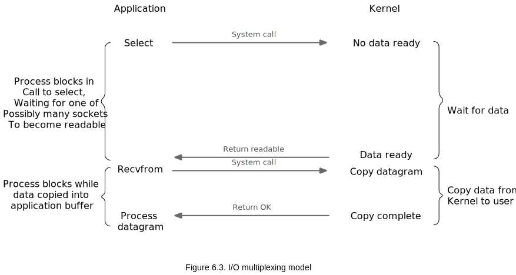
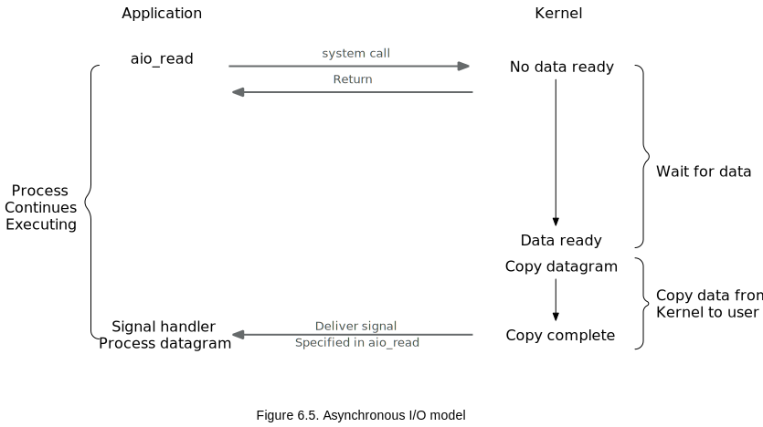

# Chapter 6. I/O Multiplexing: The 'select' and 'poll' Functions #

## 6.1 Introduction ##

- When a client is handling multiplexing descriptors, I/O multiplexing should be used.
- for a client to handle multiplex sockets at the same time. use `select`
- TCP server handles both a listening socket and its connected sockets, I/O multiplexing is normally used
- a server handles both TCP and UDP, I/O multiplexing is normally used
- a server handles multiple services and perhaps multiple protocols, I/O multiplexing is normally used 

## 6.2 I/O Models ##

- blocking I/O
- nonblocking I/O
- I/O multiplexing (`select` and `poll`)
- signal driven I/O (`SIGIO`)
- asynchronous I/O (the POSIX `aio_`functions)

### Blocking I/O Model ###

### Nonblocking I/O Model ###

### I/O Multiplexing Model ###

### Signal-Driven Model ###

### Asynchronous I/O Model ###

### Epoll ###

- reference: **Linux Programming Interface: Chapter 63.4 The epoll API**

- Primary Advantages:
  - the performance of _epoll_ scales much better than `select()` and `poll()` when monitoring __large__ numbers of file descriptors
  - the _epoll_ API permits either level-trigger or edge-trigger notification.

The performance of _epoll_ and signal-driven I/O is similar. but:
- we avoid  complexities of signal handling 
- we have greater fleixibility in specifiying what kind of monitoring we want to perform.

for more detail, see __Linux Programming Interface__

    #### Aside ####
    [The advantages and disadvantages of select, poll, epoll and comparison](https://blog.actorsfit.com/a?ID=00450-c9565a1c-22e8-49ad-87b8-ee42f071694c)

    ##### select advantages #####

    1. portable
    2. provides better time precision for timeout values: microseconds, while poll is milliseconds.

    ##### select disadvantages #####

    1. fd number can be monitored is limited by a single process 
    2. maintain a data structure to store a large number of fd, copy between userspace and kernel space
    3. linear scanning in fd list
    4. timeout is not returned. needs to be reset before entering the next select

    ##### poll advantages #####

    1. fd number is no limit (pass events to kernel through pollfd)
    2. faster than select when dealing with a large number of fd
    3. has no limit on the maximum number of connections

    ##### poll disadvantages #####

    1. large number of fd arrays copied between user mode and kernel address space
    2. *like select*, after poll returns, poll fd needs to be obtain the ready descriptor

