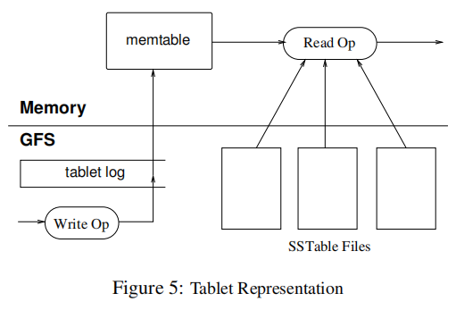

# Bigtable: A Distributed Storage System for Structured Data

## 2 Data Model

A Bigtable is spare, distributed, persistent multiple-dimentional sorted map. (like `DNS` structure)


- **Rows**

The rows keys in a table are arbitrary strings (currently up to 64KB in size). Every read or write of data under a single row key is **atomic**.

Bigtable maintains data in lexicographic order by row key.

dynamically partitioned.

range is called a *tablet*.


- **Column Families**

be grouped into sets called *column families*, which form the basic unit of access control.

All data in a column family is usually of the same type.

A column key is named using the following syntax: *family:qualifiers*. Column family **names** must be printable, but **qualifiers** may be arbitrary strings.

- **Timestamps**

Each cell in a Bigtab le can contain multiple versions of the same data;  indexed by timestamp, 64-bit integers. unique.

## 3. API

```
// Open the table
Table *T = OpenOrDie("/bigtable/web/webtable");

// Write a new anchor and delete an old anchor
RowMutation r1(T, "com.cnn.www");
r1.Set("anchor:www.c-span.org", "CNN");
r1.Delete("anchor:www.abc.com");
Operation op;
Apply(&op, &r1);
```

Figure 2: Writing to Bigtable.


```
Scanner scanner(T);
ScanStream *stream;
stream = scanner.FetchColumnFamily("anchor");
stream->SetReturnAllVersions();
scanner.Lookup("com.cnn.www");
for (; !stream->Done(); stream->Next()) {
printf("%s %s %lld %s\n",
scanner.RowName(),
stream->ColumnName(),
stream->MicroTimestamp(),
stream->Value());
}
```

Figure 3: Reading from Bigtable.

## 4 Building Blocks

Bigtable uses the distributed Google File System (GFS) to store log and data files.  operates in a shared pool of machines. depends on a cluster management system for scheduling.

The Google *SSTable* file format is used internally to store Bigtable data.

Big table relies on a highly-available and persistent distributed lock service called Chubby. consists of five active replicas,

Chubby: highly-available and persistent distributed lock service.

- mater actively serve requests.
- namespace consists of directories and small files. Each directory or file can be used as a lock, and reads and writes to a file are atomic.
- Chubby client library provides consistent caching of Chubby files.
- maintains a *session* 

Bigtable uses Chubby to ensure that there is at most one active master at any time; to store the bootstrap location of Bigtable data; to discvoer tablet servers and finalize tablet server deaths; to store Bigtable schema information; and to access control lists.# 5 Implementation

three major components: a library that is linked into every client, one master servaer, and many tablet servers.

## 5 Implementation

- a library is linked into every client,
- one master server, responsible for assigning tablets to tablet servers, detecting the addition and expiration of tablet servers, balancing tablet-server load, and garbage collection of files in GFS.
- many tablet servers. can be dynamically added (or removed) from a cluster to accomodate changes into workloads. manage a set of tablets. handles read and write requests to the tablets that it has loaded, splits tablets that have grown too large.

client data does not move through the master, because Bigtable clients do not rely on  the master for tablet location information., the master is lightly loaded in practice.

Big table cluster stores a number of tables consists a set of tablets contains all data associated with a row range.

### 5.1 Tablet Location


 

The *root tablet* contains the location of all tablets in a special `METADATA` table. **nevel split**

`METADATA` table stores the location of a tablet under a row key that is an encoding of the tablet's table identifier and its end row.

Each `METADATA` row stores approximately 1KB of data in memory.

The client library caches tablet locations. recursively moves up the tablet location hierarchy when the location of a tablet is missing or incorrect. 

### 5.2 Tablet Assignment

**Each tablet is assigned to one tablet server at a time.**

1. The master grabs a unique *master* lock in Chubby, which prevents concurrent master instantiations.
2. The master scans the servers directory in Chubby to find the live servers.
3. The master communicates with every live tablet server to discover what tables are already assigned to each server.
4. The master scans the `METADATA` table to learn that is not already assigned, the master adds the table to the set of unassigned tablets, which makes the tablet eligible for tablet assignment.

### 5.3 Tablet Serving



### 5.4 Compactions

When the memtable size reaches a threshold, the memtable is frozen, a new memtable is created, and the frozen memtable is converted to an SSTable and written to GFS.

*minor compaction* goals:

- shrinks the memory usage of the tablet server
- reduces the amount of data that has to be read from the commit log during recovery if this server dies.