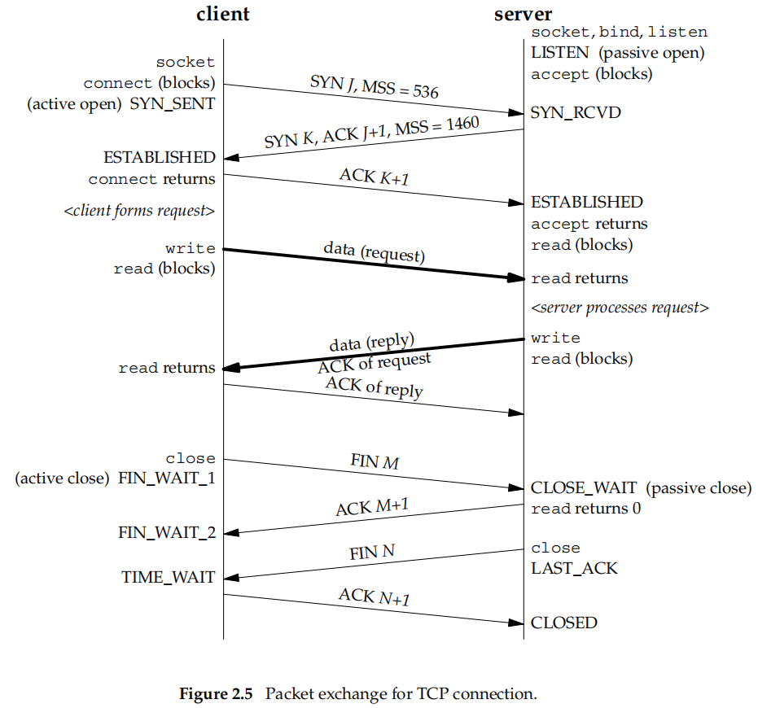

# 2 The Transport Layer: TCP, UDP, and SCTP

## 2.6 TCP Connection Establishment and Termination

### TCP Options

- MSS option. _maximum segment size_ of data that it is willing to accept in each TCP segment on this connection.
- Window Scale option. 65535 (16 bits in the TCP header), `SO_RCVBUF` to acquire larger window
- Timestamp option. to prevent possible data corruption by old, delayed, or duplicated segments.

### TCP State Transition Diagram

The sequence diagram in the next section would be easier than this one to understand the TCP state in both sides of Server and Client.

### Watching the Packets

