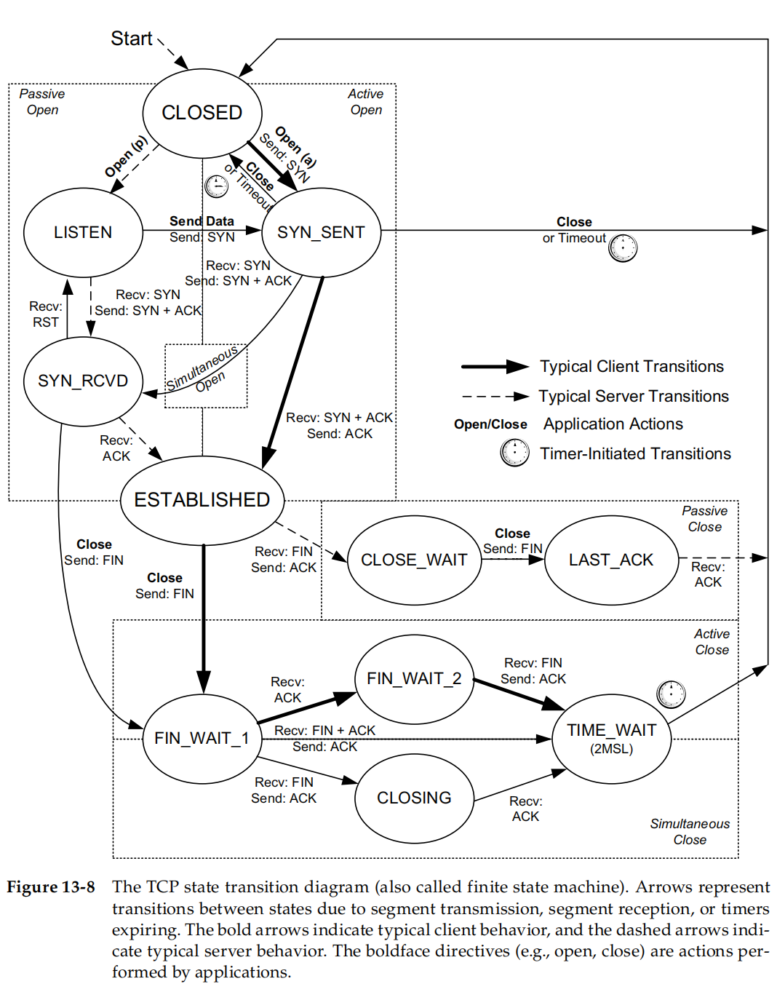

# Chapter 13. TCP Connection Management #

## 13.1 Introduction ##

## 13.2 TCP Connection Establishment and Termination ##

- 4-tuple: source ip, destination ip, source port, destination port.
- _half-close_: close only a single direction of the data flow.
- reason for prefer to use UDP:

        because of its ability to send and receive data without establishing connnections.

### 13.2.1 TCP Half-Close ###

## 13.3 TCP Options

| Kind | Length | Name           | Reference | Description and Purpose                                      |
| ---- | ------ | -------------- | --------- | ------------------------------------------------------------ |
| 0    | 1      | EOL            | [RFC0793] | End of Option List                                           |
| 1    | 1      | NOP            | [RFC0793] | No Operation (used for padding)                              |
| 2    | 4      | MSS            | [RFC0793] | Maximum Segment Size  1500 - 20:IPv4 - 20:TCP [-12:Timestamp] = **1460** [1448] |
| 3    | 3      | WSOPT          | [RFC1323] | Window Scaling Factor (left-shift amount on window)          |
| 4    | 2      | SACK-Permitted | [RFC2018] | Sender supports SACK options                                 |
| 5    | Var.   | SACK           | [RFC2018] | SACK block(out-of-order data received)                       |
| 8    | 10     | TSOPT          | [RFC1323] | Timestamps option                                            |
| 28   | 4      | UTO            | [RFC5482] | User Timeout (abort after idle time)                         |
| 29   | Var.   | TCP-AO         | [RFC5925] | Authentication option (using various algorithms)             |
| 253  | Var.   | Experimental   | [RFC4727] | Reserved for experimental use                                |
| 254  | Var.   | Experimental   | [RFC4727] | Reserved for experimental use                                |

## 13.5 TCP State Transitions ##

### 13.5.1 TCP State Transition Diagram

The Same as UNP 

### 13.5.2 TIME_WAIT (2MSL Wait) State ###

- MSL: _Maximum Segment Lifetime_

