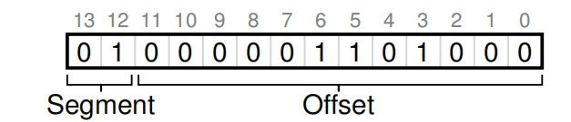

# 16 Segmentation

## 16.2 Which Segment Are We Referring To?

> // get top 2 bits of 14-bit VA
>
> Segment = (VirtualAddress & SEG_MASK) >> SEG_SHIFT
>
> // now get offset
>
> Offset = VirtualAddress & OFFSET_MASK
>
> if (Offset >= Bounds[Segment])
>
> ​	RaiseException(PROTECTION_FAULT)
>
> else {
>
> ​	PhysAddr = Base[Segment] + Offset
>
> ​	Register = AccessMemory(PhysAddr)
>
> }

## 16.5 Fine-grained vs. Coarse-grained Segmentation

