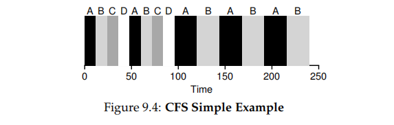
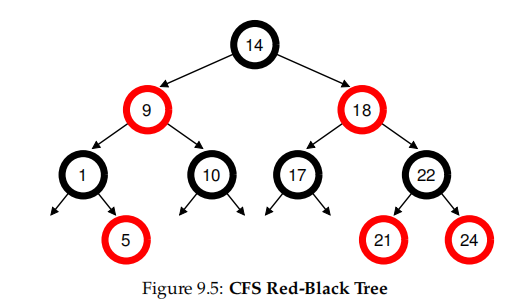

# 9 Scheduling: Proportional Share

<!--toc:start-->
- [9 Scheduling: Proportional Share](#9-scheduling-proportional-share)
  - [9.1 Basic Concept: Tickets Represents Your Share](#91-basic-concept-tickets-represents-your-share)
  - [9.2 Ticket Mechanisms](#92-ticket-mechanisms)
  - [9.3 Implementation](#93-implementation)
  - [9.5 How To Assign Tickets?](#95-how-to-assign-tickets)
  - [9.6 Why Not Deterministic?](#96-why-not-deterministic)
  - [9.7 The Linux Completely Fair Scheduler (CFS)](#97-the-linux-completely-fair-scheduler-cfs)
    - [**Basic Operation**](#basic-operation)
    - [**Weighting (Niceness)**](#weighting-niceness)
    - [**Using Red-Back Trees**](#using-red-back-trees)
    - [**Dealing With I/O And Sleeping Processes**](#dealing-with-io-and-sleeping-processes)
<!--toc:end-->

**lottery scheduling** basic idea: every so often, hold a lottery to determine which process should get to run next; processes that should run more often should be given more chances to win the lottery

## 9.1 Basic Concept: Tickets Represents Your Share

**ticket**: represents the share of a resource that a process should receive

The scheduler picks a winning ticket, the winning tickets determines whether A or B runs. The scheduler then loads the state of that winning process and runs it.

> TIP: Use Randomness
>
> lottery scheduling is its use of **randomness**.
>
> Random approaches advantages:
>
> 1. random often avoids strange corner-case behaviors
> 2. random is lightweight, requiring little state to track alternatives.
> 3. random can be quite fast.

## 9.2 Ticket Mechanisms

**ticket currency**, Currency allows a user with a set of tickets to allocate tickets among their own jobs in whatever currency they would like; the system then automatically coverts currency into the correct global value.

**ticket transfer**, a process can temporarily hand off its tickets to another process.

**ticket inflation**, a process can temporarily raise or lower the number of tickets it owns. if any one process knows it needs more CPU time, it can boost its ticket value as a way to reflect that need to the system, without communicating with any other processes.

## 9.3 Implementation

the code walk through the list of processes A, B and C, adding each ticket value to `counter` until the value exceeds `winner`

with winner ticket being 300, `counter` is incremented to 100 to account for A's tickets; then `counter` would be updated to 150 (B's tickets), Finally, `counter` is updated to 400 (> 300), break out the loop with `current` pointing at C (the winner)

## 9.5 How To Assign Tickets?

“ticket-assignment problem" remains open

## 9.6 Why Not Deterministic?

**stride scheduling**, a deterministic fair-share scheduler.

## 9.7 The Linux Completely Fair Scheduler (CFS)

implements fair-share scheduling.

CFS aims to spend very little time marking scheduling decisions, through both its inherent design and its clever use of data structures well-suited to the task.

### **Basic Operation**

a simple counting-based technique known as **virtual runtime (vruntime)**.

parameters:

- **sched_latency**, determine how long one process should run before considering a switch. typical value is 48 (milliseconds); CFS divides by the number (_n_) processes

- **min_granularity**, usually set to6, CFS will never set the time slice of a process to less than this value, ensuring that not too much time is spent in scheduling overhead.

NOTE: CFS utilizes a periodic timer interrupt, which means it can **only** make decisions at a **fixed** time intervals.CFS trakcs `vruntime` precisely, it makes the job with a time slice that is not a perfect multiple of the timer interrupt interval , will eventually approximate ideal sharing of the CPU over the long haul

### **Weighting (Niceness)**

$$
\text{time\_slice}_k = \frac{\text{weight}_k}{\sum^{n=1}_{n=0}\text{weight}} \cdot {\text{sched\_latency}}
$$

### **Using Red-Back Trees**

CFS keeps processes in a **red-back tree**, see [第 3 章 查找 | Zefrain's Blog](https://zefrain.github.io/docs/TOC/computer/Algorithms/Algorithms/ch03#332-红黑二叉查找树) and [第 6 章 内核数据结构 Zefrain's Blog](https://zefrain.github.io/docs/TOC/computer/kernel/Linux%20Kernel%20Development/ch06#1-%E7%BA%A2%E9%BB%91%E6%A0%91-) for detail

### **Dealing With I/O And Sleeping Processes**

CFS sets the `vruntime` of a job to the minimum value found in the tree when it wakes up. In this way, CFS avoids starvation, but jobs that sleep for short periods of time frequently do not ever get their fair share of the CPU.
