import {Tex} from 'react-tex'

# Chapter 9. Virtual Memory #

## 9.1 Physical and Virtual Addressing ##

    The main memory of a computer is organized as an *array* of _M_ contiguous byte-size cells.
    

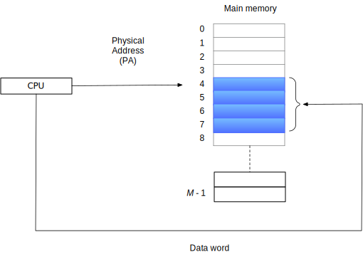

_Figure 9.1 A system that uses physical addressing._

 
 

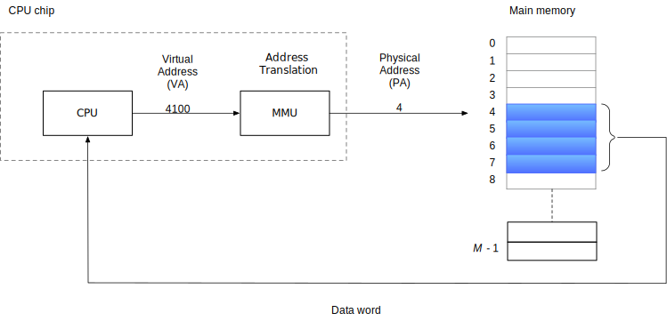

_Figure 9.2  A system that uses virtual addressing_

the CPU access main memory by generating a _virtual address (VA)_ converted to physical address by 
_address translation_ in MMU.

## 9.2 Address Spaces ##

An _address space_ is an __ordered set of nonnegative interge__ addresses

{0, 1, 2, ...}

#### Practice Problem 9.1 ####

<table align= "center">
<tr><th rowspan="2"> Number of virtual address bits (_n_) </th><th rowspan="2"> Number of virtual address </th><th rowspan="2"> Largest possible virtual address </th></tr>
<tr/>
<tr><td> 8  </td> <td> <Tex texContent="2^{8} = 256"/>    </td><td> <Tex texContent="2^8-1 = 256 - 1"/>      </td></tr>
<tr><td> 16 </td> <td> <Tex texContent="2^{?} = 64 K"/>   </td><td> <Tex texContent="2^{16} - 1 = 64K - 1"/> </td></tr>
<tr><td> 32 </td> <td> <Tex texContent="2^{32} = 4 G "/>  </td><td> <Tex texContent="2^{32} - 1 = 4G-1" />   </td></tr>
<tr><td> 48 </td> <td> <Tex texContent="2^{48} = 256 T"/> </td><td> <Tex texContent="2^{48} - 1 = 256T -1"/> </td></tr>
<tr><td> 64 </td> <td> <Tex texContent="2^{64} = 16 E"/>  </td><td> <Tex texContent="2^{64} - 1 = 16E -1"/>  </td></tr>
</table>

## 9.3 VM as a Tool for Cache ##

the set of virtual pages is partitioned into three disjoint subsets:
- Unallocated: Pages that have not yet been allocated (or created) by the VM system. do not have any data associated with them, and thus do not occupy any space on disk.
- Cached: Allocated pages that currently cached in physical memory.
- Uncached: Allocated pages that are not cached in physical memory.

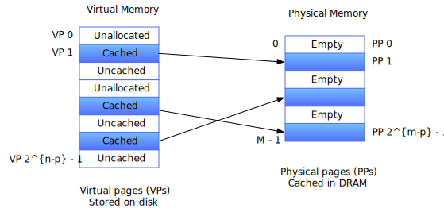

_Figure 9.3 How a VM system uses main memory as a cache_

### 9.3.2 Page Tables ###

if cached, VM system must have way to determine which physical page it is cached in.

if missed, select a victim page in physical memory, and copy the virtual page from disk to DRAM, replace the victim page.

- PTEs: _page table entries_
- VPs: _virtual pages_

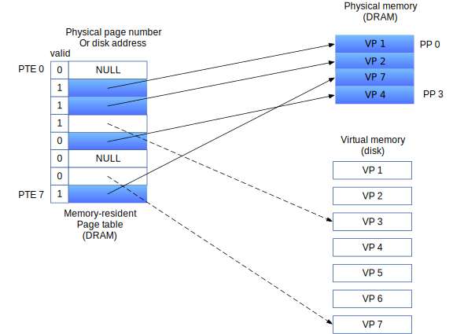

_Figure 9.4 Page table._

#### Practice Problem 9.2 ####

$n = \log_{2}{\frac{2^{n}}{2^{p}}} = \log_{2}{2^{n-p}}$

| $n$ | $P = 2^{p} | Number of PTEs  |
|-----|------------|-----------------|
| 16  | 4K (12)    | 16              |
| 16  | 8K (13)    | 8               |
| 32  | 4K (12)    | $2^{20} = 1M$   |
| 32  | 8K (13)    | $2^{19} = 512K$ |

### 9.3.3 Page Hits ###

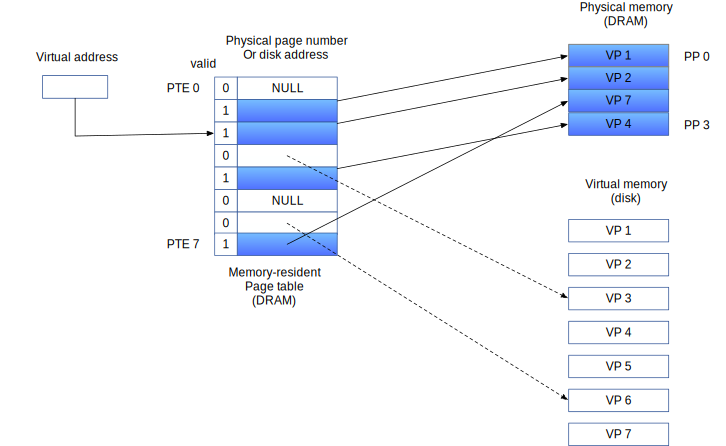

_Figure 9.5 VM page hit_

### 9.3.4 Page Faults ###

a DRAM cache miss is known as a _page fault_.

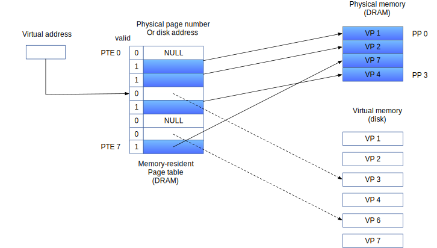

_Figure 9.6 VM page fault (before)_

The reference to a word in VP 3 is a miss and triggers a page fault.

 
 
 

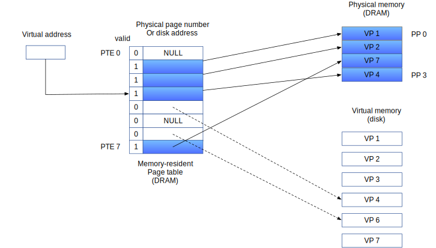

_Figure 9.7 VM page fault (after)_

The page faults:
1. selects VP 4 as the victim (If VP 4 has been modified, then the kernel copies it back to disk).
2. replaces it with a copy of VP 3 from disk.

The kernel:
1. copies VP 3 from disk to PP 3 in memory
2. updates PTE 3,
3. VP 3 now cached in main memory

### 9.3.5 Allocating Pages ###

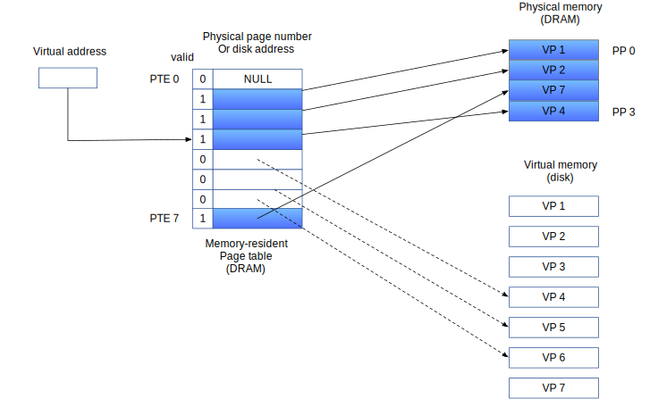

_Figure 9.8 Allocating a new virtual page_

### 9.3.6 Locality to the Rescue Again ###

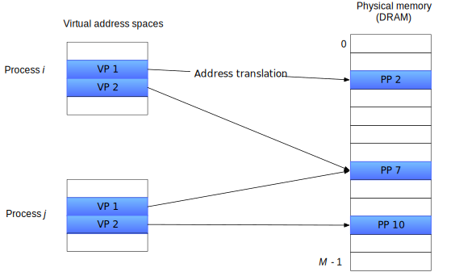

_Figure __9.9 How VM provides processes with separate address spaces.__The operating system matains a separate page table for each process in the system_

## 9.5 VM as a Tool for memory Protection ##

A user process should not be allowed to:
- modify its read-only code section. 
- read or modify any of the code and data structures in the kernel.
- read or write the private memory of other process,
- modify any virtual pages that are shared with other process, unless all partiies explicitly allow it .

permission bits:
- SUP: whther process must be running in kernel (supervisor) mode to access the page. user mode process can only access pages with SUP is 0.
- READ/WRITE: read or write

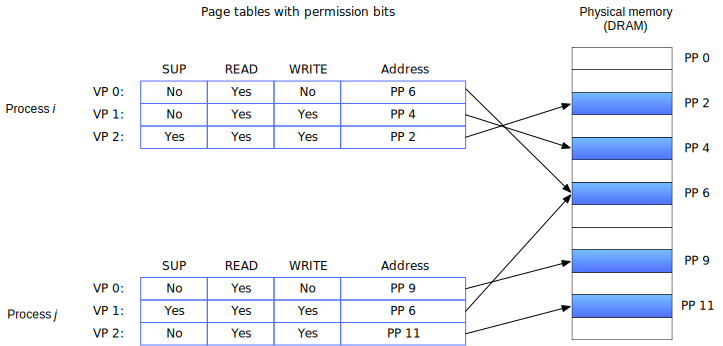

_Figure 9.10 Using VM to provide page-level memory protection_

## 9.6 Address Translation ##

<table align="center">
<tr> <th>Symbol</th> <th>Description</th> </tr>
<tr> <td colspan="2">Basic parameters</td> </tr>
<tr> <td> <Tex texContent="N=2^n"/>              </td> <td> Number of addresses in virtual address space  </td> </tr>
<tr> <td> <Tex texContent="M=2^m" />             </td> <td> Number of addresses in physical address space </td> </tr>
<tr> <td> <Tex texContent="P=2^p" />             </td> <td> Page size (bytes)                             </td> </tr>
<tr> <td colspan="2"> Components of a virtual addresses (VA)                                              </td> </tr>
<tr> <td> VPO                                    </td> <td> Virtual page offset (bytes)                   </td> </tr>
<tr> <td> VPN                                    </td> <td> Virutal page number                           </td> </tr>
<tr> <td> TLBI                                   </td> <td> TLB index                                     </td> </tr>
<tr> <td> TLBT                                   </td> <td> TLB tag                                       </td> </tr>
<tr> <td colspan="2"> Components of a physical address (PA)                                               </td> </tr>
<tr> <td> PPO                                    </td> <td> Physical page offset (bytes)                  </td> </tr>
<tr> <td> PPN                                    </td> <td> Physical page number                          </td> </tr>
<tr> <td> CO                                     </td> <td> Byte offset within cache block                </td> </tr>
<tr> <td> CI                                     </td> <td> Cache index                                   </td> </tr>
<tr> <td> CT                                     </td> <td> Cache tag                                     </td> </tr>
</table>

_Figure 9.11 Summary of address translation symbols._

 
 

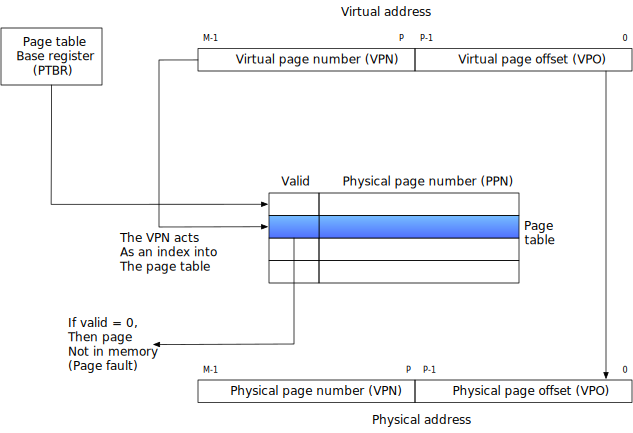

_Figure 9.12 Addres translation with a page table_

 
 

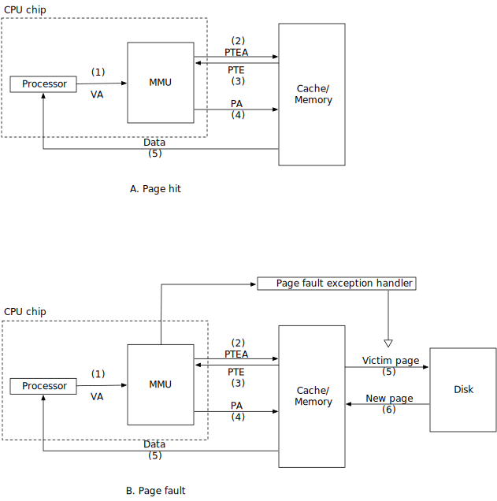

_Figure 9.13 Operational view of page hits and paeg faults. VA: virtual address. PTEA: page table entry address: PTE: page table entry. PA physical address_

CPU hardware performs when there is a page hit.
1. The processor generates a virtual address and sends it to the MMU.
2. The MMU generates the PTE address and requests it from the cache/main memory.
3. The cache/main memory returns the PTE to the MMU.
4. The MMU constructs the physical address and sends it to the cache/main memory.
5. The cache/main memory returns the requested data word to the processor.

#### Practice Problem 9.3 ####

32-bit virtual address space and a 24-bit physical address, determine the number of the bits in followings:

$$
\text{VPO}=\text{PPO}=\log_2P
$$

<table>
<tr><th rowspan="2"> <Tex texContent="P" /> </th><th colspan="4"> Number of</th></tr>
<tr><th> VPN bits </th><th> VPO bits </th><th> PPN bits</th><th> PPO bits </th></tr>

<tr><td> 1 KB </td><td> 22 </td><td> 10 </td><td> 14 </td><td> 10 </td></tr>
<tr><td> 2 KB </td><td> 21 </td><td> 11 </td><td> 13 </td><td> 11 </td></tr>
<tr><td> 4 KB </td><td> 20 </td><td> 12 </td><td> 12 </td><td> 12 </td></tr>
<tr><td> 8 KB </td><td> 19 </td><td> 13 </td><td> 11 </td><td> 13 </td></tr>
</table>

### 9.6.1 Integrating Caches and VM ###

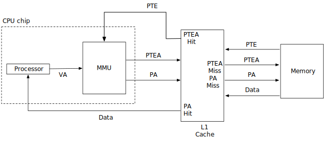

_Figure 9.14 **Integrating VM with a physical addressed cache**. VA: virtual address. PTEA: page table entry address. PTE: page table entry. PA: physical address_

### 9.6.2 Speeding Up Address Translationg with a TLB ###

-_TLB (translation lookaside buffer)_: a small cache of PTEs in the MMU tries to eliminate the time cost that the MMU refer to a PTE in order to translate the CPU generated virtual address into a physical address. It is a small, virtually addressed cache where each line holds a block consisting of a single PTE.

- _TLBI (TLB index)_: consists of the t least significant bits of the VPN.
- _TLBT (TLB tag)_: consists of the remaining bits in the VPN.

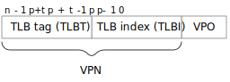

_Figure 9.15 Components of a virtual address that are used to access the TLB_

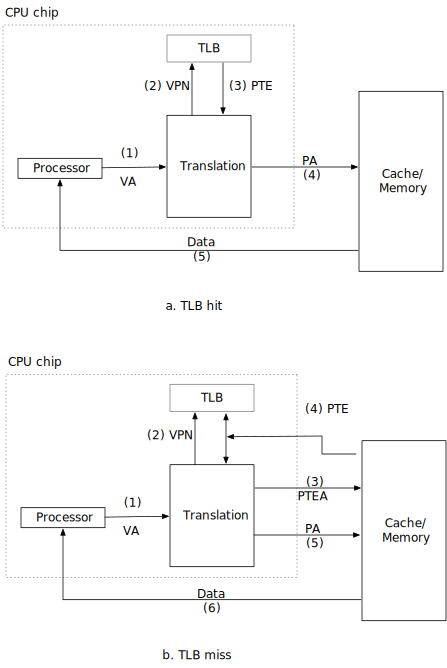

_Figure 9.16 Operational view of a TLB hit and miss._

When TLB miss, then the MMU must fetch the PTE from the L1 cache. the newly cached PTE is stored in the TLB. possibly overwriting an existing entry.(9.16 b)

### 9.6.3 Multi-Level Page Tables ###

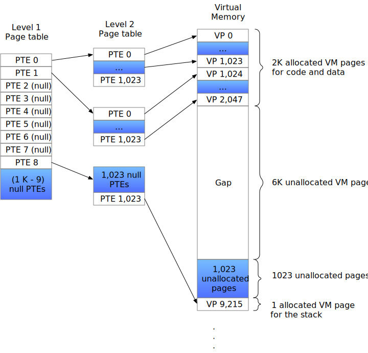

_Figure 9.17 A two-level page table hierachy. notice that addresses increase from top to bottom_

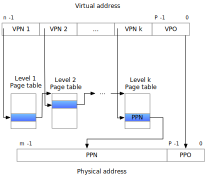

_Figure 9.18 Address translation with a k-level page table_

### 9.6.4 Putting It Together: End-to-End Address Translation ###

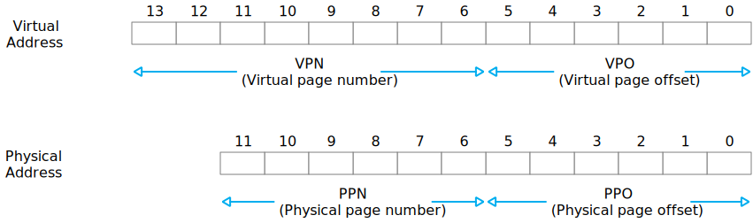

_Figure 9.19 Addressing for small memory system. Assume 14-bit virtual addresses ($n=14$), 12-bit physical addresses ($m=12$), and 64-byte pages ($P=64$)_

 
 

_Figure 9.20 **TLB, page table, and cache for small memory system.** All values in the TLB, page table, and cache are in hexademical notation_

MMU decodes the virtual address.

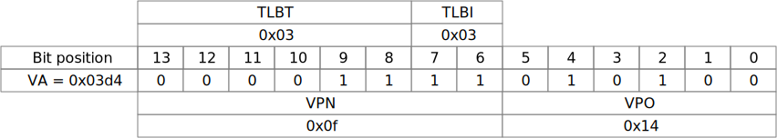

 

MMU sends the physical address to the cache

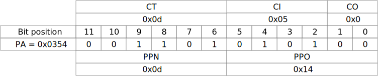

#### Practice Problem 9.4 ####

Virtual address: 0x03d7
- A. Virtual address format

| 13 | 12 | 11 | 10 | 9 | 8 | 7 | 6 | 5 | 4 | 3 | 2 | 1 | 0 |
|----|----|----|----|---|---|---|---|---|---|---|---|---|---|
| 0  | 0  | 0  | 0  | 1 | 1 | 1 | 1 | 0 | 1 | 0 | 1 | 1 | 1 |

- B. Address translation

| Parameter         | Value |
|-------------------|-------|
| VPN               | 0xf   |
| TLB index         | 0x3   |
| TLB tag           | 0x3   |
| TLB hit? (Y/N)    | Y     |
| Page fault? (Y/N) | N     |
| PPN               | 0xd      |

- C. Physical address format

| 11 | 10 | 9 | 8 | 7 | 6 | 5 | 4 | 3 | 2 | 1 | 0 |
|----|----|---|---|---|---|---|---|---|---|---|---|
| 0  | 0  | 1 | 1 | 0 | 1 | 0 | 1 | 0 | 1 | 1 | 1 |

- D. Physical memory reference

| Parameter           | Value |
|---------------------|-------|
| Byte offset         | 3     |
| Cache index         | 5     |
| Cache tag           | 0xd   |
| Cache hit? (Y/N)    | Y     |
| Cache byte returned | 0x1d  |

## 9.9 Dynamic Memory Allocation ##

### 9.9.3 Allocator Requirements and Goals ###

- _Handling arbitary request sequences_. can make an arbitary sequence of allocate and free request...
- _Making immediate response to requests_.
- _Using onlly the heap_
- _Aligning blocks (alignment requirement)_
- _Not modifying allocated blocks_

### 9.9.4 Fragmentation ###

_internal fragmentation_ occurs when an allocated block is larger than the payload.

_external fragmentation_ occurs when there is enough aggregate free memory to satisfy an allocate request.

small numbers of larger free blocks rather than large numbers of smaller free blocks.

### 9.9.10 Coalescing Free Blocks ###

_false fragmentation_, where there is a lot of available free memory chopped up into small, unusable free blocks.

allocator __MUST__ merge adjacent free blocks in a process known as _coalescing_.

### 9.9.11 Coalescing with Boundary Tags ###

    
*Requiring each block to contain both a header and a footer can introduce significant memory overhead if an application manipulates many small blocks.*

### 9.9.13 Explicit Free Lists ###

