import {Tex} from 'react-tex'

# Chapter 9. Virtual Memory #


## 9.1 Physical and Virtual Addressing ##

    The main memory of a computer is organized as an *array* of _M_ contiguous byte-size cells.
    


<div style={{textAlign:'center'}}>

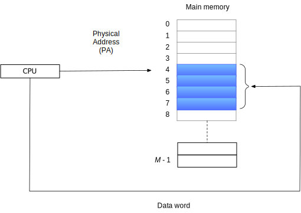

_Figure 9.1 A system that uses physical addressing._
</div>


<br/>
<br/>

<div style={{textAlign:'center'}}>

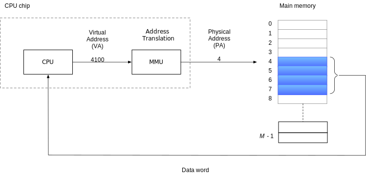

_Figure 9.2  A system that uses virtual addressing_
</div>


the CPU access main memory by generating a _virtual address (VA)_ converted to physical address by 
_address translation_ in MMU.


## 9.2 Address Spaces ##

An _address space_ is an __ordered set of nonnegative interge__ addresses

<div style={{textAlign:'center'}}>

{0, 1, 2, ...}
</div>

#### Practice Problem 9.1 ####

<table align= "center">
<tr><th rowspan="2"> Number of virtual address bits (_n_) </th><th rowspan="2"> Number of virtual address </th><th rowspan="2"> Largest possible virtual address </th></tr>
<tr/>
<tr><td> 8  </td> <td> <Tex texContent="2^{8} = 256"/>    </td><td> <Tex texContent="2^8-1 = 256 - 1"/>      </td></tr>
<tr><td> 16 </td> <td> <Tex texContent="2^{?} = 64 K"/>   </td><td> <Tex texContent="2^{16} - 1 = 64K - 1"/> </td></tr>
<tr><td> 32 </td> <td> <Tex texContent="2^{32} = 4 G "/>  </td><td> <Tex texContent="2^{32} - 1 = 4G-1" />   </td></tr>
<tr><td> 48 </td> <td> <Tex texContent="2^{48} = 256 T"/> </td><td> <Tex texContent="2^{48} - 1 = 256T -1"/> </td></tr>
<tr><td> 64 </td> <td> <Tex texContent="2^{64} = 16 E"/>  </td><td> <Tex texContent="2^{64} - 1 = 16E -1"/>  </td></tr>
</table>

## 9.3 VM as a Tool for Cache ##

the set of virtual pages is partitioned into three disjoint subsets:
- Unallocated: Pages that have not yet been allocated (or created) by the VM system. do not have any data associated with them, and thus do not occupy any space on disk.
- Cached: Allocated pages that currently cached in physical memory.
- Uncached: Allocated pages that are not cached in physical memory.


<div style={{textAlign:'center'}}>

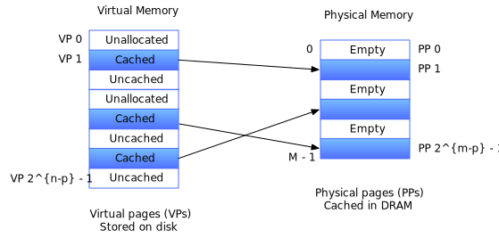

_Figure 9.3 How a VM system uses main memory as a cache_
</div>


### 9.3.2 Page Tables ###

if cached, VM system must have way to determine which physical page it is cached in.

if missed, select a victim page in physical memory, and copy the virtual page from disk to DRAM, replace the victim page.

- PTEs: _page table entries_
- VPs: _virtual pages_

<div style={{textAlign:'center'}}>

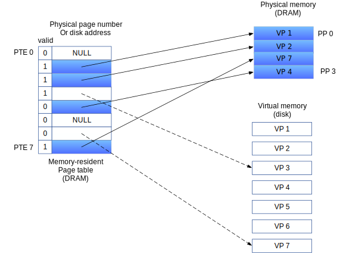

_Figure 9.4 Page table._
</div>


#### Practice Problem 9.2 ####

$n = \log_{2}{\frac{2^{n}}{2^{p}}} = \log_{2}{2^{n-p}}$

| $n$ | $P = 2^{p} | Number of PTEs  |
|-----|------------|-----------------|
| 16  | 4K (12)    | 16              |
| 16  | 8K (13)    | 8               |
| 32  | 4K (12)    | $2^{20} = 1M$   |
| 32  | 8K (13)    | $2^{19} = 512K$ |


### 9.3.3 Page Hits ###

<div style={{textAlign:'center'}}>

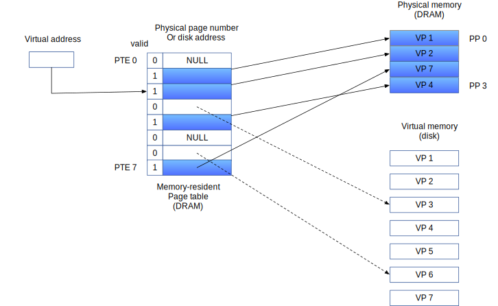

_Figure 9.5 VM page hit_
</div>

### 9.3.4 Page Faults ###

a DRAM cache miss is known as a _page fault_.


<div style={{textAlign:'center'}}>


_Figure 9.6 VM page fault (before)_

</div>
The reference to a word in VP 3 is a miss and triggers a page fault.

<br/>
<br/>
<br/>

<div style={{textAlign:'center'}}>

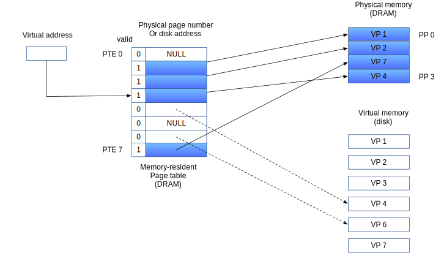

_Figure 9.7 VM page fault (after)_

</div>

The page faults:
1. selects VP 4 as the victim (If VP 4 has been modified, then the kernel copies it back to disk).
2. replaces it with a copy of VP 3 from disk.

The kernel:
1. copies VP 3 from disk to PP 3 in memory
2. updates PTE 3,
3. VP 3 now cached in main memory

### 9.3.5 Allocating Pages ###

<div style={{textAlign:'center'}}>

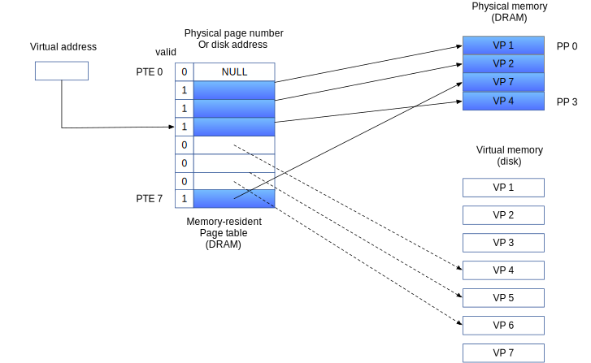

_Figure 9.8 Allocating a new virtual page_
</div>


### 9.3.6 Locality to the Rescue Again ###

<div style={{textAlign:'center'}}>

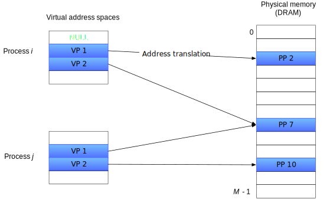

_Figure __9.9 How VM provides processes with separate address spaces.__The operating system matains a separate page table for each process in the system_
</div>


## 9.5 VM as a Tool for memory Protection ##

A user process should not be allowed to:
- modify its read-only code section. 
- read or modify any of the code and data structures in the kernel.
- read or write the private memory of other process,
- modify any virtual pages that are shared with other process, unless all partiies explicitly allow it .


permission bits:
- SUP: whther process must be running in kernel (supervisor) mode to access the page. user mode process can only access pages with SUP is 0.
- READ/WRITE: read or write

<div style={{textAlign:'center'}}>

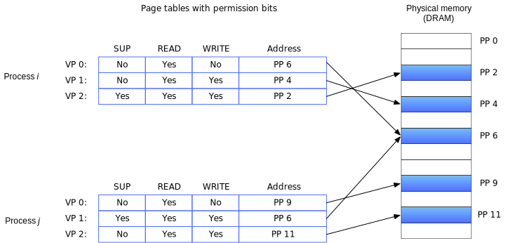

_Figure 9.10 Using VM to provide page-level memory protection_
</div>

## 9.6 Address Translation ##

<div style={{display: 'flex', justifyContent: 'center'}}>

<table align="center">
<tr> <th>Symbol</th> <th>Description</th> </tr>
<tr> <td colspan="2">Basic parameters</td> </tr>
<tr> <td> <Tex texContent="N=2^n"/>              </td> <td> Number of addresses in virtual address space  </td> </tr>
<tr> <td> <Tex texContent="M=2^m" />             </td> <td> Number of addresses in physical address space </td> </tr>
<tr> <td> <Tex texContent="P=2^p" />             </td> <td> Page size (bytes)                             </td> </tr>
<tr> <td colspan="2"> Components of a virtual addresses (VA)                                              </td> </tr>
<tr> <td> VPO                                    </td> <td> Virtual page offset (bytes)                   </td> </tr>
<tr> <td> VPN                                    </td> <td> Virutal page number                           </td> </tr>
<tr> <td> TLBI                                   </td> <td> TLB index                                     </td> </tr>
<tr> <td> TLBT                                   </td> <td> TLB tag                                       </td> </tr>
<tr> <td colspan="2"> Components of a physical address (PA)                                               </td> </tr>
<tr> <td> PPO                                    </td> <td> Physical page offset (bytes)                  </td> </tr>
<tr> <td> PPN                                    </td> <td> Physical page number                          </td> </tr>
<tr> <td> CO                                     </td> <td> Byte offset within cache block                </td> </tr>
<tr> <td> CI                                     </td> <td> Cache index                                   </td> </tr>
<tr> <td> CT                                     </td> <td> Cache tag                                     </td> </tr>
</table>
</div>
<div style={{textAlign:'center'}}>

_Figure 9.11 Summary of address translation symbols._
</div>

<br/>
<br/>


<div style={{textAlign:'center'}}>


_Figure 9.12 Addres translation with a page table_
</div>


<br/>
<br/>

<div style={{textAlign:'center'}}>


_Figure 9.13 Operational view of page hits and paeg faults. VA: virtual address. PTEA: page table entry address: PTE: page table entry. PA physical address_
</div>


CPU hardware performs when there is a page hit.
1. The processor generates a virtual address and sends it to the MMU.
2. The MMU generates the PTE address and requests it from the cache/main memory.
3. The cache/main memory returns the PTE to the MMU.
4. The MMU constructs the physical address and sends it to the cache/main memory.
5. The cache/main memory returns the requested data word to the processor.

#### Practice Problem 9.3 ####

32-bit virtual address space and a 24-bit physical address, determine the number of the bits in followings:

$$
\text{VPO}=\text{PPO}=\log_2P
$$

<div style={{display: 'flex', justifyContent: 'center'}}>
<table>
<tr><th rowspan="2"> <Tex texContent="P" /> </th><th colspan="4"> Number of</th></tr>
<tr><th> VPN bits </th><th> VPO bits </th><th> PPN bits</th><th> PPO bits </th></tr>

<tr><td> 1 KB </td><td> 22 </td><td> 10 </td><td> 14 </td><td> 10 </td></tr>
<tr><td> 2 KB </td><td> 21 </td><td> 11 </td><td> 13 </td><td> 11 </td></tr>
<tr><td> 4 KB </td><td> 20 </td><td> 12 </td><td> 12 </td><td> 12 </td></tr>
<tr><td> 8 KB </td><td> 19 </td><td> 13 </td><td> 11 </td><td> 13 </td></tr>
</table>
</div>

### 9.6.1 Integrating Caches and VM ###

<div style={{textAlign:'center'}}>


_Figure 9.14 **Integrating VM with a physical addressed cache**. VA: virtual address. PTEA: page table entry address. PTE: page table entry. PA: physical address_
</div>


### 9.6.2 Speeding Up Address Translationg with a TLB ###

-_TLB (translation lookaside buffer)_: a small cache of PTEs in the MMU tries to eliminate the time cost that the MMU refer to a PTE in order to translate the CPU generated virtual address into a physical address. It is a small, virtually addressed cache where each line holds a block consisting of a single PTE.

- _TLBI (TLB index)_: consists of the t least significant bits of the VPN.
- _TLBT (TLB tag)_: consists of the remaining bits in the VPN.


<div style={{textAlign:'center'}}>

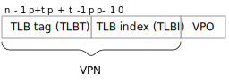

_Figure 9.15 Components of a virtual address that are used to access the TLB_


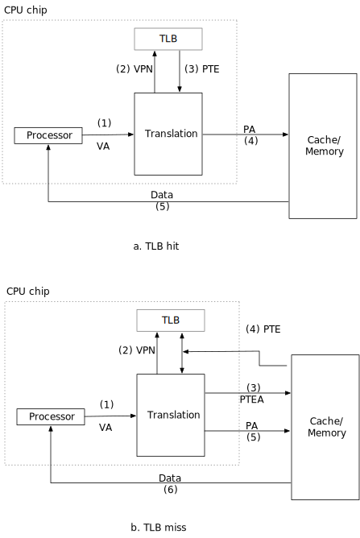

_Figure 9.16 Operational view of a TLB hit and miss._
</div>


When TLB miss, then the MMU must fetch the PTE from the L1 cache. the newly cached PTE is stored in the TLB. possibly overwriting an existing entry.(9.16 b)

### 9.6.3 Multi-Level Page Tables ###

<div style={{textAlign:'center'}}>


_Figure 9.17 A two-level page table hierachy. notice that addresses increase from top to bottom_
</div>


<div style={{textAlign:'center'}}>

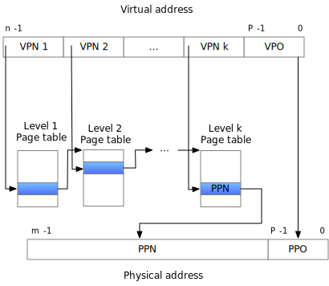

_Figure 9.18 Address translation with a k-level page table_
</div>


### 9.6.4 Putting It Together: End-to-End Address Translation ###

<div style={{textAlign:'center'}}>

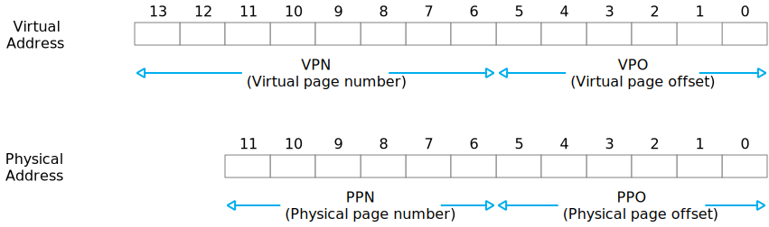

_Figure 9.19 Addressing for small memory system. Assume 14-bit virtual addresses ($n=14$), 12-bit physical addresses ($m=12$), and 64-byte pages ($P=64$)_
</div>

<br/>
<br/>

<div style={{textAlign:'center'}}>

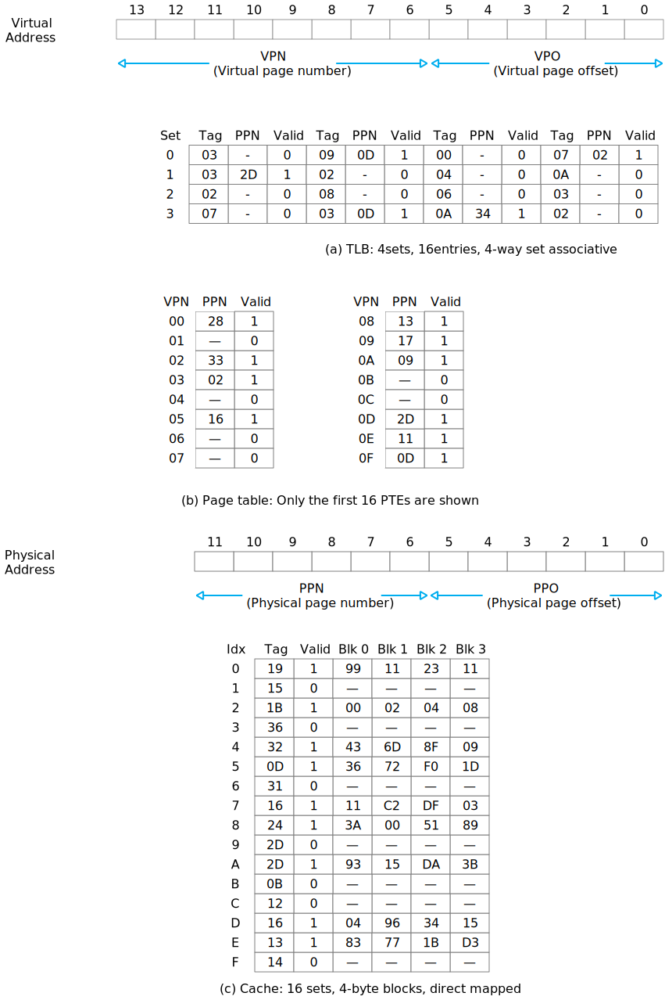

_Figure 9.20 **TLB, page table, and cache for small memory system.** All values in the TLB, page table, and cache are in hexademical notation_
</div>


MMU decodes the virtual address.
<div style={{textAlign:'center'}}>

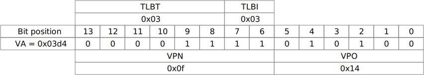


</div>
<br/>

MMU sends the physical address to the cache
<div style={{textAlign:'center'}}>


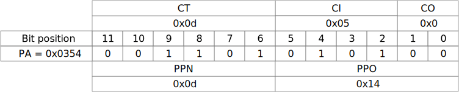
</div>


#### Practice Problem 9.4 ####

Virtual address: 0x03d7
- A. Virtual address format

| 13 | 12 | 11 | 10 | 9 | 8 | 7 | 6 | 5 | 4 | 3 | 2 | 1 | 0 |
|----|----|----|----|---|---|---|---|---|---|---|---|---|---|
| 0  | 0  | 0  | 0  | 1 | 1 | 1 | 1 | 0 | 1 | 0 | 1 | 1 | 1 |


- B. Address translation

| Parameter         | Value |
|-------------------|-------|
| VPN               | 0xf   |
| TLB index         | 0x3   |
| TLB tag           | 0x3   |
| TLB hit? (Y/N)    | Y     |
| Page fault? (Y/N) | N     |
| PPN               | 0xd      |


- C. Physical address format

| 11 | 10 | 9 | 8 | 7 | 6 | 5 | 4 | 3 | 2 | 1 | 0 |
|----|----|---|---|---|---|---|---|---|---|---|---|
| 0  | 0  | 1 | 1 | 0 | 1 | 0 | 1 | 0 | 1 | 1 | 1 |


- D. Physical memory reference

| Parameter           | Value |
|---------------------|-------|
| Byte offset         | 3     |
| Cache index         | 5     |
| Cache tag           | 0xd   |
| Cache hit? (Y/N)    | Y     |
| Cache byte returned | 0x1d  |

## 9.8 Memory Mapping ##

### 9.8.1 Shared Objects Revisited ###

<div style={{textAlign:'center'}}>

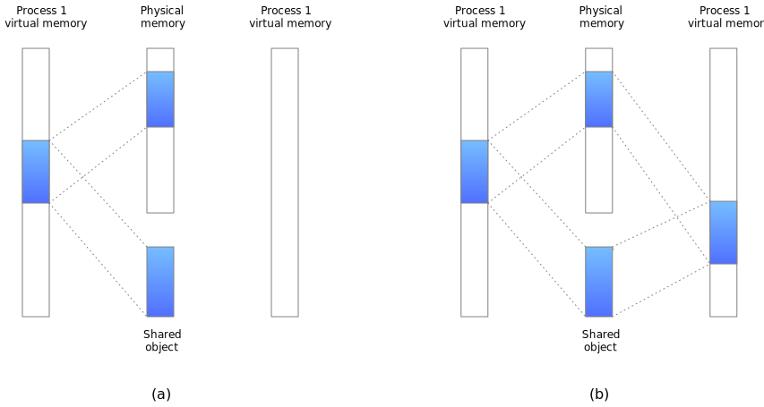

_Figure 9.29 __A shared object.__ (a) After process 1 maps the shared object. (b) After process 2 maps the same shared object. (Note that the physical pages are note necessarily contiguous.)_
</div>


<div style={{textAlign:'center'}}>

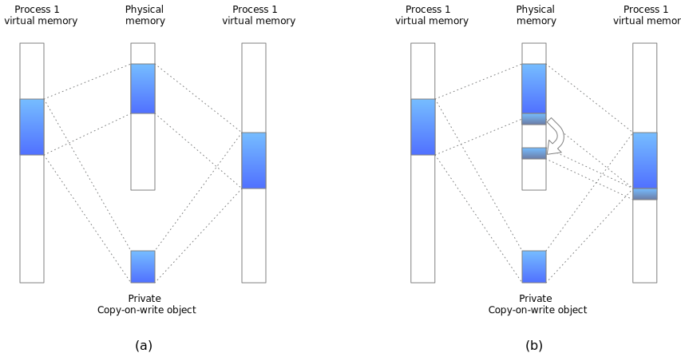

_Figure 9.30 __A private copy-on-write object.__ (a) After both processes have mapped the private copy-on-write object. (b) After process 2 writes to a page in the private data._
</div>


## 9.9 Dynamic Memory Allocation ##

### 9.9.3 Allocator Requirements and Goals ###

- _Handling arbitary request sequences_. can make an arbitary sequence of allocate and free request...
- _Making immediate response to requests_.
- _Using onlly the heap_
- _Aligning blocks (alignment requirement)_
- _Not modifying allocated blocks_


### 9.9.4 Fragmentation ###

_internal fragmentation_ occurs when an allocated block is larger than the payload.

_external fragmentation_ occurs when there is enough aggregate free memory to satisfy an allocate request.

small numbers of larger free blocks rather than large numbers of smaller free blocks.


### 9.9.5 Impelemtation Issues ###

- _Free block organization_. How do we keep track of free blocks?
- _Placement_. How do we choose an appropriate free block in which to place a newly allocated block?
- _Splitting_. After we place a newly allocated block in some free block, what do we do with the remainder of the free block?
- _Coalescing_. What do we do with a block that has just been freed?

### 9.9.6 Implicit Free Lists ###

a block consists of a one-word _header_, the payload and possibly some additional _padding_.

<div style={{textAlign:'center'}}>


_Figure 9.35 Format of a single heap block._
</div>


### 9.9.10 Coalescing Free Blocks ###

_false fragmentation_, where there is a lot of available free memory chopped up into small, unusable free blocks.

allocator __MUST__ merge adjacent free blocks in a process known as _coalescing_.


### 9.9.11 Coalescing with Boundary Tags ###

- merge next block: check to determine if the next block is free
- merge previous block: each block includes a footer (replica of header) then the allocator can determine the starting location and status of the previous block by inspecting its footer.
    
*Requiring each block to contain both a header and a footer can introduce significant memory overhead if an application manipulates many small blocks.*


### 9.9.12 Putting It Together: Implementing a Simple Allocator ###

#### General Allocator Design ####

```c
/* Private global variables */
static char *mem_heap;	   /* Points to first byte of heap */
static char *mem_brk;	   /* Points to last byte of heap plus 1 */
static char *mem_max_addr; /* Max legal heap addr plus 1 */

/*
 * mem_init - Initialize the memory system model
 */
void mem_init(void)
{
	mem_heap = (char *)Malloc(MAX_HEAP);
	mem_brk = (char *)mem_heap;
	mem_max_addr = (char *)(mem_heap + MAX_HEAP);
}

/**
 * @brief      Simple model of the sbrk function.
 *
 * @details    Extends the heap by incr bytes
 *
 * @param      incr          bytes to extend
 *
 * @return     start address of the new area
 */
void *mem_sbrk(int incr)
{
	char *old_brk = mem_brk;

	if ((incr < 0) || ((mem_brk + incr) > mem_max_addr)) {
		errno = ENOMEM;
		fprintf(stderr,
			"ERROR: mem_sbrk failed. Ran out of memory...\n");
		return (void *)-1;
	}

	mem_brk += incr;
	return (void *)old_brk;
}
```
_Figure 9.41 memlib.c Memory system model_


#### Basic Constans and Macros for Manipulating the Free List ####

```c
/* Basic constans and macros */
#define WSIZE     4		/* Word and header/footer size (bytes) */
#define DSIZE     8		/* Double word size (bytes) */
#define CHUNKSIZE (1 << 12)     /* Extend heap by this amount (bytes) */

#define MAX(x, y) ((x) > (y) ? (x) : (y))

/* Pack a size and allocated bit into a word */
#define PACK(size, alloc) ((size) | (alloc))

/* Read and Write a word at address p */
#define GET(p) (*(unsigned int *)p)
#define PUT(p, val) (*(unsigned int *)(p) = (val))

/* Read the size and allocated fields froma ddress p */
#define GET_SIZE(p)  (GET(p) & ~0x7)
#define GET_ALLOC(p) (GET(p) & 0x1)

/* Given block ptr bp, compute address of its header and footer */
#define HDRP(bp) ((char *)(bp)-WSIZE)
#define FTRP(bp) ((char *)(bp) + GET_SIZE(HDRP(bp)) - DSIZE)

/* Given block ptr bp, compute address of next and previous blocks */
#define NEXT_BLKP(bp) ((char *)(bp) + GET_SIZE(((char *)(bp)-WSIZE)))
#define PREV_BLKP(bp) ((char *)(bp) - GET_SIZE(((char *)(bp)-DSIZE)))
```
_Figure 9.43 Basic constants and and macros for manipulating the free list_


#### Creating the Initial Free List ####

```c
int mm_init(void) {
        /* Create the initial empty heap */
        if (heap_listp = mem_sbrk(4*WSIZE) == (void*)-1) {
                return -1;
        }

        PUT(heap_listp, 0);     /* alignment padding */
        PUT(heap_listp + (1 *WSIZE), PACK(DSIZE, 1)); /* Prologue header */
        PUT(heap_listp + (2 *WSIZE), PACK(DSIZE, 1)); /* Prologue footer */
        PUT(heap_listp + (3 *WSIZE), PACK(DSIZE, 1)); /* Epilogue header */
        heap_listp += (2*WSIZE);
        
        /* Extend the empty heap with a free block of CHUNKSIZE bytes */
        if (extend_heap(CHUNKSIZE/WSIZE) == NULL)
                return -1;


        return 0;
}
```
_Figure 9.44 mm_init creates a heap with an initial free block_


```c
static void *extend_heap(size_t words)
{

	char *bp;
	size_t size;

	/* Allocate an even number of words to maintain alignment */
	size = (words % 2) ? (words + 1) * WSIZE : words * WSIZE;
	if ((long)(bp = mem_sbrk(size)) = -1) {
		return NULL;
	}

	/* Initialize free block header/footer and the epilogue header */
	PUT(HDRP(bp), PACK(size, 0));	      /* Free block header */
	PUT(FTRP(bp), PACK(size, 0));	      /* Free block footer */
	PUT(HDRP(NEXT_BLKP(bp)), PACK(0, 1)); /* New epilogue header */

	/* Coalesce if the previous block was free */
	return coalesce(bp);
}
```
_Figure 9.45 extend_heap extends the heap with a new free block._


#### Freeing and Coalescing Blocks ####

frees a previously allocated block by calling `mm_free` function, free the requested block and then merge adjacent free blocks using the boundary-tags coalescing technique described in Section 9.9.11


#### Allocating Blocks ####

```c

void mm_free(void *bp)
{
	size_t size = GET_SIZE(HDRP(bp));

	PUT(HDRP(bp), PACK(size, 0));
	PUT(FTRP(bp), PACK(size, 0));

	coalesce(bp);
}

static void *caleasce(void *bp)
{
	size_t prev_alloc = GET_ALLOC(FTRP(PREV_BLKP(bp)));
	size_t next_alloc = GET_ALLOC(HDRP(NEXT_BLKP(bp)));
	size_t size = GET_SIZE(HDRP(bp));

	/*
	 * Case 1. The previous and next blocks are both allocated
	 */
	if (prev_alloc && next_alloc) {
		return bp;
	}

	/*
	 * Case 2. The previous block is allocated and the next block is free.
	 */

	else if (prev_alloc && !next_alloc) {
		size += GEt_SIZE(HDRP(NEXT_BLKP(bp)));
		PUT(HDRP(bp), PACK(size, 0));
		PUT(FTRP(bp), PACK(size, 0));
	}

	/*
	 * Case 3. The previous block is free and the next block is allocated.
	 */

	else if (!prev_alloc && next_alloc) {
		size += GET_SIZE(HDRP(PREV_BLKP(bp)))
		    : PUT(FTRP(bp), PACK(size, 0));
		PUT(HDRP(PREV_BLKP(bp)), PACK(size, 0));
		bp = PREV_BLKP(bp);
	}

	/*
	 * Case 4. The previous and next blocks are both free.
	 */
	else {
		size += GET_SIZE(HDRP(PREV_BLKP(bp))) +
			GET_SIZE(FTRP(NEXT_BLKP(bp)))
		    : PUT(HDRP(PREV_BLKP(bp)), PACK(size, 0))
		    : PUT(FTRP(NEXT_BLKP(bp)), PACK(size, 0));
		bp = PREV_BLKP(bp) :
	}

	return bp;
}

```
_Figure 9.46 `mm_free` frees a block and uses boundary-tag coleascing to merge it with any adjacent free blocks in constant time._


```c

void *mm_malloc(size_t size)
{
	size_t asize;	   /* Adjusted block size */
	size_t extendsize; /* Amount to extend heap if no fit */

	/* Ignore spurious requests */
	if (size == 0) {
		return NULL;
	}

	/* Adjust block size to include overhead and alignment reqs. */
	if (size <= DSIZE) {
		asize = 2 * DSIZE;
	} else {
		asize = DSIZE * ((size + (DSIZE) + (DSIZE - 1)) / DSIZE);
	}

	/* Search the free list for a fit */
	if ((bp = find_fit(asize)) != NULL) {
		place(bp, asize);
		return bp;
	}

	/* No fit found. Get more memory and place the block. */
	extendsize = MAX(asize, CHUNKSIZE);
	if ((bp = extend_heap(extendsize / WSIZE)) == NULL) {
		return NULL;
	}

	place(bp, asize);
	return bp;
}

```
_Figure 9.47 `mm_malloc` allocates a block from the free list_

#### Practice Problem 9.8 ####

Implement a `find_fit` function for the simple allocator described in Section 9.9.12.

```c

static void *find_fit(size_t asize)
{
	void *bp = NULL;

	for (bp = heap_listp;
	     !GET_ALLOC(HDRP(bp)) ||
	     GET_SIZE(HRDRP(bp)) <= asize; /*
					    * we may need additional size
					    * for header and footer
					    * without mm_maloc
					    */
	     bp = NEXT_BLKP(bp)) {
		;
	}
        /*
         * loop until we find suitable block,
         * or we will return initialized bp which is NULL
         */
	return bp;
}
```

#### Practice Problem 9.9 ####

Implement a place function for the example allocator.
```c

static void place(void *bp, size_t asize)
{
	size_t csize = GET_SIZE(HDRP(bp));

	if ((csize - asize) >= (2 * DSIZE)) {
		PUT(HDRP(bp), PACK(asize, 1));
		PUT(FTRP(bp), PACK(asize, 1));
		bp = NEXT_BLKP(bp);
		PUT(HDRP(bp), PACK(csize - asize, 0));
		PUT(FTRP(bp), PACK(csize - asize, 0));
	} else {
		PUT(HDRP(bp), PACK(csize, 1));
		PUT(FTRP(bp), PACK(csize, 0));
	}
}
```

### 9.9.13 Explicit Free Lists ###

<div style={{textAlign:'center'}}>

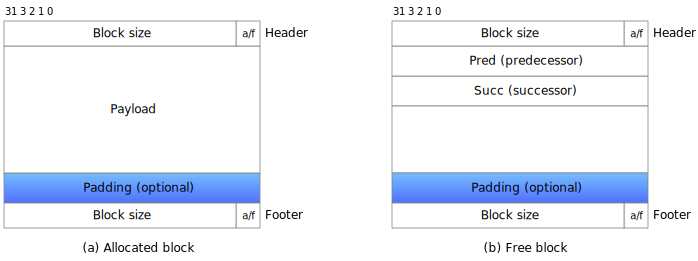

_Figure 9.48 Format of heap blocks that use doubly linked free lists._
</div>


## 9.10 Garbage Collection ##


```c

void garbage()
{
	int *p = (int *)malloc(15213);

	return; /* Array p is garbage at this point */
}
```

### 9.10.1 Garbage Collector Basics ###

<div style={{textAlign:'center'}}>

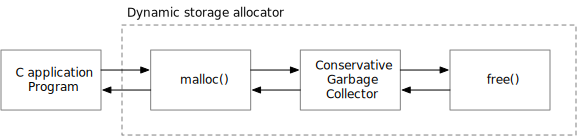

_Figure 9.50 Integrating a conservative garbage collector and a C malloc package_
</div>

C and C++ canot in general has _conservative garbage collector_, each reachable block is correctly identified as reachable, while some unreachable nodes might be incorrectly identified as reachable.


### 9.10.2 Mark&Sweep Garbage Collectors ###

- _mark phase_: marks all reachable and allocated descendants of the root nodes, followed by a _sweep phase_.
- _sweep phase_: fres each unmarked allocated block.


```c

/* (a) mark function */
void mark(ptr p)
{
	if ((b = isPtr(p)) == NULL) {
		return;
	}

	if (blockMarked(b)) {
		return;
	}

	markBlock(b);
	len = length(b);

	for (i = 0; i < len; i++) {
		mark(b[i]);
	}
	return;
}

/* (b) sweep function */
void sweep(ptr b, ptr end)
{
	while (b < end) {
		if (blockMarked(b)) {
			unmarkBlock(b);
		} else if (blockAllocated(b)) {
			free(b);
		}
		b = nextBlock(b);
	}
	return;
}
```
_Figure 9.51 Pseudocode for the `mark`  and `sweep` functions_

## 9.11 Common Memory-Related Bugs in C Programs ##

### 9.11.1 Dereferencing Bad Pointers ###

`scanf("%d", &val);` 

it is easy to pass the _contents_ of val instead of its _address_:
`scanf("%d", val);` 

### 9.11.2 Reading Uninitialized Memory ###

```c

/* Return y = Ax */
int *matvec(int **A, int *x, int n)
{
	int i, j;

	int *y = (int *)malloc(n * sizeof(int));

	for (i = 0; i < n; i++) {
		for (j = 0; j < n; j++) {
			y[i] = A[i][j] * x[j];
		}
	}

	return y;
}
```


### 9.11.3 Allowing Stack Buffer Overflows ###

```c

void bufoverflow()
{
	char buf[64];

	gets(buf); /* Here is the stack buffer overflow bugs */

	return;
}
```

### 9.11.4 Assuming That Pointers and the Objects They Point to Are the Same Size ###

```c

/* Create an nxm array */
int **makeArray(int n, int m)
{
	int i;
	int **A = (int **)malloc(
	    n * sizeof(int)); /* sizeof pointer is 8 in 64-bit os */

	for (i = 0; i < n; i++) {
		A[i] = (int *)malloc(m * sizeof(int));
	}

	return A;
}
```

### 9.11.5 Make Off-by-One Errors ###

```c

/* Create an nxm array */
int **makeArray2(int n, int m)
{
	int i;
	int **A = (int **)malloc(n * sizeof(int *));

	for (i = 0; i <= n; i++) {
		A[i] = (int *)malloc(m * sizeof(int));
	}

	return A;
}
```


### 9.11.6 Referencing a Pointer Instead of the Object It Points To ###

```c

int *binheapDelete(int **binheap, int *size)
{
	int *packet = binheap[0];

	binheap[0] = binheap[*size - 1];
	*size--;                /* This should be (*size)-- */
	heapify(binheap, *size, 0);
	return (packet);
}
```


### 9.11.7 Misunderstanding Pointer Arithmetic ###

```c

int *search(int *p, int val)
{
	while (*p && *p != val) {
		p += sizeof(int); /* Should be p++ */
	}

	return p;
}
```

### 9.11.8 Referencing Nonexistent Variables ###

```c

int *stackref()
{
	int val;

	return &val; /* its a stack pointer, will be freed after function end */
}
```


### 9.11.9 Referencing Data in Free Heap Blocks ###

```c

int *heapref(int n, int m)
{
	int i;
	int *x, *y;

	x = (int *)malloc(n * sizeof(int));

	/*
	 * Other calls to malloc and free go here
	 */

	free(x);

	y = (int *)malloc(m * sizeof(int));

	for (i = 0; i < m; i++) {
		y[i] = x[i]++; /* Oops! x[i] is a word in a free block */
	}

	return y;
}
```


### 9.11.10 Introducing Memory Leaks ###

```c

void leak(int n)
{
	int *x = (int *)malloc(n * sizeof(int));

	return; /* x is garbage at this point */
}
```
